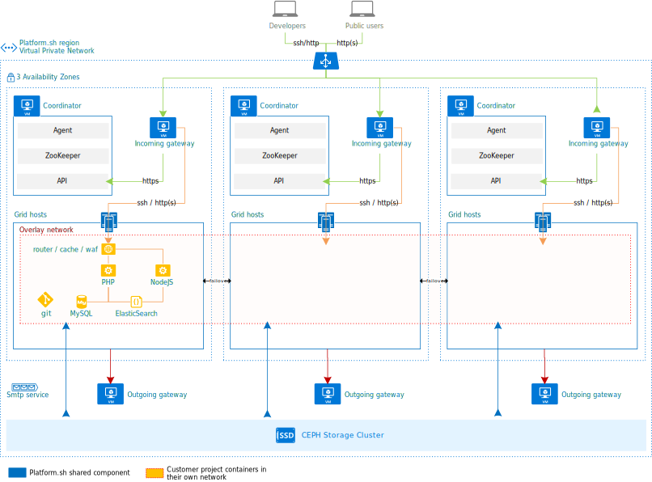

**Last updated 31st August 2023**

## Architecture (Development Environments)

## Default limits

The Development Environment for a {} project provides `production` and `staging` branches linked to the {} cluster
and 3 additional active environments for development.
This number can be increased if needed for an additional fee.

The default storage for {} contracts is 50GB per environment (production, staging, and each development environment).
This comprises total storage for your project and is inclusive of any databases, uploaded files,
writable application logging directories, search index cores, and so on.
The storage amount for your development environment reflects the amount in your Enterprise contract.

A project may have up to six (6) users associated with it at no additional charge.
Additional users may be added for an additional fee.
These users have access to both the Development environment and the {} cluster.

## Larger developments environments

By default, all containers in development environments are  sized, as they have limited traffic needs.
For more resource-intensive applications this size can be increased for an additional fee.
