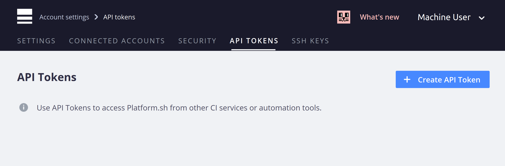
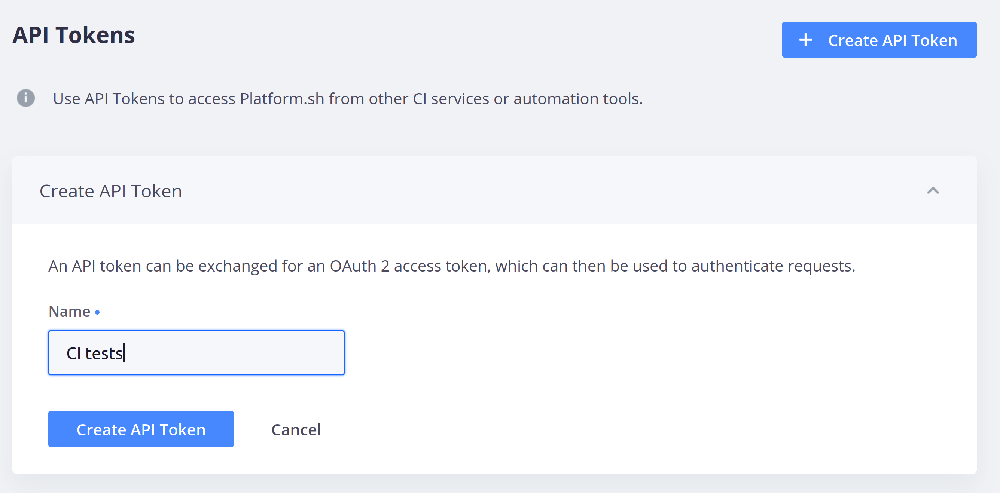
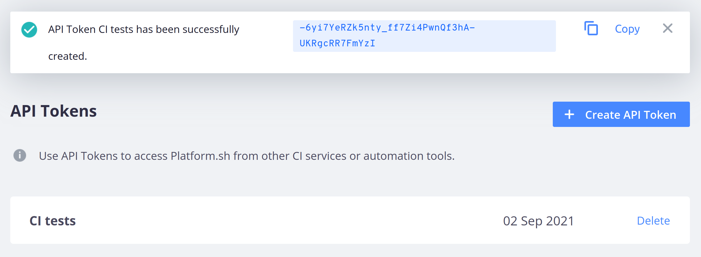

**Last updated 3rd June 2021**


## Obtaining a token

The Web PaaS CLI can also be used from CI services or other automation tools, and supports an API Token authentication option for that purpose.

An API token can be created through the management console. Go to the "User" page from your account drop-down, then select the "Account Settings" tab, then "API Tokens".

Click the "Create an API Token" link.



Enter a name to easily identify your token in the future, in case of multiple tokens ("CLI automated" is one example).



Once done, the newly created token will be displayed at the top of the page, and can be copied to the clipboard using the Copy button. After this, you will not be able to view the API token again.



Now set that token in an environment variable named `OVHCLOUD_WEBPAAS_CLI_TOKEN` on the system where the CLI will run.  Consult the documentation for your CI system to see how to do that.

> [!primary]  
> If running CLI commands from any automated system, including a Web PaaS cron task, we urge you to use the `--no-wait` flag on any commands that may take more than a second or two to avoid blocking the process.
> 

## Machine users

For security reasons we recommend creating a dedicated machine user to run automation tasks such as taking backups, renewing SSL certificates or triggering source operations. We also strongly recommend creating a unique machine user for each project to be automated.

Like human users, every machine user account needs its own unique email address.

The machine user can be given a very restrictive set of permissions limited to just its needed tasks. Backups, for instance, require `Admin` access but no SSH key, while checking out code from a CI server to run tests on it would require an SSH key but only `Reader` access.

It will also show up in logs and activity streams as a separate entry from human users.


## Install the CLI on a Web PaaS environment

A common use case for an API token is to allow the Web PaaS CLI to be run on an app container, often via a cron hook.  An API token is necessary for authentication, but the CLI will be able to auto-detect the current project and environment.

First, create a machine user (see above) that you invite to your project. Then, log in as that machine user to obtain an API token. Set this token as the [top-level](../../development-variables#top-level-environment-variables) environment variable `env:OVHCLOUD_WEBPAAS_CLI_TOKEN` either through the management console or via the CLI, like so:

```bash
webpaas variable:create -e master --level environment --name env:OVHCLOUD_WEBPAAS_CLI_TOKEN --sensitive true --value 'your API token'
```

> [!primary]  
> It is important to include the `env:` so as to expose `$OVHCLOUD_WEBPAAS_CLI_TOKEN` on its own as a top level Unix environment variable, rather than as a part of `$PLATFORM_VARIABLES` like normal environment variables.
> 

Second, add a build hook to your `.platform.app.yaml` file to download the CLI as part of the build process.

```yaml
hooks:
    build: |
        curl -fsS https://platform.sh/cli/installer | php
```

This will download the CLI to a known directory, `.platformsh/bin`, which will be added to the PATH at runtime (via the .environment file). Because the API token is available, the CLI will now be able to run authenticated commands, acting as the user who created the token.

You can now call the CLI from within the shell on the app container, or via a cron hook.  Note that if you want a cron to run only on the production environment you will need to wrap it in an if-check on the `$PLATFORM_BRANCH` variable, like so:

```yaml
crons:
    backup:
        spec: '0 5 * * *'
        cmd: |
            if [ "$PLATFORM_BRANCH" = master ]; then
                webpaas backup:create --yes --no-wait
            fi
```

(If you have renamed the default branch from `master` to something else, modify the above example accordingly.)

> [!primary]  
> Seriously, please use `--no-wait` for all CLI commands placed in a cron hook. Failure to do so may result in long deploy times and site downtime.
> 
