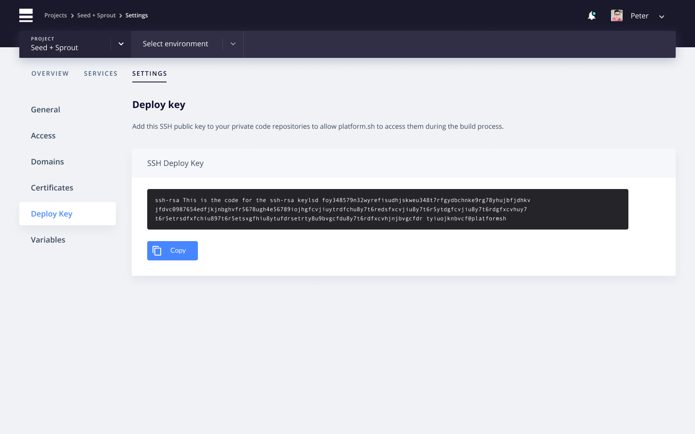

**Last updated 26th March 2021**


## Pull code from a private Git repository

Let's say you're building a module (*or theme, library...*) which is stored in a private Git repository that you have access to, and you want to use it on your project. Web PaaS allows you to include code dependencies that are stored in external private Git repositories.

To grant Web PaaS access to your private Git repository, you need to add the project public SSH key to the deploy keys of your Git repository.

You can copy your project's public key by going to the Settings tab on the management console and then clicking the Deploy Key tab on the left hand side.



If your private repository is on GitHub, go to the target repository's settings page. Go to *Deploy Keys* and click *Add deploy key*. Paste the public SSH key in and submit. By default, on github, deploy keys are read only, so you don't need to worry about the system pushing code to the private repository.

If you're using Drupal for example, you can now use your private module by adding it to your make file:

```ini
; Add private repository from GitHub
projects[module_private][type] = module
projects[module_private][subdir] = "contrib"
projects[module_private][download][type] = git
projects[module_private][download][branch] = dev
projects[module_private][download][url] = "git@github.com:guguss/module_private.git"
```

> [!primary]  
> In the make file use the `<user>@<host>:<path>.git` format, or `ssh://<user>@<host>:<port>/<path>.git` if using a non-standard port.
> 

## Using multiple private Git repositories

More complex projects may have many repositories that they want to include, but GitHub only allows you to associate a deploy key with a single repository.

If your project needs to access multiple repositories, you can choose to attach an SSH key to an automated user account. Since this account won't be used by a human, it's called a machine user. You can then add the machine account as collaborator or add the machine user to a team with access to the repositories it needs to manipulate.

More information about this is available on
[GitHub](https://developer.github.com/v3/guides/managing-deploy-keys/#machine-users).
