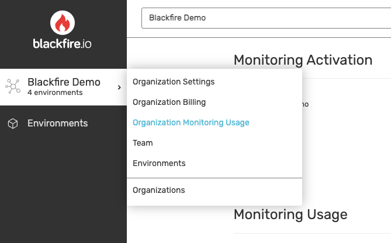
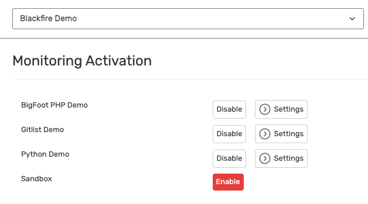

**Last updated 31st August 2023**


## Objective  

As the **official  observability service**, 
[Blackfire](https://www.blackfire.io/) helps you improve the performance of your apps at each stage of their lifecycle.
With Blackfire's unique Application Performance Monitoring (APM) and Profiling features,
you can achieve the following goals:

- Avoid performance bottlenecks by proactively identifying issues in your code

- Promptly solve identified issues by taking advantage of actionable recommendations

- Create performance budgets for critical parts of your app and get alerted of any problem before a change hits your production




Blackfire is installed natively on  and [works integrally with the  workflow](https://www.youtube.com/watch?v=Bq-LFjgD6L0).
This results in an effortless setup process and smooth user experience.

> [!primary]  
> 
> Blackfire.io can be bundled with Enterprise and Elite subscriptions as part of the Observability Suite.
> To learn more, [contact Sales](https://platform.sh/contact/).
> All customers can also subscribe to Blackfire separately.
> 
> 

## Set up Blackfire

### On a Grid or {} infrastructure 

If you're using a plan with the [Observability Suite](https://platform.sh/features/observability-suite/),
the [Blackfire automated integration](#automated-integration) is enabled on your environments by default.
Note that as an Observability Suite user, you can only access your Blackfire environments
after you've been granted access to the related  project.
Therefore, to access your Blackfire environments, make sure you log in using your  account.

If you have a {} cluster or Grid environments without the Observability suite,
you need to enable the integration yourself.
To do so, follow these steps:

1\. Create a [Blackfire account](https://blackfire.io/signup?target=/login), preferably using your  login.

2\. In your Blackfire account, create an organization.

   If you subscribed to Blackfire independently, your organization is automatically activated.
   If you subscribed to Blackfire through ,
   [ask **** Support](https://console.platform.sh/-/users/~/tickets/open) to activate your organization.
3\. In your organization, create an environment.

4\. In your environment, click **Settings/Environment Credentials**.

5\. Retrieve your Blackfire server ID and server token.

6\. Follow [the instructions from the Blackfire documentation](https://blackfire.io/docs/integrations/paas/platformsh).


If you're using the [Managed Fastly CDN](../../domains/cdn/managed-fastly.md),
it's already configured to operate with Blackfire. 
If you're using a different [Content Delivery Network (CDN)](../../domains/cdn/_index.md), 
make sure you [configure it](https://blackfire.io/docs/integrations/proxies/index)
to let Blackfire profile the code running on your servers.

### On {} infrastructure

To install Blackfire on your {} environments:

1\. Create a [Blackfire account](https://blackfire.io/signup?target=/login), preferably using your  login.

2\. In your Blackfire account, create an organization.

   If you subscribed to Blackfire independently, your organization is automatically activated.
   If you subscribed to Blackfire through ,
   [ask **** Support](https://console.platform.sh/-/users/~/tickets/open) to activate your organization.
3\. In your organization, create an environment.

4\. In your environment, click **Settings/Environment Credentials**.

5\. Retrieve your Blackfire server ID and server token.

6\. Send those credentials to [Support](https://console.platform.sh/-/users/~/tickets/open) so they complete the installation.


If you're using the [Managed Fastly CDN](../../domains/cdn/managed-fastly.md),
it's already configured to operate with Blackfire. 
If you're using a different [Content Delivery Network (CDN)](../../domains/cdn/_index.md), 
make sure you [configure it](https://blackfire.io/docs/integrations/proxies/index)
to let Blackfire profile the code running on your servers.

### Automated integration



The Blackfire automated integration is available for Grid and {} environments.

When you create a new environment,
it automatically triggers the creation of a Blackfire environment with the same settings.
On this Blackfire environment, you have access to [all the features provided by Blackfire](https://www.blackfire.io/features/).
This includes monitoring, profiling, alerting, and build-related features.

When a Blackfire environment is created based on a Grid environment,
user access settings are replicated from the  Console to Blackfire.
This includes all [access levels](https://blackfire.io/docs/up-and-running/access-management).
 
To access the Blackfire environment, each project user needs a Blackfire account.
When a project user doesn't already have a Blackfire account, 
a new one is automatically created using the user's  credentials.
 
You might have Blackfire variables already set on your project.
In this case, the existing variables override the settings of the automated integration.

Note that to trigger the synchronization of changes to users and their access levels,
you need to redeploy the environment.

## Get started with Blackfire Monitoring

Once Blackfire is [set up on your infrastructure](#set-up-blackfire), 
to start monitoring your environment follow these steps:

1\. For Python apps, you need to [activate Blackfire Monitoring](#1-activate-blackfire-monitoring) first.

2\. For both Python and PHP apps, you need to [enable Blackfire Monitoring on the required environments](#2-enable-blackfire-monitoring-on-your-environments).


### 1. Activate Blackfire Monitoring

If you want to monitor a PHP app, Blackfire Monitoring is available by default on your environments.
You only need to [specify which environments](#2-enable-blackfire-monitoring-on-your-environments) you want to monitor.

If you want to monitor a Python app, you need to activate Blackfire Monitoring yourself.
To do so, create the following [environment variable](../../development/variables/set-variables.md#create-environment-specific-variables):

```bash
webpaas variable:create --level environment --prefix env: --name BLACKFIRE_APM_ENABLED --value 1
```

If you later need to deactivate Blackfire Monitoring, change the value of the variable to `0`.

### 2. Enable Blackfire Monitoring on your environments

To enable Blackfire Monitoring on your environments, follow these steps:

1\.  Go to your [organizations list](https://blackfire.io/my/organizations) 

    and select the organization where you want to enable Blackfire Monitoring.

2\.  Click **Organization Monitoring Usage**.


    

3\.  In the **Monitoring Activation** section,

    enable monitoring on the environments of your choice.

    

For more information on Blackfire Monitoring features,
see the [Blackfire documentation](https://blackfire.io/docs/monitoring-cookbooks/index).

## Blackfire Profiling

While your code is running, the Blackfire profiler collects deep performance metrics
and provides full details and context of your code's behavior.
This helps you find the root cause of performance bottlenecks.

Blackfire lets you profile your application anywhere it's deployed,
including on your local development machines.
Using a browser extension or CLI command, 
you can profile HTTP requests, CLI scripts, Consumers, and Daemons.

For more information on Blackfire profiling features,
see the [Blackfire documentation](https://blackfire.io/docs/profiling-cookbooks/index).

## Test the performance of each new deployment

Blackfire's native integration with  enables you to test your app's performance
every time you deploy a branch in production, staging, or development.
Follow these steps:

1\.  Set up the [Blackfire Builds integration](https://blackfire.io/docs/integrations/paas/platformsh#builds-level-production).


2\.  Optional: set up an [integration with your Git provider](https://blackfire.io/docs/integrations/git/index)

    and get commit status updates from build reports.

3\.  To test business-critical use cases, [write scenarios](https://blackfire.io/docs/builds-cookbooks/scenarios).


### Bypass your reverse proxy, load balancer or CDN

To use [Blackfire profiling](#blackfire-profiling),
you need to bypass any reverse proxy, load balancer or [CDN](../../domains/cdn/_index.md) that sits in front of your app.
See [how to configure a bypass](https://blackfire.io/docs/reference-guide/reverse-proxies#documentation).

### Configure your HTTP cache

To take advantage of Blackfire features while using the HTTP cache with cookies,
allow the `__blackfire` cookie to go through the cache.

To do so, add [a configuration](../../define-routes/cache.md#allowing-only-specific-cookies) similar to the following:

```yaml {configFile="routes"}
cache:
    enabled: true
    cookies: ["/SESS.*/", "__blackfire"]
```

## Get support

If you're experiencing issues with Blackfire and [troubleshooting](#troubleshooting) information doesn't help,
follow these steps:

1\. Retrieve [startup errors](#1-retrieve-startup-errors).

2\. Retrieve your [Blackfire logs](#2-retrieve-your-blackfire-logs).

3\. Send this data to [Blackfire Support](https://support.blackfire.io).


### 1. Retrieve startup errors

To retrieve startup errors, run the following command:

```bash
webpaas ssh -- php -d display_startup_errors=on --ri blackfire 
```

### 2. Retrieve your Blackfire logs

To retrieve your Blackfire logs, follow these steps:

1\.  On the environment where you're facing issues, create the following [variable](../../development/variables/set-variables.md):


```bash
platform variable:create php:blackfire.log_file --value /tmp/blackfire.log
```

2\.  To set the verbosity of the logs to level 4 (debug level), create the following variable:


```bash
platform variable:create php:blackfire.log_level --value 4
```

3\.  Start a profile or build.


4\.  To display the logs, run the following command:


```bash
platform ssh -- cat /tmp/blackfire.log > blackfire.log
```

After you've retrieved the logs, you can disable them.
To do so, run the following commands:

```bash
webpaas variable:delete php:blackfire.log_file
webpaas variable:delete php:blackfire.log_level
```
