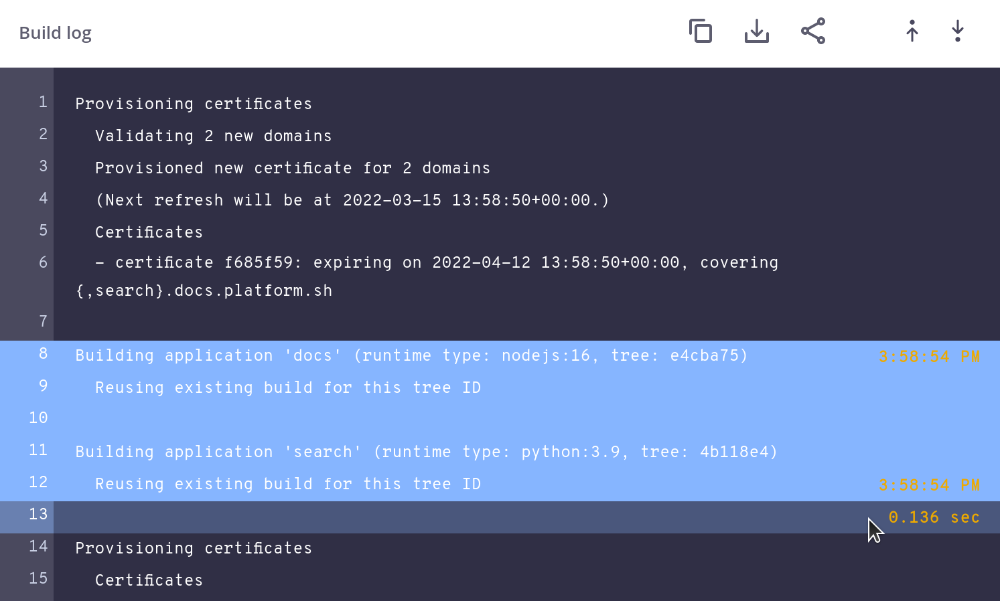

**Last updated 31st August 2023**


## Activity logs

Changes to your environments, such as deployments, cron jobs, and code or variable updates,
are each logged as activities.
You can access the logs either in the Console or using the [CLI](../../administration/cli/_index.md):

> [!tabs]      

If a running activity is stuck, you can [cancel the activity](../../environments/cancel-activity.md).

### Sharing activity logs

When trying to identify and resolve failures, it can often help to have another person's perspective.
Troubleshoot collaboratively by sharing the logs of specific activities.

To share a log, open the log and click  **Copy URL**.

Share specific lines in the log on clicking the line number.
To select multiple lines, hold <kbd>Shift</kbd>.
After selecting multiple lines,
hovering on the next unselected line gives you the amount of time that passed between the selected lines.



## Container logs

Events that occur within an app container are logged within that container.
The logs can be written to, but you should do so only with standard logging mechanisms.
If your app has its own logging mechanism, use it to write to a dedicated logs [mount](../../create-apps/app-reference.md#mounts).

To access the logs of various types of events:

> [!tabs]      

All log files are trimmed to 100 MB automatically.
If you need larger logs, set up a [cron job](../../create-apps/app-reference.md#crons) to upload them to third-party storage.
See an example of [uploading logs to Amazon S3](https://gitlab.com/contextualcode/platformsh-store-logs-at-s3) from Contextual Code.

### Types of container logs

| Type          | Always present | Description |
| ------------- | -------------- | ----------- |
| `access`      | Yes            | The raw access log for the nginx instance running on the container. It doesn't include requests that are redirected or cached by the [router](../../define-routes/_index.md). |
| `app`         | Yes            | All log messages generated by the app including language errors and exceptions. |
| `cron`        | No             | The output of cron jobs. Only exists after a cron job has run. |
| `deploy`      | No             | The output of the [`deploy` hook](../../create-apps/hooks/hooks-comparison.md#deploy-hook). Only exists after a `deploy` hook has run. |
| `dns`         | Yes            | All DNS queries made by processes in the container (such as the app and cron jobs). |
| `error`       | Yes            | nginx-level errors that occur once nginx has fully started such as HTTP errors for missing directories and excluded file types. |
| `nginx/error` | No             | All nginx startup log messages. Only useful when debugging possible nginx configuration errors. Not currently available using the `webpaas log` command. |
| `php.access`  | No             | A record of all requests to the PHP service. See [PHP access record format](#php-access-record-format). |
| `post_deploy` | No             | The output of the [`post_deploy` hook](../../create-apps/hooks/hooks-comparison.md#post-deploy-hook). Only exists after a `post_deploy` hook has run. |

#### PHP access record format

The formatting of `php.access.log` is determined by the PHP settings.
To determine the format, run the following:

```bash
webpaas ssh cat -n /etc/php/-zts/fpm/php-fpm.conf | grep "access.format"
```

You get a response such as the following:

```bash
Connection to ssh.eu.platform.sh closed.
access.format = "%{%FT%TZ}t %m %s %{mili}d ms %{kilo}M kB %C%% %{REQUEST_URI}e"
```

See what [each value in this string means](https://www.php.net/manual/en/install.fpm.configuration.php#access-format).

## Timezones

UTC is the default timezone for all logs.
