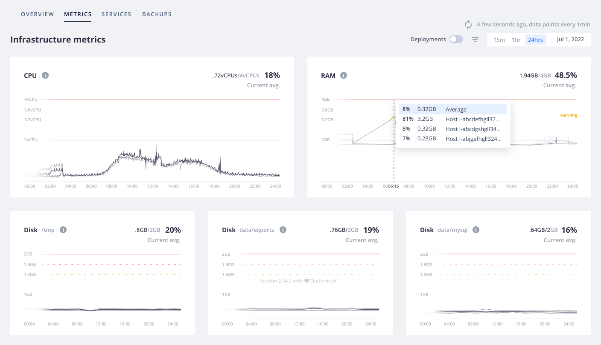
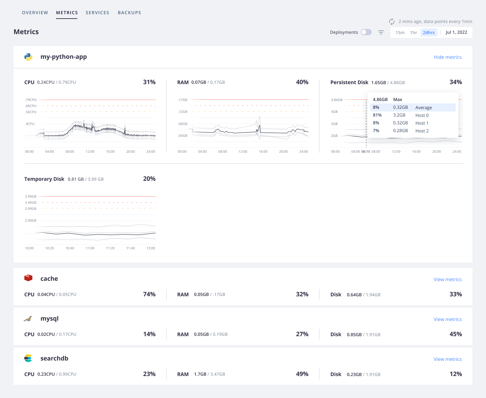
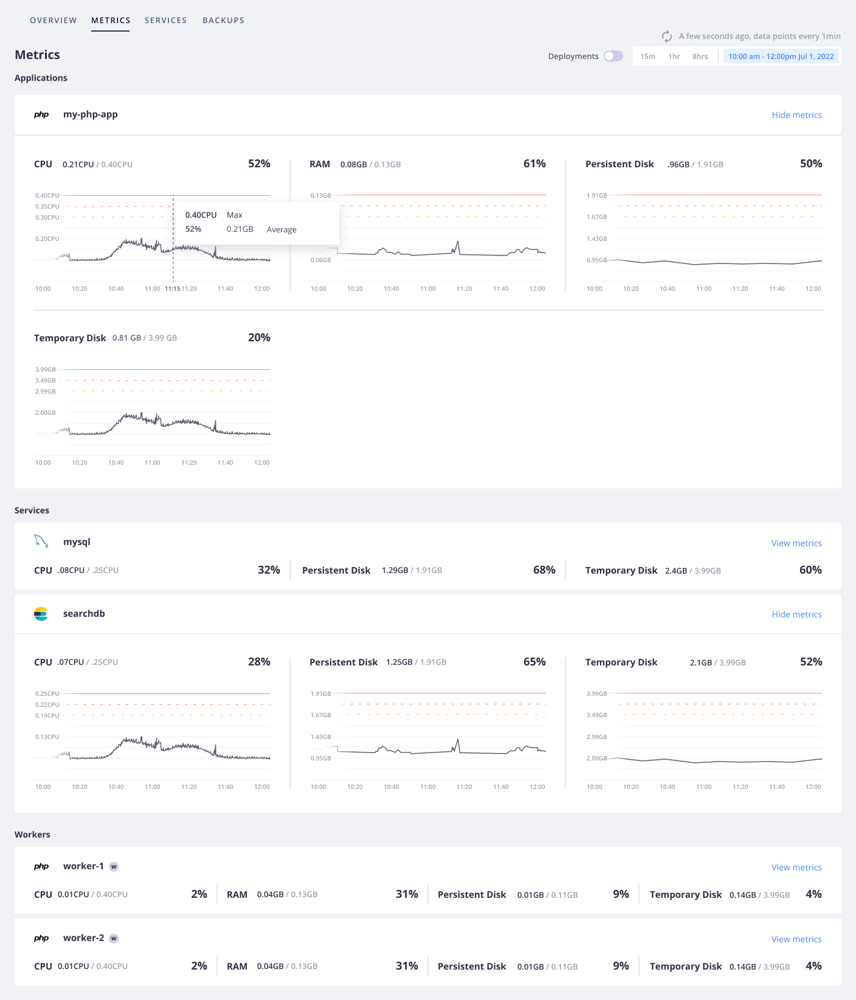

**Last updated 31st August 2023**

## Objective  

 projects are accompanied by live infrastructure metrics that provide an overview of resource usage for environments.

Within the Console, metrics can be found for an environment under **Metrics**.

The information under **Metrics** shows usage metrics for:

[{} environments](../../dedicated-gen-2/overview/_index.md):
each of the three hosts in your [N+1 configuration](../../dedicated-gen-2/architecture/_index.md)
and their average for the Production environment.
Metrics aren't available for other {} environments (such as a staging environment),
but are available for Grid environments (such as your development environments).

[{} environments](../../dedicated-gen-3/_index.md): each of the three hosts and their average.
These metrics are available for all of your {} environments.

Grid environments: your service, app, and worker containers.
These metrics are available for all of your Grid environments.

## Default thresholds

All of the graphs show labels for the following thresholds:

- Usage that crosses _80%_ results in a **warning** label.

- Usage that crosses _90%_ results in a **critical** label.

- On {} and Grid environments, usage that crosses _100%_ results in a **burst** label.

  The burst capability is available for containerized environments
  and allows a container to get more resources than it's allocated.
  Burst is considered useful for infrequent activities that cause usage spikes.

  On the Grid, resources are shared between customers,
  so these additional resources aren't guaranteed and burst can only be temporary.
  On {}, resources are dedicated to a single customer,
  but they're shared between services.
  Therefore, burst is allowed until the dedicated resource usage is exceeded.

### Recommendations

The default thresholds aim to give you an idea of when your hosts/containers are close to running out of resources.
The impact differs based on your specific apps and service.
The values of the thresholds is purely informational.

#### {} environments

For {} environments, the thresholds are set for each host.
If the resources are high and hovering close to the 100% threshold,
you might want to consider:

* [Optimizing your code](../integrate-observability/_index.md) (if possible)
* [Increasing your plan](../../administration/pricing/_index.md)

#### {} environments

For {} environments, the thresholds are set for each container.

If you have one container in a temporary burst state but your host still has plenty of available resources,
it might not be an issue as long as the site is functioning properly.
Burst allows your container to use additional resources when they aren't needed elsewhere.

If you have a container in a prolonged burst state, you might want to consider:

* [Optimizing your code](../integrate-observability/_index.md)
* Changing your [app size](../../create-apps/app-reference.md#sizes)
  or [service size](../../add-services/_index.md#size)
* [Increasing your plan](../../administration/pricing/_index.md)

You can reallocate your existing resources if other containers have resources they aren't using.

If you have multiple containers in a burst state, review your configuration or plan size.

#### Grid environments
  
For Grid environments, the thresholds are set for each container.
If the resources are high and hovering close to the 100% threshold,
you might want to consider:

* [Optimizing your code](../integrate-observability/_index.md) (if possible)
* Changing your [app size](../../create-apps/app-reference.md#sizes)
  or [service size](../../add-services/_index.md#size)
* [Increasing your plan](../../administration/pricing/_index.md)

If your containers are in a prolonged burst state,
review your configuration or plan size because burst isn't guaranteed for long periods.
If the burst threshold is triggered for short, infrequent activities,
it might not be an issue as long as the site is functioning properly.
Burst allows your container to use additional resources when they aren't required on the container's host.

## Time intervals

Measurements are taken for each metric every 1 minute.
You can select a time frame over which to see these measurements for the entire **Metrics** view.
In the primary three views, averages are shown over larger intervals.

| View                                                                  | Time between measurements                     | Example                      |
| :-------------------------------------------------------------------- | :-------------------------------------------- | :--------------------------- |
| The last 15 minutes (*15m*)                                           | 1 minute                                      | 10:00, 10:01, 10:02 |
| The last hour (*1hr*)                                                 | 1 minute                                      | 10:00, 10:01, 10:02          |
| The last 24 hours (*24hr*) for Dedicated and 8 hours (*8hr*) for Grid | 20 minutes for Dedicated, 10 minutes for Grid | 10:00, 10:20, 10:40, 11:00   |

To zoom in on smaller intervals, select specific ranges in a graph.

The interval between measurements then changes based on the range you choose.

| View         | Time between measurements |
| :----------- | :------------------------ |
| < 2 hours    | 1 minute                  |
| 2 to 5 hours | 5 minutes                 |
| 5+ hours     | 20 minutes                |

### Longer time intervals



If you have the Observability Suite, you can access historical data for up to 30 days.
These data should help you understand trends over time
and whether a given measurement is normal, something that occurs occasionally, or a true anomaly.

To see data over a given time frame, use the date picker to select the range to display.

## Deployments

Sometimes deployment activities (pushes, merges, syncs) can influence the underlying infrastructure.
You don't want to confuse a spike caused by a successful deploy with an issue that needs your attention.

To see how deployment activity influences the infrastructure, turn on **Deployments** on your metrics.

Each deployment activity appears as a line on each graph corresponding to the time the activity finished.
To see information about the deployment activity, hover over the line.
To see the build log for a specific deployment activity, click the line.
