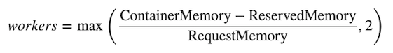

**Last updated 2nd June 2022**


## Objective  

Web PaaS uses a heuristic to automatically set the number of workers of the PHP-FPM runtime based on the memory available in the container. This heuristic is based on assumptions about the memory necessary on average to process a request. You can tweak those assumptions if your application will typically use considerably more or less memory.

Note that this value is independent of the `memory_limit` set in `php.ini`, which is the maximum amount of memory a single PHP process can use before it is automatically terminated.  These estimates are used only for determining the number of PHP-FPM workers to start.

## The heuristic

The heuristic is based on three input parameters:

- The memory available for the container, which depends on the size of the container (`S`, `M`, `L`).
- The memory that an average request is expected to require.
- The memory that should be reserved for things that are not specific to a request (memory for `nginx`, the op-code cache, some OS page cache, etc.)

The number of workers is calculated as:




## Defaults

The default assumptions are:

- `45 MB` for the average per-request memory
- `70 MB` for the reserved memory

These are deliberately conservative values that should allow most programs to run without modification.

You can change them by using the `runtime.sizing_hints.reserved_memory` and `runtime.sizing_hints.request_memory` in your `.platform.app.yaml`. For example, if your application consumes on average `110 MB` of memory for a request use:

```yaml
runtime:
    sizing_hints:
        request_memory: 110
```

The `request_memory` has a lower limit of 10 MB while `reserved_memory` has a lower limit of 70 MB.  Values lower than those will be replaced with those minimums.

You can check the maximum number of PHP-FPM workers by opening an [SSH session](../../development-ssh) and running following command (example for PHP 7.x):

```bash
grep -e '^pm.max_children' /etc/php/*/fpm/php-fpm.conf
pm.max_children = 2
```

## Measuring PHP worker memory usage

To see how much memory your PHP worker processes are using, you can open an [SSH session](../../development-ssh) and look at the PHP access log:

```bash
less /var/log/php.access.log
```

In the fifth column, you'll see the peak memory usage that occurred while each request was handled. The peak usage will probably vary between requests, but in order to avoid the severe performance costs that come from swapping, your size hint should be somewhere between the average and worst case memory usages that you observe.

A good way to determine an optimal request memory is with the following command:

```bash
tail -n5000 /var/log/php.access.log | awk '{print $6}' | sort -n | uniq -c
```

This will print out a table of how many requests used how much memory, in KB, for the last 5000 requests that reached PHP-FPM.  (On an especially busy site you may need to increase that number).  As an example, consider the following output:

```text
      1
   4800 2048
    948 4096
    785 6144
    584 8192
    889 10240
    492 12288
    196 14336
     68 16384
      2 18432
      1 22528
      6 131072
```

This indicates that the majority of requests (4800) used 2048 KB of memory.  In this case that's likely application caching at work.  Most requests used up to around 10 MB of memory, while a few used as much as 18 MB and a very few (6 requests) peaked at 131 MB.  (In this example those are probably cache clears.)

A conservative approach would suggest an average request memory of 16 MB should be sufficient.  A more aggressive stance would suggest 10 MB.  The more aggressive approach would potentially allow for more concurrent requests at the risk of some requests needing to use swap memory, thus slowing them down.

The web agency [Pixelant](https://www.pixelant.net/) has also published a [log analyzer tool for Web PaaS](https://github.com/pixelant/platformsh-analytics) that offers a better visualization of access logs to determine how much memory requests are using on average.  It also offers additional insights into the operation of your site that can suggest places to further optimize your configuration and provide guidance on when it's time to increase your plan size.  (Please note that this tool is maintained by a 3rd party, not by Web PaaS.)


> [!primary]  
> If you are running on PHP 5.x then don't bother adjusting the worker memory usage until you upgrade to PHP 7.x.  PHP 7 is vastly more memory efficient than PHP 5 and you will likely need less than half as much memory per process under PHP 7.
> 
