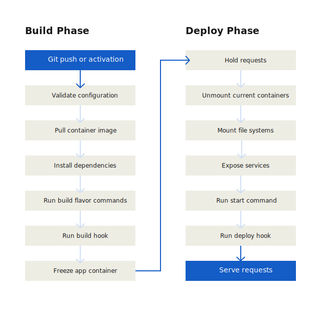

**Last updated 11th May 2021**

## Objective  

Every time you push to a live branch (a git branch with an active environment attached to it) or activate an
[environment](../administration-web/environments) for a branch, there are two main processes that happen: **Build** and **Deploy**.

1\. The build process looks through the configuration files in your repository and assembles the necessary containers.  

2\. The deploy process makes those containers live, replacing the previous versions, with virtually no interruption in service.

## Always Be Compiling

Interpreted languages like PHP or Node.js may not seem like they have to be compiled, but with modern package management tools like Composer or npm, as well as the growing use of CSS preprocessors such as Sass, most modern web applications need a "build" step between their source code and their production execution code.  At Web PaaS, we aim to make that easy.  The build step includes the entire application container&mdash;from language version to build tools to your code&mdash;rebuilt every time.

That build process is under your control and runs on every Git push.  Every Git push is a validation not only of your code, but of your build process.  Whether that's installing packages using Composer or Bundler, compiling TypeScript or Sass, or building your application code in Go or Java, your build process is vetted every time you push.

Whenever possible, you should avoid committing build assets to your repository that can be regenerated at build time.  Depending on your application, that may include 3rd party libraries and frameworks, generated and optimized CSS and JS files, generated source code, etc.

The following two constraints make sure you have fast, repeatable builds:

1\. **The build step should be environment-independent.** This is paramount to ensure development environments are truly perfect copies of production. This means you can not connect to services (like the database) during the build.

2\. **The final built application must be read-only.** If your application requires writing to the filesystem, you can specify the directories that require Read/Write access. These should not be directories that have code, because that would be a security risk.

## Building the application

After you push your code, the first build step is to validate your configuration files (i.e. `.platform.app.yaml`, `.platform/services.yaml`, and `.platform/routes.yaml`). The Git server will issue an error if validation fails, and nothing will happen on the server.

> [!primary]  
> While most projects have a single `.platform.app.yaml` file, Web PaaS supports multiple applications in a single project.  It will scan the repository for `.platform.app.yaml` files in subdirectories and each directory containing one will be built as an independent application. A built application will not contain any directories above the one in which it is found. The system is smart enough not to rebuild applications that have already been built, so if you have multiple applications, only changed applications will be rebuilt and redeployed.
> 

The live environment is composed of multiple containers&mdash;both for your application(s) and for the services it depends on. It also has a virtual network connecting them, as well as a router to route incoming requests to the appropriate application.

Based on your application type the system will select one of our pre-built container images and run the following:

1\. First, any dependencies specified in the `.platform.app.yaml` file are installed. Those include tools like Sass, Webpack, Drupal Console, or any others that you may need.

2\. Then, depending on the “build flavor” specified in the configuration file, we run a series of standard commands. The default for PHP containers, for example, is simply to run `composer install`.

3\. Finally, we run the “build hook” from the configuration file.  The build hook comprises one or more shell commands that you write to finish creating your production code base.  That could be compiling Sass files, running a bundler, rearranging files on disk, compiling an application in a compiled language, or whatever else you want.  Note that, at this point, all you are able to access is the file system; there are no services or other databases available.

Once all of that is completed, we freeze the file system and produce a read-only container image.  That image is the final build artifact: a reliable, repeatable snapshot of your application, built the way you want, with the environment you want.

Because  container configuration (both for your application and its underlying services) is exclusively based on your configuration files, and your configuration files are managed through Git, we know that a given container has a 1:1 relationship with a Git commit.  That means builds are always repeatable.  It also means that if we detect that there are no changes that would affect a given container, we can skip the build step entirely and reuse the existing container image, saving a great deal of time.

In practice, the entire build process usually takes less than a minute.

## Deploying the application

Deploying the application also has several steps, although they're much quicker.

First, we pause all incoming requests and hold them so that there's no interruption of service.  Then we disconnect the current containers from their file system mounts, if any, and connect the file systems to the new containers instead.  If it's a new branch and there is no existing file system, we clone it from the parent branch.

We then open networking connections between the various containers, but only those that were specified in the configuration files (using the `relationships` key).  No configuration, no connection. That helps with security, as only those connections that are actually needed even exist.  The connection information for each service is available in an application as environment variables.

Now that we have working, running containers there are two more steps to run.  First, if there is a “start” command specified in your `.platform.app.yaml` file to start the application, we run that. (With PHP, this is optional.)

Then we run your deploy hook.  Just like the build hook, the deploy hook is any number of shell commands you need to prepare your application.  Usually this includes clearing caches, running database migrations, and so on.  You have complete access to all services here as your application is up and running, but the file system where your code lives will now be read-only.

Finally, once the deploy hooks are done, we open the floodgates and let incoming requests through to your newly deployed application.  You're done!

In practice, the deploy process takes only a few seconds, plus whatever time is required for your deploy hook, if any.
