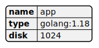
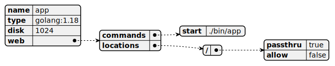
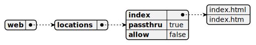

**Last updated 31st August 2023**


## Objective  

[YAML](https://en.wikipedia.org/wiki/YAML) is a human-readable format for data serialization.
This means it can be used for structured data, like what you can find in configuration files.

Some basic rules about YAML files:

- YAML files end in `.yaml`.

  Some other systems use the alternative `.yml` extension.
- YAML is case-sensitive.

- YAML is whitespace-sensitive and indentation defines the structure,

  but it doesn't accept tabs for indentation.
- Empty lines are ignored.

- Comments are preceded by an octothorpe `#`.


## Data types

YAML represents data through three primitive data structures:

- Scalars (strings/numbers/booleans)

- Mappings (dictionaries/objects)

- Sequences (arrays/lists)


### Scalars (strings/numbers/booleans)

The most straightforward data structure involves defining key–value pairs where the values are strings or integers.

So you could have a basic configuration for an app:

```yaml {configFile="app"}
name: app
type: "golang:1.18"
disk: 1024
```

This results in three key–value pairs.



You might notice you can define strings either with or without quotes, which can be single `'` or double `"`.
Quotes let you escape characters (if double) and make sure the value is parsed as a string when you want it.

For example, you might be representing version numbers and want to parse them as strings.
If you use `version: 1.10`, it's parsed as an integer and so is treated the same as `1.1`.
If you use `version: "1.10"`, it's parsed as a string and isn't treated as the same as `1.1`.

### Mappings (dictionaries/objects)

In addition to basic scalar values, each key can also represent a set of other key–value pairs.
So you can define entire dictionaries of pairs.

The structure of the mapping is determined by the indentation.
So children are indented more than parents and siblings have the same amount of indentation.
The exact number of spaces in the indentation isn't important, just the level relative to the rest of the map.

In contrast, when you define mappings, the order doesn't matter.

So you could expand the configuration from before to add another mapping:

```yaml {configFile="app"}
name: app
type: "golang:1.18"
disk: 1024

web:
    commands:
        start: ./bin/app
    locations:
        '/':
            passthru: true
            allow: false
```

This creates a `web` dictionary that has two dictionaries within it: `commands` and `locations`,
each with their own mappings.



### Sequences (arrays/lists)

In addition to maps defining further key–value pairs, you can also use sequences to include lists of information.

```yaml {configFile="app"}
web:
    locations:
        '/':
            index:
                - index.html
                - index.htm
            passthru: true
            allow: false
```

You can also define sequences using a flow syntax:

```yaml {configFile="app"}
web:
    locations:
        '/':
            index: [index.html, index.htm]
            passthru: true
            allow: false
```

In either case, you get a list of values within `index`.



## Define multi-line strings

If you have a long string that spans multiple lines, use a pipe `|` to preserve line breaks.
The new lines need to have at least the same indentation as the first
(you can add more indentation that's then preserved).

So you could add a multi-line string to a `build` key in the `hooks` map:

```yaml {configFile="app"}
hooks:
    build: |
        set -e
        cp a.txt b.txt
```

And the resulting value preserves the line break.
This lets you do things like enter small shell scripts within a YAML file.


## Reuse content

YAML supports internal named references, known as anchors, which can be referenced using an alias.
This allows you to reuse YAML blocks in multiple places within a single file.

Define an anchor by adding `&<NAME>` to the start of a value, where `<NAME>` is a unique identifier.
The anchor represents this entire value.
Then refer to the anchor using `*<NAME>`.

The following example shows 4 different workers:

```yaml {configFile="app"}
workers:
    queue1: &runner
        size: S
        commands:
            start: python queue-worker.py
    queue2: *runner
    queue3: 
        <<: *runner
        size: M
    queue4: 
        <<: *runner
        disk: 512
```

- `queue1` and `queue2` are identical with the same `size` and `commands` properties.

- `queue3` is the same as `queue1` except that it has a different value for `size`.

- `queue4` is the same as `queue1` except that it has the `disk` property in addition to the same `size` and `commands` properties.


Note that you need to place an alias with `<<:` at the same level as the other keys within that value.

## What's next

- See what  makes possible with [custom tags](./platform-yaml-tags.md).

- Read everything that's possible with YAML in the [YAML specification](https://yaml.org/spec/1.2.2/).

- See a [YAML file that explains YAML syntax](https://learnxinyminutes.com/docs/yaml/).

