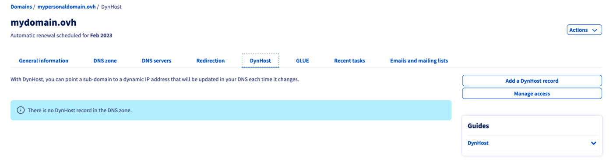
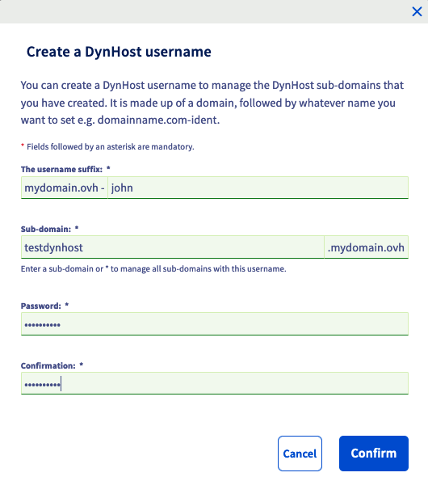

> [!primary]
> Esta traducción ha sido generada de forma automática por nuestro partner SYSTRAN. En algunos casos puede contener términos imprecisos, como en las etiquetas de los botones o los detalles técnicos. En caso de duda, le recomendamos que consulte la versión inglesa o francesa de la guía. Si quiere ayudarnos a mejorar esta traducción, por favor, utilice el botón «Contribuir» de esta página.
>

## Objetivo

La zona **D**omain **N**ame **S**ystem (**DNS**) de un dominio constituye el fichero de configuración de este último. y se compone de información técnica llamada *enregistrement DNS*. La zona DNS es, en cierto modo, un centro de afilamiento. 

Por ejemplo, puede especificar:

- La dirección IP (registros DNS de tipo *A* y *AAAA*) de su alojamiento web para mostrar su sitio web con su nombre de dominio.
- Servidores de correo (registros DNS de tipo *MX*) a los que el dominio debe redirigir los mensajes que reciba. para consultarlos en su dirección de correo electrónico personalizada con su dominio.
- Información relacionada con la seguridad o la autenticación de los servicios asociados (alojamiento web, servidor web, servidor de correo, etc.) a su dominio (registros DNS de tipo *SPF*, *DKIM*, *DMARC*, etc.).

Si lo necesita, consulte [nuestra documentación sobre los registros DNS y la edición de una zona DNS](/pages/web_cloud/domains/dns_zone_edit) desde su [área de cliente OVHcloud](https://www.ovh.com/auth/?action=gotomanager&from=https://www.ovh.es/&ovhSubsidiary=es).

La actualización de forma "dinámica" de un registro DNS puede evitar una interrupción prolongada de uno de sus servicios si no dispone de una dirección IP denominada "fija" (que no cambia).

Por ejemplo, el **DynHost** se puede utilizar si *se aloja* (en los locales de su empresa o en su domicilio, pasando por la *box* de su **P**roveedor de**A**cceso a **I**nternet (**PAI**)) un servidor de videojuegos sin tener una dirección IP "fija".

**Descubra cómo configurar un registro DNS dinámico (DynHost) para su dominio de OVHcloud.**

## Requisitos

- Tener acceso a la gestión del dominio desde el [área de cliente de OVHcloud](https://www.ovh.com/auth/?action=gotomanager&from=https://www.ovh.es/&ovhSubsidiary=es){.external}.
- Utilizar la configuración de OVHcloud (es decir, sus servidores DNS) para el dominio en cuestión. 
- El registro DynHost que vaya a crear no debe existir en la zona DNS de OVHcloud del dominio como registro "A".

> [!warning]
>
> - Si el dominio no utiliza los servidores DNS de OVHcloud, contacte con el proveedor que gestione su configuración DNS para conocer el procedimiento a seguir.
> 
> - Si el dominio está registrado en OVHcloud, compruebe que utiliza nuestra configuración. Para ello, conéctese a su [área de cliente de OVHcloud](https://www.ovh.com/auth/?action=gotomanager&from=https://www.ovh.es/&ovhSubsidiary=es){.external} y acceda al apartado `Web cloud`{.action}. En la columna izquierda, abra la pestaña `Dominios`{.action} y seleccione el dominio correspondiente. A continuación, abra la pestaña `Servidores DNS`{.action} para ver los servidores DNS utilizados por su dominio. 
>
> Para saber si utiliza o no los servidores DNS de OVHcloud, estos últimos tienen el siguiente formato: 
>
> - **dnsXX.ovh.net.** y **nsXX.ovh.net.** (donde los "**X**" son cifras que se deben sustituir por los que se refieren a los servidores de su nombre de dominio) si no utiliza la opción *DNS Anycast*
> - **dns200.anycast.me.** y **ns200.anycast.me** si utiliza la opción *DNS Anycast*
> 
> Si lo necesita, consulte nuestra guía relativa a [servidores DNS](/pages/web_cloud/domains/dns_server_general_information) para más información.
>

## Procedimiento

### Etapa 1 : crear un usuario DynHost 

Para crear un usuario DynHost, conéctese a su [área de cliente de OVHcloud](https://www.ovh.com/auth/?action=gotomanager&from=https://www.ovh.es/&ovhSubsidiary=es){.external} y acceda a la sección `Web cloud`{.action}. En la columna izquierda, abra la pestaña `Dominios`{.action} y seleccione el dominio correspondiente. A continuación, abra la pestaña `DynHost`{.action}.

{.thumbnail}

Haga clic en el botón `Gestionar los accesos`{.action} y luego en el botón `Crear un usuario`{.action}. Introduzca la información solicitada:

|Campo|Descripción|
|---|---|
|Sufijo del usuario|Establezca un sufijo para el usuario DynHost.|
|Subdominio|Indique el subdominio al que quiere crear el registro DNS dinámico. Si desea gestionar todos los subdominios con un único identificador, escriba el formulario de entrada `*`.|
|Contraseña|Establezca una contraseña para el usuario DynHost y confírmela.|

> [!success]
>
> Para instalar un DynHost directamente para su dominio, introduzca únicamente `*` en el formulario de entrada denominado `Subdominio`{.action}.
>

Una vez que haya completado todos los campos, haga clic en `Aceptar`{.action}. El usuario aparecerá en la tabla.
 Repita esta operación para cada usuario DynHost que quiera crear.

{.thumbnail}

### Etapa 2 : crear un registro DNS dinámico (DynHost) 

En segundo lugar, debe crear el registro DNS que se actualizará automáticamente. Le recordamos que el registro DynHost no debe existir en la zona DNS de OVHcloud del dominio como registro A. Para comprobarlo y, en su caso, eliminar dicho registro, consulte nuestra guía [Editar una zona DNS de OVHcloud](/pages/web_cloud/domains/dns_zone_edit){.external}.

Para crear el registro DynHost, vuelva a la página principal de la pestaña `DynHost`{.action} y haga clic en el botón `Añadir un DynHost`{.action}. Introduzca la información solicitada:

|Campo|Descripción|
|---|---|
|Subdominio|Introduzca el subdominio al que pertenezca el registro DNS que deberá actualizarse dinámicamente. Este subdominio debe ser el mismo que haya indicado anteriormente al crear el usuario DynHost. **Si desea implementar un DynHost directamente para su dominio, deje este formulario de entrada vacío**|
|IP de destino|Introduzca la dirección IP (solo IPv4) que vaya a utilizar el registro DNS. Es generalmente la dirección IP pública de su *box* Internet o de su servidor alojado. Según el principio DynHost, esta se actualizará automáticamente más adelante.|

> [!primary]
>
> Solo puede utilizarse un **IPv4** para implementar un DynHost. Los **IPv6** no están disponibles.
>

Una vez que haya completado todos los campos, haga clic en `Aceptar`{.action}. El registro aparecerá en la tabla.
 Repita esta operación para cada registro DynHost que quiera crear.

{.thumbnail}

### Etapa 3 : automatizar la actualización del DynHost

Una vez que haya creado el [usuario](#step1) y el [registro DynHost](#step2), deberá automatizar la actualización del registro DNS para que se realice dinámicamente. Para ello, debe utilizar un programa o cliente que le permita comprobar regularmente si la dirección IP de destino ha cambiado para actualizarla automáticamente.

> [!warning]
>
> La instalación y la configuración del software/cliente deben realizarse según sus propios conocimientos. A continuación ofrecemos algunas indicaciones sobre cómo hacerlo. No obstante, si tiene alguna duda, le recomendamos que contacte con un [proveedor especializado](https://partner.ovhcloud.com/es-es/directory/). Nosotros no podremos asistirle. 
> Más información en la sección ["Más información"](#go-further) de esta guía.
>

Existen diversas posibilidades en lo que respecta al programa o cliente: 

- puede instalarse en el servidor o en el ordenador;
- ya puede estar disponible en la interfaz de su router/*box* Internet si este es compatible. Si necesita ayuda, puede ponerse en contacto con el equipo de soporte de su **PAI** para realizar la configuración.

Una vez que haya elegido e instalado el cliente, deberá configurarlo utilizando la información del usuario DynHost que haya creado anteriormente en el área de cliente de OVHcloud.

Según el cliente utilizado, además de los elementos del usuario DynHost y del subdominio correspondiente, puede ser necesaria una URL de actualización. En ese caso, utilice la siguiente URL sustituyendo la información genérica:

`https://www.ovh.com/nic/update?system=dyndns&hostname=**$HOSTNAME**&myip=**$IP**`

|Valor|Sustituir por...|
|---|---|
|$HOSTNAME|El subdominio afectado por la actualización.|
|$IP|La nueva dirección IPv4 de destino.|

Puede comprobar si la dirección IP de destino se ha actualizado correctamente. Para ello, conéctese a su [área de cliente de OVHcloud](https://www.ovh.com/auth/?action=gotomanager&from=https://www.ovh.es/&ovhSubsidiary=es){.external} y acceda al apartado `Web cloud`{.action}. En la columna izquierda, abra la pestaña `Dominios`{.action} y seleccione el dominio correspondiente. A continuación, abra la pestaña `DynHost`{.action}. Compruebe la dirección IP que aparece en la columna `Destino`{.action}.

> [!warning]
>
> Cualquier modificación en la zona DNS activa de un dominio puede conllevar un plazo de propagación de la actualización de 4 a 24 horas.
>

{.thumbnail}

## Más información 

Para servicios especializados (posicionamiento, desarrollo, etc.), contacte con [partners de OVHcloud](https://partner.ovhcloud.com/es-es/directory/).

Si quiere disfrutar de ayuda para utilizar y configurar sus soluciones de OVHcloud, puede consultar nuestras distintas soluciones [pestañas de soporte](https://www.ovhcloud.com/es-es/support-levels/).

Interactúe con nuestra comunidad de usuarios en <https://community.ovh.com/en/>.