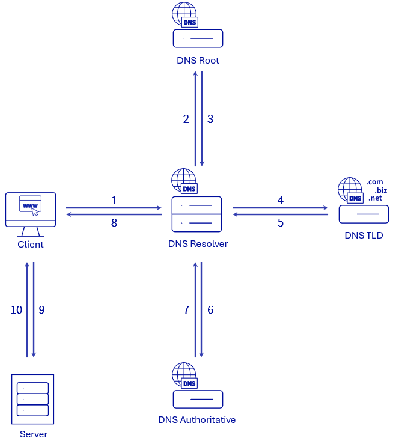

> [!primary]
> Questa traduzione è stata generata automaticamente dal nostro partner SYSTRAN. I contenuti potrebbero presentare imprecisioni, ad esempio la nomenclatura dei pulsanti o alcuni dettagli tecnici. In caso di dubbi consigliamo di fare riferimento alla versione inglese o francese della guida. Per aiutarci a migliorare questa traduzione, utilizza il pulsante "Contribuisci" di questa pagina.
>

## Obiettivo

L'acronimo **DNS**, che sta per **D**omain **N**ame **S**ystem, è un insieme di elementi (server DNS, zone DNS, ecc...) che permettono di far corrispondere un nome di dominio con un indirizzo IP.

**Informazioni sul ruolo dei server DNS, sul loro contenuto e sul loro funzionamento con un dominio**

<iframe width="560" height="315" src="https://www.youtube-nocookie.com/embed/BvrUi26ShzI" frameborder="0" allow="accelerometer; autoplay; clipboard-write; encrypted-media; gyroscope; picture-in-picture" allowfullscreen></iframe>

## Prerequisiti

### Ruolo dei server DNS

Tutti i **server DNS** formano insieme la cosiddetta rete DNS.

Questa rete DNS permette di facilitare agli utenti l'accesso a Internet e ai diversi servizi associati (siti Web, servizi di posta elettronica, ecc.).

In particolare, consentono l'utilizzo di [domini](/links/web/domains) per accedere al sito Web preferito senza dover ricordare l'indirizzo IP del server in cui è ospitato il sito Web.

{.thumbnail}

Esistono 4 tipi di server DNS.

Di seguito è riportata una tabella con tutti e quattro i tipi di server DNS e le loro interazioni. Gli esempi forniti nella tabella verranno realizzati a partire da una richiesta DNS inviata da un browser web per conoscere l'indirizzo IP del sito web *domain.tld*.

|Tipo di server DNS|Descrizione|Esempio|
|---|---|---| 
|Resolver DNS (o DNS recursive)|Primo server che riceve la richiesta DNS inviata da un client (browser Internet, client di posta, ecc...). Questa fase è rappresentata dalla fase **1** del diagramma precedente. Il server funge da gateway tra il client e il resto della rete DNS. Esegue una query sugli altri tre tipi di server DNS fino a quando non recupera l'indirizzo IP richiesto dalla query DNS dal server DNS di riferimento. Il client invia la richiesta DNS per conoscere l'indirizzo IP del dominio *domain.tld*. |Il browser invia una richiesta DNS per conoscere l'indirizzo IP del dominio *domain.tld*. Questo permette di conoscere il server su cui è ospitato il sito Web associato al dominio *domain.tld*.|
|Server DNS root (DNS root)|Contiene una directory per tutti i TLD (domini di primo livello come *.com*, *.net*, *.it*, ecc...). Il resolver DNS comunicherà al resolver DNS l'indirizzo del server DNS TLD corrispondente all'estensione presente nella richiesta DNS richiesta dal client (passi **2** e **3** dello schema sopra riportato).|Il resolver DNS trasmette la richiesta DNS ricevuta per *domain.tld* al server DNS radice e riceve in risposta l'indirizzo del server DNS TLD che gestisce l'estensione *.tld*.|
|Server DNS con estensione/nomi di dominio di primo livello (DNS TLD)|Contiene una directory dei nomi di dominio per una determinata estensione. Il resolver DNS comunicherà al resolver DNS l'indirizzo del server DNS autorevole corrispondente al nome di dominio presente nella richiesta DNS richiesta dal client (passi **4** e **5** dello schema precedente).|Il resolver DNS trasmette quindi la richiesta DNS ricevuta per *domain.tld* al server DNS TLD che gestisce le estensioni in *.tld* e riceve in risposta l'indirizzo del server DNS autorevole che gestisce la zona DNS del nome di dominio *domain.tld*.|
|Server DNS autoritativi (Authoritative DNS)|Ultimo server DNS richiesto dal resolver DNS (passi **6** e **7** dello schema sopra riportato). Contiene la zona DNS attiva per il nome di dominio presente nella query DNS richiesta dal client. Di seguito sono riportati i dettagli relativi a questo tipo di server DNS.|Il resolver DNS trasmette quindi la richiesta DNS ricevuta per *domain.tld* al server DNS autorevole che gestisce la zona DNS del nome di dominio *domain.tld* e in risposta riceve l'indirizzo IP (esempio 203.0.113.0) del server che ospita il sito Web del nome di dominio *domain.tld*.|

Non appena il resolver DNS ha recuperato l'indirizzo IP del server cercato tramite la richiesta DNS richiesta dal client, restituisce questo indirizzo IP al client (passaggio **8** dello schema sopra riportato).

Il client invia quindi un'altra richiesta direttamente al server associato all'indirizzo IP recuperato grazie alla risoluzione DNS (step **9** dello schema sopra riportato). Questo gli permette di connettersi o di recuperare gli elementi di cui ha bisogno per risolvere questa seconda richiesta (step **10** dello schema sopra riportato). Nel nostro esempio, il cliente (browser web) interroga il server con indirizzo IP 203.0.113.0 per recuperare il contenuto da visualizzare per il sito web *domain.tld*.

Per effettuare questa operazione su un dominio registrato in OVHcloud, consulta la nostra guida "[Modificare i server DNS di un dominio OVHcloud](/pages/web_cloud/domains/dns_server_edit)".

### Contenuto di un server DNS (Authoritative)

Un **server DNS (Authoritative)** contiene una rubrica di domini con estensioni (TLD) differenti.

Per ogni dominio incluso nella directory è associata una **zona DNS** che contiene la configurazione DNS da applicare al dominio.

Una zona DNS contiene informazioni tecniche chiamate *record DNS*. La zona DNS è come una cabina di pilotaggio.

> [!success]
>
> - Per maggiori informazioni sulle zone DNS, consulta la nostra guida "[Sapere tutto sulla zona DNS](/pages/web_cloud/domains/dns_zone_general_information)".
> - Consulta la nostra guida su [Scopri tutto sui record DNS](/pages/web_cloud/domains/dns_zone_records) per una migliore comprensione dell'insieme.
>

Per utilizzare la zona DNS ospitata, devono essere dichiarati i **server DNS (Authoritative)** (presso il Registrar di un dominio).

{.thumbnail}

### Funzionamento di un server DNS (Authoritative) con un dominio

#### Dichiarazione dei server DNS (Authoritative) presso il Registrar di un dominio

Per attivare la zona DNS associata a un dominio presente nella directory di un server DNS, è necessario che il server DNS sia dichiarato presso il Registrar del dominio.

Per precauzione, al Registrar di un dominio vengono dichiarati almeno 2 **server DNS (Authoritative)** (un server DNS primario e un server DNS secondario). I due sistemi funzionano in modo identico. Tuttavia, se uno dei due risponde più rapidamente, verrà interrogato in via prioritaria dai resolver DNS. Se uno dei due non risponde o non risponde più, l'altro server DNS sarà presente per rispondere alla richiesta DNS.

A volte alcuni provider DNS offrono più di 2 **server DNS (Authoritative)** da dichiarare presso il tuo dominio. In questo caso, inserisci tutti i server DNS proposti dal tuo provider DNS.

## Per saperne di più

[Sapere tutto sulla zona DNS](/pages/web_cloud/domains/dns_zone_general_information).

[Scopri tutto sui record DNS](/pages/web_cloud/domains/dns_zone_records).

[Modificare i server DNS di un dominio OVHcloud](/pages/web_cloud/domains/dns_server_edit).

[Modificare una zona DNS OVHcloud](/pages/web_cloud/domains/dns_zone_edit).

Per prestazioni specializzate (referenziamento, sviluppo, ecc...), contatta i [partner OVHcloud](/links/partner).
 
Per usufruire di un supporto per l'utilizzo e la configurazione delle soluzioni OVHcloud, è possibile consultare le nostre soluzioni [offerte di supporto](/links/support).
 
Contatta la nostra [Community di utenti](/links/community).