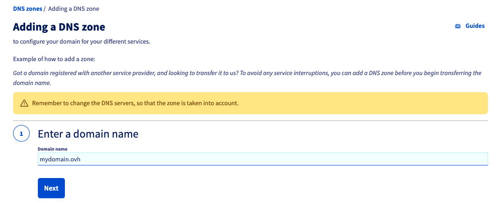
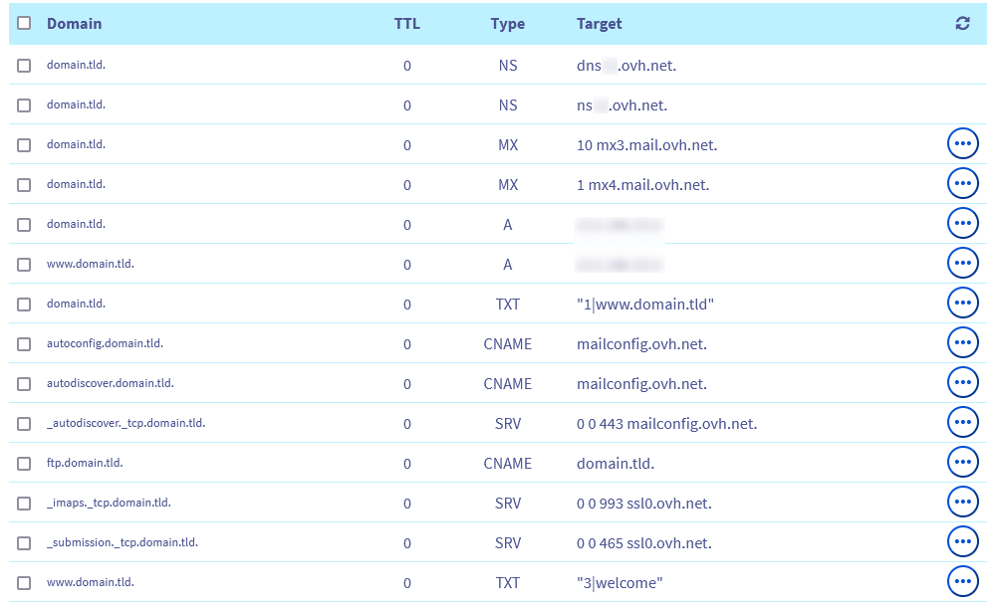
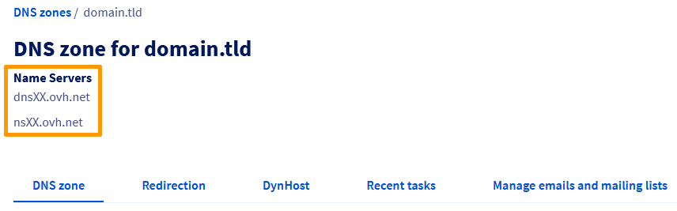

> [!primary]
> Esta tradução foi automaticamente gerada pelo nosso parceiro SYSTRAN. Em certos casos, poderão ocorrer formulações imprecisas, como por exemplo nomes de botões ou detalhes técnicos. Recomendamos que consulte a versão inglesa ou francesa do manual, caso tenha alguma dúvida. Se nos quiser ajudar a melhorar esta tradução, clique em "Contribuir" nesta página.
>

## Objetivo

A zona **D**omain **N**ame **S**ystem (**DNS**) de um nome de domínio constitui o ficheiro de configuração deste último. É composta por informações técnicas, designadas *registos DNS*. A zona DNS é, de certa forma, como um centro de agulhas.

Para mais explicações, consulte os seguintes guias:

- [Saber tudo sobre os servidores DNS](/pages/web_cloud/domains/dns_server_general_information)
- [Saber tudo sobre a zona DNS](/pages/web_cloud/domains/dns_zone_general_information)
- [Saber tudo sobre os registos DNS](/pages/web_cloud/domains/dns_zone_records)

Por várias razões, poderá ter de criar uma zona DNS para o seu domínio na OVHcloud.

**Saiba como criar uma zona DNS na OVHcloud para o seu domínio através da Área de Cliente OVHcloud.**

## Requisitos

- Dispor de um nome de domínio.
- O domínio em questão não deve dispor de uma zona DNS (ativa ou não) na OVHcloud ou estar a ser objeto de uma operação ou de um comando em curso na OVHcloud.
- Ter acesso ao seu [Área de Cliente OVHcloud](/links/manager){.external}.

## Instruções

> [!warning]
>
> Pode criar várias zonas DNS (em diferentes fornecedores/fornecedores/alojadores DNS) para um mesmo nome de domínio. No entanto, só pode ter uma zona DNS ativa para o seu domínio. Esta restrição visa evitar *conflitos DNS*.
>
> A ativação/desativação de uma zona DNS é efetuada a partir da declaração dos **servidores DNS** no seu nome de domínio. Pode alterar esta declaração e alterar os **servidores DNS** de um nome de domínio junto: 
>
> - do *agente de registo* onde registou diretamente o seu nome de domínio;
> - do prestador de serviços que o gere, se passar por um prestador de serviços especializado para gerir o seu nome de domínio.
>
> Ao alterar **servidores DNS** de um nome de domínio, está a desativar a configuração da antiga zona DNS aplicada em benefício da configuração da nova zona DNS (presente nos novos **servidores DNS** declarados).
>
> Por isso, antes de alterar os **servidores DNS** declarados ao seu domínio, verifique se a configuração da nova zona DNS corresponde às suas necessidades.
>

### Etapa 1: criar a zona DNS através da Área de Cliente OVHcloud

Ligue-se ao seu [Área de Cliente OVHcloud](/links/manager){.external} e vá à secção `Web cloud`{.action}. Na coluna da esquerda, clique em `Encomendar`{.action} e na caixa `Zona DNS`{.action}.

Na nova página, introduza o domínio (exemplo: *domínio.tld*) para o qual deseja criar uma zona DNS OVHcloud. Aguarde alguns instantes até que a ferramenta efetue as verificações relativas ao nome de domínio.

Se aparecer uma mensagem a indicar que a zona DNS não pode ser criada, verifique se o nome de domínio cumpre os requisitos necessários ou peça à pessoa que o gere que o faça por si. Assim que tudo estiver correto, tente novamente.

{.thumbnail}

Assim que a verificação chegar ao fim, escolha ativar ou não as entradas mínimas para a zona DNS que vai criar. Esta escolha não é definitiva pois poderá sempre [editar os registos da zona DNS](/pages/web_cloud/domains/dns_zone_edit) mais tarde.

{.thumbnail}

|Ativar entradas mínimas?|Detalhes|
|---|---|
|Sim|Selecione esta escolha se deseja personalizar você mesmo a zona DNS. {.thumbnail}
|Não|Selecione esta escolha se pretende utilizar serviços da OVHcloud como [alojamento web](/links/web/hosting){.external}, sendo a zona pré-configurada para este efeito. {.thumbnail}|

Depois de escolher, siga os passos até criar a zona DNS.

### Etapa 2: editar a zona DNS (facultativo)

Uma vez que a zona DNS para o seu domínio está criada, pode editá-la a partir de agora. Esta operação é opcional, mas pode ser necessária se pretender assegurar a continuidade da disponibilidade dos serviços associados a este nome de domínio (como um website e/ou os e-mails).

Para editar esta zona DNS, consulte o nosso guia "[Editar uma zona DNS na OVHcloud](/pages/web_cloud/domains/dns_zone_edit)".

> [!primary]
>
> Se acabou de criar a zona DNS e o domínio ainda não estiver incluído na lista dos serviços (na parte `Web cloud`{.action} na Área de Cliente OVHcloud, depois na secção `Nomes de domínio`{.action}), aguarde 15 a 20 minutos e recarregue a página.
>

### Etapa 3: alterar os servidores DNS do domínio

Quando a zona DNS da OVHcloud estiver pronta para ser utilizada, associe-a ao seu domínio para aplicar a configuração que contém a este último. 

Assim, deverá recuperar previamente os **servidores DNS** da OVHcloud nos quais a zona DNS da OVHcloud foi criada para o seu domínio.

Para isso, aceda à [Área de Cliente OVHcloud](/links/manager){.external} e aceda à secção `Web cloud`{.action}. Na coluna da esquerda, clique em `Nomes de domínio`{.action} e selecione a zona DNS em causa. 

Ela tem o nome do seu domínio e um logótipo em forma de globo etiquetado com o termo *DNS* está presente à esquerda. 

> [!primary]
> Neste estádio, se tem um logótipo em forma de globo apenas (sem o termo *DNS* escrito no seu interior), é que o nome de domínio já está a ser gerido na sua Área de Cliente OVHcloud. 
>
> Se é o contacto *Administrador* deste último, poderá neste caso alterar diretamente os **servidores DNS** através do nosso [guia](/pages/web_cloud/domains/dns_server_edit) sobre o assumpto.
>
> Relembramos que, antes de alterar os **servidores DNS** declarados ao seu domínio, verifique se a configuração da nova zona DNS corresponde às suas expetativas.
>

Na página que aparece, os servidores DNS a utilizar com o seu nome de domínio para ativar a zona DNS da OVHcloud estão apostos abaixo de `Name Servers`{.action}.

{.thumbnail}

Depois de obter as informações, **modifique os servidores DNS do seu nome de domínio a partir da interface do prestador que gere o domínio**. Depois de efetuar a operação, é necessário um tempo máximo de propagação de **48 horas** para que a alteração seja totalmente efetiva.

> [!primary]
>
> Relembramos que, antes de alterar os **servidores DNS** declarados ao seu domínio, verifique se a configuração da nova zona DNS corresponde às suas expetativas.
>

> [!success]
>
> Se pretender personalizar os nomes dos servidores DNS associados à zona DNS ativa do seu domínio, consulte o guia "[Personalizar os servidores DNS de um nome de domínio (Glue Records)](/pages/web_cloud/domains/glue_registry)".
>

## Quer saber mais?

[Saber tudo sobre os servidores DNS](/pages/web_cloud/domains/dns_server_general_information)

[Saber tudo sobre a zona DNS](/pages/web_cloud/domains/dns_zone_general_information)

[Saber tudo sobre os registos DNS](/pages/web_cloud/domains/dns_zone_records)

[Editar uma zona DNS da OVHcloud](/pages/web_cloud/domains/dns_zone_edit)

Para serviços especializados (referenciamento, desenvolvimento, etc), contacte os [parceiros OVHcloud](/links/partner).
 
Se pretender usufruir de uma assistência na utilização e na configuração das suas soluções OVHcloud, consulte as nossas diferentes [ofertas de suporte](/links/support).
 
Fale com nossa [comunidade de utilizadores](/links/community).