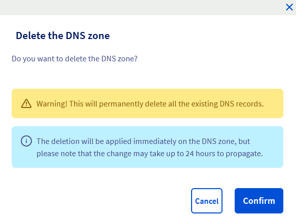
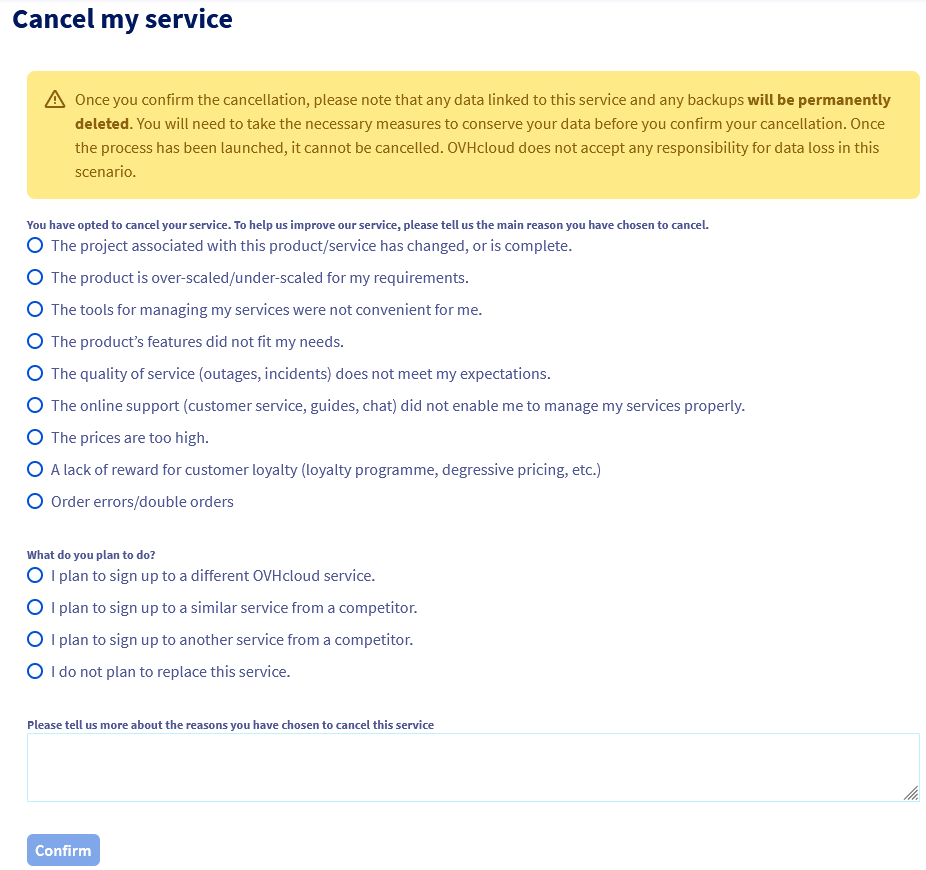

> [!primary]
> Esta tradução foi automaticamente gerada pelo nosso parceiro SYSTRAN. Em certos casos, poderão ocorrer formulações imprecisas, como por exemplo nomes de botões ou detalhes técnicos. Recomendamos que consulte a versão inglesa ou francesa do manual, caso tenha alguma dúvida. Se nos quiser ajudar a melhorar esta tradução, clique em "Contribuir" nesta página.
>

## Objetivo

A zona **D**omain **N**ame **S**ystem (**DNS**) de um nome de domínio é o seu ficheiro de configuração. É composta por informações técnicas, chamadas *registos DNS*. A zona DNS é, de certa forma, um centro de comando.

Para mais informações sobre as zonas e os servidores DNS, consulte os seguintes guias: 

- [Saber tudo sobre os servidores DNS](/pages/web_cloud/domains/dns_server_general_information)
- [Saber tudo sobre a zona DNS](/pages/web_cloud/domains/dns_zone_general_information)
- [Saber tudo sobre os registos DNS](/pages/web_cloud/domains/dns_zone_records)

Por exemplo, pode eliminar uma zona DNS do seu domínio na OVHcloud nos seguintes casos (lista não exaustiva):

- Utiliza uma zona DNS ativa para o seu nome de domínio noutro fornecedor que não a OVHcloud.
- Já não utiliza o nome de domínio associado à zona DNS presente na OVHcloud.
- Migrou os seus serviços para outro fornecedor e pretende rescindir os seus serviços OVHcloud.

> [!primary]
>
> A criação / modificação / eliminação de uma zona DNS na sua [Área de Cliente OVHcloud](/links/manager) é totalmente gratuita.
>

**Saiba como eliminar uma zona DNS da OVHcloud para o seu domínio através da Área de Cliente OVHcloud.**

## Requisitos

Ter acesso à [Área de Cliente OVHcloud](/links/manager).
- Ter uma zona DNS na Área de Cliente OVHcloud.
- Dispor de direitos suficientes sobre a zona DNS a eliminar. Encontre mais informações no nosso guia "[Gerir os contactos dos seus serviços](/pages/account_and_service_management/account_information/managing_contacts)".

## Instruções

> [!warning]
>
> Antes de continuar, verifique se a zona DNS que pretende eliminar já não está a ser utilizada pelo seu domínio.
>
> A eliminação da zona DNS ativa para o seu domínio levará à interrupção dos serviços online (site, endereços de e-mail, etc.).
>
> Faça um [WHOIS](/links/web/domains-whois) do seu domínio para saber se a zona DNS ativa do seu domínio é a que se encontra presente na OVHcloud ou não.
>
> Se a zona DNS ativa para o seu domínio for a que está presente na OVHcloud e pretender substituí-la por uma zona DNS alojada noutro local, consulte o guia "[Modificar os servidores DNS de um nome de domínio OVHcloud](/pages/web_cloud/domains/dns_server_edit)" antes de efetuar qualquer operação de eliminação da zona DNS.
>

### Etapa 1 - Iniciar a eliminação de uma zona DNS da OVHcloud

Para iniciar a eliminação de uma zona DNS da OVHcloud, execute as seguintes ações: 

1. Aceda à [Área de Cliente OVHcloud](/links/manager).
2. Na linha situada no topo da Área de Cliente, clique no separador `Web Cloud`{.action}.
3. Na coluna da esquerda, clique no menu pendente `Nomes de domínio`{.action}.
4. Selecione o domínio ou a zona DNS em causa.
5. Na página que se abrir, clique no separador `Zona DNS`{.action} para aceder à tabela que lista todas as entradas DNS da zona DNS.
6. Na parte direita (ou abaixo da tabela em função da resolução do seu ecrã), clique no botão `Eliminar a zona DNS`{.action}".

{.thumbnail}

Na janela que se abre, leia as mensagens indicadas no interior.

{.thumbnail}

Clique no botão `Validar`{.action} para concluir a primeira etapa de eliminação da zona DNS.

### Etapa 2 - Confirmar a eliminação de uma zona DNS da OVHcloud

No seguimento da etapa anterior, um e-mail para confirmar a eliminação da zona DNS é enviado para o endereço de e-mail do contacto "[Administrador](/pages/account_and_service_management/account_information/managing_contacts)" da zona DNS da OVHcloud.

> [!success]
>
> Se não receber este e-mail, verifique as mensagens de correio publicitário não solicitado.
>

Esta mensagem de correio eletrónico contém duas ligações válidas para **72** horas a partir do momento em que concluir a etapa 1 deste guia.

Clique no **link de validação** para prosseguir com a eliminação da zona DNS da OVHcloud ou no **link de anulação** para interromper o processo de eliminação da zona DNS da OVHcloud.

> [!primary]
>
> Se o reencaminhamento da ligação não funcionar, copie e cole *** o link na barra de URL do browser. Se necessário, volte a ligar-se à sua [Área de Cliente OVHcloud](/links/manager).
>

Se clicar na ligação de validação, será redirecionado para uma nova página da OVHcloud que lhe pedirá o(s) motivo(s) para eliminar a zona DNS da OVHcloud.

{.thumbnail}

Depois de preencher o formulário, e se tiver a certeza absoluta de que deseja eliminar a zona DNS da OVHcloud de forma definitiva, clique no botão `Validar`{.action} na parte inferior da página.

Será enviado um último e-mail de confirmação para o endereço de e-mail do contacto "[Administrador](/pages/account_and_service_management/account_information/managing_contacts)" da zona DNS da OVHcloud, para confirmar a eliminação.

## Quer saber mais?

[Gerir os contactos dos serviços](/pages/account_and_service_management/account_information/managing_contacts)

[Editar uma zona DNS da OVHcloud](/pages/web_cloud/domains/dns_zone_edit)

[Modificar os servidores DNS de um domínio OVHcloud](/pages/web_cloud/domains/dns_server_edit)

[Criar uma zona DNS OVHcloud](/pages/web_cloud/domains/dns_zone_create)
 
Para serviços especializados (referenciamento, desenvolvimento, etc), contacte os [parceiros OVHcloud](/links/partner).
 
Se pretender usufruir de uma assistência na utilização e na configuração das suas soluções OVHcloud, consulte as nossas diferentes [ofertas de suporte](/links/support).
 
Fale com nossa [comunidade de utilizadores](/links/community).