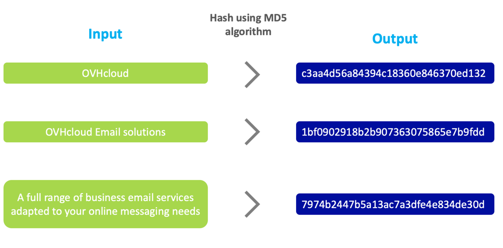
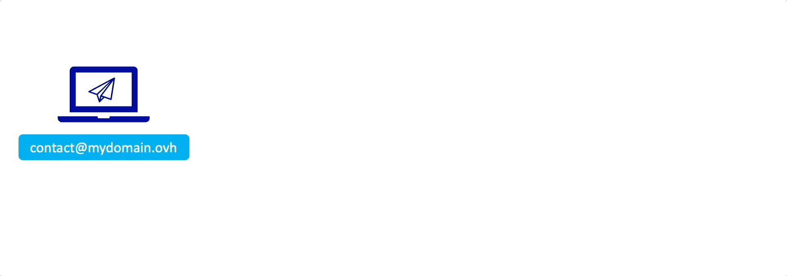
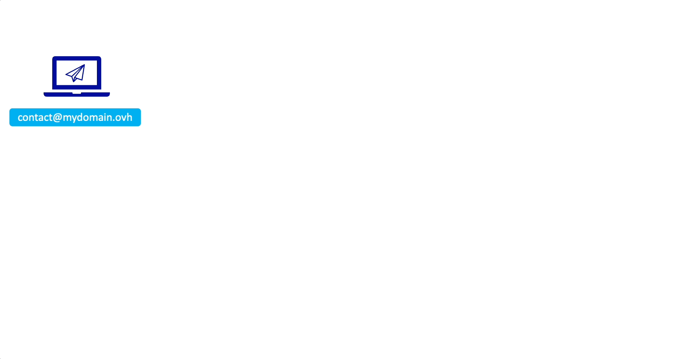
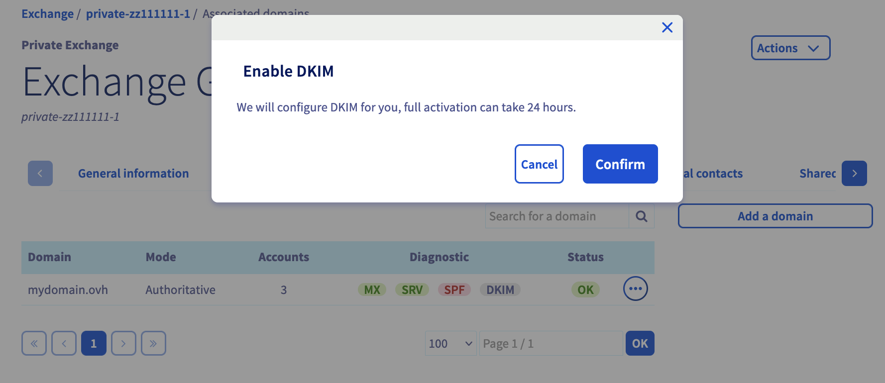
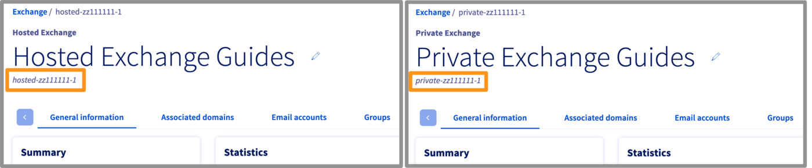
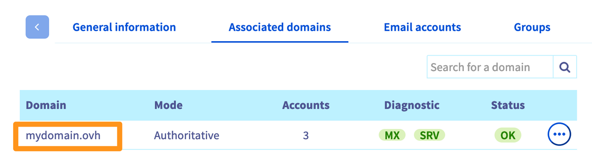
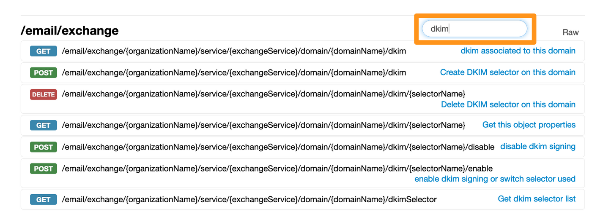
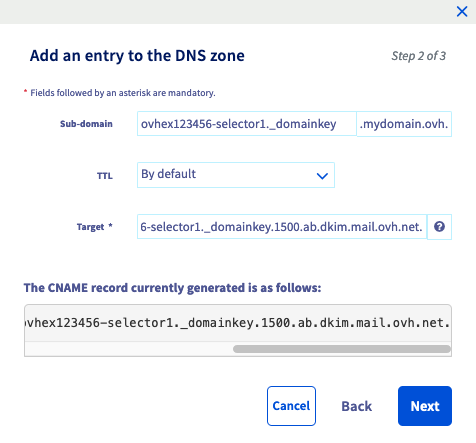
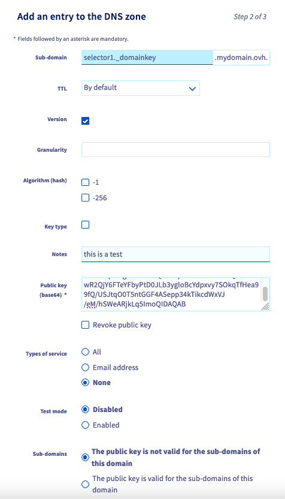
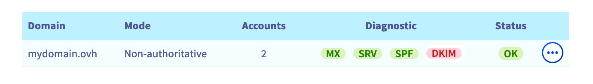

<style>
 pre {
     font-size: 14px !important;
 }
 pre.bgwhite {
   background-color: #fff !important;
   color: #000 !important;
   font-family: monospace !important;
   padding: 5px !important;
   margin-bottom: 5px !important;
 }
 pre.bgwhite code {
   background-color: #fff !important;
   border: solid 0px transparent !important;
   font-family: monospace !important;
   font-size: 0.90em !important;
   color: #000 !important;
 }
 .small {
     font-size: 0.90em !important;
 }
</style>

> [!primary]
> Esta traducción ha sido generada de forma automática por nuestro partner SYSTRAN. En algunos casos puede contener términos imprecisos, como en las etiquetas de los botones o los detalles técnicos. En caso de duda, le recomendamos que consulte la versión inglesa o francesa de la guía. Si quiere ayudarnos a mejorar esta traducción, por favor, utilice el botón «Contribuir» de esta página.
>

## Objetivo

El registro DKIM (**D**omain**K**eys **I**dentified **M**ail) permite firmar los emails para evitar la usurpación de identidad. Esta firma funciona sobre el principio del hackeo combinado con una criptografía asimétrica.

**Esta guía explica cómo funciona DKIM y cómo utilizarlo en el servicio de correo.**

## Requisitos

- Tener acceso a la gestión del dominio desde el [área de cliente de OVHcloud](https://www.ovh.com/auth/?action=gotomanager&from=https://www.ovh.es/&ovhSubsidiary=es) o desde su proveedor de servicios si está registrado fuera de OVHcloud.
- Haber iniciado sesión en el [área de cliente de OVHcloud](https://www.ovh.com/auth/?action=gotomanager&from=https://www.ovh.es/&ovhSubsidiary=es).
- Haber contratado una de nuestras soluciones [Exchange](https://www.ovhcloud.com/es-es/emails/), [Email Pro](https://www.ovhcloud.com/es-es/emails/email-pro/) o una solución de correo electrónico fuera de OVHcloud que disponga del DKIM.

> [!warning]
>
> Si el dominio no utiliza los servidores DNS de OVHcloud, deberá editar el DKIM desde el panel que le ofrezca el proveedor que gestione la configuración de su dominio.
>
> Si el dominio está registrado en OVHcloud, puede comprobar si utiliza nuestra configuración de OVHcloud desde el [área de cliente](https://www.ovh.com/auth/?action=gotomanager&from=https://www.ovh.es/&ovhSubsidiary=es), en la pestaña `Zona DNS`{.action}, después de seleccionar el dominio correspondiente.
>

## Procedimiento

**Índice**

- [¿Cómo funciona DKIM?](#how-dkim-work)
    - [El hackeo](#hash)
    - [El cifrado asimétrico](#encrypt)
    - [¿Cómo se utilizan el encriptado y el cifrado asimétrico para el DKIM?](#encrypt-and-hash)
    - [¿Por qué es necesario configurar los servidores DNS?](#dns-and-dkim)
    - [Ejemplo de un email enviado utilizando DKIM](#example)
    - [¿Qué es un selector DKIM?](#selector)
- [Configurar el DKIM automáticamente para una solución de correo Exchange o Email Pro de OVHcloud](#auto-dkim)
- [Configurar el DKIM manualmente para una solución de correo Exchange o Email Pro de OVHcloud](#internal-dkim)
    - [Configuración completa de DKIM](#firststep)
        - [Para Exchange](#confex)
        - [Para Email Pro](#confemp)
    - [Los diferentes estados del DKIM](#status)
    - [Activar o cambiar un selector DKIM](#enable-switch)
    - [Desactivar y eliminar el DKIM](#disable-delete)
- [Configurar DKIM para una solución de correo electrónico fuera de su cuenta de OVHcloud](#external-dkim)
    - [Registro DKIM](#dkim-record)
    - [Registro TXT](#txt-record)
    - [Registro CNAME](#cname-record)
- [Probar su DKIM](#test-dkim)
- [Casos de uso](#usecases)
    - [¿Cómo cambiar su par de llaves DKIM?](#2selectors)
    - [¿Por qué el icono DKIM aparece en rojo en el área de cliente?](#reddkim)


### ¿Cómo funciona DKIM? <a name="how-dkim-work"></a>

Para entender por qué DKIM permite proteger los intercambios de correo, es necesario entender cómo funciona. DKIM utiliza el "**hachage**" y el "**cifrado asimétrico**" para crear una firma segura. La **plataforma de correo** y la **zona DNS** de su dominio ayudarán a transmitir la información del DKIM a sus destinatarios.

#### El hackeo <a name="hash"></a>

El principio de una **función de trama** es generar una **firma** (también llamada huella) a partir de un dato de entrada. Su interés es crear una secuencia de caracteres fija en salida, independientemente de la cantidad de datos de entrada. 

En el siguiente diagrama, puede ver que la salida (Output) siempre estará compuesta por 32 caracteres, utilizando un algoritmo de hash MD5 (**M**essage **D**igest **5**), mientras que el texto de entrada (Input) puede variar en tamaño. La menor variación de carácter en los datos de entrada cambia completamente el hacha de salida, lo que hace que la firma de salida sea impredecible e infalsificable. En el ejemplo a continuación, el valor de entrada (Input) pasa al algoritmo hash MD5 y muestra su valor de hash como salida (Output).

{.thumbnail}

La función hash es útil cuando desea comprobar la integridad de un mensaje. De hecho, dos datos que pueden ser de apariencia muy parecida presentan un valor de hackeo completamente diferente con una longitud de caracteres igual a la salida, cualquiera que sea la longitud de entrada.

#### El cifrado asimétrico <a name="encrypt"></a>

El **cifrado**, como su nombre indica, tiene como objetivo cifrar los datos que se le proporcionan. Es "**asimétrico**" porque la clave de cifrado no es la misma que la clave de descifrado, a diferencia de un cifrado simétrico, que usará la misma clave para cifrar y descifrar.

En el cifrado asimétrico se utiliza una **clave pública** y una **clave privada**. La clave pública es visible y accesible para todos. La clave privada solo es utilizada por el propietario y no es visible para todos. 

Existen dos usos del cifrado asimétrico:

- **Los datos de entrada se cifran con la clave pública y se descifran con el que posee la clave privada**. Por ejemplo, si desea que un tercero transmita los datos de forma segura, Transmite su clave pública sin preocuparse de que alguien la recupere, este tercero cifrará sus datos con su clave pública. Los datos encriptados solo podrán ser desencriptados por el propietario de la clave privada.

{.thumbnail}

- **Los datos de entrada son cifrados por el propietario de la clave privada y descifrados por la clave pública**. Este uso se aplica para autentificar un intercambio de datos. Por ejemplo, los destinatarios desean asegurarse de que usted es el autor del mensaje que les envía. En ese caso, cifrará su mensaje con su clave privada. Solo podrá descifrar este mensaje mediante la clave pública que haya transmitido a todos, lo que garantiza a sus destinatarios la autenticidad de su mensaje. De hecho, un mensaje descifrado por la clave pública sólo puede provenir del propietario de la clave privada.

{.thumbnail}

#### ¿Cómo se utilizan el encriptado y el cifrado asimétrico para el DKIM? <a name="encrypt-and-hash"></a>

Desde la plataforma de correo, DKIM utilizará el hackeo para crear una firma a partir de algunos elementos de [la cabecera del email](/pages/web_cloud/email_and_collaborative_solutions/troubleshooting/diagnostic_headers) y del cuerpo del email (contenido del email).

La firma se cifrará con la clave privada utilizando cifrado asimétrico.

#### ¿Por qué es necesario configurar los servidores DNS? <a name="dns-and-dkim"></a>

Para que el destinatario pueda verificar la firma DKIM del remitente, necesitará los parámetros DKIM y, sobre todo, la clave pública para descifrarla. La [zona DNS](/pages/web_cloud/domains/dns_zone_edit) de un dominio es pública, por lo que se añade un registro DNS para transmitir la clave pública y los parámetros DKIM al destinatario.

#### ¿Qué es un selector DKIM? <a name="selector"></a>

Al activar el DKIM, este funciona con un par de claves públicas/clave privada. Es posible asignar varios pares de claves a su dominio, por ejemplo, mediante la rotación. De hecho, al cambiar de par de claves, el antiguo par debe permanecer activo hasta que todos los mensajes que haya enviado con la antigua clave no fallen en la verificación del DKIM en el servidor de recepción.

Para que funcione este principio de rotación, usaremos lo que se llama **selector DKIM**. Un selector DKIM incluye un par de claves públicas o privadas. Es visible como una cadena de caracteres en la firma DKIM de un correo electrónico con el argumento `s=`. Puede consultar esta firma en [la cabecera del email](/pages/web_cloud/email_and_collaborative_solutions/troubleshooting/diagnostic_headers).

**Ejemplo de una parte de la firma DKIM**

<pre class="bgwhite"><code>DKIM-Firma: v=1; a=rsa-sha256; d=mydomain.ovh; s=ovhex123456-selector1; c=relajación/relajación; t=1681877341; 
</code></pre>

Aquí el valor del selector es `s=ovhex123456-selector1`.

#### Ejemplo de un email enviado utilizando DKIM <a name="example"></a>

Al enviar un correo electrónico desde **contact@mydomain.ovh**, se añade una firma cifrada con clave privada (private key) a la cabecera del email.

{.thumbnail}

El destinatario **recipient@otherdomain.ovh** podrá descifrar esta firma con la clave pública (Public key) visible en la zona DNS de **mydomain.ovh**. La firma se crea a partir del contenido del mensaje de correo electrónico enviado. Esto significa que si el correo electrónico se modifica durante el tránsito, la firma no coincidirá con el contenido, por lo que la verificación DKIM fracasará en el servidor de destino.

{.thumbnail}

### Configurar el DKIM automáticamente para una solución de correo Exchange o Email Pro de OVHcloud <a name="auto-dkim"></a>

La configuración automática del DKIM está disponible para los servicios de correo [Exchange](https://www.ovhcloud.com/es-es/emails/) y [E-mail Pro](https://www.ovhcloud.com/es-es/emails/email-pro/).

Por defecto, el DKIM no está activado cuando se añade un dominio a la plataforma. Por lo tanto, deberá iniciar el proceso de configuración automática desde el área de cliente.

Haga clic en la pestaña que corresponde a su producto.

> [!tabs]
> **Exchange**
>>
>> Desde su [área de cliente de OVHcloud](https://www.ovh.com/auth/?action=gotomanager&from=https://www.ovh.es/&ovhSubsidiary=es), en la pestaña `Web Cloud`{.action}, haga clic en `Microsoft`{.action} y seleccione `Exchange`{.action}. Haga clic en el nombre del servicio Exchange correspondiente. Por último, abra la pestaña `Dominios asociados`{.action}.
>>
>> A la derecha del dominio en cuestión, puede observar que la etiqueta `DKIM` es gris.
>>
>>{.thumbnail}
>>
> **Email Pro**
>>
>> Desde su [área de cliente de OVHcloud](https://www.ovh.com/auth/?action=gotomanager&from=https://www.ovh.es/&ovhSubsidiary=es), en la pestaña `Web Cloud`{.action}, haga clic en `Emails Pro`{.action} y seleccione el servicio Email Pro correspondiente. Por último, abra la pestaña `Dominios asociados`{.action}.
>>
>> A la derecha del dominio en cuestión, puede observar que la etiqueta `DKIM` es gris.
>>
>>{.thumbnail}

Para activar el DKIM, haga clic en la etiqueta gris `DKIM` y seleccione `Validar`{.action} desde la ventana de activación que aparece.

{.thumbnail}

> [!warning]
>
> Para configurar automáticamente la zona DNS del dominio en cuestión, es necesario que la zona DNS se gestione desde la misma cuenta de cliente de OVHcloud que la plataforma de correo. Si tiene una zona DNS gestionada desde otra cuenta de cliente de OVHcloud o desde un dominio externo a OVHcloud, deberá introducir manualmente los registros DNS.
>
> Para ello, acceda al paso «**3.Obtener el registro DNS**» del apartado [Configuración completa del DKIM](#firststep), en el apartado correspondiente a su solución de correo electrónico, [Exchange](#confex) o [Email Pro](#confemp).

La activación automática del DKIM tarda entre 30 minutos y 24 horas como máximo. Para comprobar que su DKIM está operativo, solo tiene que volver a la pestaña `Dominios asociados`{.action} de su plataforma de correo y asegurarse de que la etiqueta `DKIM` se haya vuelto verde.

{.thumbnail}

Si la etiqueta `DKIM` es de color rojo, después de las 24 horas, consulte la sección [«¿Por qué el DKIM no funciona y aparece en rojo en el área de cliente?»](#reddkim) de esta guía.

### Configurar el DKIM manualmente para una solución de correo Exchange o Email Pro de OVHcloud <a name="internal-dkim"></a>

Para configurar su DKIM, es necesario obtener primero la referencia de su plataforma Exchange o Email Pro. 

Haga clic en la pestaña de abajo correspondiente a su producto.

> [!tabs]
> **Exchange**
>>
>> En el [área de cliente de OVHcloud](https://www.ovh.com/auth/?action=gotomanager&from=https://www.ovh.es/&ovhSubsidiary=es), en la pestaña `Web Cloud`{.action}, haga clic en `Microsoft`{.action} y seleccione `Exchange`{.action}. y seleccione el servicio Exchange correspondiente. Por defecto, el nombre de su plataforma corresponde a su referencia, o ésta será visible con el nombre que le haya asignado (ver la imagen inferior).
>>
>> {.thumbnail}
>>
> **Email Pro**
>>
>> En el [área de cliente de OVHcloud](https://www.ovh.com/auth/?action=gotomanager&from=https://www.ovh.es/&ovhSubsidiary=es), en la pestaña `Web Cloud`{.action}, haga clic en `Emails Pro`{.action} y seleccione el servicio Email Pro correspondiente. Por defecto, el nombre de su plataforma corresponde a su referencia, o ésta será visible con el nombre que le haya asignado (ver la imagen inferior).
>>
>> {.thumbnail}

Asimismo, asegúrese de que el dominio que quiera utilizar para el correo electrónico esté activo en la sección `Dominios asociados`{.action}.

{.thumbnail}

Para configurar el DKIM, acceda al sitio web <https://api.ovh.com/console/>, conéctese con el botón `Login`{.action} en la parte superior derecha e introduzca sus claves OVHcloud.

> Si nunca ha utilizado la API, puede consultar nuestra guía ["Cómo utilizar las API de OVHcloud"](/pages/manage_and_operate/api/first-steps).

Acceda a la sección `/email/exchange` (productos Exchange) o `/email/pro` (solución Email Pro) de las API e introduzca "dkim" en la casilla `Filter` para mostrar únicamente las API relativas al DKIM.

{.thumbnail}

#### Configuración completa de DKIM <a name="firststep"></a>

##### **Para Exchange** <a name="confex"></a>

Siga los **5 pasos** que se indican a continuación haciendo clic en cada una de las pestañas.

> [!tabs]
> **1.Lista de votantes**
>> Antes de crear uno de los selectores para su dominio, debe obtener el nombre que le asigna automáticamente la plataforma Exchange.<br>
>> <br>
>> Para ello, utilice la siguiente llamada a la API:<br>
>>
>> > [!api]
>> >
>> > @api {v1} /email/exchange GET /email/exchange/{organizationName}/service/{exchangeService}/domain/{domainName}/dkimSelector
>> >
>> <br>
>>
>> - `organizationName`: introduzca el nombre de su plataforma Exchange que aparece en el formato "hosted-zz11111-1" o "private-zz111111-1". <br>
>> - `exchangeService`: introduzca el nombre de su plataforma Exchange que aparece en el formato "hosted-zz11111-1" o "private-zz111111-1". <br>
>> - `domainName`: introduzca el dominio asociado a la plataforma Exchange en la que quiere activar DKIM. <br>
>>
>> *Ejemplo de resultado:* 
>> ``` console
>> "ovhex123456-selector1"
>> "ovhex123456-selector2"
>> ```
>>
> **2.Crear un selector**
>> Va a crear un selector, generar su par de claves y el registro DNS asociado al dominio.<br>
>> <br>
>> Para ello, utilice la siguiente llamada a la API:<br>
>>
>> > [!api]
>> >
>> > @api {v1} /email/exchange POST /email/exchange/{organizationName}/service/{exchangeService}/domain/{domainName}/dkim
>> >
>>
>> - `organizationName`: introduzca el nombre de su plataforma Exchange que aparece en el formato "hosted-zz11111-1" o "private-zz111111-1".
>> - `exchangeService`: introduzca el nombre de su plataforma Exchange que aparece en el formato "hosted-zz11111-1" o "private-zz111111-1".
>> - `domainName`: introduzca el dominio asociado a la plataforma Exchange en la que quiere activar el DKIM.
>> - `autoEnableDKIM` : DKIM se activará directamente marcando esta casilla. **No marque esta casilla si el dominio no está registrado en la misma cuenta de cliente de OVHcloud o en otro agente registrador**.
>> - `configureDkim` : el registro CNAME se añadirá automáticamente a su zona DNS de su dominio si se gestiona en la misma cuenta de cliente de OVHcloud que su plataforma Exchange. **No marque esta casilla si el dominio no está registrado en el mismo área de cliente de OVHcloud o en otro agente registrador**.
>> - `selectorName`: escriba el nombre de un selector que haya indicado en el paso anterior (por ejemplo: "ovhex123456-selector1"). <br>
>>
>> Haga clic en `Execute`{.action} para comenzar la creación del selector.<br>
>> > 
>> > [!primary]
>> >
>> > Le recomendamos que realice esta operación dos veces para cada uno de los selectores que ha indicado anteriormente. El segundo selector le permitirá realizar un cambio de par de claves cuando sea necesario. **No marque la casilla `autoEnableDKIM`{.action} cuando cree el segundo selector** para no entrar en conflicto con la activación del primer selector. Le invitamos a consultar nuestro caso de uso [«Cómo cambiar su par de claves DKIM»](#2selectors) cuando quiera cambiar al segundo selector.
>> <br>
>>
>> *Ejemplo de resultado:*
>> ``` console
>> status: "todo",
>> function: "addExchangeDomainDKIM",
>> id : 107924143,
>> "finishDate": null,
>> "todoDate": "2023-05-05T11:32:07+02:00"
>> ```
>> > [!primary]
>> >
>> > Si su dominio está gestionado en el mismo área de cliente que su plataforma y ha marcado `autoEnableDKIM` y `configureDkim`, acceda directamente a [**Los diferentes estados de DKIM**](#dkim-status) para seguir la activación del DKIM.
>>
> **3.Obtener el registro DNS**
>> Es necesario configurar manualmente la zona DNS del dominio **en los siguientes** casos:
>>
>> - su plataforma Exchange está asociada a un dominio gestionado en otra cuenta de cliente de OVHcloud ;<br>
>> - la plataforma Exchange está asociada a un dominio gestionado en otro agente registrador ;<br>
>> - ha elegido no marcar la casilla `configureDkim` en el paso anterior.<br>
>>
>> Para configurar su zona DNS, es necesario recuperar los valores del registro DNS **para cada selector si ha creado dos**. Para ello, utilice la siguiente llamada a la API:
>>
>> > [!api]
>> >
>> > @api {v1} /email/exchange GET /email/exchange/{organizationName}/service/{exchangeService}/domain/{domainName}/dkim/{selectorName}
>> >
>>
>> - `organizationName`: introduzca el nombre de su plataforma Exchange que aparece en el formato "hosted-zz11111-1" o "private-zz111111-1".
>> - `selectorName`: escriba el nombre del selector que creó en el paso anterior.
>> - `exchangeService`: introduzca el nombre de su plataforma Exchange que aparece en el formato "hosted-zz11111-1" o "private-zz111111-1".
>> - `domainName`: introduzca el dominio asociado a la plataforma Exchange en la que quiera configurar el DKIM.
>>
>> *Ejemplo de resultado:*
>> ``` console
>> targetRecord: "ovhex123456-selector1._domainkey.1675.ac.dkim.mail.ovh.net"
>> recordType: "CNAME"
>> header: "from;to;subject;date"
>> taskPendingId: 108712689
>> status: "waitingRecord"
>> cnameIsValid: false
>> lastUpdate: "1970-01-01T00:00:00+01:00"
>> customerRecord: "ovhex123456-selector1._domainkey.mydomain.ovh"
>> selectorName: "ovhex1234565-selector1"
>> ```
>> Obtenga los valores `customerRecord` y `targetRecord` en un archivo de texto. Vaya al siguiente paso.
>>
>> > [!primary]
>> >
>> > Es posible que el `status:` esté en `todo`, pero esto no tiene ningún efecto en la configuración de su zona DNS.
>>
> **4.Configurar el registro DNS**
>> Desde [el área de clientes de OVHcloud](https://www.ovh.com/auth/?action=gotomanager&from=https://www.ovh.es/&ovhSubsidiary=es) donde el nombre de dominio de su Exchange, en la pestaña `Web Cloud`{.action}, haga clic en `Domain name`{.action} en la columna de la izquierda y seleccione el nombre de dominio correspondiente.<br>
>> Acceda a la pestaña `Zona DNS`{.action} y haga clic en `Añadir un registro`{.action} en la nueva ventana. Seleccione `CNAME` y complete los valores que haya indicado.<br>
>>
>> Si se toman los valores del ejemplo en el paso "**3. Obtener el registro DNS**":
>>
>> - `customerRecord: "ovhex123456-selector1._domainkey.mydomain.ovh"` corresponde al subdominio del registro CNAME. Solo se conserva `ovhex123456-selector1._domainkey`, ya que el `.mydomain.ovh` est ya se ha completado. <br>
>> - `targetRecord: "ovhex123456-selector1._domainkey.1500.ab.dkim.mail.ovh.net"` corresponde al destino del registro. Se agrega un punto al final para calcular el valor. Esto da `ovhex123456-selector1._domainkey.1500.ab.dkim.mail.ovh.net.`<br>
>>
>> {.thumbnail} <br>
>> 
>> Una vez introducidos los valores, haga clic en `Siguiente`{.action} y luego en `Aceptar`{.action}.
>>
>> **Repita esta operación para el segundo selector si lo ha creado.**<br>
>>
>> Si configura su zona DNS en una interfaz tercera fuera de OVHcloud, el registro CNAME debe tener el siguiente formato:
>>
>> ``` console
>> ovhex123456-selector1._domainkey IN CNAME ovhex123456-selector1._domainkey.1500.ab.dkim.mail.ovh.net.
>> ```
>>
>> > [!warning]
>> >
>> > Tenga en cuenta que cualquier modificación en una zona DNS conlleva un retraso en la propagación. Suele ser corto pero puede extenderse hasta las 24 horas.
>>
> **5.Activación del DKIM**
>> > [!warning]
>> >
>> > En la sección [**Estado del DKIM**](#dkim-status) de esta guía, compruebe que el valor `status:` está bien en `ready` antes de poder activar el DKIM.
>>
>> Para activar el DKIM, utilice la siguiente llamada a la API:
>>
>> > [!api]
>> >
>> > @api {v1} /email/exchange POST /email/exchange/{organizationName}/service/{exchangeService}/domain/{domainName}/dkim/{selectorName}/enable
>> >
>>
>> - `organizationName`: introduzca el nombre de su plataforma Exchange que aparece en el formato "hosted-zz11111-1" o "private-zz111111-1".
>> - `selectorName`: escriba el nombre del selector que haya creado.
>> - `exchangeService`: introduzca el nombre de su plataforma Exchange que aparece en el formato "hosted-zz11111-1" o "private-zz111111-1".
>> - `domainName`: introduzca el dominio asociado a la plataforma Exchange en la que quiere activar el DKIM.
>>
>> *Ejemplo de resultado:*
>> ``` console
>> id: 108716876
>> todoDate: "2023-05-05T11:30:11+02:00"
>> finishDate: null
>> status: "todo"
>> function: "enableExchangeDKIM"
>> ```
>>
>> > [!success]
>> >
>> > Ahora ha realizado todas las operaciones necesarias para activar el DKIM. Para asegurarse de que esté activado, consulte la sección [**"Estado de DKIM"**](#dkim-status) de esta guía para comprobar que el valor `status:` está bien en `inProduction`. En ese caso, su DKIM estará activo.<br><br> **Si ha creado dos selectores**, el segundo selector debe estar en `status: "ready"`.
>>

##### **Para Email Pro** <a name="confemp"></a>

Siga los **5 pasos** que se indican a continuación haciendo clic en cada una de las pestañas.

> [!tabs]
> **1.Lista de votantes**
>> Antes de crear uno de los selectores para su dominio, debe obtener el nombre que le asigna automáticamente la plataforma Email Pro.<br>
>> <br>
>> Para ello, utilice la siguiente llamada a la API:<br>
>>
>> > [!api]
>> >
>> > @api {v1} /email/exchange POST /email/exchange/{organizationName}/service/{exchangeService}/domain/{domainName}/dkim/{selectorName}/enable
>> >
>> <br>
>>
>> - `service`: introduzca el nombre de su plataforma Email Pro, que aparece en el formato "emailpro-zz11111-1" . <br>
>> - `domainName`: introduzca el dominio asociado a la plataforma Email Pro en la que quiere activar DKIM. <br>
>>
>> *Ejemplo de resultado:* 
>> ``` console
>> "ovhemp123456-selector1"
>> "ovhemp123456-selector2"
>> ```
>>
> **2.Crear un selector**
>> Va a crear un selector, generar su par de claves y el registro DNS asociado al dominio.<br>
>> <br>
>> > [!primary]
>> >
>> > Le recomendamos que realice esta operación dos veces para cada uno de los selectores que ha indicado anteriormente. El segundo selector le permitirá realizar un cambio de par de claves cuando sea necesario. Le invitamos a consultar nuestro caso de uso [«Cómo cambiar su par de claves DKIM»](#2selectors).
>> <br>
>> Para ello, utilice la siguiente llamada a la API:<br>
>>
>> > [!api]
>> >
>> > @api {v1} /email/pro POST /email/pro/{service}/domain/{domainName}/dkim
>> >
>>
>> - `service`: introduzca el nombre de su plataforma Email Pro, que aparece en el formato "emailpro-zz11111-1" . <br>
>> - `domainName`: introduzca el dominio asociado a la plataforma Email Pro en la que quiere activar el DKIM.
>> - `autoEnableDKIM` : DKIM se activará directamente marcando esta casilla. **No marque esta casilla si el dominio no está registrado en la misma cuenta de cliente de OVHcloud o en otro agente registrador**.
>> - `configureDkim` : el registro CNAME se añadirá automáticamente a la zona DNS de su dominio si se gestiona en la misma cuenta de cliente de OVHcloud que la plataforma Email Pro. **No marque esta casilla si el dominio no está registrado en el mismo área de cliente de OVHcloud o en otro agente registrador**.
>> - `selectorName`: escriba el nombre de un selector que haya indicado en el paso anterior. (ejemplo: "ovhemp123456-selector1") <br>
>>
>> Haga clic en `Execute`{.action} para comenzar la creación del selector.<br>
>>
>> *Ejemplo de resultado:*
>> ``` console
>> status: "todo",
>> función: "addDomainDKIM",
>> id: 107924143,
>> "finishDate": null,
>> "todoDate": "2023-05-05T11:32:07+02:00"
>> ```
>> > [!primary]
>> >
>> > Si su dominio está gestionado en el mismo área de cliente que su plataforma y ha marcado `autoEnableDKIM` y `configureDkim`, acceda directamente a [**Los diferentes estados de DKIM**](#dkim-status) para seguir la activación del DKIM.
>>
> **3.Obtener el registro DNS**
>> Es necesario configurar manualmente la zona DNS del dominio **en los siguientes** casos:
>>
>> - La plataforma Email Pro está asociada a un dominio gestionado en otra cuenta de cliente de OVHcloud.<br>
>> - La plataforma Email Pro está asociada a un dominio gestionado en otro agente registrador.<br>
>> - ha elegido no marcar la casilla `configureDkim` en el paso anterior.<br>
>>
>> Para configurar la zona DNS, deberá obtener los valores del registro DNS **para cada selector si ha creado dos**. Para ello, utilice la siguiente llamada a la API:
>>
>> > [!api]
>> >
>> > @api {v1} /email/pro GET /email/pro/{service}/dominio/{domainName}/dkim/{selectorName}
>> >
>>
>> - `service`: introduzca el nombre de su plataforma Email Pro, que aparece en el formato "emailpro-zz11111-1" .
>> - `selectorName`: escriba el nombre del selector que creó en el paso anterior.
>> - `domainName`: introduzca el dominio asociado a la plataforma Email Proe en la que quiere configurar el DKIM.
>>
>> *Ejemplo de resultado:*
>> ``` console
>> targetRecord: "ovhemp123456-selector1._domainkey.1675.ac.dkim.mail.ovh.net"
>> recordType: "CNAME"
>> header: "from;to;subject;date"
>> taskPendingId: 108712689
>> status: "waitingRecord"
>> cnameIsValid: false
>> lastUpdate: "1970-01-01T00:00:00+01:00"
>> customerRecord: "ovhemp123456-selector1._domainkey.mydomain.ovh"
>> selectorName: "ovhemp1234565-selector1"
>> ```
>> Obtenga los valores `customerRecord` y `targetRecord` en un archivo de texto. Vaya al siguiente paso.
>>
>> > [!primary]
>> >
>> > Es posible que el `status:` esté en `todo`, pero esto no tiene ningún efecto en la configuración de su zona DNS.
>>
> **4.Configurar el registro DNS**
>> Desde [el área de clientes de OVHcloud](https://www.ovh.com/auth/?action=gotomanager&from=https://www.ovh.es/&ovhSubsidiary=es) donde el nombre de dominio de su Exchange, en la pestaña `Web Cloud`{.action}, haga clic en `Domain name`{.action} en la columna de la izquierda y seleccione el nombre de dominio correspondiente.<br>
>> Acceda a la pestaña `Zona DNS`{.action} y haga clic en `Añadir un registro`{.action} en la nueva ventana. Seleccione `CNAME` y complete los valores que haya indicado.<br>
>>
>> Si se toman los valores del ejemplo en el paso "**3\. Obtener el registro DNS**":
>>
>> - `customerRecord: "ovhemp123456-selector1._domainkey.mydomain.ovh"` corresponde al subdominio del registro CNAME. Solo se conserva `ovhemp123456-selector1._domainkey`, ya que el `.mydomain.ovh`est ya se ha completado. <br>
>> - `targetRecord: "ovhemp123456-selector1._domainkey.1500.ab.dkim.mail.ovh.net"` corresponde al destino del registro. Se agrega un punto al final para calcular el valor. Esto da `ovhemp123456-selector1._domainkey.1500.ab.dkim.mail.ovh.net.`<br>
>>
>> {.thumbnail} <br>
>> 
>> Una vez introducidos los valores, haga clic en `Siguiente`{.action} y luego en `Aceptar`{.action}.<br>
>>
>> **Repita esta operación para el segundo selector si lo ha creado.**<br>
>>
>> Si configura su zona DNS en una interfaz tercera fuera de OVHcloud, el registro CNAME debe tener el siguiente formato:
>>
>> ``` console
>> ovhemp123456-selector1._domainkey IN CNAME ovhemp123456-selector1._domainkey.1500.ab.dkim.mail.ovh.net.
>> ```
>>
>> > [!warning]
>> >
>> > Tenga en cuenta que cualquier modificación en una zona DNS conlleva un retraso en la propagación. Suele ser corto pero puede extenderse hasta las 24 horas.
>>
> **5.Activación del DKIM**
>> > [!warning]
>> >
>> > En la sección [**Estado del DKIM**](#dkim-status) de esta guía, compruebe que el valor `status:` está bien en `ready` antes de poder activar el DKIM.
>>
>> Para activar el DKIM, utilice la siguiente llamada a la API:
>>
>> > [!api]
>> >
>> > @api {v1} /email/pro POST /email/pro/{service}/domain/{domainName}/dkim/{selectorName}/enable
>> >
>>
>> - `service`: introduzca el nombre de su plataforma Email Pro, que aparece en el formato "emailpro-zz11111-1" .
>> - `selectorName`: escriba el nombre del selector que haya creado.
>> - `domainName`: introduzca el dominio asociado a la plataforma Email Pro en la que quiere activar el DKIM.
>>
>> *Ejemplo de resultado:*
>> ``` console
>> id: 108716876
>> todoDate: "2023-05-05T11:30:11+02:00"
>> finishDate: null
>> status: "todo"
>> function: "enableDKIM"
>> ```
>>
>> > [!success]
>> >
>> > Ahora ha realizado todas las operaciones necesarias para activar el DKIM. Para asegurarse de que esté activado, consulte la sección [**"Estado de DKIM"**](#dkim-status) de esta guía para comprobar que el valor `status:` está bien en `inProduction`. En ese caso, su DKIM estará activo.
>>

#### Los diferentes estados del DKIM <a name="dkim-status"></a>

Seleccione el servicio de correo en las siguientes pestañas:

> [!tabs]
> **Exchange**
>> Al realizar operaciones en el DKIM de su plataforma Exchange, utilice la siguiente llamada a la API para comprobar el estado actual del DKIM.
>>
>> > [!api]
>> >
>> > @api {v1} /email/exchange GET /email/exchange/{organizationName}/servicio/{exchangeService}/dominio/{domainName}/dkim/{selectorName}
>> >
>>
>> - `organizationName`: introduzca el nombre de su plataforma Exchange que aparece en el formato "hosted-zz11111-1" o "private-zz111111-1". <br>
>> - `selectorName`: escriba el nombre del selector que haya creado. <br>
>> - `exchangeService`: introduzca el nombre de su plataforma Exchange que aparece en el formato "hosted-zz11111-1" o "private-zz111111-1". <br>
>> - `domainName`: introduzca el dominio asociado a la plataforma Exchange en la que debe estar presente el DKIM. <br>
>>
>> A continuación, compruebe el valor `status:` en el resultado:
>>
>> - `todo`: se ha iniciado la tarea, y se va a iniciar. <br>
>> - `WaitingRecord` : los registros DNS están pendientes de configuración o en proceso de validación en la zona DNS del dominio. Se realiza una comprobación automática regular para comprobar si el registro DNS está presente y se ha introducido correctamente.
>> - `ready` : los registros DNS están presentes en la zona. Ahora puede activar el DKIM. <br>
>> - `inProduction` : el DKIM está bien configurado y activado, por lo que está totalmente operativo. <br>
>> - `disabling` : el DKIM se está desactivando. <br>
>> - `deleting` : se está eliminando el DKIM. <br>
>>
>> Si se produce el siguiente error al ejecutar la llamada a la API, significa que el selector no existe o ha sido eliminado. Habrá que crearlo.
>>
>> ``` console
>> Not Found (404)
>> { "message": "The requested object (selectorName = ovhemp123456-selector1) does not exist" }
>> ```
> **Email Pro**
>> Al realizar operaciones en el DKIM de su plataforma Email Pro, utilice la siguiente llamada a la API para comprobar el estado actual del DKIM.
>>
>> > [!api]
>> >
>> > @api {v1} /email/pro GET /email/pro/{service}/dominio/{domainName}/dkim/{selectorName}
>> >
>>
>> - `service`: introduzca el nombre de su plataforma Email Pro, que aparece en el formato "emailpro-zz11111-1" . <br>
>> - `selectorName`: escriba el nombre del selector que haya creado. <br>
>> - `domainName`: introduzca el dominio asociado a la plataforma Email Pro en la que debe estar presente el DKIM. <br>
>>
>> A continuación, compruebe el valor `status:` en el resultado:
>>
>> - `todo`: se ha iniciado la tarea, y se va a iniciar. <br>
>> - `WaitingRecord` : los registros DNS están pendientes de configuración o en proceso de validación en la zona DNS del dominio. Se realiza una comprobación automática regular para comprobar si el registro DNS está presente y se ha introducido correctamente. <br>
>> - `ready` : los registros DNS están presentes en la zona. Ahora puede activar el DKIM. <br>
>> - `inProduction` : el DKIM está bien configurado y activado, por lo que está totalmente operativo. <br>
>> - `disabling` : el DKIM se está desactivando. <br>
>> - `deleting` : se está eliminando el DKIM. <br>
>>
>> Si se produce el siguiente error al ejecutar la llamada a la API, significa que el selector no existe o ha sido eliminado. Habrá que crearlo.
>>
>> ``` console
>> Not Found (404)
>> { "message": "The requested object (selectorName = ovhemp123456-selector1) does not exist" }
>> ```

#### Activar o cambiar un selector DKIM <a name="enable-switch"></a>

> [!warning]
>
> El selector DKIM debe estar en estado de `ready` antes de poder activarlo.

Seleccione el servicio de correo en las siguientes pestañas:

> [!tabs]
> **Exchange**
>> Para activar el DKIM en un selector, utilice la siguiente llamada a la API:
>>
>> > [!api]
>> >
>> > @api {v1} /email/exchange POST /email/exchange/{organizationName}/servicio/{exchangeService}/dominio/{domainName}/dkim/{selectorName}/enable
>> >
>>
>> - `organizationName`: introduzca el nombre de su plataforma Exchange que aparece en el formato "hosted-zz11111-1" o "private-zz111111-1".<br>
>> - `selectorName`: escriba el nombre de un selector existente.<br>
>> - `exchangeService`: introduzca el nombre de su plataforma Exchange que aparece en el formato "hosted-zz11111-1" o "private-zz111111-1".<br>
>> - `domainName`: introduzca el dominio asociado a la plataforma Exchange en la que quiere activar el DKIM.<br>
>>
> **Email Pro**
>> Para activar el DKIM en un selector, utilice la siguiente llamada a la API:
>>
>> > [!api]
>> >
>> > @api {v1} /email/pro POST /email/pro/{service}/dominio/{domainName}/dkim/{selectorName}/enable
>> >
>>
>> - `service`: introduzca el nombre de su plataforma Email Pro, que aparece en el formato "emailpro-zz11111-1" . <br>
>> - `selectorName`: escriba el nombre del selector que haya creado.<br>
>> - `domainName`: introduzca el dominio asociado a la plataforma Email Pro en la que debe estar presente el DKIM.<br>
>>

> [!primary]
>
> Al rotar el selector DKIM, puede activar directamente el segundo selector que haya creado para cambiarlo, pero conservando el primer selector que permanecerá activo hasta que el destinatario analice correctamente todos los mensajes de correo que se emitan con él.

#### Desactivar y eliminar el DKIM <a name="enable-switch"></a>

> [!warning]
>
> El selector DKIM debe estar en estado `inProduction` o `ready` antes de poder desactivarlo.

Seleccione el servicio de correo en las siguientes pestañas:

> [!tabs]
> **Exchange**
>> Si desea desactivar el DKIM sin eliminar el selector y su par de claves, utilice la siguiente llamada a la API:
>> 
>> > [!api]
>> >
>> > @api {v1} /email/exchange POST /email/exchange/{organizationName}/servicio/{exchangeService}/dominio/{domainName}/dkim/{selectorName}/disable/
>> >
>>
>> - `organizationName`: introduzca el nombre de su plataforma Exchange que aparece en el formato "hosted-zz11111-1" o "private-zz111111-1". <br>
>> - `selectorName`: escriba el nombre del selector que desee desactivar. <br>
>> - `exchangeService`: introduzca el nombre de su plataforma Exchange que aparece en el formato "hosted-zz11111-1" o "private-zz111111-1". <br>
>> - `domainName`: introduzca el dominio asociado a su plataforma Exchange. <br>
>>
>> Si quiere eliminar el selector DKIM y su par de claves, utilice la siguiente llamada a la API:
>>
>> > [!api]
>> >
>> > @api {v1} /email/exchange DELETE /email/exchange/{organizationName}/servicio/{exchangeService}/dominio/{domainName}/dkim/{selectorName}
>> >
>>
>> - `organizationName`: introduzca el nombre de su plataforma Exchange que aparece en el formato "hosted-zz11111-1" o ">> private-zz111111-1". <br>
>> - `selectorName`: escriba el nombre del selector que desee eliminar. <br>
>> - `exchangeService`: introduzca el nombre de su plataforma Exchange que aparece en el formato "hosted-zz11111-1" o "private-zz111111-1". <br>
>> - `domainName`: introduzca el dominio asociado a su plataforma Exchange. <br>
>>
> **Email Pro**
>> Si desea desactivar el DKIM sin eliminar el selector y su par de claves, utilice la siguiente llamada a la API:
>> 
>> > [!api]
>> >
>> > @api {v1} /email/pro POST /email/pro/{service}/dominio/{domainName}/dkim/{selectorName}/disable
>> >
>>
>> - `service`: introduzca el nombre de su plataforma Email Pro, que aparece en el formato "emailpro-zz11111-1" . <br>
>> - `selectorName`: escriba el nombre del selector que desee desactivar. <br>
>> - `domainName`: introduzca el dominio asociado a la plataforma Email Pro. <br>
>>
>> Si quiere eliminar el selector DKIM y su par de claves, utilice la siguiente llamada a la API:
>>
>> > [!api]
>> >
>> > @api {v1} /email/pro DELETE /email/pro/{service}/dominio/{domainName}/dkim/{selectorName}
>> >
>>
>> - `service`: introduzca el nombre de su plataforma Email Pro, que aparece en el formato "emailpro-zz11111-1" . <br>
>> - `selectorName`: escriba el nombre del selector que desee eliminar. <br>
>> - `domainName`: introduzca el dominio asociado a la plataforma Email Pro. <br>
>>


### Configurar el DKIM para una solución de correo electrónico fuera de su cuenta de OVHcloud <a name="external-dkim"></a>

Si quiere configurar su zona DNS para añadir un registro DKIM a su solución, siga las indicaciones que se ofrecen a continuación.

En [el área de cliente de OVHcloud](https://www.ovh.com/auth/?action=gotomanager&from=https://www.ovh.es/&ovhSubsidiary=es), abra la pestaña `Web Cloud`{.action} y haga clic en `Dominios`{.action} en la columna izquierda y seleccione el dominio correspondiente.

Abra la pestaña `Zona DNS`{.action} y haga clic en `Añadir un registro`{.action}. Existen 3 formas de añadir un registro para configurar el DKIM en la zona DNS:

- [un registro DKIM](#dkim-record): configuración que permite visualizar todos los parámetros de un registro DKIM.
- [un registro TXT](#txt-record): registro a utilizar cuando se le hayan proporcionado todos los parámetros DKIM.
- [un registro CNAME](#cname-record): Este registro se utiliza para un servicio de correo de OVHcloud o para un servidor de correo de Microsoft.

#### Registro DKIM <a name="dkim-record"></a>

Este registro se llama DKIM en la interfaz, pero en realidad es un registro TXT de salida. El registro DKIM tiene por objeto facilitar la lectura de los diferentes elementos de configuración del DKIM presentándolos en cuadrados independientes.

{.thumbnail}

- **Subdominio**: introduzca el nombre del selector DKIM y añada `._domainkey` en sufijo, el dominio se añadirá automáticamente al final.

*ejemplo:*

``` console
  selector-name._domainkey.mydomain.ovh.
```

- **Versión (v=)**: sirve para indicar la versión del DKIM. Se recomienda usarlo y su valor predeterminado es `DKIM1`.<br>
Si se especifica, esta etiqueta debe colocarse primero en el registro y debe ser igual a "DKIM1" (sin comillas). Los registros que comiencen con la etiqueta "v=" con otro valor deben ser ignorados.

- **Granularidad (g=)**: permite especificar la parte "local parte" de una dirección de correo electrónico, es decir, la parte situada antes de la "@".<br>
Permite especificar la dirección de correo o las direcciones de correo electrónico a las que se permite firmar un mensaje de correo electrónico con la clave DKIM del selector.<br>
El valor predeterminado de "g=" es "\*", lo que significa que todas las direcciones de correo electrónico están autorizadas a utilizar la clave de firma DKIM.<br>
Indicando un valor específico para "g=", se puede limitar el uso de la llave a una parte local de una dirección de correo electrónico específica o a un rango de direcciones de correo específicas utilizando caracteres genéricos (por ejemplo: "\*-group").

- **Algoritmo (hash) (h=)**: permite especificar los algoritmos hash utilizados para firmar las cabeceras de un email. Esta etiqueta permite definir una lista de algoritmos de hackeo que se utilizarán para generar una firma DKIM para un mensaje dado.

- **Tipo de llave (k=)**: especifica el algoritmo de firma utilizado para firmar los mensajes de correo electrónico salientes. Permite a los destinatarios saber cómo se ha firmado el mensaje y cuál es el método utilizado para verificar su autenticidad.<br>
Los valores posibles para la etiqueta "k=" incluyen "rsa" para el algoritmo de firma RSA y "ed25519" para el algoritmo de firma Ed25519. La elección del algoritmo depende de la política de seguridad del remitente y de la aceptación por el destinatario.

- **Notas (n=)**: sirve para incluir notas de interés para los administradores que gestionan el sistema de claves DKIM.<br>
Estas notas pueden ser útiles por motivos de documentación o para ayudar a los administradores a entender o gestionar el funcionamiento de DKIM. Las notas incluidas en n= no son interpretadas por los programas y no afectan al funcionamiento del DKIM.

- **Clave pública (base 64) (p=)**: se utiliza para introducir los datos de la clave pública DKIM, que están codificados en base64.<br>
Esta etiqueta es obligatoria en la firma DKIM y permite a los destinatarios de la firma recuperar la clave pública necesaria para verificar la autenticidad del mensaje firmado.

- **Revocar la clave pública**: si se ha revocado una clave pública de DKIM (por ejemplo, en caso de que la clave privada se haya comprometido), se utilizará un valor vacío para la etiqueta "p=", indicando que la clave pública ya no es válida. A continuación, los destinatarios deben indicar un error relativo a cualquier firma DKIM que haga referencia a una clave revocada.

- **Tipo de servicio (s=)**: La etiqueta "s=" (Service Type) es opcional y no está disponible por defecto. Permite especificar el tipo o tipos de servicios a los que se aplica el registro DKIM.<br>
Los tipos de servicios se definen utilizando una lista de palabras clave separadas por dos puntos ":".<br>
El destinatario debe ignorar este registro si el tipo de servicio adecuado no está listado.<br>
La etiqueta "s=" está destinada a restringir el uso de las llaves para otros fines, en caso de que el uso de DKIM se defina para otros servicios en el futuro.<br>
Los tipos de servicios actualmente definidos son "\*" (todos los tipos de servicios), "email" (correo electrónico).

- **Modo de prueba (t=y)**: permite a los propietarios del dominio probar la instalación del DKIM sin correr el riesgo de que los mensajes sean rechazados o marcados como spam si la verificación de la firma DKIM no ha podido realizarse.<br>
Cuando se utiliza el flag "t=y", el destinatario no debe tratar de forma diferente los mensajes firmados en modo de prueba y los mensajes sin firmar. Sin embargo, el destinatario puede seguir el resultado del modo de prueba para ayudar a los firmantes.

- **Subdominios (t=s)**: permite restringir el uso de la firma DKIM únicamente en el dominio (por ejemplo, @mydomain.ovh) o permitir el envío desde el nombre de dominio y sus subdominios (por ejemplo: @mydomain.ovh, @test.mydomain.ovh, @other.mydomain.ovh, etc.)

#### Registro TXT <a name="txt-record"></a>

Tipo de registro nativo utilizado para configurar el DKIM en la zona DNS del dominio. Es necesario controlar bien la sintaxis para completarla.

Este tipo de configuración DKIM es recomendable cuando el proveedor del servicio de correo le haya proporcionado la información que debe introducir.

Para más información sobre la composición del registro DKIM, consulte la sección anterior de esta guía titulada "[Registro DKIM](#dkim-record)".

**Ejemplo de registro DKIM**

- subdominio:

``` console
selector-name._domainkey.mydomain.ovh.
```

- Destino:

``` console
v=DKIM1;t=s;p= MIIBIjANBgkqhkiG9w0BAQEFAAOCAQ8AMIIBCgKCAQEA77VDAIfyhjtoF0DIE5V7 rev1EKk4L0nxdBpD5O/jPrM4KP0kukeuB6IMpVplkkq52MSDeRcjoO50h0DmwZOr RUkyGjQwOnAh0VhY3fqkuwBYftEX7vWo8C2E1ylzimABkwPpSL62jZ1DheoXcil9 1M35wWBKtlYdXVedKjCQKOEnwTo+0hdNe38rU9NMgq6nbTIMjDntvxoVI+yF3kcx q/VpAY8BIYbcAXkVFvUyfUBABnnKpf0SfblsfcLW0Koy/FRxPDFOvnjNxXeOxMFR UI6K6PaW2WvtbJG2v+gHLY5M4tB0+/FNJU9emZfkPOk3DmRhZ8ENi7+oZa2ivUDj OQIDAQAB
```

#### Registro CNAME <a name="cname-record"></a>

El registro CNAME es un alias. Esto significa que el valor de destino devuelve a una URL que proporcionará el registro DKIM al servidor que desee que aparezca el registro CNAME. Este tipo de registro CNAME para configurar el DKIM es frecuente cuando se utiliza un servidor de correo Microsoft.

Este es precisamente el tipo de registro utilizado para activar el DKIM en un dominio declarado para una solución Exchange de OVHcloud. Este procedimiento permite que su proveedor de soluciones de correo gestione por usted la seguridad y la actualización del DKIM. Este procedimiento permite que su proveedor de solución de correo gestione por usted la seguridad y la actualización del DKIM.

### Probar su DKIM <a name="test-dkim"></a>

Le recomendamos que envíe un mensaje de correo electrónico desde una cuenta de su plataforma Exchange a una dirección de correo electrónico que verifique la firma DKIM al recibir el mensaje.

En la cabecera del mensaje de correo electrónico recibido encontrará lo siguiente:

<pre class="bgwhite"><code>ARC-Authentication-Results: i=1; mx.example.com;
       dkim=pass header.i=@mydomain.ovh header.s=ovhex123456-selector1 header.b=KUdGjiMs;
       spf=pass (example.com: domain of test-dkim@mydomain.ovh designnates 54.36.141.6 as permitted sender) smtp.mailfrom=test-dkim@mydomain.ovh
Return-Path: &lt;test-dkim@mydomain.ovh>
</code></pre>

Para consultar la cabecera de un mensaje de correo electrónico, consulte nuestra guía [Obtener la cabecera de un email](/pages/web_cloud/email_and_collaborative_solutions/troubleshooting/diagnostic_headers).

### Casos prácticos <a name="usecases"></a>

#### ¿Cómo y por qué cambiar su par de claves DKIM? <a name="2selectors"></a>

Al activar por primera vez el DKIM en su servicio de correo, es posible crear dos selectores, cada uno de los cuales contiene un par de claves. El segundo selector sirve como sucesor del que está en uso.

Para evitar los intentos de descifrar la clave DKIM, se recomienda cambiar periódicamente el par de claves. Para ello, asegúrese de haber configurado bien sus 2 selectores verificando que el primero esté en status `inProduction` y el segundo en status `ready`. Puede consultar este estado en la sección ["Los diferentes estados del DKIM"](#dkim-status).

Haga clic en la pestaña que corresponde a su producto.

> [!tabs]
> **Exchange**
>> Para cambiar al segundo selector, utilice la siguiente llamada a la API:
>> 
>> > [!api]
>>
>> > @api {v1} /email/exchange POST /email/exchange/{organizationName}/service/{exchangeService}/domain/{domainName}/dkim/{selectorName}/enable
>>
>>
>> - `organizationName`: introduzca el nombre de su plataforma Exchange con el formato «hosted-zz111111-1» o «private-zz111111-1». <br>
>> - `selectorName`: escriba el nombre del selector al que desea cambiar. <br>
>> - `exchangeService`: introduzca el nombre de su plataforma Exchange con el formato «hosted-zz111111-1» o «private-zz11111-1». <br>
>> - `domainName` : Introduzca el nombre de dominio asociado a su plataforma Exchange. <br>
>>
> **Email Pro**
>> Para cambiar al segundo selector, utilice la siguiente llamada a la API:
>>
>> > [!api]
>>
>> > @api {v1} /email/pro POST /email/pro/{service}/domain/{domainName}/dkim/{selectorName}/enable
>>
>>
>> - `service` : Introduzca el nombre de su plataforma Email Pro con el formato « emailpro-zz111111-1 ». <br>
>> - `selectorName`: escriba el nombre del selector al que desea cambiar. <br>
>> - `domainName` : Introduzca el nombre de dominio asociado a su plataforma E-mail Pro en el que debe estar presente el DKIM.<br>
>>

Después de cambiar al nuevo selector, conserve el antiguo durante 7 días antes de eliminarlo y crear uno nuevo.

#### ¿Por qué el DKIM no funciona y aparece en rojo en el área de cliente? <a name="reddkim"></a>

Tenga en cuenta que sus mensajes de correo electrónico no están firmados por el DKIM, a pesar de haberlo activado o configurado. En primer lugar, conéctese al área de cliente para comprobar el estado del DKIM.

Haga clic en la pestaña que corresponde a su producto para comprobar el estado del DKIM en su plataforma de correo.

> [!tabs]
> **Exchange**
>>
>> Desde su [área de cliente de OVHcloud](https://www.ovh.com/auth/?action=gotomanager&from=https://www.ovh.es/&ovhSubsidiary=es), en la pestaña `Web Cloud`{.action}, haga clic en `Microsoft`{.action} y seleccione `Exchange`{.action}. Por último, haga clic en el nombre del servicio Exchange correspondiente.<br><br> En la sección `Dominios asociados`{.action}, compruebe el color del icono `DKIM` a la derecha del dominio correspondiente (ver la imagen a continuación).
>>
>>{.thumbnail}
>>
> **Email Pro**
>>
>> Desde su [área de cliente de OVHcloud](https://www.ovh.com/auth/?action=gotomanager&from=https://www.ovh.es/&ovhSubsidiary=es), en la pestaña `Web Cloud`{.action}, haga clic en `E-mails Pro`{.action} y seleccione el servicio E-mail Pro correspondiente.<br><br> En la sección `Dominios asociados`{.action}, compruebe el color del icono `DKIM` a la derecha del dominio en cuestión (ver la imagen siguiente).
>>
>>{.thumbnail}

Si acaba de configurar el DKIM, esto significa que la activación del DKIM no ha finalizado, **se recomienda esperar 24h**.

Si el estado permanece rojo después de las 24 horas, compruebe el estado del selector que ha activado. Para ello, consulte la sección «[Los diferentes estados del DKIM](#dkim-status)» de esta guía.

Estos son los 4 estados que tienen como resultado el icono DKIM en rojo en su área de cliente:

 - `WaitingRecord`: los registros DNS están pendientes de configuración o se están validando en la zona DNS del dominio. Se realiza una comprobación automática periódica para comprobar si el registro DNS está presente y se ha completado correctamente. En función de su plan, siga el **paso 5** del apartado "[Configuración completa del DKIM](#firststep)" para configurar correctamente la zona DNS del dominio.
 - `ready`: los registros DNS están presentes en la zona. El DKIM ya puede activarse. Para activar el selector, pulse en la sección "[Activar o cambiar un selector DKIM](#enable-switch)".
 - `deleting`: se está eliminando el DKIM. Una vez eliminado, siga la sección "[Configuración completa del DKIM](#firststep)".
 - `disabling`: se está desactivando el DKIM. Una vez hecho esto, puede activar el selector en la sección "[Activar o cambiar un selector DKIM](#enable-switch)".
 - `todo`: la tarea se ha inicializado y debe iniciarse. Una vez transcurridas 24 horas, si el selector sigue en este estado, le invitamos a abrir un [tíquet con el soporte](https://help.ovhcloud.com/csm?id=csm_cases_requests) indicando el número del selector correspondiente.

## Más información <a name="go-further"></a>
  
Interactúe con nuestra comunidad de usuarios en <https://community.ovh.com/en/>.
