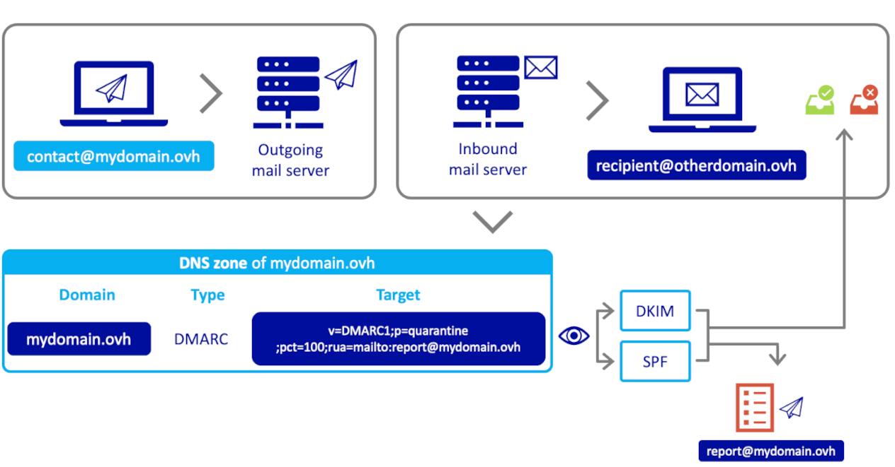
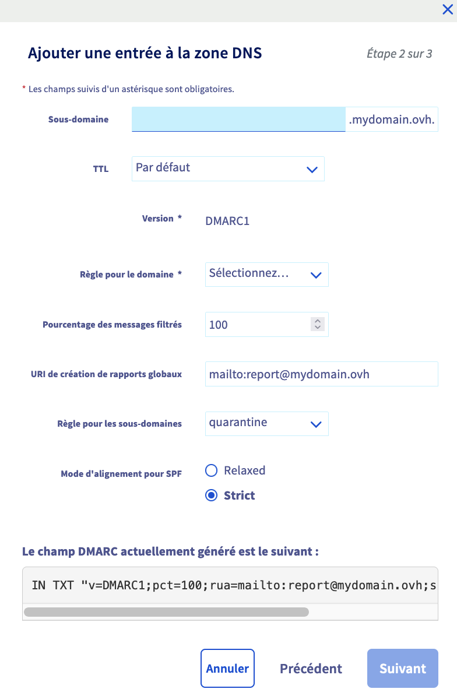
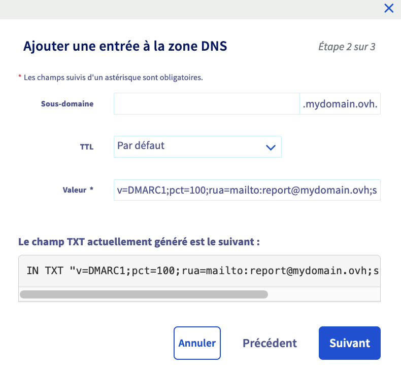
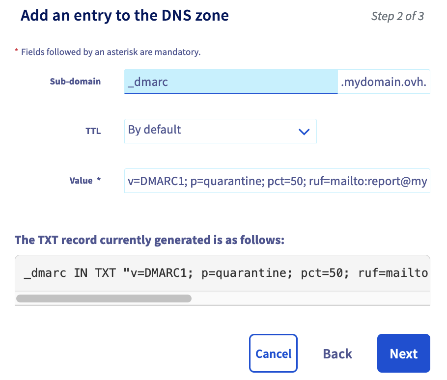

## Objective

The **D**omain-based **M**essage **A**uthentication, **R**eporting, and **C**ompliance (DMARC) record is an email security mechanism. It is based on the results of the [SPF](/pages/web_cloud/domains/dns_zone_spf) and [DKIM](/pages/web_cloud/domains/dns_zone_dkim) checks.

**Find out how DMARC works, and how to set it up for your email service.**

## Requirements

- Access to manage your domain name (attached to your email solution) from the [OVHcloud Control Panel](https://www.ovh.com/auth/?action=gotomanager&from=https://www.ovh.co.uk/&ovhSubsidiary=GB).
- One of the authentication mechanisms, [SPF](/pages/web_cloud/domains/dns_zone_spf) and/or [DKIM](/pages/web_cloud/domains/dns_zone_dkim) must be configured in the DNS zone of the email solution domain name.

## Instructions

The DMARC record contains policy information for malicious emails that attempt to spoof your domain name.<br>
DMARC queries authentication mechanisms [SPF](/pages/web_cloud/domains/dns_zone_spf) and [DKIM](/pages/web_cloud/domains/dns_zone_dkim) to verify incoming emails.<br>
The result of these SPF and/or DKIM checks is translated by DMARC into "actions to take" when an email fails the checks. These measures can include quarantining or rejecting the emails concerned.

### How does DMARC work? <a name="how-dmarc-works"></a>

To understand how DMARC works, here is an example.

When the **contact@mydomain.ovh** address sends an email to the destination address **recipient@otherdomain.ovh**, the receiving server for the destination domain name ‘**otherdomain.ovh**’ will query the DNS zone for the sending domain name **mydomain.ovh** to read the instructions in the DMARC record.

The DMARC record communicates the policy based on the SPF and DKIM test results. They can also enter one or more email addresses (represented in our example by the address **report@mydomain.ovh**) used to receive reports of email failures sent from the domain name **mydomain.ovh**.

After reading the instructions of the **mydomain.ovh** domain name DMARC record by the **“otherdomain.ovh”** receiving server, emails will either be delivered to the address **recipient@otherdomain.ovh**, or marked as "SPAM" or rejected.

{.thumbnail}

### Configure DMARC 

You must first enable DMARC on the email service associated with your domain name.

There are two ways to configure the DMARC in your OVHcloud DNS zone:

- Via a [DMARC record](#dmarc-record). This registration allows a simplified configuration of the DMARC. Simply fill in the fields with the DMARC settings required for your configuration. This record is read as a TXT record by DNS servers.
- Via a [TXT record](#txt-record). This standard record can be used as part of the DMARC configuration from the OVHcloud Control Panel. You can use it to integrate all of the DMARC settings tags, including those that are missing via the OVHcloud DMARC record. However, you will need to follow the syntax rules of the DMARC protocol.

#### DMARC record <a name="dmarc-record"></a>

You can add the DMARC record to your DNS zone from the OVHcloud Control Panel. To do this, log in to the [OVHcloud Control Panel](https://www.ovh.com/auth/?action=gotomanager&from=https://www.ovh.co.uk/&ovhSubsidiary=GB), and click the `Web Cloud`{.action} tab. In the left-hand column, select the domain name in the `Domain names`{.action} section, then click on the `DNS zone`{.action} tab to access your DNS zone.

Once you have viewed your DNS zone, click on the `Add an entry`{.action} button, then click on "Mail records" in `DMARC`{.action}.

Below is a full description of the tags used for the OVHcloud **DMARC record**:

- **Version (v=)** : Mandatory field determining the version of the DMARC protocol.

- **Domain rule (p=)** : policy to be adopted by the recipient at the request of the owner of the sending domain. The policy applies to the queried domain and subdomains unless the **sp=** subdomain tag specifies different instructions. Possible values are :
    - *None* : The domain owner does not request any specific action regarding message delivery.
    - *quarantine* : If the DMARC verification fails, the recipients must treat the emails as suspicious. Depending on the capabilities of the recipient server, this may mean "put in the spam folder" and/or "report as suspicious".
    - *reject* : Rejects emails that fail the DMARC verification.

- **Percentage of messages filtered (pct=)** (value between 0 and 100, default is 100): The percentage of the message flow to which the DMARC policy should be applied. The purpose of the "pct" tag is to enable domain owners to adopt a slow implementation of the DMARC mechanism.

- **Global Reporting URI (rua=)**: Addresses to which reports should be sent (comma separated plain text list). Any valid URI can be specified. The "mailto:" comment must precede the email recipient (e.g. `mailto:address@example.com`).

- **Rule for sub-domains (sp=)**: the policy to be adopted by the recipient for all sub-domains. It only applies to the sub-domains of the domain being queried, and not to the domain itself. Its syntax is identical to that of the "p" tag defined above. If this tag is not present, the policy specified by the "p" tag is applied to the subdomains.

- **Alignment mode for SPF (aspf=)** (default is `r`) : Specifies the SPF alignment mode. The values are as follows:
    - `r` for relaxed mode : emails that fail SPF authentication are marked as "unwanted" by the recipient server.
    - `s` for strict mode: emails that fail SPF authentication are rejected by the recipient server.

> [!primary]
>
> In the context of the SPF and DKIM authentication mechanisms, **alignment** refers to the correspondence between the domain name (and/or the domain signature) used when sending **and** the domain name registered in these mechanisms.
>
> **Examples** 
>
> - **Aligned** : When the address *john.smith@mydomain.ovh* transmits a message from the email service attached to the domain name *mydomain.ovh* and the SPF and DKIM authentication mechanisms have been configured, an aligned result is obtained.
> - **Partially aligned** : When the address *john.smith@subdomain.mydomain.ovh* transmits a message from the email service attached to the domain name *mydomain.ovh*, but the SPF and DKIM authentication mechanisms have been configured only on the primary domain (i.e. *mydomain.ovh*), a partially aligned result is obtained.
> - **Authentication failed**: the sender attempts to send an email as *john.smith@mydomain.ovh* via another address (such as *robert@example.com*) or using an email service that is not listed in the SPF. In this case, the SPF and DKIM authentication mechanisms return a failure as a result.

{.thumbnail}

#### TXT record <a name="txt-record"></a>

You can add the TXT record to your DNS zone from the [OVHcloud Control Panel](https://www.ovh.com/auth/?action=gotomanager&from=https://www.ovh.co.uk/&ovhSubsidiary=GB). C lick the `Web Cloud`{.action} tab, go to `Domain names`{.action}, then choose the domain name concerned. Go to the `DNS Zone`{.action} tab.

Once you have viewed your DNS zone, click on the `Add a record`{.action} button, then click on "Extended fields" in `TXT`{.action}.

The following is a list of tags used to create a **TXT record** with DMARC settings. This list is complementary to the tags mentioned in the previous [DMARC record](#dmarc-record) section.

- **adkim** (default is `r`) : Specifies the DKIM alignment mode. The values are as follows :
    - `r` for relaxed mode : emails that fail DKIM authentication are marked as "unwanted" by the recipient server.
    - `s` for strict mode: emails that fail DKIM authentication are rejected by the recipient server.

- **ruf** (a comma-separated list in plain text) : addresses to which message-specific failure information should be reported . If this tag is present, the owner of the sending domain will ask recipients to send detailed failure reports about emails that specifically fail the DMARC assessment (see `fo` tag below). The format of the message to be generated must follow the format specified for the `rf` tag. The "mailto:" comment must precede the email recipient (e.g. `mailto:address@example.com`).

- **fo** (Plain text, default is `0`): Detailed failure report options. Report generators can choose to comply with the requested options. The contents of this tag should be ignored if a `ruf` tag (above) is not also specified. The value of this tag is a colon-separated (`:`) list of characters that indicate the following failure report options:
     - **0**: Generates a DMARC failure report if all authentication mechanisms (DKIM **AND** SPF) fail to produce an aligned pass result.
     - **1**: Generates a DMARC failure report if an authentication mechanism (DKIM **OR** SPF) produces something other than a aligned "success" result.
     - **d**: Generates a DKIM failure report if the DKIM authentication mechanism fails, regardless of its alignment.
     - **s**: Generates an SPF failure report if the SPF authentication mechanism fails, regardless of its alignment.

- **rf** (comma-separated plain text values, the default value is `afrf`): This tag indicates the type of format expected for reports that provide specific details about message authentication failures. Currently, only `afrf` (Auth Failure Reporting Format) is supported.

- **ri** (an unsigned 32-bit integer in plain text, the default is 86400): The required interval, in seconds, between aggregated reports. This tag specifies how often email recipients should generate aggregated reports on the DMARC assessment results for the domain.

{.thumbnail}

#### Records examples<a name="record-example"></a>

##### First example

To illustrate this first example, we used the [DMARC record](#dmarc-record) in the DNS zone and applied the following settings to it:

{.thumbnail}

The result is:

```
"v=DMARC1;p=quarantine;pct=100;rua=mailto:report@mydomain.ovh;aspf=s;"
```

- All sent emails (**pct=100**) are processed by the SPF and/or DKIM authentication mechanisms.
- Emails that fail the SPF test are automatically rejected because "**aspf=s**" (SPF mechanism in strict mode).
- An error report on the SPF and/or DKIM authentication mechanisms failure is sent to the address `report@mydomain.ovh` (**rua=mailto:report@mydomain.ovh**).

##### Second example

For this second example, we used a [TXT record](#txt-record) to use tags that are not available through the simplified [DMARC record](#dmarc-record).

{.thumbnail}

The result is:

```
"v=DMARC1; p=quarantine; pct=100; ruf=mailto:report@mydomain.ovh; fo=0; adkim=r; aspf=s; adkim=r; ri=86400"
```

- **p=quarantine** - emails that do not pass the DMARC tests are treated as “suspicious”.

- **pct=100**: The DMARC policy applies to 100% of the emails sent from the domain owner’s email stream.

- **ruf=mailto:report@mydomain.ovh** : email address to which detailed failure reports should be sent via the "mailto" argument.

- **fo=0**: options for generating failure reports. A "0" value indicates that DMARC failure reports should be generated only if the SPF and DKIM authentication mechanisms fail to produce a pass-aligned result.

- **adkim=r**: The DKIM ID alignment mode required by the domain owner is "relaxed" (flexible mode). In this mode, DKIM must provide a valid signature and the identifier of the "From" header can be partially aligned.

- **aspf=s**: The SPF identifier alignment mode required is "strict". This means that the SPF identifier of the aligned domain must exactly match the sending IP address of the message.

- **adkim=r**: The DKIM ID alignment mode required by the domain owner is "relaxed". In this mode, DKIM must provide a valid signature and the "From" header identifier can be partially aligned.

- **ri=86400**: Sets the requested interval between aggregated reports, in seconds. In this case, an aggregated report must be generated at least once every 86400 seconds (i.e. once per day).

## Go further

For specialized services (SEO, development, etc.), contact OVHcloud [partners](https://partner.ovhcloud.com/en-gb/directory/).

If you would like assistance with using and configuring your OVHcloud solutions, we recommend referring to our range of support [offers](https://www.ovhcloud.com/en-gb/support-levels/).

Join our community of users on <https://community.ovh.com/en/>.
