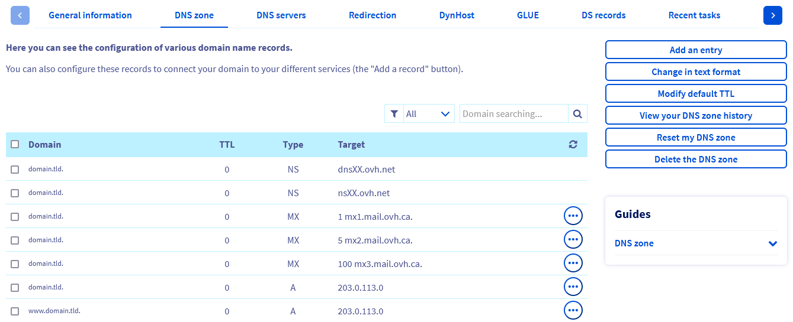
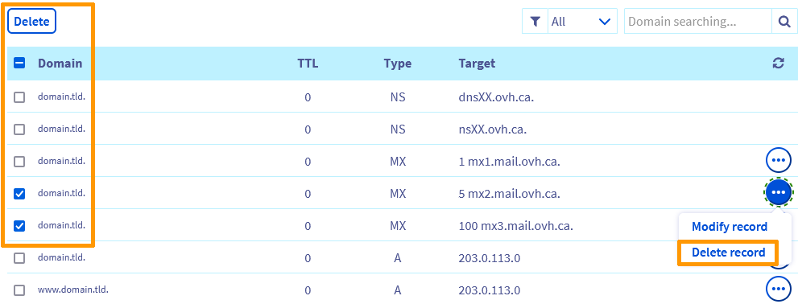
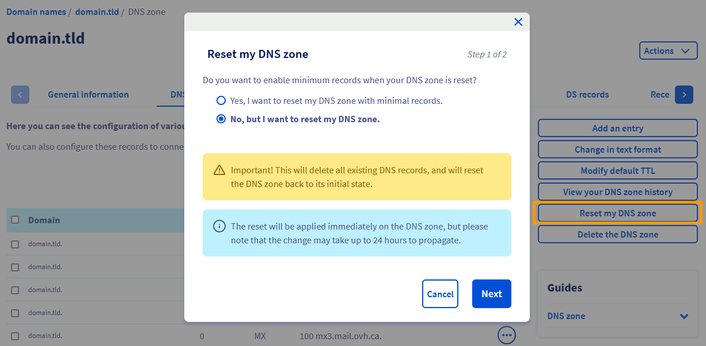
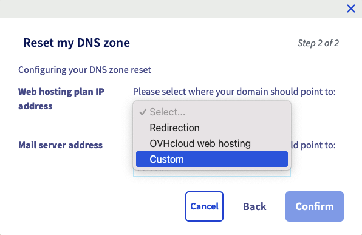

## Objectif

<iframe width="560" height="315" src="https://www.youtube-nocookie.com/embed/BvrUi26ShzI" frameborder="0" allow="accelerometer; autoplay; clipboard-write; encrypted-media; gyroscope; picture-in-picture" allowfullscreen></iframe>

Le sigle **DNS**, signifiant **D**omain **N**ame **S**ystem, est un ensemble d'éléments (serveurs DNS, zones DNS, etc.) permettant de faire correspondre un nom de domaine avec une adresse IP.

Pour plus d'explications, consultez nos guides « [Qu'est ce qu'un serveur DNS ?](/pages/web_cloud/domains/dns_zone_general_information) » et « [Qu'est ce qu'une zone DNS ?](/pages/web_cloud/domains/dns_zone_general_information) » 

**Découvrez comment éditer votre zone DNS OVHcloud via votre espace client OVHcloud.**

## Prérequis

- Disposer d'un accès à la gestion du nom de domaine concerné depuis votre [espace client OVHcloud](/links/manager).
- Être connecté à votre [espace client OVHcloud](/links/manager).
- Utiliser la configuration OVHcloud (ses serveurs DNS) pour le nom de domaine concerné. 

> [!warning]
>
> - Si votre nom de domaine n'utilise pas les serveurs DNS d'OVHcloud, vous devez réaliser la modification depuis l'interface du prestataire gérant la configuration de votre nom de domaine.
> 
> - Si votre nom de domaine est enregistré chez OVHcloud, vous pouvez vérifier si ce dernier utilise notre configuration. Pour cela, rendez-vous dans votre [espace client OVHcloud](/links/manager), dans l'onglet `Serveurs DNS`{.action} du nom de domaine concerné. Si besoin, consultez notre guide « [Modifier les serveurs DNS d'un nom de domaine OVHcloud](/pages/web_cloud/domains/dns_server_edit) ».
> 
> Dans les deux cas ci-dessus, faites attention en effectuant vos changements de serveurs DNS. En effet, l'ancienne configuration pouvant être appliquée à votre nom de domaine ne sera plus active si vous n'avez pas préalablement reconfiguré et personnalisé la nouvelle zone DNS présente chez OVHcloud. 
> Vous ne pouvez avoir qu'une seule zone DNS active à la fois par nom de domaine.
>

## En pratique

### Accéder à la gestion d'une zone DNS OVHcloud

> [!primary]
>
> Contrairement au nom de domaine, il n'y a pas de notion de propriétaire pour une zone DNS, mais de gestion des contacts pour une zone DNS OVHcloud. Si vous souhaitez basculer la gestion de votre zone DNS vers un autre compte OVHcloud, suivez notre guide [Gérer les contacts de ses services](/pages/account_and_service_management/account_information/managing_contacts).

Pour accéder à la gestion d'une zone DNS OVHcloud, effectuez les actions suivantes : 

1. Connectez-vous à votre [espace client OVHcloud](/links/manager).
2. Sur la ligne située en haut de l'espace client, cliquez sur l'onglet `Web Cloud`{.action}.
3. Dans la colonne de gauche, cliquez sur le menu déroulant `Noms de domaine`{.action}.
4. Sélectionnez le nom de domaine ou la zone DNS concerné(e).
5. Sur la page qui s'affiche, cliquez sur l'onglet `Zone DNS`{.action}.

Le tableau qui apparaît affiche pour chaque ligne un enregistrement DNS lié à votre nom de domaine chez OVHCloud. Vous avez la possibilité d'en filtrer le contenu par type d'enregistrement ou par domaine.

{.thumbnail}

### Éditer la zone DNS OVHcloud de votre nom de domaine

**L'édition d'une zone DNS est une manipulation sensible** : réaliser un changement inopportun pourrait, par exemple, rendre indisponible l'accès à votre site internet ou la réception de nouveaux messages sur vos adresses e-mail.

Comprendre ces différents enregistrements vous permettra de mieux appréhender les changements que vous allez effectuer si vous éditez la zone DNS de votre nom de domaine.

> [!success]
>
> Consultez notre guide sur les [enregistrements DNS](/pages/web_cloud/domains/dns_zone_records) afin de mieux appréhender vos manipulations DNS.
>
> Consultez également notre guide relatif aux [sous-domaines](/pages/web_cloud/domains/domain_create_subdomains) pour plus d'informations sur ce sujet.
>

Vous pouvez éditer la zone DNS OVHcloud de votre nom de domaine en ajoutant, modifiant ou en supprimant un enregistrement DNS. 
Pour effectuer cela, vous pouvez soit modifier manuellement la zone en mode textuel, soit utiliser nos assistants de configuration.

#### Modifier manuellement la zone en mode textuel 

> [!warning]
>
> Pour les utilisateurs avertis uniquement. Soyez également très vigilant sur la syntaxe lors de vos modifications.
>

Pour modifier en mode textuel une zone DNS OVHcloud, effectuez les actions suivantes :

1. Connectez-vous à votre [espace client OVHcloud](/links/manager).
2. Sur la ligne située en haut de l'espace client, cliquez sur l'onglet `Web Cloud`{.action}.
3. Dans la colonne de gauche, cliquez sur le menu déroulant `Noms de domaine`{.action}.
4. Sélectionnez le nom de domaine ou la zone DNS concerné(e).
5. Sur la page qui s'affiche, cliquez sur l'onglet `Zone DNS`{.action}.
6. Sur la droite ou en dessous du tableau, cliquez sur `Modifier en mode textuel`{.action} puis suivez les étapes qui s'affichent.

> [!warning]
> 
> Ne modifiez pas, via le bouton `Modifier en mode textuel`{.action}, les enregistrements NS de votre zone DNS au profit de serveurs DNS externes à OVHcloud. En effet, cette zone DNS fonctionne **uniquement** avec des serveurs DNS OVHcloud.

#### Utiliser nos assistants de configuration

À partir de ce point, cette documentation abordera uniquement la configuration via nos assistants.

> [!primary]
>
> Munissez-vous des informations à modifier dans votre zone DNS OVHcloud. Si vous effectuez cette modification à la demande d'un fournisseur de service, ce dernier doit vous communiquer la liste des éléments à modifier.
>

> [!tabs]
> **Ajouter un nouvel enregistrement DNS**
>>
>> Pour ajouter un nouvel enregistrement DNS, effectuez les actions suivantes : 
>>
>> 1. Connectez-vous à votre [espace client OVHcloud](/links/manager).
>> 2. Sur la ligne située en haut de l'espace client, cliquez sur l'onglet `Web Cloud`{.action}.
>> 3. Dans la colonne de gauche, cliquez sur le menu déroulant `Noms de domaine`{.action}.
>> 4. Sélectionnez le nom de domaine ou la zone DNS concerné(e).
>> 5. Sur la page qui s'affiche, cliquez sur l'onglet `Zone DNS`{.action}.
>> 6. Sur la droite ou en dessous du tableau, cliquez sur `Ajouter une entrée`{.action} puis suivez les étapes qui s'affichent.
>>
>> Nous vous invitons à vérifier au préalable si cet enregistrement n'existe pas déjà et ne pointe pas vers une cible différente. Pour cela, filtrez le contenu du tableau par type d'enregistrement ou par domaine. Si l'enregistrement existe déjà, nous vous invitons à le modifier grâce à la manipulation décrite juste après.
>>
>> {.thumbnail}
>>
>> > Lorsque la cible de votre enregistrement est une URL, pensez à ponctuer celle-ci. En effet, si vous ne le faites pas, votre nom de domaine sera automatiquement ajouté à la fin de votre cible.
>> >
>> > **Exemple** : vous souhaitez créer un enregistrement CNAME de `test.mydomain.ovh` vers `mydomain.ovh`.
>> >
>> > Vous devez alors avoir comme cible `mydomain.ovh.` et non pas `mydomain.ovh` sans le **.** à la fin.
>>
> **Modifier un enregistrement DNS existant**
>>
>> Pour modifier un enregistrement DNS, effectuez les actions suivantes : 
>>
>> 1. Connectez-vous à votre [espace client OVHcloud](/links/manager).
>> 2. Sur la ligne située en haut de l'espace client, cliquez sur l'onglet `Web Cloud`{.action}.
>> 3. Dans la colonne de gauche, cliquez sur le menu déroulant `Noms de domaine`{.action}.
>> 4. Sélectionnez le nom de domaine ou la zone DNS concerné(e).
>> 5. Sur la page qui s'affiche, cliquez sur l'onglet `Zone DNS`{.action}.
>> 6. Dans le tableau qui apparaît, cliquez sur le pictogramme `...`{.action} à droite de l'entrée concernée.
>> 7. Cliquez ensuite sur `Modifier l'entrée`{.action} et suivez les étapes qui s'affichent.
>>
>> {.thumbnail}
>>
> **Supprimer un enregistrement DNS**
>>
>> Pour supprimer un enregistrement DNS, effectuez les actions suivantes : 
>>
>> 1. Connectez-vous à votre [espace client OVHcloud](/links/manager).
>> 2. Sur la ligne située en haut de l'espace client, cliquez sur l'onglet `Web Cloud`{.action}.
>> 3. Dans la colonne de gauche, cliquez sur le menu déroulant `Noms de domaine`{.action}.
>> 4. Sélectionnez le nom de domaine ou la zone DNS concerné(e).
>> 5. Sur la page qui s'affiche, cliquez sur l'onglet `Zone DNS`{.action}.
>> 6. Dans le tableau qui apparaît, cliquez sur le pictogramme `...`{.action} à droite de l'entrée concernée.
>> 7. Cliquez ensuite sur `Supprimer l'entrée`{.action} et suivez les étapes qui s'affichent.
>>
>> Vous pouvez supprimer plusieurs entrées en une seule fois en les cochant depuis la partie gauche du tableau, puis en cliquant sur le bouton `Supprimer`{.action}.
>>
>> {.thumbnail}
>>
> **Réinitialiser la zone DNS**
>>
>> Réinitialiser votre zone DNS permet de revenir à une configuration minimale, avec les entrées OVHcloud par défaut ou celles de vos services. Vous pouvez également pointer votre nom de domaine vers des services d'hébergement Web et e-mail personnalisés.
>>
>> > [!alert]
>> >
>> > Avant de réinitialiser votre zone DNS, assurez-vous que votre nom de domaine n'est pas attaché à des services en cours d'utilisation, tels qu'un site web ou des adresses e-mail.
>> >
>>
>> Pour réinitialiser votre zone DNS, effectuez les actions suivantes :
>>
>> 1. Connectez-vous à votre [espace client OVHcloud](/links/manager).
>> 2. Sur la ligne située en haut de l'espace client, cliquez sur l'onglet `Web Cloud`{.action}.
>> 3. Dans la colonne de gauche, cliquez sur le menu déroulant `Noms de domaine`{.action}.
>> 4. Sélectionnez le nom de domaine ou la zone DNS concerné(e).
>> 5. Sur la page qui s'affiche, cliquez sur l'onglet `Zone DNS`{.action}.
>> 6. Sur la droite ou en dessous du tableau, cliquez sur `Réinitialiser ma zone DNS`{.action} puis suivez les 2 étapes qui s'affichent.
>>
>> {.thumbnail}
>>
>> **Étape 1**
>>
>> Répondez à la question `Voulez-vous activer les entrées minimales lors de la réinitialisation de votre zone DNS ?`. Définir des entrées minimales dans une zone DNS permet d'éviter qu'une requête vers le nom de domaine n'aboutisse sur une erreur.
>>
>> - `Oui, je veux réinitialiser ma zone DNS avec les entrées minimales`
>> - `Non, mais je veux réinitialiser ma zone DNS`
>>
>> **Étape 2**
>>
>> Quel que soit votre choix à l'étape 1, il est nécessaire de définir une réponse lorsqu'on interroge votre nom de domaine, afin d'éviter une réponse DNS en erreur.
>>
>> Sélectionnez les deux options en cliquant sur les onglets suivants.
>>
>> **Adresse IP de votre hébergement**
>>
>> - `Redirection` : votre nom de domaine pointera vers le serveur de redirection OVHcloud. Cela permet d'afficher une page d'accueil OVHcloud et ainsi éviter une erreur DNS. 
>> - `Hébergement Web OVHcloud` : votre nom de domaine pointera vers l'adresse IP de l'hébergement Web associé au nom de domaine. 
>> - `Personnalisé` : définissez la valeur IPv4 ([enregistrement A](/pages/web_cloud/domains/dns_zone_records#pointer-records)) de l'hébergement Web que vous souhaitez pointer.  
>> {.thumbnail}
>>
>> **Adresse de votre serveur e-mail**
>>
>> - `Redirection` : votre nom de domaine pointera vers les serveurs de redirections e-mail. Ce choix est particulièrement utile si vous n'avez aucune offre e-mail mais que vous souhaitez renvoyer les e-mails vers une ou plusieurs adresses e-mail en dehors de votre nom de domaine. 
>> - `Serveur E-mail OVHcloud` : à définir lorsque que vous possédez une offre e-mail mutualisée. 
>> - `Personnalisé` : définissez l'URL et la priorité du serveur e-mail ([enregistrement MX](/pages/web_cloud/domains/dns_zone_records#mail-records)) que vous souhaitez pointer.  
>> {.thumbnail}
>>

### Le temps de propagation

Une fois la zone DNS de votre nom de domaine modifiée, un temps de propagation de 24 heures maximum est nécessaire afin que les modifications soient effectives.

Si vous souhaitez réduire ce délai pour les prochaines éditions de votre zone DNS OVHcloud, vous pouvez le faire, dans une certaine mesure, en ajustant le TTL (*Time To Live*) qui s'appliquera à tous les enregistrements de la zone DNS. Effectuez les actions suivantes : 

1. Connectez-vous à votre [espace client OVHcloud](/links/manager).
2. Sur la ligne située en haut de l'espace client, cliquez sur l'onglet `Web Cloud`{.action}.
3. Dans la colonne de gauche, cliquez sur le menu déroulant `Noms de domaine`{.action}.
4. Sélectionnez le nom de domaine ou la zone DNS concerné(e).
5. Sur la page qui s'affiche, cliquez sur l'onglet `Zone DNS`{.action}.
6. Sur la droite ou en dessous du tableau, cliquez sur le bouton `TTL par défaut`{.action} et suivez les étapes qui s'affichent.

Vous pouvez aussi modifier le TTL d'un enregistrement DNS. Cependant, cette manipulation ne peut être effectuée que sur un enregistrement à la fois, en le modifiant ou lors d'un ajout.

## Aller plus loin

[Qu'est ce qu'un serveur DNS?](/pages/web_cloud/domains/dns_server_general_information)

[Qu'est ce qu'une zone DNS?](/pages/web_cloud/domains/dns_zone_general_information)

[Les enregistrements DNS](/pages/web_cloud/domains/dns_zone_records)

[Ajouter un champ SPF à la configuration de son nom de domaine](/pages/web_cloud/domains/dns_zone_spf)

[Protégez votre domaine contre le Cache Poisoning avec le DNSSEC](/links/web/domains-dnssec)

Pour des prestations spécialisées (référencement, développement, etc), contactez les [partenaires OVHcloud](/links/partner)

Si vous souhaitez bénéficier d'une assistance à l'usage et à la configuration de vos solutions OVHcloud, nous vous proposons de consulter nos différentes [offres de support](/links/support).

Échangez avec notre [communauté d'utilisateurs](/links/community).