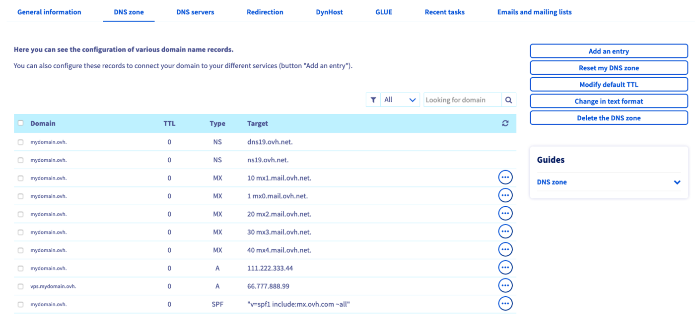

> [!primary]
> Tłumaczenie zostało wygenerowane automatycznie przez system naszego partnera SYSTRAN. W niektórych przypadkach mogą wystąpić nieprecyzyjne sformułowania, na przykład w tłumaczeniu nazw przycisków lub szczegółów technicznych. W przypadku jakichkolwiek wątpliwości zalecamy zapoznanie się z angielską/francuską wersją przewodnika. Jeśli chcesz przyczynić się do ulepszenia tłumaczenia, kliknij przycisk "Zgłoś propozycję modyfikacji" na tej stronie.
> 

## Wprowadzenie

<iframe width="560" height="315" src="https://www.youtube-nocookie.com/embed/BvrUi26ShzI" frameborder="0" allow="accelerometer; autoplay; clipboard-write; encrypted-media; gyroscope; picture-in-picture" allowfullscreen></iframe>

### Zrozumienie pojęcia DNS 

Symbol DNS, oznaczający **D**omain **N**ame **S**ystem, to zbiór elementów pozwalających na powiązanie domeny z adresem IP.

Na przykład, jeśli chcesz uzyskać dostęp do strony *mojadomena.ovh*, Twoje zapytanie jest początkowo przetwarzane przez zestaw DNS, który będzie kierował je na adres IP serwera, na którym hostowana jest strona *mydomain.ovh*.

W związku z operacjami, które przeprowadzasz w Panelu klienta, ważne jest rozróżnienie **serwerów DNS** i **strefy DNS**. To na poziomie **serwera DNS** jest skonfigurowana **strefa DNS**. 

Informacje dotyczące **serwerów DNS** oraz ich modyfikacja znajdziesz w przewodniku "[Zmiana serwerów DNS domeny OVHcloud](/pages/web_cloud/domains/dns_server_general_information)".

{.thumbnail}

Jeśli powtórzymy powyższy przykład, po wpisaniu adresu *mydomain.ovh*, zostaną przesłuchane **serwery DNS** powiązane z tą nazwą domeny. Serwery zawierają **strefę DNS** domeny *mojadomena.ovh*, w której podano adres IP hostingu *mydomain.ovh*. Dzięki temu Twoja przeglądarka może wyświetlić stronę internetową *mojadomena.ovh* zawartą na hostingu. Nazywamy to rozdzielczością DNS.

{.thumbnail}

### Strefa DNS 

Strefa DNS domeny to plik konfiguracyjny składający się z **rekordów**. Umożliwiają one powiązanie domeny z serwerami hostującymi Twoje usługi internetowe, takimi jak strony WWW (poprzez rekord A) lub konta e-mail (rekord MX).

{.thumbnail}

**Dowiedz się, jak edytować strefę DNS w Panelu klienta.**

## Wymagania początkowe

- Dostęp do interfejsu zarządzania domeną w Panelu [klienta OVHcloud](/links/manager){.external}.
- Dostęp do [Panelu klienta OVHcloud](/links/manager){.external}.
- Używanie konfiguracji OVHcloud (serwerów DNS OVHcloud) dla danej domeny.

> [!warning]
>
> - Jeśli Twoja domena nie używa serwerów DNS OVHcloud, przeprowadź zmianę w interfejsie dostawcy zarządzającego konfiguracją Twojej domeny.
> 
> - Jeśli Twoja domena jest zarejestrowana w OVHcloud, możesz sprawdzić, czy używa konfiguracji OVHcloud. W tym celu przejdź do [Panelu klienta OVHcloud](/links/manager){.external}, zakładka `Serwery DNS`{.action} odpowiedniej domeny.
> 
> W obu przypadkach należy zachować ostrożność wykonując zmiany na serwerach DNS. Poprzednia konfiguracja, która może zostać zastosowana do Twojej domeny, nie będzie już aktywna, jeśli nie skonfigurowałeś i spersonalizowałeś wcześniej nowej strefy DNS w OVHcloud. 
> Możesz mieć tylko jedną strefę DNS aktywowaną dla każdej domeny.
>

## W praktyce

### Dostęp do interfejsu zarządzania strefą DNS

> [!primary]
>
> W przeciwieństwie do nazwy domeny, nie ma tu pojęcia właściciela strefy DNS, lecz zarządzanie kontaktami w przypadku strefy DNS OVHcloud. Jeśli chcesz przełączyć zarządzanie swoją strefą DNS na inne konto OVHcloud, postępuj zgodnie z naszym przewodnikiem [Zarządzanie kontaktami swoich usług](/pages/account_and_service_management/account_information/managing_contacts).

Zaloguj się do Panelu [klienta OVHcloud](/links/manager){.external} w sekcji `Web Cloud`{.action}. Kliknij `Domeny`{.action}, a następnie wybierz odpowiednią domenę. Teraz przejdź do zakładki `Strefa DNS`{.action}.

Pojawi się tabela wyszczególniająca rekord DNS przypisany do Twojej domeny w OVHCloud dla każdego wiersza. Możesz sortować zawartość tabeli według typu rekordu lub nazwy domeny. 

{.thumbnail}

### Wpisy DNS

**Edycja strefy DNS jest operacją wymagającą odpowiedniej wiedzy**: wprowadzenie omyłkowej zmiany mogłoby na przykład uniemożliwić dostęp do Twojej strony WWW lub odbiór nowych wiadomości e-mail.

Poznanie poszczególnych rekordów będzie pomocne w lepszym zrozumieniu zmian, które wprowadzisz w strefie DNS Twojej domeny. Zapraszamy do zapoznania się z poniższą listą. Zawiera ona cele i specyfikę każdej rejestracji.

#### Zapisy wskazania 

Wybierz odpowiedni rekord, klikając każdą z następujących zakładek.

> [!tabs]
> **A**
>> **A**ddress   
>> Powiąż domenę z adresem IPv4 `X.X.X.X` (gdzie `X` to cyfry od `0` do `255`). Na przykład adres IPv4 serwera, na którym hostowana jest Twoja strona WWW.
>>
> **AAAA** 
>> Four **A** characters because this record is encoded on four times more bits than the historical **A** field    Powiąż domenę z adresem IPv6. Na przykład adres IPv6 serwera, na którym hostowana jest Twoja strona WWW.
>>
>> > [!primary]
>> >
>> > Adresy IPv6 są wdrażane stopniowo, aby zmniejszyć brak adresów IPv4 ze względu na stałe zwiększanie się zastosowań cyfrowych. 128-bitowe kodowanie adresów IPv6 pozwala na zapewnienie większej liczby adresów IP.
>> >
>> > Jeśli jednak Twój serwer dysponuje już adresem IPv4, zalecamy korzystanie z adresu IPv6. 
>> > W rzeczywistości adresy IPv6 nie są jeszcze prawidłowo interpretowane w całej sieci internetowej, co może powodować zaburzenia wyświetlania lub dostępu.
>> >
> **CNAME**
>> **C**anonical **NAME**   
>> Użyj adresu IP innej domeny tworząc link o nazwie alias. Na przykład, jeśli *www.mydomain.ovh* to *mydomain.ovh*, oznacza to, że *www.mydomain.ovh* będzie używał adresu IP *mydomain.ovh*.
>>
>> > [!alert]
>> >
>> > Rekord TXT wykorzystujący tę samą domenę lub subdomenę co rekord CNAME zakłóca jego działanie. Wpis CNAME będzie działać tylko częściowo lub w ogóle.
>> > 
>>
>> > [!warning]
>> >
>> > Pola CNAME nie mogą być używane bezpośrednio przez domenę w jej własnej strefie DNS. Tylko domena musi bowiem wskazywać bezpośrednio na adres IP z polem typu A (lub AAAA, jeśli jest to IPv6).
>> > 
>> > Aby skorzystać z powyższego przykładu, nie będziesz mógł utworzyć pola CNAME dla domeny *mojadomena.ovh* w strefie DNS, którą utworzyłeś dla domeny.
>> > Możesz utworzyć pole CNAME dla wszystkich subdomen (przykłady: *subdomain.mydomain.ovh* lub *www.mydomain.ovh*) domeny *mojadomena.ovh* w strefie DNS utworzonej dla *mydomain.ovh*.
>> >
>> > Jeśli chcesz dowiedzieć się więcej na ten temat z technicznego punktu widzenia, na dole strony znajdziesz [specjalny przypadek zastosowania dla CNAME i stref DNS utworzonych dla subdomen](#techusecase).
>> >
>>
> **DNAME**
>> **D**elegation **NAME**    Umożliwia wygenerowanie "aliasu" dla wszystkich subdomen domeny. Rekord ten pozwala uniknąć tworzenia wielu rekordów CNAME. Pole CNAME przekierowuje niezależnie tylko jedną subdomenę na jeden cel.
>>
>> Przykład: rejestrację DNAME domeny *mydomain.ovh* na *ovh.com*, wszystkie subdomeny *mydomain.ovh* (takie jak *dname.mydomain.ovh* i *xxx.mydomain.ovh*) zostaną przekierowane na subdomeny z krajów niebędących domenami z kategorii *dname.ovh.com* Kapitan i *xxx.ovh.com*.
>>
>>Innymi słowy, rekord DNAME wskazuje, że *dname.mydomain.ovh* i *xxx.mydomain.ovh* muszą wyświetlać wyniki *dname.ovh.com* i *xxx.ovh.com*.
>>
>> > [!warning]
>> >
>> > Natomiast *mydomain.ovh* jako domena nie będzie wyświetlała docelowej domeny *ovh.com*, ponieważ rekord DNAME jest ważny tylko dla subdomen zdefiniowanych w rekordzie DNAME.
>> >
>> > Ponadto, jeśli subdomena *xxx.ovh.com* nie wskaże nigdzie indziej, rekord DNAME nie wyświetli się również w przypadku *xxx.mydomain.ovh*.
>> >
>>
>> > [!success]
>> > 
>> > Rejestracja DNAME jest zazwyczaj stosowana w przypadku zmiany nazwy firmy. Można go również uruchomić, jeśli użytkownik dysponuje kilkoma rozszerzeniami domen (.fr, .net, .com, .info, ...).
>> >
> **NS**
>> **N**ame **S**erver  
>> Definiuje serwery DNS przypisane do strefy DNS. Na przykład, jeśli wpisy NS Twojej strefy DNS wyświetlają serwery *dns19.ovh.net* i *ns19.ovh.net*, użyj ich w zakładce `Serwery DNS`{.action} w Panelu klienta OVHcloud. Więcej informacji znajdziesz w przewodniku "[Zmiana serwerów DNS domeny OVHcloud](/pages/web_cloud/domains/dns_server_general_information)".
>>
>> > [!warning]
>> >
>> > Nie zmieniaj za pomocą przycisku `Modyfikacja w trybie tekstowym`{.action} rekordów NS strefy DNS na serwery DNS zewnętrzne OVHcloud. Strefa DNS działa **tylko** z serwerami DNS OVHcloud.
>> >

#### Zapisy e-mail 

Wybierz odpowiedni rekord, klikając każdą z następujących zakładek.

> [!tabs]
> **MX**
>> **M**ail e**X**changer   
>> Powiąż domenę z serwerem e-mail. Na przykład adres *10 mx1.mail.ovh.net* odpowiada jednemu z serwerów e-mail OVHcloud, gdy korzystasz z usługi e-mail OVHcloud. Istnieje prawdopodobieństwo, że Twój dostawca poczty e-mail dysponuje kilkoma serwerami e-mail: należy utworzyć kilka pól MX. Zapoznaj się z naszą dokumentacją "[Dodaj pole MX do konfiguracji domeny](/pages/web_cloud/domains/dns_zone_mx)".
>>
>> > [!warning]
>> >
>> > Zalecamy używanie w strefie DNS wyłącznie jednego lub kilku serwerów tego samego dostawcy e-mail.
>> > Jeśli dysponujesz już usługami e-mail u innego dostawcy i dodajesz jednocześnie (nie zastępując) serwery e-mail nowego dostawcy, istnieje ryzyko, że obie strony będą losowo otrzymywać e-maile od jednego lub kilku dostawców.
>> > 
>>
> **SPF**
>> **S**ender **P**olicy **F**ramework   
>> Pozwala zapobiegać przypadkom podszywania się pod adresy e-mail używające Twojej domeny (*spoofing*). Na przykład rejestracja `v=spf1 zawiera:mx.ovh.com ~all` wskazuje, że jedynie serwery poczty elektronicznej powiązane z Twoją ofertą mail OVHCloud mogą być uznane za zgodne z prawem przez serwer poczty przychodzącej. Możesz wprowadzić ten wpis w formie pola TXT lub w systemie automatycznej konfiguracji. Aby dowiedzieć się więcej, zapoznaj się z naszą dokumentacją "[Dodaj pole SPF do konfiguracji domeny](/pages/web_cloud/domains/dns_zone_spf)".
>>
> **DKIM**
>> **D**omain**K**eys **I**dentified **M**ail   
>> Pozwala sprawdzić autentyczność domeny nadawcy i zapewnić integralność wysłanego e-maila. Wpis DKIM ma postać klucza składającego się z kilku znaków. Klucz DKIM jest dostarczany przez dostawcę poczty elektronicznej (jeśli jest on proponowany przez dostawcę). Możesz go podać w postaci pola TXT.
> **DMARC**
>> **D**omain-based **M**essage **A**uthentication, **R**eporting and **C**onformance   
>> Przyczynia się do uwierzytelniania e-maili przy użyciu SPF i/lub DKIM. Wartość ta zostanie Ci przyznana przez dostawcę poczty e-mail (jeśli taka funkcja jest oferowana przez dostawcę). Będzie ona przynajmniej powiązana z rekordem SPF lub DKIM.

#### Rozszerzone wpisy 

Select the record you want by clicking each of the following tabs.

> [!tabs]
> **TXT**
>> **T**e**XT**   
>> Pozwala dodać wybraną wartość w formacie tekstowym w strefie DNS Twojej domeny. Rekord ten jest często używany podczas weryfikacji/walidacji lub procesu bezpieczeństwa.
>>
>> > [!warning]
>> > 
>> > Wpis TXT jest ograniczony do 255 znaków. W niektórych przypadkach możesz jednak podzielić Twoją wartość na kilka rekordów. Skontaktuj się ze swoim dostawcą, jeśli żąda on od niego podania wartości przekraczającej rozmiar 255 znaków.
>> > 
>> > Ten limit nie istnieje jednak, jeśli przejdziesz przez funkcję "Zmień w trybie tekstowym" [opisaną poniżej](#txtmod) w tym przewodniku (dla zaawansowanych użytkowników).
>> > 
>>
> **SRV**
>> **S**e**RV**ice resource   
>> Umożliwia wskazanie adresu serwera zarządzającego usługą. Może na przykład wskazać adres serwera SIP lub adres serwera pozwalającego na automatyczną konfigurację programu pocztowego.
>>
> **CAA**
>> **C**ertification **A**uthority **A**uthorization   
>> Umożliwia wyświetlenie listy organizacji upoważnionych do wydawania certyfikatów SSL dla domeny. 
>>
>> > [!warning]
>> >
>> > Jeśli konfigurujesz wpis CAA dla domeny, ta konfiguracja będzie dotyczyć również **wszystkich subdomen** dla tej samej domeny.
>> >
>> > Jeśli używasz certyfikatu SSL Let's Encrypt dla swojej domeny na hostingu www OVHcloud i używasz rekordu CAA, ten ostatni uniemożliwi odnowienie certyfikatu SSL Let's Encrypt.
>>
> **NAPTR**
>> **N**ame **A**uthority **P**oin**T**e**R**   
>> Używane w telekomunikacji do kierowania zapytań wysyłanych przez mobilny terminal na serwer. Rekord SRV może być powiązany z dynamicznym generowaniem docelowych adresów URI (Uniform Resource Identifier).
>>
> **LOC**
>> **LOC**ation   
>> Używane, gdy podajemy informacje o położeniu geograficznym (np. szerokość geograficzna, długość geograficzna i wysokość).
>>
> **SSHFP**
>> **S**ecure **SH**ell **F**inger**P**rint   
>> Używane, gdy wpisujemy odcisk klucza publicznego SSH.
>>
> **TLSA**
>> **T**ransport **L**ayer **S**ecurity **A**uthentification   
>> Używane, gdy wpisujemy odcisk palca certyfikatu SSL/TLS.

### Modyfikacja strefy DNS OVHcloud

Możesz edytować strefę DNS OVHcloud Twojej domeny dodając, zmieniając lub usuwając rekord DNS. Aby to zrobić, możesz skorzystać z jednej z dwóch metod:

#### Ręczna zmiana strefy w trybie tekstowym 

> [!warning]
> 
> Tylko dla zaawansowanych użytkowników. Bądź również bardzo czujny na składni podczas zmian.
> 

W zakładce `Strefa DNS`{.action} kliknij `Zmień w trybie tekstowym`{.action}, następnie postępuj zgodnie z kolejnymi instrukcjami, które się wyświetlają.

#### Skorzystaj z naszych asystentów konfiguracji

Od tego momentu niniejszy przewodnik opisuje jedynie konfigurację przy użyciu asystenta.

> [!primary]
>
> Przygotuj informacje, które chcesz zmienić w strefie DNS OVHcloud. Jeśli przeprowadzasz tę zmianę na wniosek dostawcy usług, dostawca usług musi przekazać Ci listę elementów do zmiany.
>

#### Dodanie nowego rekordu DNS

Aby dodać nowy rekord DNS w zakładce `Strefa DNS`{.action} Twojej domeny, kliknij przycisk `Dodaj rekord`{.action} po prawej stronie tabeli. Wybierz typ pola DNS, po czym postępuj zgodnie z instrukcjami.

Zalecamy uprzednie sprawdzenie, czy rekord ten nie istnieje i czy nie wskazuje na inny cel. W tym celu włącz sortowanie zawartości tabeli według typu rekordu i nazwy domeny. Jeśli rekord już istnieje, rekomendujemy jego zmianę zgodnie z procedurą opisaną poniżej.

{.thumbnail}

> Jeśli celem twojego rekordu jest adres URL, pamiętaj o zaznaczeniu tego adresu. W przeciwnym razie Twoja domena zostanie automatycznie dodana na końcu Twojej docelowej strony.
>
> Przykład: chcesz utworzyć rekord CNAME dla *testów.mydomain.ovh* na *mydomain.ovh*.
>
> Musisz być celem *mydomain.ovh.* nie *mydomain.ovh* bez "." na koniec.

#### Modyfikacja istniejącego rekordu DNS 

Aby zmienić rekord DNS, kliknij ikonkę `Strefa DNS`{.action} w Panelu klienta, `...`{.action} w tabeli po prawej stronie wybranego rekordu. Następnie kliknij `Zmień rekord`{.action}, po czym postępuj zgodnie z kolejnymi instrukcjami, które się wyświetlą.

{.thumbnail}

#### Usunięcie rekordu DNS

Aby usunąć rekord DNS, kliknij ikonkę `Strefa DNS`{.action} w Panelu klienta `...`{.action} w tabeli po prawej stronie wybranego rekordu. Następnie kliknij `Usuń rekord`{.action}, po czym postępuj zgodnie z kolejnymi instrukcjami, które się wyświetlą.

Możesz usunąć kilka rekordów za jednym razem, zaznaczając je w lewej części tabeli i klikając przycisk `Usuń`{.action}.

{.thumbnail}

#### Zresetuj strefę DNS

Zresetowanie strefy DNS pozwala na przywrócenie minimalnej konfiguracji z domyślnymi wpisami OVHcloud lub wpisami usług. Możesz również wskazać swoją domenę na niestandardowy hosting WWW oraz usługi e-mail.

> [!alert]
>
> Przed zresetowaniem strefy DNS upewnij się, że Twoja domena nie jest powiązana z usługami, które są obecnie używane, takimi jak strona WWW lub konta e-mail.
>

W zakładce `Strefa DNS`{.action} kliknij `Zresetuj strefę DNS`{.action}, następnie postępuj zgodnie z 2 wyświetlającymi się instrukcjami.

{.thumbnail}

**Etap 1**

Odpowiedz na pytanie `Czy chcesz włączyć wpisy minimalne podczas resetowania strefy DNS?`. Ustanowienie minimalnych wpisów w strefie DNS zapobiega sytuacji, w której zapytanie do nazwy domeny nie doprowadzi do błędu.

- `Tak, chcę zresetować strefę DNS z minimalnymi wpisami`
- `Nie, ale chcę zresetować strefę DNS`

**Etap 2**

Niezależnie od tego, jaki wybierzesz w etapie 1, podczas wyszukiwania nazwy domeny należy zdefiniować odpowiedź, aby uniknąć odpowiedzi DNS z błędem.

Wybierz obie opcje, klikając poniższe zakładki.

> [!tabs]
> **Adres IP hostingu**
>> - `Przekierowanie`: Twoja domena będzie wskazywać na serwer przekierowania OVHcloud. Pomaga to w wyświetleniu strony głównej OVHcloud, co pozwala uniknąć błędu DNS. 
>> - `Hosting WWW OVHcloud`: Twoja domena będzie wskazywać na adres IP hostingu powiązanego z domeną  
>> - `Niestandardowy`: ustaw wartość IPv4 ([rekord A](#pointer-records)) hostingu, który chcesz wskazywać.   
>> {.thumbnail}
>>
> **Adres email**
>> - `Przekierowanie`: Twoja domena będzie wskazywać na serwery przekierowań email. Ten wybór. Jest to szczególnie przydatne, jeśli nie masz żadnej oferty e-mail, ale chcesz, aby e-maile były wysyłane na jeden lub więcej adresów e-mail poza Twoją domeną. 
>> - `Serwer E-mail OVHcloud`: do ustawienia, gdy posiadasz ofertę e-mail na hostingu. 
>> - `Niestandardowy`: ustaw adres URL i priorytet serwera e-mail ([rekord MX](#mail-records)), który chcesz wskazać.  
>> {.thumbnail}
>>

### Czas propagacji

Czas propagacji wprowadzonych w strefie DNS zmian wynosi maksymalnie 24 godziny.

Jeśli chcesz skrócić czas potrzebny na kolejną edycję strefy DNS OVHcloud, możesz zmienić w pewnym stopniu TTL (*Time To Live*), który będzie miał zastosowanie do wszystkich rekordów strefy DNS.

W tym celu przejdź do zakładki `Strefa DNS`{.action} w Panelu klienta, kliknij `przycisk domyślny TTL`{.action}, a następnie postępuj zgodnie z kolejnymi instrukcjami. 

Możesz również zmienić TTL rekordu DNS. Operacja ta może być jednak przeprowadzona tylko na jednym rekordzie, po zmianie lub po dodaniu rekordu.

### Szczególne zastosowanie: korzystanie z rekordów CNAME 

Niektórzy użytkownicy tworzą strefy DNS bezpośrednio dla subdomeny (np. *subdomeny-posiadające-własną-strefę-DNS.mydomain.ovh*). W takim przypadku zastosowanie ma również zasada określona [powyżej](#cname) w tym przewodniku. 

Ponieważ strefa DNS jest utworzona dla subdomeny (w naszym przykładzie *subdomena-posiadająca-strefę-DNS.mydomain.ovh*), subdomena jest traktowana jako cała domena w strefie DNS.

W związku z tym nie będziesz mógł utworzyć pola CNAME dla *subdomeny-mającej-własną-strefę-DNS.mydomain.ovh* w strefie DNS utworzonej dla tej subdomeny. Możesz jednak utworzyć pola CNAME, takie jak *subdomena.subdomena-posiadająca-własną-strefę-DNS.mydomain.ovh* lub *xxx.subdomena-mająca-własną-strefę-DNS.mydomain.ovh*.

## Sprawdź również

[Informacje na temat serwerów DNS](/pages/web_cloud/domains/dns_server_general_information){.external}.

[Dodawanie rekordu SPF podczas konfiguracji domeny](/pages/web_cloud/domains/dns_zone_spf){.external}.

[Zabezpieczenie domeny przed Cache Poisoning za pomocą DNSSEC](/pages/web_cloud/domains/dns_dnssec){.external}.

W przypadku wyspecjalizowanych usług (pozycjonowanie, rozwój, etc.) skontaktuj się z [partnerami OVHcloud](/links/partner).

Jeśli chcesz otrzymywać wsparcie w zakresie konfiguracji i użytkowania Twoich rozwiązań OVHcloud, zapoznaj się z naszymi [ofertami pomocy](/links/support).

Dołącz do społeczności naszych użytkowników na stronie <https://community.ovh.com/en/>. 
