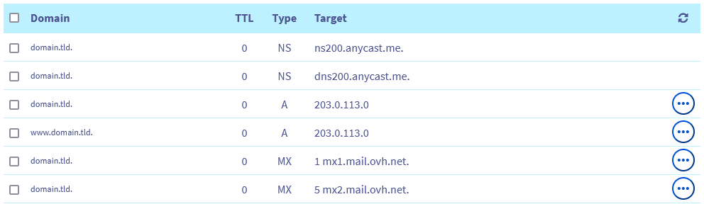

## Objectif

Le sigle **DNS**, signifiant **D**omain **N**ame **S**ystem, est un ensemble d'éléments (serveurs DNS, zones DNS, etc.) permettant de faire correspondre un nom de domaine avec une adresse IP.

Il est essentiel de différencier les **serveurs DNS** et la **zone DNS**. En effet, c'est au niveau du **serveur DNS** qu'est configurée la **zone DNS**. 

Pour une méilleure compréhension de l'ensemble, nous vous recommandons au préalable de consulter notre guide « [Qu'est ce qu'un serveur DNS ?](/pages/web_cloud/domains/dns_server_general_information) ».

Par exemple, lorsque vous souhaitez accéder au site *domain.tld* via un navigateur internet, votre requête est initialement traitée par cet ensemble DNS qui va l'aiguiller vers l'adresse IP du serveur hébergeant le site *domain.tld*.

Ainsi, lorsque vous tapez *domain.tld*, les **serveurs DNS** associés à ce nom de domaine seront interrogés. Ces derniers contiennent la **zone DNS** du nom de domaine *domain.tld* où est renseignée l'adresse IP de l'hébergement de *domain.tld*. Votre navigateur est ensuite en mesure d'afficher le site internet *domain.tld* contenu sur l'hébergement web. On appelle cela une résolution DNS.

**Découvrez le rôle d'une zone DNS, ce qu'elle contient et comment elle fonctionne avec un nom de domaine.**

## En pratique

### Rôle d'une zone DNS

La zone **D**omain **N**ame **S**ystem (**DNS**) d’un nom de domaine constitue le fichier de configuration de ce dernier. Elle se compose d’informations techniques, appelées *enregistrements DNS*. La zone DNS est, en quelque sorte, comme un centre d'aiguillage pour un nom de domaine.

Vous pouvez, par exemple, y préciser :

- L'adresse IP (enregistrements DNS de type *A* et *AAAA*) de votre hébergement web pour afficher votre site web avec votre nom de domaine.
- Les serveurs e-mail (enregistrements DNS de type *MX*) vers lesquels votre nom de domaine doit rediriger les e-mails qu'il reçoit. Cela vous permet de les consulter sur votre (vos) adresse(s) e-mail(s) personnalisée(s) avec votre nom de domaine.
- Des informations liées à la sécurité / l'authentification de vos services (hébergement web, serveur web, serveur e-mail, etc.)  associés à votre nom de domaine (enregistrements DNS de type *SPF*, *DKIM*, *DMARC*, etc.).

Une zone DNS est hébergée / enregistrée sur des **serveurs DNS**. Ce sont les **serveurs DNS** qui doivent être déclarés auprès du nom de domaine pour utiliser la zone DNS qu'ils hébergent. 

Consultez notre page web expliquant [comment fonctionne un serveur DNS](/links/web/domains-dns-server) pour plus d'informations.

### Les enregistrements DNS

Il existe un grand nombre de type d'enregistrement DNS. Ces derniers ont tous un but spécifique dans la résolution DNS. Chez OVHcloud, ils sont distingués en trois parties : 

- Les enregistrements de pointage (A, AAAA, CNAME, DNAME, NS);
- Les enregistrements e-mail (MX, SPF, DKIM, DMARC);
- Les enregistrements étendus (TXT, SRV, CAA, NAPTR, LOC, SSHFP, TLSA)

Consultez notre guide sur [les enregistrements DNS](/pages/web_cloud/domains/dns_zone_records) pour plus d'informations sur les différents types d'enregistrements évoqués ci-dessus. Vous y retrouverez des éléments qui vous permettrons, par exemple, de mieux appréhender l'[édition d'une zone DNS OVHcloud](/pages/web_cloud/domains/dns_zone_edit)

### Exemple de zone DNS

Pour mieux vous représenter ce qu'est une zone DNS, retrouvez ci-après un exemple de zone DNS pour le nom de domaine *domain.tld*. Celle-ci est configurée sur les serveurs DNS *dns200.anycast.me* et *ns200.anycast.me* d'OVHcloud :

{.thumbnail}

En comparaison, retrouvez ci-dessous son équivalent en « mode textuel » :

```bash
$TTL 3600
@	IN SOA dns200.anycast.me. tech.ovh.net. (2024051800 86400 3600 3600000 60)
                 IN NS     ns200.anycast.me.
                 IN NS     dns200.anycast.me.
                 IN A      203.0.113.0
www              IN A      203.0.113.0
                 IN MX     1 mx1.mail.ovh.net.
                 IN MX     5 mx2.mail.ovh.net.
                 IN MX     10 mx3.mail.ovh.net.
```

Dans cet exemple, la zone DNS précise, entre autre, les informations suivantes aux requêtes DNS qui lui parviennent :

- Les serveurs DNS déclarés pour le nom de domaine *domain.tld* sont les serveurs DNS *dns200.anycast.me* et *ns200.anycast.me*.
- Le serveur doit renvoyer l'adresse IP 203.0.113.0 si une requête  DNS est effectuée vers le domaine *domain.tld* ou le sous-domaine *www.domain.tld*. Derrière l'adresse IP 203.0.113.0 ont peut, par exemple, retrouver le site web *domain.tld*.
- Pour les e-mails, la zone DNS indique que les requêtes DNS réalisée pour le nom de domaine *domain.tld* doivent être redirigés vers le serveur *mx1.mail.ovh.net* en priorité. Si celui-ci met trop de temps à répondre ou est indisponible, la requête sera redirigée vers le serveur *mx2.mail.ovh.net* et ainsi de suite jusqu'au dernier serveur déclaré *mx3.mail.ovh.net*.
- Le SOA de la zone DNS indique que la date de dernière mise à jour de la zone DNS est le 18/05/2024 et que le délai de raffraîchissement de la zone DNS est de 3600 secondes.

## Aller plus loin

[Qu'est ce qu'un serveur DNS?](/pages/web_cloud/domains/dns_server_general_information)

[Qu'est ce qu'une zone DNS?](/pages/web_cloud/domains/dns_zone_general_information)

[Créer une zone DNS OVHcloud](/pages/web_cloud/domains/dns_zone_create)

[Éditer une zone DNS OVHcloud](/pages/web_cloud/domains/dns_zone_edit)

[Gérer l’historique d'une zone DNS OVHcloud](/pages/web_cloud/domains/dns_zone_history)

[Supprimer une zone DNS OVHcloud](/pages/web_cloud/domains/dns_zone_deletion)

Pour des prestations spécialisées (référencement, développement, etc), contactez les [partenaires OVHcloud](/links/partner).

Si vous souhaitez bénéficier d'une assistance à l'usage et à la configuration de vos solutions OVHcloud, nous vous proposons de consulter nos différentes [offres de support](/links/support).

Échangez avec notre communauté d'utilisateurs sur <https://community.ovh.com>.