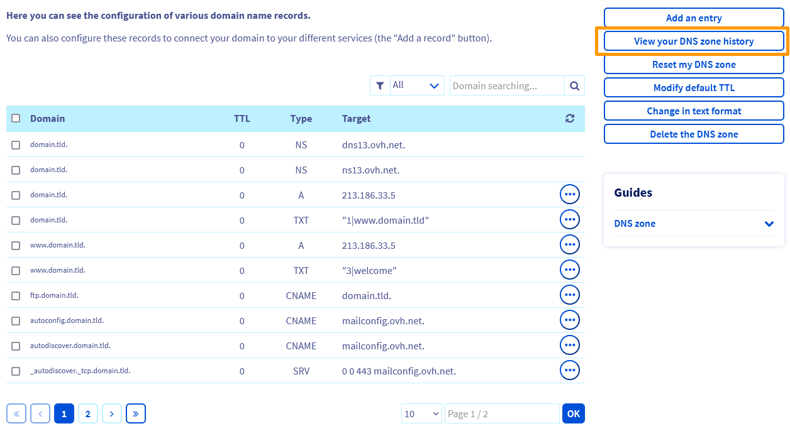
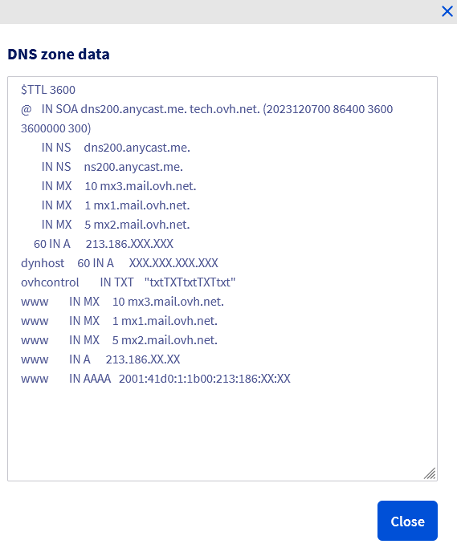
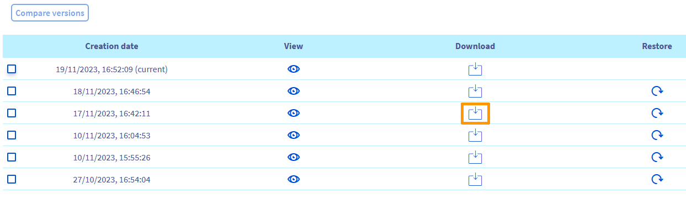
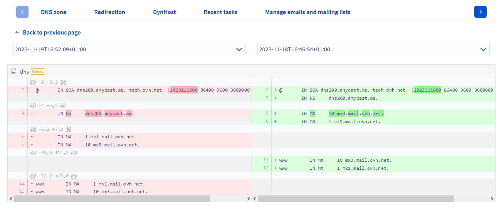

> [!primary]
> Esta traducción ha sido generada de forma automática por nuestro partner SYSTRAN. En algunos casos puede contener términos imprecisos, como en las etiquetas de los botones o los detalles técnicos. En caso de duda, le recomendamos que consulte la versión inglesa o francesa de la guía. Si quiere ayudarnos a mejorar esta traducción, por favor, utilice el botón "Contribuir" de esta página.
>

## Objetivo

La zona **D**omain **N**ame **S**ystem (**DNS**) de un dominio es el fichero de configuración del dominio. Consta de información técnica, denominada *registros DNS*. La zona DNS es como un centro de reenvío.

Por ejemplo, puede especificar lo siguiente:

- La dirección IP (registros DNS de tipo *A* y *AAAA*) de su alojamiento web para mostrar su sitio web con su nombre de dominio.
- Los servidores de correo (registros DNS de tipo *MX*) a los que el dominio debe redirigir los emails que recibe. Esto le permite consultarlos en su dirección de correo personalizada con su nombre de dominio.
- Información relativa a la seguridad y la autenticación de los servicios (alojamiento web, servidor web, servidor de correo, etc.) asociados a su dominio (registros DNS de tipo *SPF*, *DKIM*, *DMARC*, etc.).

Si lo necesita, consulte nuestra documentación sobre [registros DNS](/pages/web_cloud/domains/dns_zone_records) y la [edición de una zona DNS](/pages/web_cloud/domains/dns_zone_edit) desde su [área de cliente de OVHcloud](/links/manager).
Existen diversos motivos por los que podría necesitar aplicar una configuración DNS anterior al dominio.

A partir de ahora, la gestión de los DNS se simplifica gracias al historial de sus zonas DNS.

**Descubra cómo consultar, comparar, descargar y restaurar las copias de seguridad de la zona DNS**

## Requisitos

- Tener una zona DNS para el dominio en el [área de cliente de OVHcloud](/links/manager)
- Estar conectado al [área de cliente de OVHcloud](/links/manager)
- Tener acceso a la gestión del dominio

## Procedimiento

Para acceder a esta funcionalidad, conéctese al [área de cliente de OVHcloud](/links/manager) y acceda a la sección `Web Cloud`{.action} de la parte superior de la interfaz. En la columna izquierda, haga clic en `Dominios`{.action} y seleccione el dominio asociado a la zona DNS que quiera gestionar.

En la nueva página, si no ha sido redirigido a esta pestaña, haga clic en la pestaña `Zona DNS`{.action}.

Se mostrará una tabla con la zona DNS del dominio. Aquí encontrará la lista de los registros DNS que contiene. A la derecha del cuadro, varios botones le permiten realizar acciones en su zona DNS. 

{.thumbnail}

Haga clic en `Ver el historial de mi zona DNS`{.action}. 

Se abrirá una nueva página en la que podrá consultar el historial de copias de seguridad de su zona DNS, ordenado de la fecha más reciente a la más antigua. En la parte superior de la tabla se encuentra la versión actual de la zona DNS. En esta página, puede:

- [Ver una zona DNS](#view)
- [Descargar una zona DNS](#download)
- [Restaurar una zona DNS](#restore)
- [Comparar dos zonas DNS](#compare)

> [!primary]
>
> Las copias de seguridad de la zona DNS están sujetas a las siguientes limitaciones:
>
> - Conservamos un máximo de 200 copias de seguridad para una misma zona DNS.
> - Cuando una copia de seguridad tiene más de 31 días, se elimina automáticamente, a excepción de las **5 copias de seguridad más recientes** realizadas.
>

### Ver una zona DNS 

Para ver la zona DNS que desea ver, identifique la fila correspondiente en la tabla y haga clic en el icono de la columna `Ver`{.action}.

{.thumbnail}

Se mostrarán los datos de la zona DNS correspondiente.

{.thumbnail}

Haga clic en `Cerrar`{.action} para volver a la página principal "Historial de la zona DNS".

### Descargar una zona DNS 

Para descargar la zona DNS que desee, identifique la fila correspondiente en la tabla y haga clic en el icono de la columna `Descargar`{.action}.

{.thumbnail}

La zona DNS se descarga en formato .txt.

### Restaurar una zona DNS 

Si quiere sustituir la zona DNS actual por otra, solo tiene que restaurar una zona DNS anterior. En la tabla que contiene el historial de sus zonas DNS, identifique la fila correspondiente a la zona DNS que quiere restaurar (compruebe la fecha a la izquierda de la fila) y haga clic en el icono de la columna `Restaurar`{.action}.

{.thumbnail}

Se abrirá la siguiente ventana.

{.thumbnail}

Compruebe que la fecha indicada en el mensaje corresponde a la zona DNS que desea restaurar. Recuerde, como indica el banner amarillo, que la zona DNS actual (situada en la parte superior de la lista del historial de zonas DNS) será eliminada y sustituida por la zona DNS que quiera restaurar.

Haga clic en `Restaurar`{.action} para confirmar la restauración o en `Cancelar`{.action}.

> [!primary]
>
> La modificación o restauración de una zona DNS conlleva un retraso de propagación de **4** a **24** horas para que se aplique por completo a la red DNS.
>

### Comparar dos zonas DNS 

Puede comparar el contenido de dos zonas DNS. En la tabla que contiene el historial de su zona DNS, identifique las dos líneas correspondientes a las dos zonas DNS que desea comparar (compruebe la fecha a la izquierda de cada línea) y selecciónelas. Para comparar estas dos versiones de zona DNS, haga clic en `Comparar las versiones`{.action}, en la parte superior izquierda.

{.thumbnail}

Aparecerá una nueva página con el contenido de las dos zonas DNS. Por encima de cada versión se muestra la fecha correspondiente. Por defecto, la versión de la zona DNS más reciente se encuentra a la izquierda y la más antigua a la derecha. Un código de color ayuda a identificar las diferencias de contenido. 
A la izquierda, el contenido resaltado en rojo se ha modificado o eliminado en la versión más reciente. 
A la derecha, el contenido resaltado en verde ha cambiado o se ha añadido con respecto a la versión anterior. 

También puede actualizar las fechas de las versiones que desea comparar con las dos listas desplegables.

{.thumbnail}

Esta guía explica cómo comparar dos zonas DNS, ver, descargar, restaurar y eliminar una zona DNS.

## Más información

[Todo sobre los servidores DNS](/pages/web_cloud/domains/dns_server_general_information)

[Todo sobre la zona DNS](/pages/web_cloud/domains/dns_zone_general_information)

[Todo sobre los registros DNS](/pages/web_cloud/domains/dns_zone_records)

[Todo sobre los servidores DNS](/pages/web_cloud/domains/dns_server_general_information)

[Todo sobre la zona DNS](/pages/web_cloud/domains/dns_zone_general_information)

[Todo sobre los registros DNS](/pages/web_cloud/domains/dns_zone_records)

[Conectarse al área de cliente de OVHcloud](/pages/account_and_service_management/account_information/ovhcloud-account-login)

[Crear una zona DNS en OVHcloud](/pages/web_cloud/domains/dns_zone_create)

Para servicios especializados (posicionamiento, desarrollo, etc.), contacte con [partners de OVHcloud](/links/partner).

Si quiere disfrutar de ayuda para utilizar y configurar sus soluciones de OVHcloud, puede consultar nuestras distintas soluciones [pestañas de soporte](/links/support).

Interactúe con nuestra [comunidad de usuarios](/links/community).