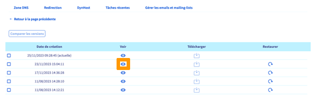
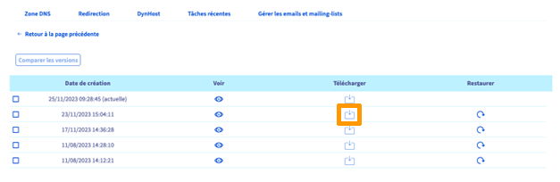
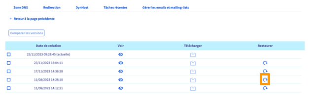
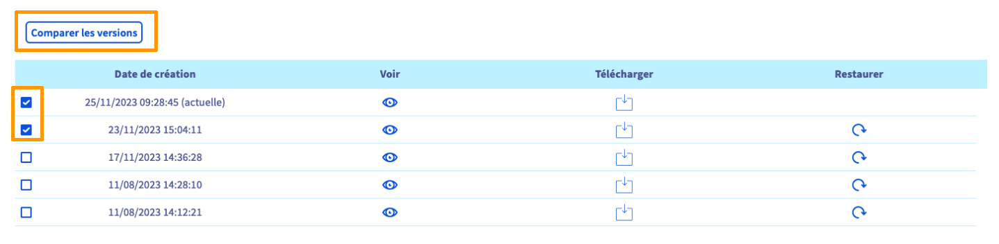
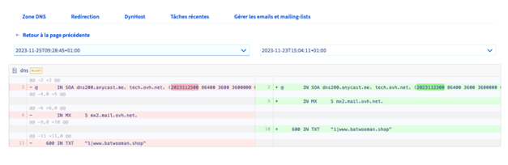

## Objectif

La zone **D**omain **N**ame **S**ystem (**DNS**) d’un nom de domaine constitue le fichier de configuration de ce dernier. Elle se compose d’informations techniques, appelées *enregistrements DNS*. La zone DNS est, en quelque sorte, comme un centre d'aiguillage.

Vous pouvez, par exemple, y préciser :

- L'adresse IP (enregistrements DNS de type *A* et *AAAA*) de votre hébergement web pour afficher votre site web avec votre nom de domaine.
- Les serveurs e-mail (enregistrements DNS de type *MX*) vers lesquels votre nom de domaine doit rediriger les e-mails qu'il reçoit. Cela vous permet de les consulter sur votre (vos) adresse(s) e-mail(s) personnalisée(s) avec votre nom de domaine.
- Des informations liées à la sécurité / l'authentification de vos services (hébergement web, serveur web, serveur e-mail, etc.)  associés à votre nom de domaine (enregistrements DNS de type *SPF*, *DKIM*, *DMARC*, etc.).

N'hésitez pas à consulter notre documentation sur [les enregistrements DNS et l'édition d'une zone DNS](/pages/web_cloud/domains/dns_zone_edit) depuis votre [espace client OVHcloud](https://www.ovh.com/auth/?action=gotomanager&from=https://www.ovh.com/fr/&ovhSubsidiary=fr) si vous souhaitez en apprendre plus sur le sujet.
Désormais, la gestion des DNS est facilitée grâce à l’historique de vos zones DNS.

**Découvrez comment consulter, comparer, télécharger et restaurer vos sauvegardes de zone DNS**

## Prérequis

- Être connecté à l’[espace client OVHcloud](https://www.ovh.com/auth/?action=gotomanager&from=https://www.ovh.com/fr/&ovhSubsidiary=fr)
- Disposer d'un accès à la gestion du nom de domaine concerné

## En pratique

Dans votre [espace client OVHcloud](https://www.ovh.com/auth/?action=gotomanager&from=https://www.ovh.com/fr/&ovhSubsidiary=fr), sélectionnez `Web Cloud`{.action} dans le menu en haut de l'interface. Dans la colonne de gauche, dirigez-vous dans l’onglet `Noms de domaine`, puis sélectionnez le nom de domaine lié à la zone DNS que vous souhaitez manipuler.

Le tableau qui apparaît contient la liste des enregistrements DNS liés à votre nom de domaine chez OVHcloud. Sous ce tableau, plusieurs boutons vous permettent d’effectuer des actions sur vos zones DNS. Cliquez sur `Voir l’historique de ma zone DNS`{.action}. 

Sur la nouvelle page qui s'affiche, un tableau apparaît contenant l'historique de vos zones DNS, classé de la date la plus récente à la plus ancienne. En tête de ce tableau se trouve la version actuelle de votre zone DNS. Sur cette page, il vous est possible d’effectuer les actions suivantes :

- Visualiser une zone DNS
- Télécharger une zone DNS
- Restaurer une zone DNS
- Comparer deux zones DNS

### Visualiser une zone DNS

Pour visualiser la zone DNS de votre choix, identifiez la ligne correspondante dans le tableau puis cliquez sur l'icône présente dans la colonne `Voir`{.action}.

{.thumbnail}

Les données de la zone DNS concernée s’affichent.

{.thumbnail}

Cliquez sur `Fermer`{.action} pour revenir à la page principale « Historique de la zone DNS ».

### Télécharger une zone DNS

Pour télécharger la zone DNS de votre choix, identifiez la ligne correspondante dans le tableau puis cliquez sur l'icône présente dans la colonne `Télécharger`{.action}.

{.thumbnail}

La zone DNS se télécharge au format .txt.

### Restaurer une zone DNS

Si vous souhaitez remplacer votre zone DNS actuelle par une autre, il vous suffit de restaurer une zone DNS plus ancienne. Dans le tableau contenant l’historique de vos zones DNS, identifiez la ligne correspondant à la zone DNS que vous voulez restaurer (pensez à bien vérifier la date à gauche de la ligne) puis cliquez sur l'icône présente dans la colonne `Restaurer`{.action}.

{.thumbnail}

La fenêtre suivante s’affiche.

{.thumbnail}

Vérifiez que la date indiquée dans le message correspond à la zone DNS que vous voulez restaurer. Comme la bannière jaune l’indique, n’oubliez pas que la zone DNS actuelle (présente tout en haut dans la liste de l’historique des zones DNS) sera supprimée et remplacée par la zone DNS que vous souhaitez restaurer.

Cliquez sur `Restaurer`{.action} pour confirmer la restauration ou sur `Annuler`{.action}.

### Comparer deux zones DNS

Il est possible de comparer le contenu de deux zones DNS. Dans le tableau contenant l’historique de vos zones DNS, identifiez les deux lignes correspondant aux deux zones DNS que vous voulez restaurer (pensez à bien vérifier la date à gauche de chaque ligne) puis sélectionnez-les. Pour comparer ces deux versions de zone DNS, cliquez en haut à gauche sur `Comparer les versions`{.action}.

{.thumbnail}

Une nouvelle page apparaît, affichant le contenu des deux zones DNS. Au-dessus de chaque version s’affiche la date correspondante. Par défaut, la version de la zone DNS la plus récente se trouve à gauche et la plus ancienne à droite. Un code couleur vous aide à identifier les différences de contenu. 
À gauche, le contenu surligné en rouge a été modifié ou supprimé sur la version plus récente. 
À droite, le contenu surligné en vert a été modifié ou ajouté par rapport à la version plus ancienne. 

Vous avez également la possibilité de mettre à jour les dates des versions que vous souhaitez comparer grâce aux deux listes déroulantes.

{.thumbnail}

Grâce à ce guide, vous êtes désormais capable de comparer deux zones DNS, mais également de visualiser, télécharger, restaurer et supprimer une zone DNS.

## Aller plus loin

[Se connecter à l'espace client OVHcloud](/pages/account_and_service_management/account_information/ovhcloud-account-login)

[Sauvegarder et exporter une base de données sur votre serveur de bases de données](/pages/web_cloud/domains/dns_zone_create/)

Si vous souhaitez bénéficier d'une assistance à l'usage et à la configuration de vos solutions OVHcloud, nous vous proposons de consulter nos différentes [offres de support](https://www.ovhcloud.com/fr/support-levels/).

Échangez avec notre communauté d'utilisateurs sur <https://community.ovh.com>.