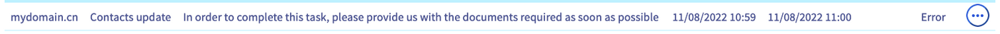
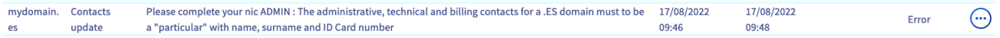
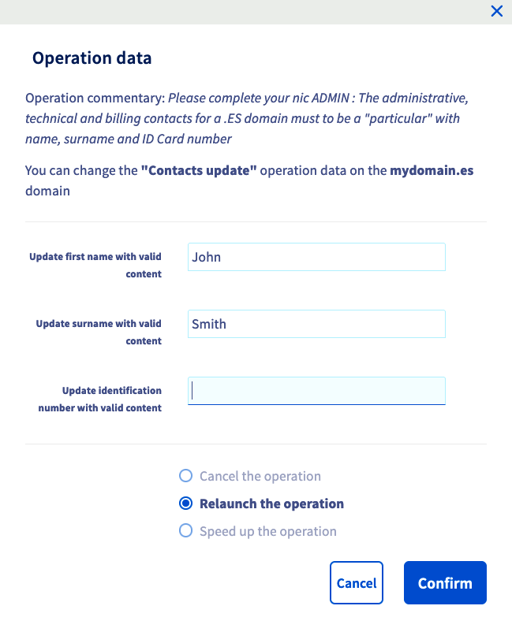
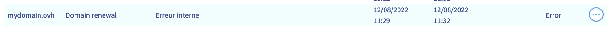

> [!primary]
> Esta tradução foi automaticamente gerada pelo nosso parceiro SYSTRAN. Em certos casos, poderão ocorrer formulações imprecisas, como por exemplo nomes de botões ou detalhes técnicos. Recomendamos que consulte a versão inglesa ou francesa do manual, caso tenha alguma dúvida. Se nos quiser ajudar a melhorar esta tradução, clique em "Contribuir" nesta página.
>

## Objetivo

A criação de um nome de domínio, a sua transferência, a sua mudança de proprietário são outras tantas operações para as quais pode ocorrer um erro. Poderá ser necessária uma intervenção da sua parte.

**Saiba como agir quando ocorrer um erro num domínio.**

## Requisitos

- Dispor de um ou vários domínios.
- Estar ligado à [Área de Cliente OVHcloud](https://www.ovh.com/auth/?action=gotomanager&from=https://www.ovh.pt/&ovhSubsidiary=pt).
- Estar atualizado em [pagamentos](/pages/account_and_service_management/managing_billing_payments_and_services/invoice_management#pay-bills) e [renovações](/pages/account_and_service_management/managing_billing_payments_and_services/how_to_use_automatic_renewal#renewal-management) dos serviços associados (nome de domínio e alojamento web).

## Instruções

Na Área de [Cliente OVHcloud](https://www.ovh.com/auth/?action=gotomanager&from=https://www.ovh.pt/&ovhSubsidiary=pt), aceda à secção `Web Cloud`{.action} e, a seguir, `Domínios`{.action}. Clique em `Operações em curso`{.action} por cima da lista de domínios.

Tem uma tabela que lhe permite consultar todas as operações associadas aos nomes de domínio da sua Área de Cliente.

{.thumbnail}

- `Domínio`: Domínio abrangido pela operação.
- `Operação`:  Operação em curso no domínio.
- `Comentário`: Detalhes sobre a operação em curso. Instruções.
- `Data de processamento`: Data de criação da operação.
- `Data de atualização`:  Data de atualização da operação em curso.
- `Data de finalização`: Data de fim da operação.
- `Estado`: Estado atual da operação.

Todas as operações listadas nesta tabela não requerem a sua intervenção para que elas se desenrolem normalmente. 
Neste guia, vamos focar as operações **em erro** através de exemplos recorrentes.

{.thumbnail}

### Exemplos

> [!primary]
>
> A lista de exemplos abaixo é não exaustiva. Se encontrar um erro que não é detalhado neste guia:
>
> - Verifique que está atualizado nas [renovações](/pages/account_and_service_management/managing_billing_payments_and_services/how_to_use_automatic_renewal#renewal-management) e [pagamentos](/pages/account_and_service_management/managing_billing_payments_and_services/invoice_management#pay-bills) de domínios.
> - Verifique se pode agir clicando no botão `...`{.action} à direita da operação em causa.
> - Leia a mensagem descritiva e verifique se esta lhe permite resolver o erro.
>
> Se, apesar destas verificações, não estiver em condições de agir sobre o nome de domínio, convidamo-lo a abrir um ticket de assistência a partir da sua Área de Cliente.
>

#### Pedido de documentos

Algumas extensões de nomes de domínio necessitam de justificar a sua utilização fornecendo documentos. Se for o caso, deverá enviar os documentos a partir da janela `Operações em curso`{.action}.

{.thumbnail}

Para apresentar o(s) documento(s) necessário(s), clique no botão `...`{.action} à direita da operação em causa. 
Na janela que se segue, a secção "Descrição" irá permitir-lhe obter detalhes sobre o documento que pretende fornecer, assim como um botão para televerter o seu documento.

{.thumbnail}

#### Informações em falta

Ao registar o seu nome de domínio, é necessário, por vezes, completar os dados de "contacto". Se estas últimas não correspondem aos critérios do nome de domínio, pode obter o erro abaixo.

{.thumbnail}

Clique no botão `...`{.action} à direita da operação. 
A janela seguinte aparece. Preencha os campos com as informações do contacto em questão.

{.thumbnail}

#### Código de transferência errado 

Ao transferir o seu domínio para a OVHcloud, deverá introduzir um código de transferência (**AuhInfo**) aquando da encomenda. Se este código estiver incorreto, a operação é suspensa, mas pode relançá-la introduzindo o código correto.

{.thumbnail}

Clique no botão `...`{.action} à direita da operação. 
Aparecerá a janela seguinte, introduza o código de transferência (**AuthInfo**) e execute novamente a operação.

{.thumbnail}

#### Erro associado aos servidores DNS

Pode ocorrer um erro se os servidores DNS associados a um domínio não funcionarem. 
No exemplo abaixo, o endereço IP do servidor DNS não responde.

{.thumbnail}

Na secção `Nomes de domínio`{.action}, selecione o domínio em questão e clique no separador `Servidores DNS`{.action}. A partir deste separador, [modifique os seus servidores DNS](/pages/web_cloud/domains/dns_server_general_information). 

#### Erro num nome de domínio em **.ie**, **.de** ou **.it** após uma atualização DNS

Ao alterar os seus servidores DNS, o registry poderá verificar os novos servidores DNS e a zona DNS associada e bloquear o domínio se a configuração não estiver conforme.

> [!warning]
>
> Este tipo de bloqueio é iniciado pelo registry e não pela OVHcloud. Assim, mesmo que o domínio seja bloqueado pelo registry, os seus servidores DNS aparecem como `Ativos` na sua Área de Cliente OVHcloud.

Para verificar se o domínio está bloqueado, aceda à tabela `Operações em curso`{.action}.

{.thumbnail}

Para verificar o seu nome de domínio, sugerimos que utilize a ferramenta de verificação fornecida pelo registry:

- Para um nome de domínio em **.de**: <https://nast.denic.de/>.
- Para um nome de domínio em **.it**: <https://dns-check.nic.it/>.

> [!primary]
>
> Se o seu registo não fornecer uma ferramenta de verificação dos servidores DNS, é possível consultar os seus novos servidores DNS através do comando ``nslookupsur uma "encomenda" Windows ou através do comando `dig` num "terminal" Linux ou macOS. 
>
> Se os seus servidores DNS estiverem disponíveis, a ferramenta irá devolver-lhe um endereço IP.
>
> Em qualquer caso, certifique-se de que o administrador do servidor DNS está devidamente configurado para alojar a zona DNS do seu domínio.

Depois de identificar a origem do erro e de o corrigir, pode clicar no botão `...`{.action} à direita da operação em causa e relançar a operação de verificação DNS.

#### Erro interno da OVHcloud

Pode encontrar um erro com os detalhes "erro interno". Este erro não permite ações da sua parte. 
Em primeiro lugar, verifique se o seu nome de domínio e os servidores DNS estão ativos. 

Se verificar uma anomalia não relacionada com a configuração dos servidores DNS ou da zona DNS, convidamo-lo a abrir um ticket de assistência junto do suporte OVHcloud para identificar a origem da avaria.

{.thumbnail}

## Saiba mais

[Transferir o domínio para a OVHcloud](/pages/web_cloud/domains/transfer_incoming_generic_domain)

[Transferir um domínio para outro agente de registo](/pages/web_cloud/domains/transfer_outgoing_domain)

[Modificar os servidores DNS de um nome de domínio OVHcloud](/pages/web_cloud/domains/dns_server_general_information)
 
Para serviços especializados (referenciamento, desenvolvimento, etc), contacte os [parceiros OVHcloud](https://partner.ovhcloud.com/pt/directory/).

Se pretender usufruir de uma assistência na utilização e na configuração das suas soluções OVHcloud, consulte as nossas diferentes [ofertas de suporte](https://www.ovhcloud.com/pt/support-levels/).

Fale com nossa comunidade de utilizadores: <https://community.ovh.com/en/>. 