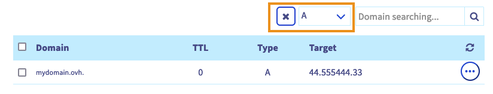
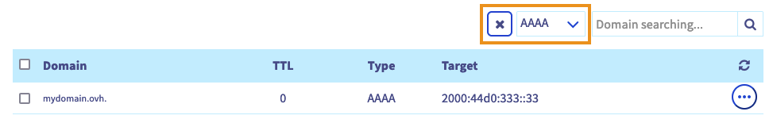

> [!primary]
> Diese Übersetzung wurde durch unseren Partner SYSTRAN automatisch erstellt. In manchen Fällen können ungenaue Formulierungen verwendet worden sein, z.B. bei der Beschriftung von Schaltflächen oder technischen Details. Bitte ziehen Sie im Zweifelsfall die englische oder französische Fassung der Anleitung zu Rate. Möchten Sie mithelfen, diese Übersetzung zu verbessern? Dann nutzen Sie dazu bitte den Button "Beitragen" auf dieser Seite.
>

## Ziel

Sie besitzen einen Domainnamen bei OVHcloud und möchten ihn mit einem Shopify Hosting verbinden. In dieser Anleitung erfahren Sie, wie Sie die OVHcloud DNS-Zone vorbereiten und konfigurieren, um die Konfiguration Ihres Shopify-Hostings zu ermöglichen.

**Hier erfahren Sie, wie Sie Ihre OVHcloud Domain mit einem Shopify Hosting verbinden**

> [!warning]
>
> - Der Shopify Support hat keinen Zugriff auf die Einstellungen Ihrer OVHcloud Domain und kann Sie daher nicht darüber beraten, welche Informationen Sie ihm zur Verfügung stellen müssen.
>
> - OVHcloud stellt Ihnen Dienstleistungen zur Verfügung, für deren Konfiguration und Verwaltung Sie die alleinige Verantwortung tragen. Es liegt somit bei Ihnen, sicherzustellen, dass diese ordnungsgemäß funktionieren.   Wir stellen Ihnen diese Anleitung zur Verfügung, um Ihnen bei der Bewältigung alltäglicher Verwaltungsaufgaben zu helfen. Dennoch empfehlen wir Ihnen, falls Sie Hilfe brauchen, einen spezialisierten [Dienstleister](https://partner.ovhcloud.com/de/) und/oder den Herausgeber des Dienstes zu kontaktieren. Für externe Dienstleistungen bietet OVHcloud leider keine Unterstützung. Weitere Informationen finden Sie im Abschnitt [Weiterführende](#gofurther) Informationen in dieser Anleitung.
>

## Voraussetzungen

- Sie sind in Ihrem [OVHcloud Kundencenter](https://www.ovh.com/auth/?action=gotomanager&from=https://www.ovh.de/&ovhSubsidiary=de){.external} angemeldet.
- Sie besitzen eine bei OVHcloud registrierte [Domain](https://www.ovhcloud.com/de/domains/){.external}.
- Sie verfügen über die entsprechenden [Berechtigungen zur Verwaltung](/pages/account_and_service_management/account_information/managing_contacts) der Domain über Ihr OVHcloud [Kundencenter](https://www.ovh.com/auth/?action=gotomanager&from=https://www.ovh.de/&ovhSubsidiary=de){.external}.
- Sie verfügen über ein Hosting bei Shopify.
- Sie haben Zugriff auf die Verwaltung dieses Hostings bei Shopify.

## In der praktischen Anwendung

Bevor Sie die beiden Schritte in dieser Anleitung ausführen, sollten Sie sich mit der Konfiguration einer DNS-Zone vertraut machen. Nutzen Sie dazu unsere Anleitung "[Bearbeiten der OVHcloud](/pages/web_cloud/domains/dns_zone_edit) DNS-Zone".

> [!warning]
>
> Ihre DNS Zone ist möglicherweise bereits vorkonfiguriert oder mit einem Hosting verbunden. In dieser Anleitung erfahren Sie, wie Sie jeden DNS-Eintrag identifizieren, der für die Verbindung mit Ihrem Shopify-Hosting erforderlich ist. Einige müssen gelöscht werden, um Konflikte mit den in dieser Konfiguration erforderlichen DNS-Einträgen zu vermeiden. Andere müssen nur noch geändert oder neu erstellt werden. Für ein besseres Verständnis verwenden wir als Beispiel die Domain "**mydomain.ovh**". Ersetzen Sie diese bei der Konfiguration durch Ihren Domainnamen.

### DNS-Einträge auf Ihrem OVHcloud Account konfigurieren

Verbinden Sie sich mit Ihrem OVHcloud [Kundencenter](https://www.ovh.com/auth/?action=gotomanager&from=https://www.ovh.de/&ovhSubsidiary=de){.external} im Bereich `Web Cloud`{.action}. Klicken Sie auf `Domainnamen`{.action} und wählen Sie die betreffende Domain aus. Gehen Sie dann auf den Tab `DNS Zone`{.action}.

Die angezeigte Tabelle listet alle DNS-Einträge der ausgewählten Domain auf.

{.thumbnail}

Jeder DNS Eintrag kann geändert werden, indem Sie rechts in der Zeile der betreffenden Tabelle auf den Button `...`{.action} und dann auf Eintrag `bearbeiten klicken`{.action}.

Folgen Sie den Schritten der Reihe nach, indem Sie die folgenden Registerkarten durchsuchen:

> [!tabs]
> **Schritt 1**
>> **A-Eintrag**  
>> Um die vorhandenen A-Einträge zu identifizieren, klicken Sie oben in der Tabelle mit den DNS-Einträgen auf das Filtermenü und wählen Sie `A` aus. 
>> {.thumbnail} 
>> - Klicken Sie auf den Button `...`{.action} rechts in der Tabellenzeile, die Ihrem Domainnamen ohne Subdomain entspricht (Beispiel: `mydomain.ovh.`), und klicken Sie dann auf `Eintrag bearbeiten`{.action}. 
>> - Wenn ein Eintrag für die Subdomain "www." vorhanden ist (Beispiel: `www.mydomain.ovh.`), müssen Sie diesen löschen, damit er nicht mit dem in Schritt 4 angegebenen CNAME-Eintrag in Konflikt steht. Klicken Sie auf den Button `...`{.action} rechts in der Tabellenzeile für Ihre Domain allein mit der Subdomain "www." und klicken Sie dann auf `Eintrag löschen`{.action}. 
>> - Wenn Sie noch keinen "A"-Eintrag haben, klicken Sie auf den Button Einen `Eintrag hinzufügen`{.action} rechts oben auf Ihrem Bildschirm und wählen Sie das "Zeigerfeld" `A`{.action}  
>> Lassen Sie das Feld **Subdomain** leer und geben Sie die IPv4-Adresse von Shopify `23.227.38.65` in das Feld **Ziel** ein.
>> {.thumbnail}  
>> Klicken Sie auf `Weiter`{.action}, bestätigen Sie Ihren A Eintrag und fahren Sie mit Schritt 2 fort.
> **Schritt 2**
>> **AAAA-Eintrag**  
>>  Um vorhandene AAAA-Einträge zu identifizieren, klicken Sie oben in der Tabelle mit DNS-Einträgen auf das Filtermenü und wählen Sie `AAAA` aus. 
>> {.thumbnail} 
>> - Klicken Sie auf den Button `...`{.action} rechts in der Tabellenzeile für Ihre Domain allein ohne Subdomain (Beispiel: `mydomain.ovh.`) und klicken Sie dann auf `Eintrag bearbeiten`{.action}. 
>> - Wenn ein Eintrag für die Subdomain "www." vorhanden ist (Beispiel: `www.mydomain.ovh.`), müssen Sie diesen löschen, damit er nicht mit dem in Schritt 4 angegebenen CNAME-Eintrag in Konflikt steht. Klicken Sie auf den Button `...`{.action} rechts in der Tabellenzeile für Ihre Domain allein mit der Subdomain "www." und klicken Sie dann auf `Eintrag löschen`{.action}. 
>> - Wenn Sie noch keinen "AAAA"-Eintrag haben, klicken Sie auf den Button Einen `Eintrag hinzufügen`{.action} rechts oben auf Ihrem Bildschirm und wählen Sie das "Pointing-Feld" `AAAA`{.action}  
>> Lassen Sie das Feld **Subdomain** leer und geben Sie die IPv6-Adresse von Shopify `2620:0127:f00f:5::` in das Feld **Ziel** ein.
>> {.thumbnail}  
>> Klicken Sie auf `Weiter`{.action}, bestätigen Sie Ihren "AAAA" Eintrag und fahren Sie mit Schritt 3 fort.
> **Schritt 3**
>> **TXT-Eintrag**  
>>  Um vorhandene TXT-Einträge zu identifizieren, klicken Sie oben in der Tabelle mit DNS-Einträgen auf das Filtermenü und wählen `TXT` aus. 
>> {.thumbnail} 
>> - Wenn "TXT"-Einträge für die Domain alleine (Beispiel: `mydomain.ovh.`) und ihre Subdomain mit der Endung "www." (Beispiel: `www.mydomain.ovh.`) vorhanden sind, müssen diese gelöscht werden, damit sie nicht im Konflikt mit dem CNAME-Eintrag stehen, den Sie in Schritt 4 eingeben. Klicken Sie auf den Button `...`{.action} rechts in der Tabellenzeile für Ihre Domain allein mit der Subdomain "www." und klicken Sie dann auf `Eintrag löschen`{.action}. 
> **Schritt 4**
>> **CNAME-Eintrag**  
>>  Um vorhandene CNAME-Einträge zu identifizieren, klicken Sie oben in der DNS-Eintragstabelle auf das Filtermenü und wählen Sie `CNAME` aus. 
>> {.thumbnail}
>> - Klicken Sie auf den Button `...`{.action} rechts in der Tabellenzeile zu Ihrer Subdomain in "www." (Beispiel: `mydomain.ovh.`) und klicken Sie dann auf `Eintrag bearbeiten`{.action}. 
>> - Wenn Sie keinen existierenden "CNAME" Eintrag haben, klicken Sie auf den Button Einen `Eintrag hinzufügen`{.action} rechts oben auf Ihrem Bildschirm und wählen Sie das "`CNAME`{.action}" Daraufzeigefeld.
>> Vervollständigen Sie das Feld **Subdomain** mit dem Wert `www` und geben Sie `shops.myshopify.com.` in das Feld **Ziel** ein. 
>> {.thumbnail}  
>> Klicken Sie auf `Weiter`{.action} und bestätigen Sie Ihren "CNAME" Eintrag.

Die DNS Zone ist nun so konfiguriert, dass sie mit einem Shopify Hosting verbunden wird.

### Domain mit Shopify verbinden

Die Vorgehensweise für diesen Schritt erfolgt über das Shopify-Verwaltungsinterface. Bitte gehen Sie direkt zu Schritt 2 der Anleitung auf der Shopify-Website und klicken Sie auf [**diesen Link**](https://help.shopify.com/de/manual/domains/add-a-domain/connecting-domains/connect-domain-manual){.external}.

> [!primary]
>
> Die Überprüfung Ihres Domainnamens kann bis zu 48 Stunden dauern.

Wenn Sie ein E-Mail-Angebot von OVHcloud nutzen oder eines [unserer E-Mail](https://www.ovhcloud.com/de/emails/)-Angebote abonnieren möchten, müssen Sie auch Ihre DNS-Zone entsprechend vorbereiten. Lesen Sie unsere Anleitung zur [Konfiguration eines MX](/pages/web_cloud/domains/dns_zone_mx)-Eintrags.

## Weiterführende Informationen 

[DNS-Server einer OVHcloud Domain ändern](/pages/web_cloud/domains/dns_server_general_information)

[OVHcloud DNS-Zone für eine Domain erstellen](/pages/web_cloud/domains/dns_zone_create)

[Bearbeiten einer OVHcloud DNS-Zone](/pages/web_cloud/domains/dns_zone_edit)

Um die Verwaltung Ihrer Domain auf ein anderes OVHcloud Kundenkonto zu ändern, folgen Sie der Anleitung "Kontakte [verwalten](/pages/account_and_service_management/account_information/managing_contacts)".

Kontaktieren Sie für spezialisierte Dienstleistungen (SEO, Web-Entwicklung etc.) die [OVHcloud Partner](https://partner.ovhcloud.com/de/directory/).
 
Wenn Sie Hilfe bei der Nutzung und Konfiguration Ihrer OVHcloud Lösungen benötigen, beachten Sie unsere [Support-Angebote](https://www.ovhcloud.com/de/support-levels/).
 
Für den Austausch mit unserer User Community gehen Sie auf <https://community.ovh.com/en/>.