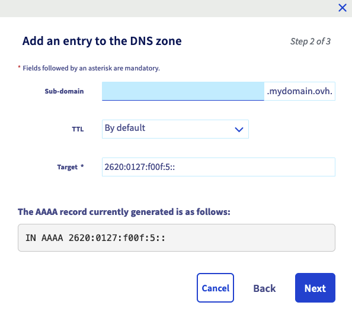

> [!primary]
> Tłumaczenie zostało wygenerowane automatycznie przez system naszego partnera SYSTRAN. W niektórych przypadkach mogą wystąpić nieprecyzyjne sformułowania, na przykład w tłumaczeniu nazw przycisków lub szczegółów technicznych. W przypadku jakichkolwiek wątpliwości zalecamy zapoznanie się z angielską/francuską wersją przewodnika. Jeśli chcesz przyczynić się do ulepszenia tłumaczenia, kliknij przycisk "Zgłoś propozycję modyfikacji” na tej stronie.
>

## Wprowadzenie

Posiadasz domenę w OVHcloud i chcesz ją połączyć z hostingiem Shopify. W tym przewodniku znajdziesz etapy przygotowania i konfiguracji strefy DNS OVHcloud, aby umożliwić konfigurację hostingu Shopify.

**Dowiedz się, jak powiązać domenę OVHcloud z hostingiem Shopify**

> [!warning]
>
> - Pomoc Shopify nie ma dostępu do ustawień Twojej domeny OVHcloud i nie może udzielić Ci porad dotyczących informacji, które należy jej dostarczyć.
>
> - OVHcloud udostępnia różnorodne usługi, jednak to Ty odpowiadasz za ich konfigurację i zarządzanie nimi. Ponosisz więc odpowiedzialność za ich prawidłowe funkcjonowanie.   Oddajemy w Twoje ręce niniejszy przewodnik, którego celem jest pomoc w wykonywaniu bieżących zadań. Niemniej jednak, w przypadku trudności zalecamy skontaktowanie się z wyspecjalizowanym [usługodawcą](/links/partner) lub skontaktuj się z dostawcą usługi. Niestety firma OVH nie będzie mogła udzielić wsparcia w tym zakresie. Więcej informacji znajduje się w sekcji [Sprawdź również](#go-further) ten przewodnik.
>

## Wymagania początkowe

- Dostęp do [Panelu klienta OVHcloud](/links/manager){.external}.
- Posiadanie [domeny](/links/web/domains){.external} zarejestrowanej w OVHcloud.
- Posiadanie odpowiednich [uprawnień do zarządzania](/pages/account_and_service_management/account_information/managing_contacts) domeną w [Panelu klienta OVHcloud](/links/manager){.external}.
- Posiadanie hostingu w Shopify.
- Dostęp do interfejsu zarządzania hostingiem w Shopify.

## W praktyce

Zalecamy, abyś przed przystąpieniem do dwóch kroków, zapoznał się z konfiguracją strefy DNS za pomocą przewodnika "[Edycja strefy DNS OVHcloud](/pages/web_cloud/domains/dns_zone_edit)".

> [!warning]
>
> Strefa DNS jest już wstępnie skonfigurowana lub powiązana z hostingiem. Zobaczymy, jak zidentyfikować każdy rekord DNS niezbędny do połączenia z hostingiem Shopify. Niektóre z nich będą musiały zostać usunięte, aby uniknąć konfliktu z wymaganymi rekordami DNS w tej konfiguracji. Pozostałe zostaną po prostu zmodyfikowane lub utworzone. Aby lepiej zrozumieć, jako przykład posłużymy się nazwą domeny "**mydomain.ovh**". Zastąp go nazwą domeny podczas konfiguracji.

### Konfiguracja wpisów DNS na koncie OVHcloud

Zaloguj się do Twojego panelu [klienta OVHcloud](/links/manager){.external} w sekcji `Web Cloud`{.action}. Kliknij `Domeny`{.action}, następnie nazwę wybranej domeny. Teraz przejdź do zakładki `Strefa DNS`{.action}.

Tabela, która się wyświetla zawiera listę wszystkich rekordów DNS wybranej domeny.

{.thumbnail}

Każdy rekord DNS można zmienić, klikając przycisk `...`{.action} znajdujący się po prawej stronie odpowiedniego wiersza tabeli, a następnie klikając `Zmień rekord`{.action}.

Postępuj zgodnie z kolejnością kroków, przechodząc przez następujące karty:

> [!tabs]
> **Etap 1**
>> **Rekord A**  
>> Aby zidentyfikować istniejące rekordy "A", kliknij menu filtrów w górnej części tabeli rekordów DNS i wybierz opcję `A`. 
>> {.thumbnail} 
>> - Kliknij przycisk `...`{.action} po prawej stronie wiersza tabeli, który odnosi się tylko do Twojej domeny, bez subdomeny (na przykład: `mydomain.ovh.`), a następnie kliknij `Zmień rekord`{.action}. 
>> - Jeśli istnieje rekord dla subdomeny "www." (przykład: `www.mydomain.ovh.`), należy go usunąć, aby nie kolidował z rekordem CNAME, który wprowadzisz w etapie 4. Kliknij przycisk `...`{.action} po prawej stronie wiersza tabeli odpowiadającego nazwie Twojej domeny z subdomeną "www.", a następnie kliknij `Usuń rekord`{.action}. 
>> - Jeśli nie masz istniejącego rekordu "A", kliknij przycisk `Dodaj rekord`{.action} w prawym górnym rogu ekranu i wybierz "Pole wskaźnika" `A`{.action}  
>> Pozostaw pole **Subdomena** puste i wprowadź adres IPv4 Shopify 23.`227.38.65` w polu **Adres docelowy**.
>> {.thumbnail}  
>> Kliknij `Dalej`{.action}, zatwierdź rekord "A" i przejdź do etapu 2.
> **Etap 2**
>> **Rekord AAAA**  
>>  Aby zidentyfikować istniejące rekordy "AAAA", kliknij menu filtrów u góry tabeli rekordów DNS i wybierz opcję `AAAA`. 
>> {.thumbnail} 
>> - Kliknij przycisk `...`{.action} po prawej stronie wiersza tabeli odpowiadającego nazwie domeny bez subdomeny (przykład: `mydomain.ovh.`), a następnie kliknij `Zmień rekord`{.action}. 
>> - Jeśli istnieje rekord dla subdomeny "www." (przykład: `www.mydomain.ovh.`), należy go usunąć, aby nie kolidował z rekordem CNAME, który wprowadzisz w etapie 4. Kliknij przycisk `...`{.action} po prawej stronie wiersza tabeli odpowiadającego nazwie Twojej domeny z subdomeną "www.", a następnie kliknij `Usuń rekord`{.action}. 
>> - Jeśli nie masz istniejącego rekordu "AAAA", kliknij przycisk `Dodaj rekord`{.action} w prawym górnym rogu ekranu i wybierz "Pole wskaźnika" `AAAA`{.action}  
>> Pozostaw pole **Subdomena** puste i wprowadź adres IPv6 Shopify 2620:`0127:f00f:5::` w polu **Adres docelowy**.
>> {.thumbnail}  
>> Kliknij `Dalej`{.action}, zatwierdź rekord "AAAA" i przejdź do etapu 3.
> **Etap 3**
>> **Rekord TXT**  
>>  Aby zidentyfikować istniejące rekordy "TXT", kliknij menu filtrów na górze tabeli rekordów DNS i wybierz opcję `TXT`. 
>> {.thumbnail} 
>> - Jeśli rekordy "TXT" są obecne tylko dla domeny (na przykład: `mydomain.ovh.`) i dla jej subdomeny "www." (na przykład: `www.mydomain.ovh.`), należy je usunąć, aby nie kolidowały z rekordem CNAME, który podasz w etapie 4. Kliknij przycisk `...`{.action} po prawej stronie wiersza tabeli odpowiadającego nazwie Twojej domeny z subdomeną "www.", a następnie kliknij `Usuń rekord`{.action}. 
> **Etap 4**
>> **Rekord CNAME**  
>>  Aby zidentyfikować istniejące rekordy "CNAME", kliknij menu filtrów na górze tabeli rekordów DNS i wybierz opcję `CNAME`. 
>> {.thumbnail}
>> - Kliknij przycisk `...`{.action} po prawej stronie wiersza tabeli odpowiadającego Twojej subdomenie "www." (przykład: `mydomain.ovh.`), a następnie kliknij `Zmień rekord`{.action}. 
>> - Jeśli nie posiadasz istniejącego rekordu "CNAME", kliknij przycisk `Dodaj rekord`{.action} w prawym górnym rogu ekranu i wybierz "Pole wpisu" `CNAME`{.action}.
>> Uzupełnij pole **Subdomena** wartością `www` i wpisz `shops.myshopify.com` w polu **Adres docelowy**. 
>> {.thumbnail}  
>> Kliknij `Dalej`{.action}, po czym zatwierdź rekord "CNAME".

Strefa DNS jest teraz skonfigurowana tak, aby wskazywała na hosting Shopify.

### Przypisz domenę do Shopify

Operacje na tym etapie należy wykonać w panelu zarządzania Shopify. Prosimy o przejście bezpośrednio do etapu 2 przewodnika na stronie Shopify, klikając [**ten link**](https://help.shopify.com/pl/manual/domains/add-a-domain/connecting-domains/connect-domain-manual){.external}.

> [!primary]
>
> Weryfikacja domeny może potrwać do 48 godzin.

Jeśli korzystasz z oferty e-mail OVHcloud lub zamierzasz zamówić jedną z [naszych usług e-mail](/links/web/emails), musisz również odpowiednio przygotować Twoją strefę DNS. Zapoznaj się z przewodnikiem dotyczącym [konfiguracji rekordu MX](/pages/web_cloud/domains/dns_zone_mx).

## Sprawdź również 

[Zmiana serwerów DNS domeny OVHcloud](/pages/web_cloud/domains/dns_server_edit)

[Utworzenie strefy DNS OVHcloud](/pages/web_cloud/domains/dns_zone_create)

[Edycja strefy DNS OVHcloud](/pages/web_cloud/domains/dns_zone_edit)

Aby zmienić sposób zarządzania domeną na inne konto klienta OVHcloud, zapoznaj się z przewodnikiem "[Zarządzanie kontaktami dla usług](/pages/account_and_service_management/account_information/managing_contacts) OVHcloud".

W przypadku wyspecjalizowanych usług (pozycjonowanie, rozwój, etc.) skontaktuj się z [partnerami OVHcloud](/links/partner).
 
Jeśli chcesz otrzymywać wsparcie w zakresie konfiguracji i użytkowania Twoich rozwiązań OVHcloud, zapoznaj się z naszymi [ofertami pomocy](/links/support).
 
Dołącz do [grona naszych użytkowników](/links/community).