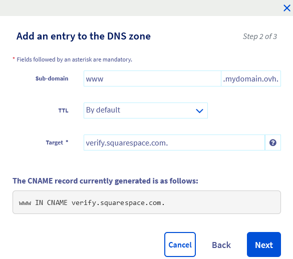

> [!primary]
> Questa traduzione è stata generata automaticamente dal nostro partner SYSTRAN. I contenuti potrebbero presentare imprecisioni, ad esempio la nomenclatura dei pulsanti o alcuni dettagli tecnici. In caso di dubbi consigliamo di fare riferimento alla versione inglese o francese della guida. Per aiutarci a migliorare questa traduzione, utilizza il pulsante "Contribuisci" di questa pagina.
>

## Obiettivo

Se il dominio è registrato in OVHcloud e vuoi connetterlo a un hosting SquareSpace. Questa guida ti mostra la procedura da seguire per preparare e configurare la zona DNS di OVHcloud e configurare l’hosting SquareSpace.

**Questa guida ti mostra come connettere un dominio OVHcloud a un hosting SquareSpace**

> [!warning]
>
> - L’assistenza SquareSpace non ha accesso ai parametri del dominio OVHcloud e non può quindi consigliarti quali informazioni è necessario fornire.
>
> - OVHcloud mette a tua disposizione servizi di cui tu sei responsabile per la configurazione e la gestione. Garantirne quotidianamente il corretto funzionamento è quindi responsabilità dell’utente.   Questa guida ti aiuta a realizzare le operazioni più ricorrenti. Tuttavia, in caso di difficoltà o dubbi, ti consigliamo di contattare un [fornitore specializzato](/links/partner) o il fornitore del servizio. OVHcloud non potrà fornirti alcuna assistenza. Per maggiori informazioni consulta la sezione [Per saperne](#go-further) di più.
>

## Prerequisiti

- Avere accesso allo [Spazio Cliente OVHcloud](/links/manager){.external}
- Disporre di un [dominio](/links/web/domains){.external} registrato in OVHcloud.
- Disporre delle [autorizzazioni necessarie per gestire](/pages/account_and_service_management/account_information/managing_contacts) il dominio dallo [Spazio Cliente OVHcloud](/links/manager){.external}.
- Disporre di un hosting in SquareSpace.
- Avere accesso alla gestione di questo hosting su SquareSpace.

## Procedura

Prima di eseguire i due passaggi di questa guida, ti consigliamo di familiarizzare con la configurazione di una zona DNS utilizzando la nostra guida "[Modificare una zona DNS in OVHcloud](/pages/web_cloud/domains/dns_zone_edit)".

> [!warning]
>
> La tua zona DNS è potenzialmente già preconfigurata o collegata a un hosting. In questa guida ti mostreremo come identificare ogni record DNS necessario per la connessione al tuo hosting SquareSpace. Alcuni dovranno essere eliminati per evitare conflitti con i record DNS necessari in questa configurazione. Altri saranno semplicemente da modificare o creare. Per una migliore comprensione, utilizzeremo come esempio il dominio "**mydomain.ovh**". Sostituiscilo con il tuo dominio durante la configurazione.

### Configurare i record DNS su un account OVHcloud

Accedi allo [Spazio Cliente OVHcloud](/links/manager){.external}, sezione `Web Cloud`{.action}. Clicca su `Domini`{.action} e poi seleziona il dominio interessato. e clicca sulla scheda `Zona DNS`{.action}.

Visualizzi una tabella con tutti i record DNS del dominio selezionato.

{.thumbnail}

Ogni record DNS può essere modificato cliccando sul pulsante `...`{.action} a destra della riga della tabella in questione e poi su `Modifica il record`{.action}.

Segui i passaggi in sequenza nelle seguenti schede:

> [!tabs]
> **Step 1**
>> **Record A**  
>> Per identificare i record "A" esistenti, fare clic sul menu dei filtri nella parte superiore della tabella dei record DNS e selezionare `A`. 
>> {.thumbnail} 
>> - Clicca sul pulsante `...`{.action} a destra della riga della tabella che corrisponde al tuo dominio senza sottodominio (esempio: `mydomain.ovh.`) e poi clicca su `Modifica il record`{.action}. 
>> - Se è presente un record per il sottodominio "www." (esempio: `www.mydomain.ovh.`), è necessario eliminarlo affinché non entri in conflitto con il record CNAME che inserirai allo Step 4. Clicca sul pulsante `...`{.action} a destra della riga della tabella corrispondente al tuo dominio con il sottodominio "www." e poi clicca su `Elimina il record`{.action}. 
>> - Se non disponi di un record "A", clicca sul pulsante `Aggiungi un record`{.action} in alto a destra e seleziona il "Campo di puntamento" `A`{.action}  
>> Per inserire i 4 indirizzi IPv4 relativi a SquareSpace, è necessario creare 4 record di tipo "A" in successione.
>> Lasciare vuoto il campo **Sottodominio** e inserire il primo indirizzo IPv4 di SquareSpace `198.185.159.144` nel campo **Destinazione**.
>> Clicca su `Seguente`{.action}, conferma la tua registrazione "A",; ripeti l’operazione per gli altri 3 indirizzi IPv4 `198.185.159.145`; `198.49.23.144`; `198.49.23.145` e passa allo step 2.
> **Step 2**
>> **Record AAAA**  
>>  Per identificare i record AAAA esistenti, fare clic sul menu dei filtri nella parte superiore della tabella dei record DNS e selezionare `AAAA`. 
>> {.thumbnail} 
>> - Clicca sul pulsante `...`{.action} a destra della riga della tabella che corrisponde al tuo dominio, senza sottodominio (esempio: `mydomain.ovh.`), poi clicca su `Elimina il record`{.action}. 
>> - Se è presente un record per il sottodominio "www" (esempio: `wwww.mydomain.ovh.`), eliminalo in modo che non entri in conflitto con il record CNAME che inserirai allo Step 4. Clicca sul pulsante `...`{.action} a destra della riga della tabella corrispondente al tuo dominio con il sottodominio "www" e poi clicca su `Elimina il record`{.action}. 
>> - Se non disponi di un record "AAAA" esistente, passa allo Step 3.
> **Step 3**
>> **Record TXT**  
>> Per identificare i record TXT esistenti, fare clic sul menu dei filtri nella parte superiore della tabella dei record DNS e selezionare `TXT`. 
>> {.thumbnail} 
>> - Se sono presenti record "TXT" solo per il dominio (esempio: `mydomain.ovh.`) e per il suo sottodominio in "www" (esempio: `wwww.mydomain.ovh.`), è necessario eliminarli affinché non entrino in conflitto con il record CNAME che inserirai allo Step 4. Clicca sul pulsante `...`{.action} a destra della riga della tabella corrispondente al tuo dominio con il sottodominio "www" e poi clicca su `Elimina il record`{.action}. 
> **Step 4**
>> **Record CNAME**  
>> Per identificare i record "CNAME" esistenti, clicca sul menu dei filtri in alto nella tabella dei record DNS e seleziona `CNAME`. 
>> {.thumbnail}
>> - Clicca sul pulsante `...`{.action} a destra della riga della tabella corrispondente al tuo sottodominio in "www" (esempio: `mydomain.ovh.`) e poi clicca su `Modifica il record`{.action}. 
>> - Se non disponi di un record "CNAME", clicca sul pulsante `Aggiungi un record`{.action} in alto a destra e seleziona il "Campo di puntamento" `CNAME`{.action}.
>> Inserisci nel campo **Sottodominio** il valore `www` e inserisci `verify.squarespace.com.` nel campo **Destinazione**. 
>> {.thumbnail}
>> Clicca su `Seguente`{.action} e conferma la registrazione "CNAME".
>> Aggiungere il secondo record CNAME digitando `ext-cust.squarespace.com.` nel campo **Destinazione**. 

A questo punto la zona DNS è configurata per essere collegata a un hosting SquareSpace.

### Connettere un dominio a SquareSpace

Le operazioni per questo step devono essere effettuate dallo spazio di gestione di SquareSpace.

> [!primary]
>
> - Puoi connettere il tuo dominio a un sito SquareSpace di prova o a pagamento. Non è possibile connetterlo a un sito scaduto.
> - Se al dominio è associato un account email, è possibile continuare a utilizzarlo dopo che il dominio si è connesso a SquareSpace. Prima di connettere il dominio, consigliamo di consultare questa [guida SquareSpace](https://support.squarespace.com/hc/it/articles/217601877-Usare-un-indirizzo-email-di-dominio-personalizzato-di-cui-gi%C3%A0-disponi-con-Squarespace){.external}.
> - Puoi utilizzare diversi domini personalizzati per il tuo sito Web. È possibile connetterne o salvarne quante volte si desidera.
> - Non è possibile connettere un dominio personalizzato a SquareSpace se il dominio include la parola "squarespace" o "sqsp".

Per iniziare, segui la procedura di connessione descritta nello step 1 di questa [guida SquareSpace](https://support.squarespace.com/hc/it/articles/12880712406797-Collegare-un-dominio-OVHcloud-al-sito-Squarespace){.external}.

> [!warning]
>
> Se ricevi l'alert "This domain is already connected to another Squarespace site" (questo dominio è già connesso a un altro sito Squarespace), controlla gli altri tuoi siti Squarespace per determinare a quale sito è connesso il dominio. A questo punto, disconnetterlo da questo sito Web.

Per continuare il processo, passa allo step 2 di questa [guida SquareSpace](https://support.squarespace.com/hc/it/articles/12880712406797-Collegare-un-dominio-OVHcloud-al-sito-Squarespace){.external}.

Se utilizzi un servizio di posta elettronica OVHcloud o intendi sottoscrivere una delle [nostre soluzioni di posta](/links/web/emails), prepara la zona DNS di conseguenza. Consulta la nostra guida "[Configurazione di un record MX](/pages/web_cloud/domains/dns_zone_mx)".

## Per saperne di più 

[Modificare i server DNS di un dominio OVHcloud](/pages/web_cloud/domains/dns_server_edit)

[Creare una zona DNS OVHcloud per un dominio](/pages/web_cloud/domains/dns_zone_create)

[Modificare una zona DNS in OVHcloud](/pages/web_cloud/domains/dns_zone_edit)

Per modificare la gestione del dominio verso un altro account cliente OVHcloud, segui la guida "[Gestire i contatti dei servizi](/pages/account_and_service_management/account_information/managing_contacts) OVHcloud".

Per prestazioni specializzate (referenziamento, sviluppo, ecc...), contatta i [partner OVHcloud](/links/partner).
 
Per usufruire di un supporto per l'utilizzo e la configurazione delle soluzioni OVHcloud, è possibile consultare le nostre soluzioni [offerte di supporto](/links/support).
 
Contatta la nostra [Community di utenti](/links/community).