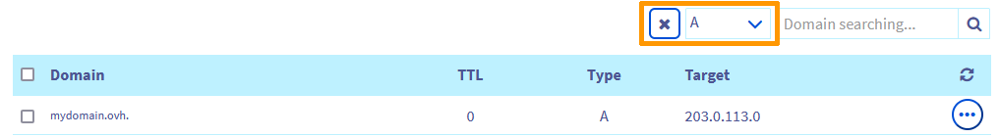

> [!primary]
> Questa traduzione è stata generata automaticamente dal nostro partner SYSTRAN. I contenuti potrebbero presentare imprecisioni, ad esempio la nomenclatura dei pulsanti o alcuni dettagli tecnici. In caso di dubbi consigliamo di fare riferimento alla versione inglese o francese della guida. Per aiutarci a migliorare questa traduzione, utilizza il pulsante "Contribuisci" di questa pagina.
>

## Obiettivo

Se il dominio è registrato in OVHcloud e vuoi connetterlo a un hosting SquareSpace. Questa guida ti mostra la procedura da seguire per preparare e configurare la zona DNS di OVHcloud e configurare l’hosting SquareSpace.

**Questa guida ti mostra come connettere un dominio OVHcloud a un hosting SquareSpace**

> [!warning]
>
> - L’assistenza SquareSpace non ha accesso ai parametri del dominio OVHcloud e non può quindi consigliarti quali informazioni è necessario fornire.
>
> - OVHcloud mette a tua disposizione servizi di cui tu sei responsabile per la configurazione e la gestione. Garantirne quotidianamente il corretto funzionamento è quindi responsabilità dell’utente.   Questa guida ti aiuta a realizzare le operazioni più ricorrenti. Tuttavia, in caso di difficoltà o dubbi, ti consigliamo di contattare un [fornitore specializzato](/links/partner) o il fornitore del servizio. OVHcloud non potrà fornirti alcuna assistenza. Per maggiori informazioni consulta la sezione [Per saperne](#go-further) di più.
>

## Prerequisiti

- Avere accesso allo [Spazio Cliente OVHcloud](/links/manager){.external}
- Disporre di un [dominio](/links/web/domains){.external} registrato in OVHcloud.
- Disporre delle [autorizzazioni necessarie per gestire](/pages/account_and_service_management/account_information/managing_contacts) il dominio dallo [Spazio Cliente OVHcloud](/links/manager){.external}.
- Disporre di un hosting in SquareSpace.
- Avere accesso alla gestione di questo hosting su SquareSpace.

## Procedura

Prima di eseguire i due passaggi di questa guida, ti consigliamo di familiarizzare con la configurazione di una zona DNS utilizzando la nostra guida "[Modificare una zona DNS in OVHcloud](/pages/web_cloud/domains/dns_zone_edit)".

> [!warning]
>
> La tua zona DNS è potenzialmente già preconfigurata o collegata a un hosting. In questa guida ti mostreremo come identificare ogni record DNS necessario per la connessione al tuo hosting SquareSpace. Alcuni dovranno essere eliminati per evitare conflitti con i record DNS necessari in questa configurazione. Altri saranno semplicemente da modificare o creare. Per una migliore comprensione, utilizzeremo come esempio il dominio "**mydomain.ovh**". Sostituiscilo con il tuo dominio durante la configurazione.

### Configurare i record DNS su un account OVHcloud

Accedi allo [Spazio Cliente OVHcloud](/links/manager){.external}, sezione `Web Cloud`{.action}. Clicca su `Domini`{.action} e poi seleziona il dominio interessato. e clicca sulla scheda `Zona DNS`{.action}.

Visualizzi una tabella con tutti i record DNS del dominio selezionato.

{.thumbnail}

Ogni record DNS può essere modificato cliccando sul pulsante `...`{.action} a destra della riga della tabella in questione e poi su `Modifica il record`{.action}.

Segui i passaggi in sequenza nelle seguenti schede:

> [!tabs]
> **Step 1**
>> **Record A**  
>> Per identificare i record "A" esistenti, fare clic sul menu dei filtri nella parte superiore della tabella dei record DNS e selezionare `A`. 
>> {.thumbnail} 
>> - Clicca sul pulsante `...`{.action} a destra della riga della tabella che corrisponde al tuo dominio senza sottodominio (esempio: `mydomain.ovh.`) e poi clicca su `Modifica il record`{.action}. 
>> - Se è presente un record per il sottodominio "www." (esempio: `www.mydomain.ovh.`), è necessario eliminarlo affinché non entri in conflitto con il record CNAME che inserirai allo Step 4. Clicca sul pulsante `...`{.action} a destra della riga della tabella corrispondente al tuo dominio con il sottodominio "www." e poi clicca su `Elimina il record`{.action}. 
>> - Se non disponi di un record "A", clicca sul pulsante `Aggiungi un record`{.action} in alto a destra e seleziona il "Campo di puntamento" `A`{.action}  
>>> Per inserire i 4 indirizzi IPv4 relativi a SquareSpace, è necessario creare 4 record di tipo "A" in successione.
>>> Lasciare vuoto il campo **Sottodominio** e inserire il primo indirizzo IPv4 di SquareSpace `198.185.159.144` nel campo **Destinazione**.
>>> Clicca su `Seguente`{.action}, conferma la tua registrazione "A",; ripeti l’operazione per gli altri 3 indirizzi IPv4 `198.185.159.145`; `198.49.23.144`; `198.49.23.145` e passa allo step 2.