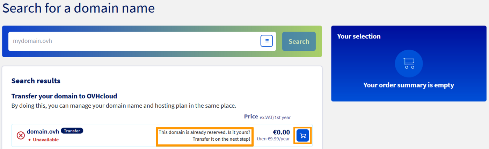
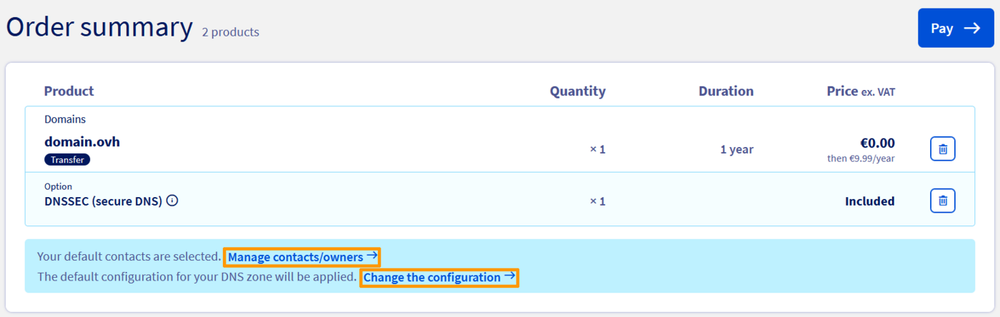

**Last updated 22nd June 2023** 

## Objective

Your domain name is currently managed by another **registrar** and you want to move it to OVHcloud? You can do this by following a transfer procedure.

By transferring your domain name, you will its **registrar**. You can transfer your domain name to OVHcloud by creating an order. The transfer process usually takes between one and ten days.

**This guide explains how to transfer a generic domain name to OVHcloud.**

> [!warning]
>
> The domain name *registrar* is a service provider authorised to offer domain names for registration by an individual, association or organisation. You renew your domain name subscription with the same *registrar* (usually once a year).
>
> If OVHcloud is already the *registrar* of your domain name, the *incoming domain transfer* procedure does not apply. The *incoming domain transfer* procedure described in this guide is **only** appropriate for domain names registered with a *registrar* other than OVHcloud.
>
> To transfer the domain name management to another OVHcloud customer account, a *change of contacts* must be made instead. The procedure is described in [our contact management guide](/pages/account_and_service_management/account_information/managing_contacts).
>
> If you also need to change the **domain name holder**, you should do so **before** you change the domain name contacts. To do this, use our [change of ownership for domain names instructions](/pages/web_cloud/domains/trade_domain).
>

## Requirements

- A domain name registered with another registrar.
- The domain name is more than 60 days old.
- The domain name has not been transferred or changed owners within the last 60 days.
- The domain name status is "OK" or "Transferable".
- The domain name is not expired and has an expiry date that allows to finish the transfer process in time - recommended are more than 60 days.
- The domain name is unlocked, with a transfer code received or the ability to receive one.
- You have the authority to request a transfer for the domain name.
- The domain name owner and/or its administrators must be informed of the transfer request.

## Instructions

> [!success]
>
> To find out the pricing conditions for transferring a domain name depending on its extension, enter the domain you wish to transfer on our page [www.ovhcloud.com/en-au/domains/tld/](https://www.ovhcloud.com/en-au/domains/tld/) and follow the steps in this guide.
>

The transfer procedure has several steps. These steps will involve various entities being contacted, including your current domain name registrar, OVHcloud, and other parties. The table below provides a breakdown of who is contacted, and how long each step will take to complete.

|Steps|Description|Who is involved?|Where?|Time taken|
|---|---|---|---|---|
|1|Checking the information associated with the domain|The domain administrator|With the current registrar|Depends on your actions|
|2|Unlocking the domain and retrieving the transfer code|The domain administrator, with the owner's permission|With the current registrar|Depends on your actions|
|3|Requesting the domain name transfer|Whoever has the transfer code and the owner's permission|With the new registrar|Depends on your actions|
|4|Transfer confirmation|With the current registrar|At the request of the organisation managing the domain name extension|Five days maximum|

> [!warning]
>
> The exact procedure for domain transfer may vary, especially in case of some country-code **TLD**s (**ccTLD**, such as .pl, .lu, .hk, .ro, .be, .lt, .dk, .at, .fi, etc.) and a few special purpose **TLD**s (.am, .fm, etc.). Depending on your domain name extension, you may have additional requirements. We recommend to first check against the information displayed in the section of the extension concerned, on our website: <https://www.ovhcloud.com/en-au/domains/tld/>.
>

### Step 1: Check the information associated with the domain

**To start with, it is important to ensure that the information associated with the domain name is up-to-date.** Since the implementation of GDPR, the data visible in [WHOIS](https://www.ovhcloud.com/en-au/domains/whois/){.external} has become very limited. We recommend checking the information associated with your domain name via your current domain name registrar.

- **If the information is correct:** Go to the next step of this guide.

- **If the information is incorrect or not visible:** Contact your domain name registrar to check and/or modify it.

> [!primary]
>
> If you do not know which registrar is responsible for your domain name, the "Registrar" lines retrieved as part of the [WHOIS](https://www.ovhcloud.com/en-au/domains/whois/){.external} search result can help you identify it.
>

### Step 2: Unlock your domain and retrieve the transfer code

Once you have checked this information, you will need to unlock your domain name. You can only do this via your current domain name registrar. Please contact them to find out more about their procedure.

Once you have unlocked your domain name, your domain name registrar must provide the AUTH/INFO code for it. This code is sometimes referred to using different names, such as: **transfer key**, **domain password**, **AUTH-CODE** or **EPP-Code**.

Please note that OVHcloud is not your current domain name registrar. We are therefore unable to unlock your domain or provide the AUTH/INFO code.

> [!warning]
>
> Once you have unlocked your domain name, you will have 7 days to begin transferring it to OVHcloud. After this 7-day period, your domain will be locked automatically if you do not submit a request to change your domain name registrar.
>

### Step 3: Request a domain name transfer to OVHcloud

Now that your domain name is unlocked and you have your AUTH/INFO, you can request for your domain name to be transferred to OVHcloud. Simply order a domain name transfer on [our website](https://www.ovhcloud.com/en-au/domains/domain-transfer/){.external}. Enter your domain name, and follow the order process.

{.thumbnail}

When you are asked to provide your transfer code, enter it into the field. If you do not have the transfer code yet, you can tick a box labelled `Enter the authentication code later in the OVHcloud Control Panel`{.action}. However, we advise to have the code ready before you continue. Keep in mind that transfer will not start until a valid code is provided.

{.thumbnail}

Domains can also be ordered in addition to a [Web Hosting plan](https://www.ovhcloud.com/en-au/web-hosting/). Our guide on [Migrating your website and emails to OVHcloud](/pages/web_cloud/web_hosting/hosting_migrating_to_ovh){.external} provides useful information for an optimised approach.

> [!warning]
>
> Throughout the order process, we advise taking special care with regard to the following points:
>
> - **Data on the domain name owner.** Especially since GDPR legislation is in effect, please ensure that all information on the domain name owner matches the information stored by your current domain name registrar. Doing this will ensure that you will not be suspected of domain name theft.
>
> - **Entering the DNS servers for your domain name.** If you are currently using your domain name to keep a website or email service online, you will need to specify their DNS servers in order to avoid any service interruptions.  
>

#### Managing owner and DNS servers details

- Clicking on `Change the configuration`{.action} in this step allows you to enter the names of the DNS servers the domain name is currently using. This way, the domain name will be already associated with those DNS servers in the OVHcloud configuration. 

- If you proceed without doing this, the domain name will provided with a new DNS zone on OVHcloud DNS servers. A manual [modification of the DNS zone](/pages/web_cloud/domains/dns_zone_edit) might then become necessary.

- In some cases, the transfer process may require additional information regarding the domain name owner. To add this information, click on the option `Manage contacts/owner`{.action}.

{.thumbnail}

#### Tracking a transfer after the order

Once the order has been confirmed, you will receive a purchase order. The transfer process will not start until payment has been received. Once this is done, you can track the transfer progress via the [OVHcloud Control Panel](https://ca.ovh.com/auth/?action=gotomanager&from=https://www.ovh.com.au/&ovhSubsidiary=au){.external}. To track the progress, open `Domain names`{.action}, then click on `Ongoing operations`{.action}.

> [!primary]
>
> If the transfer code was not entered during the order, you can enter it in the section `Ongoing operations`{.action} to validate the transfer.

### Step 4: Transfer validation by the current registrar

Once the order and transfer code have been confirmed, the domain name registrar (which is still not OVHcloud) will receive a validation request. There are several possible outcomes at this stage, depending on the actions taken.

|Action|Result|
|---|---|
|Validation response received from the current registrar.|The transfer is completed within **24 hours**.|
|No response received from the current registrar.|The transfer is completed after a **5-day period**.|
|A refusal request from the current registrar.|The transfer process is **cancelled** as soon as a refusal is issued.|

If a refusal is issued by the current registrar, contact them to find out why they refused it.

The transfer process can be restarted from the [OVHcloud Control Panel](https://ca.ovh.com/auth/?action=gotomanager&from=https://www.ovh.com.au/&ovhSubsidiary=au){.external}. Select `Web Cloud`{.action} and go to the `Domain names`{.action}, then click on `Ongoing operations`{.action}.

> [!primary]
>
> The transfer of a domain with the extension ".fr" differs slightly from the process described above. You will need to unlock your domain name and retrieve its transfer code from your current domain name registrar.
> Initiate the transfer order and enter the transfer code as described above.
>
> Once the transfer process has been initiated, the total time it takes to **transfer a ".fr" domain name will take an irreducible minimum of 8 days.**
>
> In case of **opposition to the transfer by the current registrar**, the transfer **will still be carried out** but it will take **an irreducible minimum of 22 days** to be finalised.
>

### Step 5: Manage your domain at OVHcloud

Once the transfer procedure is complete, you can manage your domain from the [OVHcloud Control Panel](https://ca.ovh.com/auth/?action=gotomanager&from=https://www.ovh.com.au/&ovhSubsidiary=au){.external}.

To do this, go to `Web Cloud`{.action} and open `Domain names`{.action} in the services bar, then click on the domain name concerned.

> [!warning]
>
> For domain names with a *generic* extension (**gTLD**s such as *.com*, *.net*, *.info*, *.org*, etc.), the initial expiration date of the domain name is retained. After a successful transfer, OVHcloud extends the subscription for another year at no extra charge.
> For example, your domain name with a *generic* extension expires on 29/09/2023 and is transferred on 04/06/2023. Once you have transferred your domain name to OVHcloud, the new expiration date is 29/09/2024.
>
> For domain names with a *country* or *regional* extension (**ccTLD**s such as *.fr*, *.be*, *.de*, *.es*, etc.), the transfer rules depend on the specifications put in place by the **registry* of the extension in question.
> Once the transfer is complete, check the expiry date of your domain name in your OVHcloud Control Panel.
>
> To do this, log in to your [OVHcloud Control Panel](https://ca.ovh.com/auth/?action=gotomanager&from=https://www.ovh.com.au/&ovhSubsidiary=au), then go to the `Web Cloud`{.action} section. In the left-hand column, click on `Domain names`{.action} then select the domain name concerned. The **month** and **year** of the next renewal are displayed below the domain name at the top of the page.
>
> Depending on the situation and the new expiry date, a renewal of the domain name may be necessary right after the transfer.
>

## Go further

[Migrating your website and emails to OVHcloud](/pages/web_cloud/web_hosting/hosting_migrating_to_ovh)

For specialised services (SEO, development, etc.), contact [OVHcloud partners](https://partner.ovhcloud.com/en-au/directory/).

If you would like assistance using and configuring your OVHcloud solutions, please refer to our [support offers](https://www.ovhcloud.com/en-au/support-levels/).

Join our community of users on <https://community.ovh.com/en/>.
