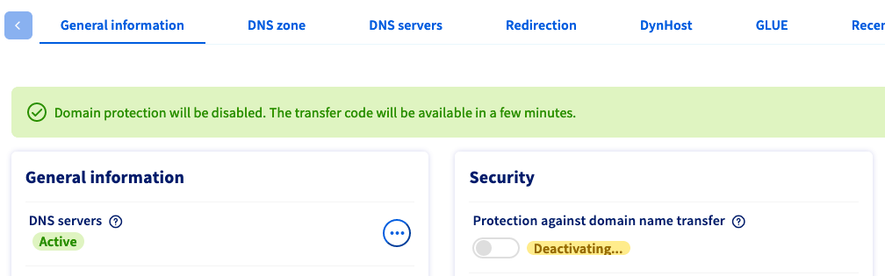

> [!primary]
> Esta traducción ha sido generada de forma automática por nuestro partner SYSTRAN. En algunos casos puede contener términos imprecisos, como en las etiquetas de los botones o los detalles técnicos. En caso de duda, le recomendamos que consulte la versión inglesa o francesa de la guía. Si quiere ayudarnos a mejorar esta traducción, por favor, utilice el botón «Contribuir» de esta página.
> 

## Objetivo

Una **transferencia de dominio** hace referencia a la transferencia de un dominio de un agente registrador a otro. Por ejemplo, si ha contratado un dominio en nuestro sitio web, OVHcloud es su actual agente registrador. El nuevo agente registrador debe iniciar una transferencia de dominio saliente.

Con el fin de evitar las transferencias de dominio no autorizadas, los dominios suelen estar bloqueados por el estado *clientTransferProhibited*. Es necesario eliminar esta protección desde el área de cliente de OVHcloud antes de iniciar la transferencia.

**Descubra cómo preparar su dominio para una transferencia saliente.**

> [!warning]
>
> Si el dominio en cuestión debe permanecer registrado en OVHcloud, pero modificado en sus modalidades de gestión o de propiedad, una transferencia saliente de dominio no es el procedimiento adecuado.
>
> Para transferir la gestión de su dominio a otra cuenta de cliente de OVHcloud, el método adecuado es un **cambio de contactos**. El procedimiento se describe en [esta guía](/pages/account_and_service_management/account_information/managing_contacts).
>
Si también debe cambiar el **propietario** del dominio, debe hacerlo **antes** de cambiar los contactos del dominio. Para ello, siga las indicaciones que le indicamos en la guía sobre el [cambio de propietario de los dominios](/pages/web_cloud/domains/trade_domain).
>

## Requisitos

- Tener un [dominio](https://www.ovhcloud.com/es/domains/) registrado con OVHcloud.
- Estar facultado para solicitar la transferencia del dominio. El propietario y las personas que lo administren deben haber sido informados.
- Tener acceso a la gestión del dominio desde el [área de cliente de OVHcloud](https://ca.ovh.com/auth/?action=gotomanager&from=https://www.ovh.com/world/&ovhSubsidiary=ws){.external}.
- El registro del dominio en cuestión data de hace al menos 60 días **y** no ha sido transferido ni intercambiado (es decir, el cambio de propietario) en los últimos 60 días.

> [!primary]
>
> Si usted es el **propietario** del dominio pero su gestión en el área de cliente de OVHcloud no está disponible, ya sea a través de su propio acceso o a través del contacto administrativo del dominio, consulte [esta guía](/pages/account_and_service_management/account_information/managing_contacts#caso-particular-de-un-propietario-de-dominio) antes de continuar.
>

## Procedimiento

> [!warning]
>
> Las instrucciones siguientes describen la forma más común de transferir un dominio, válido para la mayoría de los dominios de primer nivel (top-level domain, o TLD). No obstante, las normas específicas de procedimiento de los TLD son definidas únicamente por la autoridad competente, es decir, el **registro**. Los agentes registradores como OVHcloud deben respetar estas reglas y no influyen en las decisiones de los registros.
>
> El procedimiento exacto para las transferencias de dominio puede variar, en particular en el caso de determinados TLD de código de país (ccTLD, como .lu, .uk, .hk, .ro) y de algunos TLD especiales (.am, .fm, etc.). Las transferencias también pueden prohibirse por diversos motivos, por ejemplo en los casos de pago en espera, abuso o bloqueo del registro.
>
> En caso de duda, le recomendamos que consulte los siguientes recursos:
>
> - el sitio web del registro TLD correspondiente;
> - la [lista de TLD disponibles en OVHcloud](https://www.ovhcloud.com/es/domains/tld/);
> - [Las explicaciones de la ICANN sobre los códigos de estado EPP](https://www.icann.org/resources/pages/epp-status-codes-2014-06-16-en) (para saber qué códigos de estado se aplican actualmente a su nombre de dominio, realice una búsqueda *Whois*, utilizando preferentemente el sitio web del registro TLD correspondiente);
> - el sitio web y la interfaz de gestión de su nuevo agente registrador, especialmente en lo que respecta a las cuestiones relativas a un proceso de transferencia pendiente.
>

### Etapa 1 : eliminar la protección contra la transferencia del dominio

Conéctese al [Panel de configuración de OVHcloud](https://ca.ovh.com/auth/?action=gotomanager&from=https://www.ovh.com/world/&ovhSubsidiary=ws) y seleccione `Web Cloud`{.action}. Haga clic en `Dominios`{.action} y seleccione el dominio correspondiente.

En la pestaña `Información general`{.action}, encontrará el cursor `Protección contra la transferencia` en **Seguridad**. Por defecto, esta protección está `Activada`{.action}.

{.thumbnail}

Haga clic en el cursor y confirme en la nueva ventana que desea eliminar la protección. Espere unos minutos a que el estado pase a `Desactivado`{.action}.

> [!primary]
>
> Si encuentra el mensaje "**Se ha producido un error al solicitar la desactivación de la protección del dominio ("User not granted for this request")**", significa que no tiene los permisos suficientes para desbloquear el dominio. 
>
> Además, si encuentra el mensaje: "**AUTH/INFO code : Authcode is not managed by OVHcloud, contact the registry to claim it**", que significa que el código de transferencia de su dominio no es recuperable a través de su [área de cliente de OVHcloud](https://ca.ovh.com/auth/?action=gotomanager&from=https://www.ovh.com/world/&ovhSubsidiary=ws).  
> 
> En ambos casos, compruebe que es el contacto **administrador** del dominio con ayuda de nuestra guía sobre la [gestión de contactos](/pages/account_and_service_management/account_information/managing_contacts) y compruebe que la extensión de su dominio permite un desbloqueo desde el [área de cliente de OVHcloud](https://ca.ovh.com/auth/?action=gotomanager&from=https://www.ovh.com/world/&ovhSubsidiary=ws).
> 
> En efecto, algunos *códigos de transferencia* son gestionados directamente por el *registro* de la extensión del dominio. Un *registro* es una organización que gestiona el conjunto de dominios para una extensión determinada. Por ejemplo, el **AFNIC** gestiona el conjunto de dominios con la extensión "*.fr*". En ese caso, deberá contactar directamente con el *registro*, que gestiona la extensión del dominio, para obtener el *código de transferencia*.
>

{.thumbnail}

> [!primary]
>
> Una vez levantada la protección, el nombre de dominio permanece desbloqueado durante siete días. Después de este período, la protección se reactivará automáticamente. Si no solicita la transferencia del dominio a su nuevo agente registrador durante este período, será necesario volver a eliminar la protección del dominio.
>

### Etapa 2 : obtener el código de transferencia

> [!warning]
>
> Tenga en cuenta que siempre es posible desbloquear y recuperar el código de transferencia de su nombre de dominio después de su vencimiento. De acuerdo con las reglas del registro, es posible que sea necesario restaurar un dominio en [período de redención] (https://www.icann.org/resources/pages/epp-status-codes-2014-06-16-en) para transferirlo. Comuníquese con su nuevo registrador para conocer los detalles de la transferencia.
>

Una vez desbloqueada la protección contra la transferencia, deberá obtener el código de transferencia del dominio. Para ello, en la pestaña `Información general`{.action}, haga clic en el enlace `AUTH/INFO`{.action}, situado junto a `Protección contra la transferencia`{.action}. Actualice la página si es necesario.

Se abrirá una ventana en la que podrá consultar su código AUTH/INFO (también llamado código de transferencia, contraseña de dominio, AUTH-CODE o EPP-Code).

{.thumbnail}

El nuevo agente registrador solicitará el código para finalizar la transferencia. Puede consultar los detalles en el nuevo agente registrador.

En lugar de escribir manualmente el código, le recomendamos que copie y pegue el código, ya que algunos caracteres pueden confundirse fácilmente.

Una vez recuperado el código de transferencia, **no vuelva a bloquear su dominio a menos que ya no quiera transferirlo**.

### Etapa 3 : iniciar la transferencia al nuevo agente registrador

Una vez que haya realizado los pasos anteriores, puede iniciar la transferencia, generalmente haciendo un pedido. La transferencia puede tardar hasta 10 días. 

Para más información, contacte con su nuevo agente registrador.

> [!warning]
>
> Si su nuevo agente registrador solicita un nuevo código de transferencia, reactive la `Protección contra la transferencia` para su dominio y desactive este de nuevo unos minutos después. Así podrá obtener un nuevo código de transferencia.
>

## Más información

[Transferencia del dominio .co.uk saliente](/pages/web_cloud/domains/transfer_outgoing_couk)

Para servicios especializados (posicionamiento, desarrollo, etc.), contacte con [partners de OVHcloud](https://partner.ovhcloud.com/es/).

Si quiere disfrutar de ayuda para utilizar y configurar sus soluciones de OVHcloud, puede consultar nuestras distintas soluciones [pestañas de soporte](https://www.ovhcloud.com/es/support-levels/).

Interactúe con nuestra comunidad de usuarios en <https://community.ovh.com/en/>.