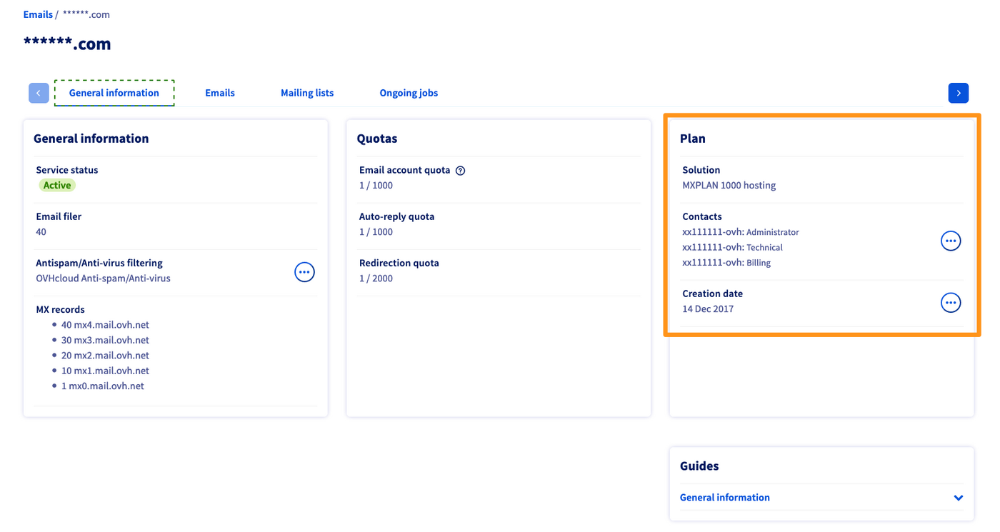
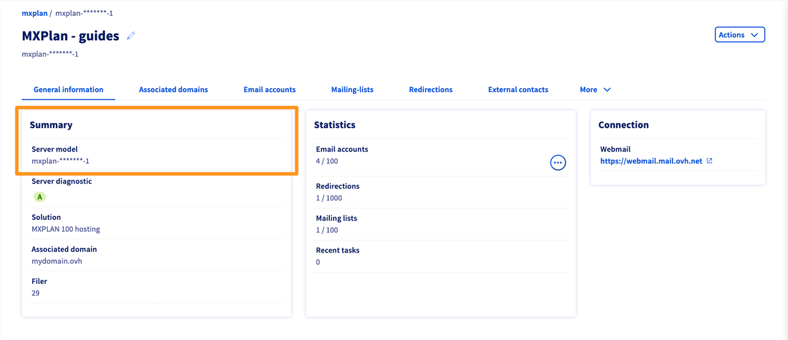

## Objective

You want to:

- Delete an email account you no longer use.
- Reset an email account to use it with a new email address.
- Reset an email account in order to cancel it.

**This guide explains how to delete or reset an email account of your email solution.**

## Requirements

- A preconfigured OVHcloud email solution, such as [**Hosted Exchange**](/links/web/emails-hosted-exchange), [**Email Pro**](/links/web/email-pro) or **MX Plan** (available with a [web hosting plan](/links/web/hosting), a [100M free hosting](/links/web/domains-free-hosting), or ordered separately)
- Access to the [OVHcloud Control Panel](/links/manager) as the Admin contact of the email service concerned (section `Web Cloud`{.action})

## Instructions 

OVHcloud offers 3 email solutions, and the concept of account deletion differs depending on which email solution you choose.

- **MX Plan**: This offer contains a certain number of email accounts as a bundle. When you delete an account, you free up an account "slot" of the email service.
- **Email Pro** and **Hosted Exchange**: Each of these offers consist of the service itself and individually billed email accounts. If you want to delete an email account, you will need to **reset** it. Once you have reset your email account, you can use this account again to create a new email address. You can also [cancel the subscription](/pages/web_cloud/email_and_collaborative_solutions/microsoft_exchange/manage_billing_exchange#deleting-accounts) for this account if you wish to permanently delete it.

### Delete or reset an email account

Select the tab corresponding to your email solution:

> [!tabs]
> **MX Plan legacy**
>>
>> To check if your MX Plan solution is a legacy or new version, please refer to the table in the "[Identifying your MX Plan solution](#whichmxplan)" section of this guide.
>>
>> 1. Log in to your [OVHcloud Control Panel](/links/manager).
>> 1. Open the `Web Cloud`{.action} section.
>> 1. Click `MX Plan`{.action}.
>> 1. Select the domain concerned.
>> 1. Go to the `Email accounts`{.action}  tab. The window that appears will display the existing email accounts.
>> 1. Click the `...`{.action} button to the right of the account you want to modify, then click `Disable account`{.action}.
>>
>> {.thumbnail}
>>
> **MX Plan new version**
>>
>> To check if your MX Plan solution is a legacy version, please refer to the table in the “[Identifying your MX Plan solution](#whichmxplan)” section of this guide.
>>
>> 1. Log in to your [OVHcloud Control Panel](/links/manager).
>> 1. Open the `Web Cloud`{.action} section.
>> 1. Click `MX Plan`{.action}.
>> 1. Select the domain concerned.
>> 1. Go to the `Email accounts`{.action} tab. The window that appears will display the existing email accounts.
>> 1. Click the `...`{.action} button to the right of the account you want to modify, then click `Reset this account`{.action}.
>>
>> {.thumbnail}
>>
> **Email Pro**
>>
>> 1. Log in to your [OVHcloud Control Panel](/links/manager).
>> 1. Open the `Web Cloud`{.action} section.
>> 1. Click `Email Pro`{.action}.
>> 1. Select the service concerned.
>> 1. Go to the `Email accounts`{.action} tab. The window that appears will display the existing email accounts.
>> 1. Click the `...`{.action} button to the right of the account you want to modify, then click `Reset this account`{.action}.
>>
>> After resetting your account, if you want to permanently delete it, you must cancel it. To do this, please refer to our guide "[Managing the billing for your Email Pro accounts](/pages/web_cloud/email_and_collaborative_solutions/email_pro/manage_billing_emailpro)".
>>
>> {.thumbnail}
>>
> **Exchange**
>>
>> 1. Log in to your [OVHcloud Control Panel](/links/manager).
>> 1. Open the `Web Cloud`{.action} section.
>> 1. In the `MICROSOFT` section, click `Exchange`{.action}.
>> 1. Select the service concerned.
>> 1. Go to the `Email accounts`{.action} tab.
>> 1. Click the `...`{.action} button to the right of the account you want to modify, then click `Reset`{.action}.
>>
>> After resetting your account, if you want to permanently delete it, you must cancel it. To do this, please refer to our guide "[Managing the billing for your Exchange accounts](/pages/web_cloud/email_and_collaborative_solutions/microsoft_exchange/manage_billing_exchange)".
>>
>> {.thumbnail}
>>

#### Identifying your MX Plan solution 

In the table below, you will find the information you need to identify your MX Plan solution.

|MX Plan legacy version|MX Plan new version|
|---|---|
|{.thumbnail}  The solution appears in the **Subscription** box on the right. The legacy solution *does not* have a server reference.|{.thumbnail} The new solution has a **Server model** in the **Summary** box on the left.|
|Select the **MX Plan legacy** emails tab above in this guide.|Select the **MX Plan new version** emails tab above in this guide.|

## Go further

[Getting started with MX Plan](/pages/web_cloud/email_and_collaborative_solutions/mx_plan/email_generalities)

[Getting started with Email Pro](/pages/web_cloud/email_and_collaborative_solutions/email_pro/first_config)

[Getting started with Hosted Exchange](/pages/web_cloud/email_and_collaborative_solutions/microsoft_exchange/exchange_starting_hosted)

[Managing the billing of your Email Pro accounts](/pages/web_cloud/email_and_collaborative_solutions/email_pro/manage_billing_emailpro)

[Managing the billing of your Exchange accounts](/pages/web_cloud/email_and_collaborative_solutions/microsoft_exchange/manage_billing_exchange)

If you would like assistance using and configuring your OVHcloud solutions, please refer to our [support offers](/links/support).

Join our [community of users](/links/community).
