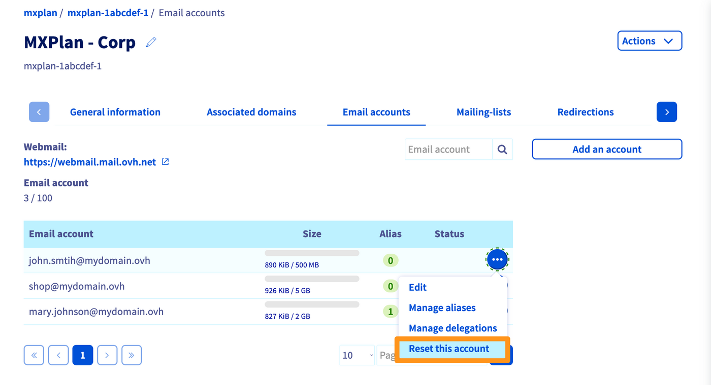

**Last updated 27th January 2023**

## Objective

You want to:

- Delete an email account you no longer use.
- Reset an email account to use it with a new email address.
- Reset an email account in order to cancel it.

**This guide explains how to delete or reset an email account of your email solution.**

## Requirements

- A preconfigured OVHcloud email solution **MX Plan** (available with a [web hosting plan](https://www.ovhcloud.com/en-sg/web-hosting/))
- Access to the [OVHcloud Control Panel](https://ca.ovh.com/auth/?action=gotomanager&from=https://www.ovh.com/sg/&ovhSubsidiary=sg) as the Admin contact of the email service concerned (section `Web Cloud`{.action})

## Instructions 

To check if your MX Plan solution is a legacy version, please refer to the table in the “[Identifying your MX Plan solution](#whichmxplan)” section of this guide.

Open `Emails`{.action} in the side panel, then choose the name of the MX Plan service concerned. Go to the `Email accounts`{.action} tab. The window that appears will display the existing email accounts. Click the <i class="icons-ellipsis icons-border-rounded icons-masterbrand-blue"></i> button to the right of the account you want to modify, then click `Reset this account`{.action}.

{.thumbnail}

## Go further

[Getting started with MX Plan](/pages/web_cloud/email_and_collaborative_solutions/mx_plan/email_generalities)

If you would like assistance using and configuring your OVHcloud solutions, please refer to our [support offers](https://www.ovhcloud.com/en-sg/support-levels/).

Join our community of users on <https://community.ovh.com/en/>.