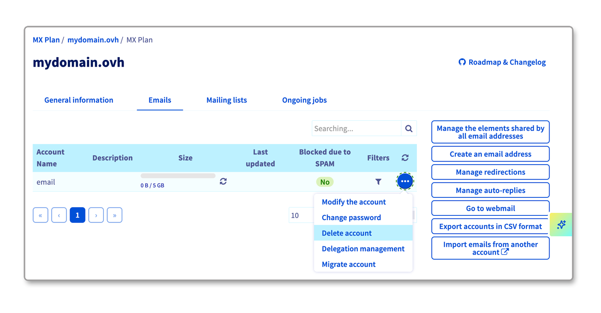
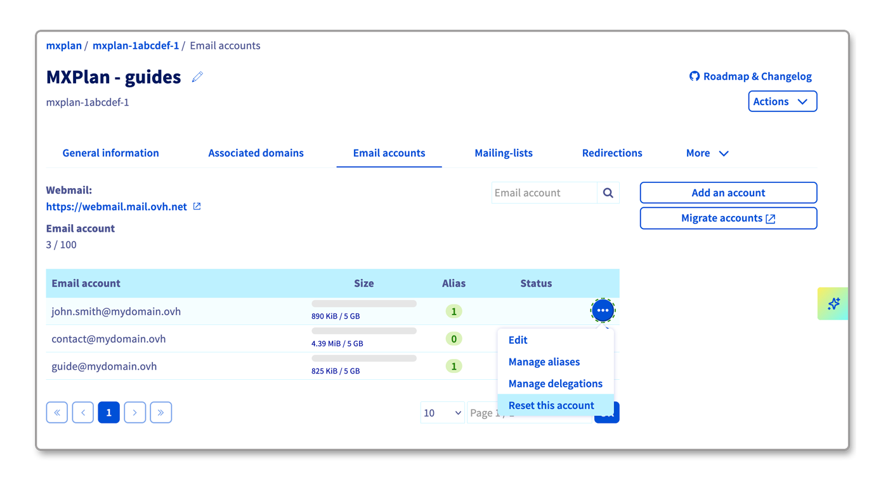
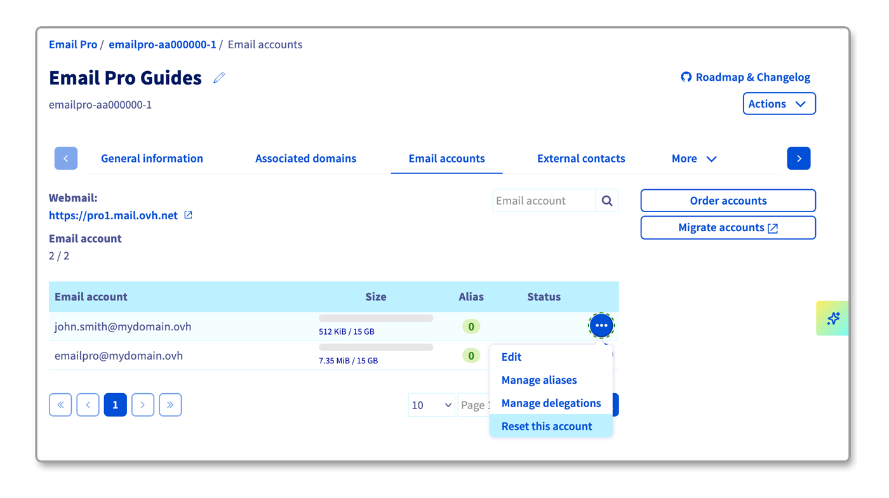
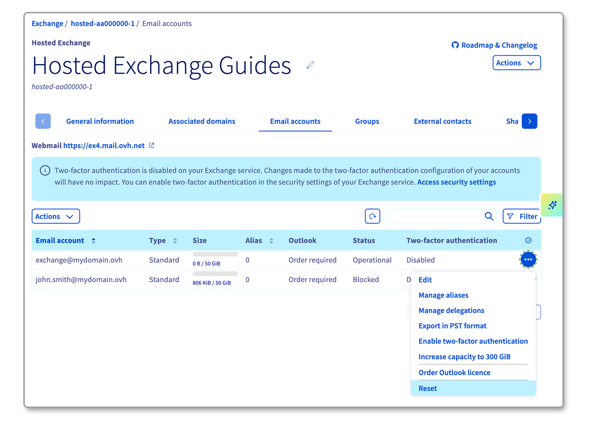
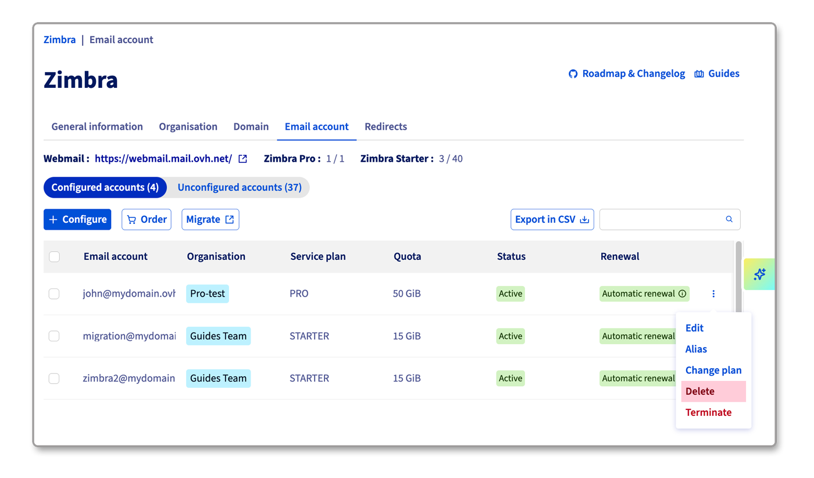

## Objetivo

Deseja:

- Eliminar um endereço de e-mail que já não utiliza. 
- Reinicializar uma conta de e-mail para a utilizar num novo endereço de e-mail. 
- Reinicializar uma conta de e-mail para rescindir a conta.

**Saiba como eliminar ou reinicializar um endereço de e-mail na sua oferta de e-mail**

## Requisitos

- Dispor de uma solução de e-mail OVHcloud previamente configurada:
    - **MX Plan**, proposta entre as nossas [ofertas de alojamento web](/links/web/hosting), incluída num [Alojamento gratuito 100M](/links/web/domains-free-hosting) ou encomendada separadamente como solução autónoma.
    - [**Exchange**](/links/web/emails-exchange).
    - [**E-mail Pro**](/links/web/email-pro).
    - [**Zimbra**](/links/web/zimbra).
- Ser o contacto administrador do serviço de e-mail em questão.
- Ter acesso aos endereços de e-mail pertinentes.

<!-- CP-NAV-START:web-mx-plan -->
<!-- CP-NAV-START:web-zimbra -->
<!-- CP-NAV-START:web-email-pro -->
<!-- CP-NAV-START:web-exchange -->
---

### Acesso à Área de Cliente OVHcloud

**MX Plan:**

- **Ligação direta:** [MX Plan](/links/control-panel/web-mx-plan)
- **Caminho de navegação:** `Web Cloud`{.action} > `MX Plan`{.action} > Selecione o seu serviço MX Plan

**Zimbra:**

- **Ligação direta:** [Zimbra](/links/control-panel/web-zimbra)
- **Caminho de navegação:** `Web Cloud`{.action} > `Zimbra Mail`{.action}

**E-mail Pro:**

- **Ligação direta:** [E-mail Pro](/links/control-panel/web-email-pro)
- **Caminho de navegação:** `Web Cloud`{.action} > `E-mail Pro`{.action} > Selecione a sua plataforma

**Exchange:**

- **Ligação direta:** [Exchange](/links/control-panel/web-exchange)
- **Caminho de navegação:** `Web Cloud`{.action} > `Exchange`{.action} > Selecione a sua plataforma

---
<!-- CP-NAV-END:web-exchange -->
<!-- CP-NAV-END:web-email-pro -->
<!-- CP-NAV-END:web-zimbra -->
<!-- CP-NAV-END:web-mx-plan -->

> [!primary]
>
> **Identificar a tecnologia de e-mail da sua oferta MX Plan.**
>
> Em função da data de ativação da sua oferta MX Plan ou de uma migração recente, a tecnologia de e-mail associada pode diferir. Esta tecnologia é caracterizada pela interface do seu webmail. Para a identificar:
>
> - A partir do separador `Informações gerais`{.action}, registe a tecnologia utilizada sob a menção **Webmail** presente no quadro `Subscrição`{.action}.
>
> {.thumbnail .w-500}

## Prática 

A OVHcloud propõe 4 soluções de e-mail, a noção de eliminação de conta é diferente consoante a sua oferta.

- **E-mail MX Plan**: esta oferta é vendida sob a forma de um pack de várias contas de e-mail. Quando eliminar uma conta, liberta um espaço no seu pack.
- **E-mail Pro**, **Hosted Exchange** e **Zimbra**: estas ofertas estão à la carte, encomenda uma subscrição individual por conta de e-mail. Se deseja eliminar um endereço de e-mail, trata-se de efetuar uma **reinicialização**. Uma vez a conta de e-mail reinicializada, pode reutilizar esta conta para criar um novo endereço de e-mail. Também pode [cancelar a assinatura](/pages/web_cloud/email_and_collaborative_solutions/microsoft_exchange/manage_billing_exchange#eliminar-contas) desta conta se pretender eliminá-la definitivamente.

### Eliminar ou reinicializar uma conta de e-mail

Selecione o separador correspondente à sua oferta de e-mail:

> [!tabs]
> **MX Plan Roundcube**
>>
>> Para identificar a tecnologia de e-mail associada ao seu serviço MX Plan, consulte a parte "[Identificar a tecnologia de e-mail da sua oferta MX Plan](#whichmxplan)" deste guia.
>>
>> 1. Aceda ao separador `Contas de e-mail`{.action}. Na nova janela, podem ver-se as contas de e-mail existentes.
>> 1. Clique no botão `...`{.action} à direita da conta a modificar e, a seguir, em `Eliminar conta`{.action}.
>>
>> {.thumbnail}
>>
> **MX Plan Zimbra/OWA**
>>
>> Para identificar a tecnologia de e-mail associada ao seu serviço MX Plan, consulte a parte "[Identificar a tecnologia de e-mail da sua oferta MX Plan](#whichmxplan)" deste guia.
>>
>> 1. Aceda ao separador `Contas de e-mail`{.action}. Na nova janela, podem ver-se as contas de e-mail existentes.
>> 1. Clique no botão `...`{.action} à direita da conta a modificar e, a seguir, em `Reinicializar esta conta`{.action}.
>>
>> {.thumbnail}
>>
> **E-mail Pro**
>>
>> 1. Aceda ao separador `Contas de e-mail`{.action}. Na nova janela, podem ver-se as contas de e-mail existentes.
>> 1. Clique no botão `...`{.action} à direita da conta a modificar e, a seguir, em `Reinicializar esta conta`{.action}.
>>
>> Após a reinicialização da sua conta, se pretender eliminá-la definitivamente, deverá rescindir a sua conta. Para isso, consulte o nosso guia [Gerir a faturação das contas Email-Pro](/pages/web_cloud/email_and_collaborative_solutions/email_pro/manage_billing_emailpro).
>>
>> {.thumbnail}
>>
> **Exchange**
>>
>> 1. Aceda ao separador `Contas de e-mail`{.action}.
>> 1. Clique no botão `...`{.action} à direita da conta a modificar e, a seguir, em `Reinicializar`{.action}.
>>
>> Após a reinicialização da sua conta, se pretender eliminá-la definitivamente, deverá rescindir a sua conta. Para isso, consulte o nosso guia [Gerir a faturação das contas Exchange](/pages/web_cloud/email_and_collaborative_solutions/microsoft_exchange/manage_billing_exchange).
>>
>> {.thumbnail}
>>
> **Zimbra STARTER/PRO**
>>
>> 1. Aceda ao separador `Conta email`{.action}. Na nova janela, podem ver-se as contas de e-mail existentes.
>> 1. Clique no botão `⋮`{.action} à direita da conta a modificar e, a seguir, clique em `Eliminar`{.action}.
>>
>> {.thumbnail}
>>

## Saiba mais

[Primeiros passos com a solução MX Plan](/pages/web_cloud/email_and_collaborative_solutions/mx_plan/email_generalities)

[Primeiros passos com a solução E-mail Pro](/pages/web_cloud/email_and_collaborative_solutions/email_pro/first_config)

[Primeiros passos com a solução Hosted Exchange](/pages/web_cloud/email_and_collaborative_solutions/microsoft_exchange/exchange_starting_hosted)

[Primeiros passos com Zimbra](/pages/web_cloud/email_and_collaborative_solutions/zimbra/getting_started_zimbra)

[Gerir a faturação das contas E-mail Pro](/pages/web_cloud/email_and_collaborative_solutions/email_pro/manage_billing_emailpro)

[Gerir a faturação das suas contas Exchange](/pages/web_cloud/email_and_collaborative_solutions/microsoft_exchange/manage_billing_exchange)

Se pretender usufruir de uma assistência na utilização e na configuração das suas soluções OVHcloud, consulte as nossas diferentes [ofertas de suporte](/links/support).

Fale com nossa [comunidade de utilizadores](/links/community).
