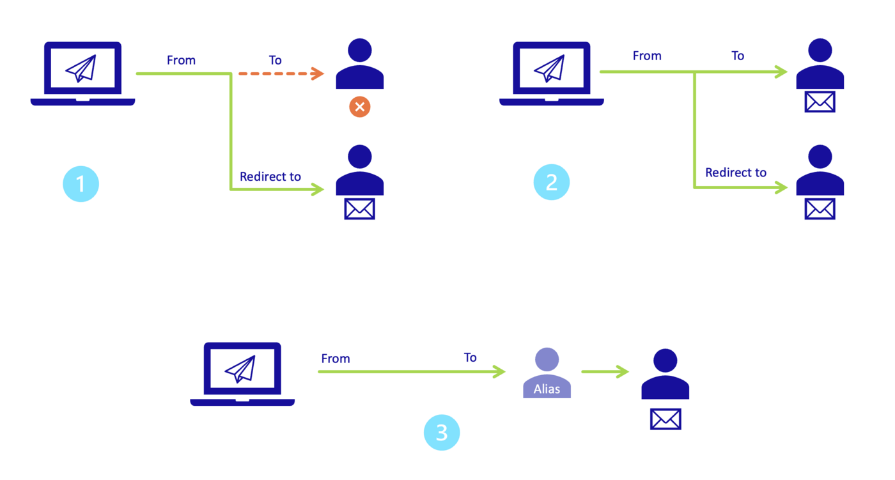
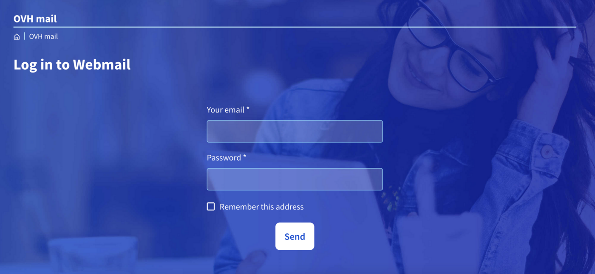
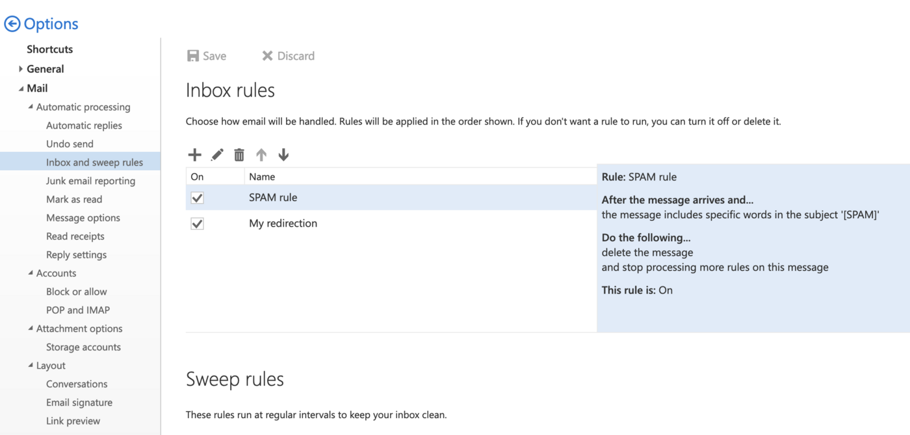
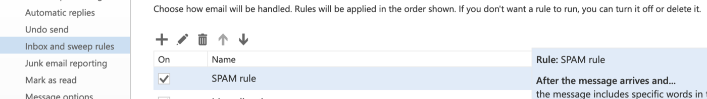
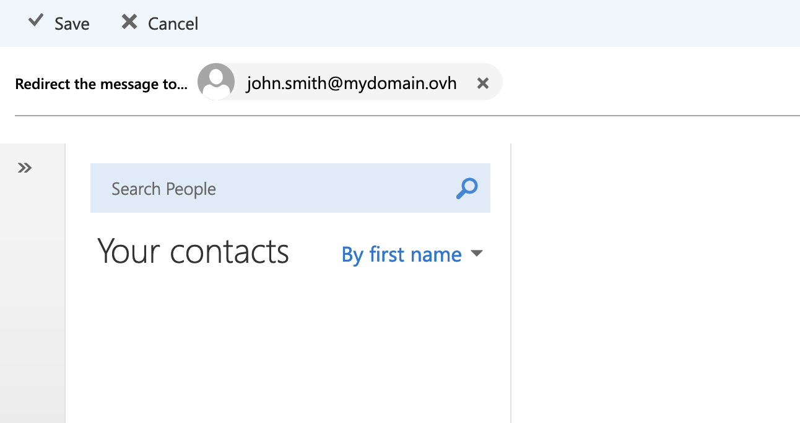
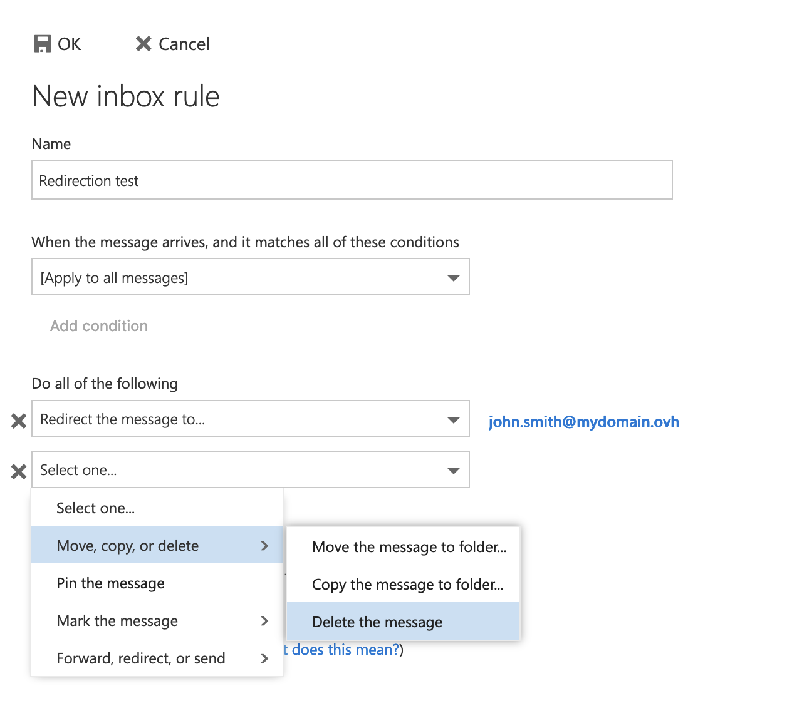
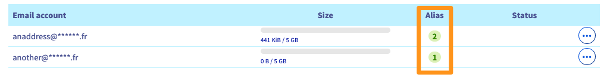
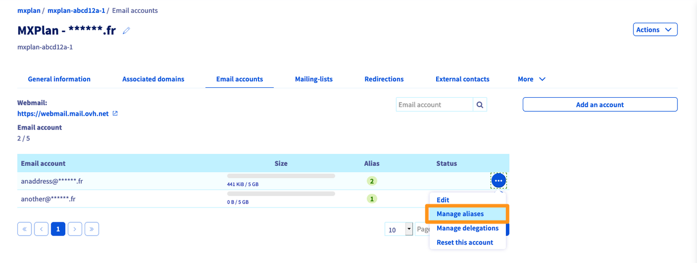
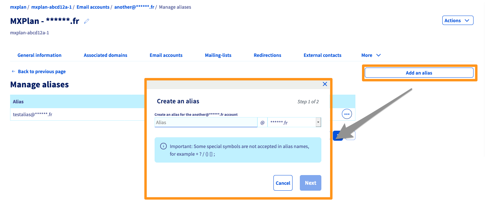
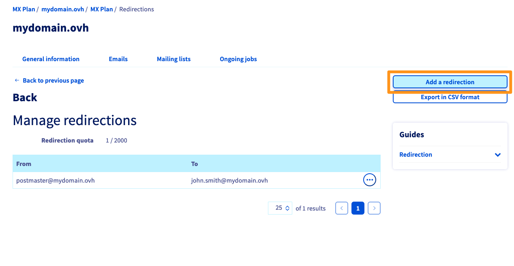

## Objective

In this guide, you will find information and support on how to configure email redirections, such as redirecting emails received from address A to address B.

**This guide explains how to manage aliases and email redirections.**

### What is an email redirection?

You can use redirections to change the routing of an email sent to an email address, forwarding it to one or more other email addresses.

For example, you may want emails sent to **contact@mydomain.ovh** forwarded to **john.smith@otherdomain.ovh**. By doing so, you can automatically send emails received by **contact@mydomain.ovh** to **john.smith@otherdomain.ovh**.

### What is an email alias?

Unlike redirection, an alias address is not an actual email account, but functions as a secondary address for the email account associated with it.

By creating an alias for your email account, you can give your contacts a "masking" address instead of revealing your personal email address to them. An email account can have multiple aliases.

For example, your email address is **john.smith@mydomain.ovh** and your alias is **information@mydomain.ovh**. You can then send your contacts the address **information@mydomain.ovh** and receive emails on **john.smith@mydomain.ovh**, without the sender knowing the address **john.smith@mydomain.ovh**.

### Redirection and alias in comparison 

- **Simple redirection (diagram 1 below)**: The email is sent directly to the redirection email address, the original recipient does not receive the email.

- **Redirection with local copy (diagram 2 below)**: Both the original recipient and the redirection email account will receive the email.

- **Email alias (diagram 3 below)**: The email is sent to the alias address and received by the email account on which the alias has been configured.

{.thumbnail}

> [!primary]
>
> Note that you can configure a redirection to several email addresses.

## Requirements

- A preconfigured OVHcloud email solution **MX Plan** (available with a [web hosting plan](https://www.ovhcloud.com/en-sg/web-hosting/))
- Access to the [OVHcloud Control Panel](https://ca.ovh.com/auth/?action=gotomanager&from=https://www.ovh.com/sg/&ovhSubsidiary=sg)

## Instructions

The sections “[Creating a redirection](#redirect)” and “[Creating an alias](#alias)” concern all OVHcloud email solutions, **unless** if you have a domain name registered with OVHcloud without an attached email solution.

For these exception, please read the paragraph “[Creating a redirection or an alias for a domain name without an email solution](#mxplanlegacy)”.

### Creating a redirection 

Redirections are not managed in the OVHcloud Control Panel, but via the webmail application after logging in to the email account concerned.

Go to the address <https://www.ovhcloud.com/en-sg/mail/>. Enter your **email address** and **password** to log in.

{.thumbnail}

In our example, we are setting up a **redirection with a local copy** (see [diagram 2](#diagram) at the beginning of this guide). If this is what you need, click `OK`{.action} (floppy disk icon) in the top left-hand corner, and the rule will be applied. If you do not want to do this, skip to the next step.

Follow the instruction steps by clicking successively on each tab below:

> [!tabs]
> **Step 1**
>>
>> Once you have logged in to your email account via [webmail](https://www.ovhcloud.com/en-sg/mail/), click on the cogwheel icon in the top right-hand corner, then on `Options`{.action}.  
>> {.thumbnail} 
>>
> **Step 2**
>>
>> From the **Options** window in the left-hand column, go to the **Automatic processing** category in the **Mail** section and click on `Inbox and sweep rules`{.action}.   
>> {.thumbnail}  
>> In this window, you can manage redirections and apply filters to all incoming emails. 
>>
> **Step 3**
>>
>> Once you have opened the window for managing **Inbox rules**, click on the `+`{.action} icon on the top left-hand corner.  
>> {.thumbnail}  
>>
> **Step 4**
>>
>> **Name**: Define the name of your redirection.  
>> **When the message arrives, and it matches all of these conditions**: If your redirection applies to all messages, select `[Apply to all messages]`{.action}.  
>>{.thumbnail .w-640}  
>>
> **Step 5**
>>
>> **Do all of the following**: This is where you apply the redirection. Select `Forward, redirect or send`{.action}, then `Redirect the message to...`{.action}.  
>>{.thumbnail .w-640}  
>>
> **Step 6**
>>
>> Type the address you want to redirect the email to in the field **Redirect the message to...**, then click `Save`{.action}. Finally, click `OK`{.action} (floppy disk icon) to create your redirection.  
>>{.thumbnail .w-640}  
>>

> [!primary]
>
> To apply a **simple redirection** (see [diagram 1](#diagram) at the beginning of this guide), add an additional rule to your **redirection with a local copy** in this window. Click `Add action`{.action} (box 1), then `Move, copy, or delete`{.action}, and then click `Delete the message`{.action}. This rule moves the email into the trash folder after it has been forwarded to the redirection email address.  
> {.thumbnail .w-640}

### Creating an alias 

Log in to the [OVHcloud Control Panel](https://ca.ovh.com/auth/?action=gotomanager&from=https://www.ovh.com/sg/&ovhSubsidiary=sg) and go to the `Web Cloud` section. Navigate to your email solution. Open `Emails`{.action}, select the platform concerned, and click on the `Email accounts`{.action} tab.

To add an alias to your email account, follow the instruction steps by clicking successively on each tab below:

> [!tabs]
> **Step 1**
>>
>> In the table that appears, you will see an `Alias` column.  
>> {.thumbnail} 
>>
> **Step 2**
>>
>> Click the `...`{.action} button, then click `Configure aliases`{.action} (or `Manage aliases`{.action}).  
>> {.thumbnail} 
>>
> **Step 3**
>>
>> Click `Add Alias`{.action} and enter the address you have chosen for your alias and confirm your choice.  
>> {.thumbnail} 

#### Deleting an alias

In the `Email accounts`{.action} tab, click on the `...`{.action} button to the right of the email accounts concerned. Then click `Configure aliases`{.action} (or `Manage aliases`{.action}).

Click on the button `...`{.action} in the row of the alias in question and select `Delete alias`{.action}.

{.thumbnail}

#### Creating a redirection or an alias for a domain name without an email solution 

Log in to the [OVHcloud Control Panel](https://ca.ovh.com/auth/?action=gotomanager&from=https://www.ovh.com/sg/&ovhSubsidiary=sg) and open `Emails`{.action} in the `Web Cloud` section.

The method for creating an alias or redirection is the same. Follow the instruction steps by clicking successively on each tab below:

> [!tabs]
> **Step 1**
>>
>> After selecting your service, you will be on the `General information`{.action} tab. Click on the `Emails`{.action} tab, then `Manage redirections`{.action} on the right-hand side.  
>> {.thumbnail} 
>>
> **Step 2**
>>
>> The table showing active redirections will appear. Click on the button `Add a redirection`{.action} to the right.  
>> {.thumbnail} 
>>
> **Step 3**
>>
>> **From the address**: Enter the email address from which you want to forward emails.  
>> **To the address**: Enter the destination address for your redirection. This can be one of your OVHcloud email addresses, or an external email address.  
>> **Select a copy format**: Choose whether you want to:   - **Keep a copy of the email at OVHcloud** (receive the email on your primary email account and redirection email account)  *cf. the [diagram 2](#diagram) at the beginning of this guide.*   - **Do not store a copy of the email** (forward directly to the redirection email address without the primary email account receiving it)   *cf. the [diagram 1](#diagram) at the beginning of this guide.*  
>> Then click `Confirm`{.action} to add this redirection.  
>> {.thumbnail}

> [!primary]
>
> When you choose “**Keep a copy of the email at OVHcloud**”, a redirection of the email address to itself is automatically created in the redirection list. This creates the local copies of emails.

## Go further

Join our community of users on <https://community.ovh.com/en/>.