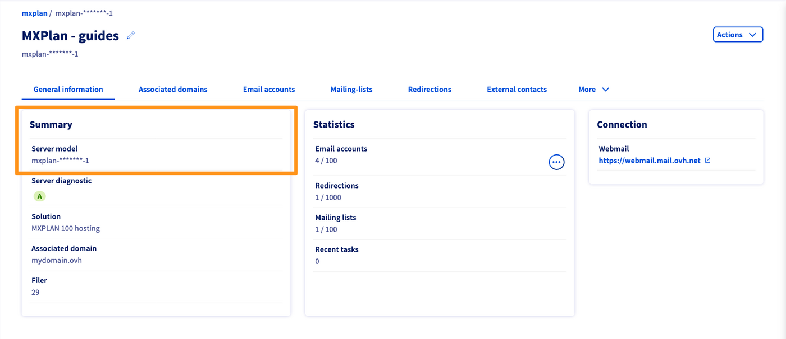

> [!primary]
> Esta tradução foi automaticamente gerada pelo nosso parceiro SYSTRAN. Em certos casos, poderão ocorrer formulações imprecisas, como por exemplo nomes de botões ou detalhes técnicos. Recomendamos que consulte a versão inglesa ou francesa do manual, caso tenha alguma dúvida. Se nos quiser ajudar a melhorar esta tradução, clique em "Contribuir" nesta página.
>

**Última atualização: 01/02/2023**

## Objetivo

Neste guia encontrará diferentes informações e ajudas relativas à configuração dos seus reencaminhamentos e alias de e-mail, por exemplo para enviar e-mails recebidos num endereço A para um endereço B.

**Saiba como gerir os seus alias e reencaminhamentos de e-mail.**

### O que é um reencaminhamento de e-mail?

Um reencaminhamento permite modificar o trajeto inicial de um e-mail para um ou vários outros endereços de e-mail.

Por exemplo, ao enviar um e-mail para **contact@mydomain.ovh**, este deverá ser igualmente enviado para **john.smith@otherdomain.ovh**. Isto permite transmitir automaticamente um e-mail destinado a **contact@mydomain.ovh** para **john.smith@otherdomain.ovh**.

### O que é um alias de e-mail?

Contrariamente ao reencaminhamento, o endereço de e-mail associado ao alias não é um endereço que se possa consultar, trata-se de uma "máscara".

Criar um alias para o seu endereço de e-mail permite-lhe comunicar um endereço "máscara" aos seus contactos, sem ter de comunicar o seu endereço de e-mail pessoal ao remetente. Um endereço de e-mail pode ter vários alias.

Por exemplo, o seu endereço de e-mail é **john.smith@mydomain.ovh** e o seu alias **information@mydomain.ovh**. Pode então comunicar aos seus contactos o endereço **information@mydomain.ovh** e receber os seus e-mails em **john.smith@mydomain.ovh**, sem que o remetente tenha conhecimento de **john.smith@mydomain.ovh**.

### Reencaminhamento e alias em imagem 

- **O reencaminhamento simples (esquema n°1 abaixo)**: o e-mail é enviado diretamente para o endereço de reencaminhamento. o destinatário inicial não recebe o e-mail.

- **O reencaminhamento com cópia local (esquema n°2 abaixo)**: o e-mail é enviado ao destinatário inicial e ao endereço de reencaminhamento.

- **O alias de e-mail (esquema n°3 abaixo)**: o e-mail é enviado ao alias que o devolve ao destinatário no qual o alias foi configurado.

{.thumbnail}

> [!primary]
>
> Tenha em conta que é possível configurar um reencaminhamento para vários endereços de e-mail.

## Requisitos

- Ter acesso à [Área de Cliente OVHcloud](https://www.ovh.com/auth/?action=gotomanager&from=https://www.ovh.pt/&ovhSubsidiary=pt).
- Dispor de uma solução de e-mail OVHcloud previamente configurada (**MX Plan**, proposta entre as nossas [ofertas de alojamento web](https://www.ovhcloud.com/pt/web-hosting/), incluída num [Alojamento gratuito 100M](https://www.ovhcloud.com/pt/domains/free-web-hosting/) ou encomendada separadamente como solução autónoma, como o [Hosted Exchange](https://www.ovhcloud.com/pt/emails/hosted-exchange/) ou o [Email Pro](https://www.ovhcloud.com/pt/emails/email-pro/)).

## Instruções

Os capítulos "[criar um reencaminhamento](#redirect)" e "[criar um alias](#alias)" abrangem todas as nossas ofertas de e-mail OVHcloud, **exceto se**:

- Se possui a versão histórica da oferta MXplan (para o verificar, pode consultar o quadro abaixo).
- possui um domínio registado na OVHcloud sem uma oferta de e-mail associada.

Para estas duas exceções, consulte diretamente o capítulo "[Criar um reencaminhamento ou um alias numa oferta MX Plan histórica ou num domínio sem oferta de e-mail](#mxplanlegacy)".

>
> Consoante a data de ativação da sua oferta MXplan ou se [esta foi migrada recentemente](https://www.ovhcloud.com/pt/web-hosting/mxplan-migration/), é possível que disponha da versão histórica ou da nova versão da oferta. Antes de prosseguir, deve identificar esta última.  
>
>
> Para isso, aceda à [Área de Cliente OVHcloud](https://www.ovh.com/auth/?action=gotomanager&from=https://www.ovh.pt/&ovhSubsidiary=pt), na parte `Web Cloud`{.action}. Clique em `Emails`{.action} e escolha o nome do serviço MX Plan em causa. Continue a ler em função da versão que possui: 
>
> |Versão antiga da oferta MX Plan|Nova versão da oferta MX Plan|
> |---|---|
> |{.thumbnail}  Consulte o tipo de oferta na secção «Subscrição».|{.thumbnail} Consulte a `Referência do servidor` na secção «Resumo».|
> |Consulte a secção "[Versão antiga da oferta MX Plan](#mxplanlegacy)".|Continue a ler a [Criar um reencaminhamento](#redirect) ou [Criar um alias](#alias)|

### Criar um reencaminhamento 

A gestão dos reencaminhamentos faz-se não através da Área de Cliente, mas diretamente através do webmail do endereço de e-mail em questão.

Vá ao endereço <https://www.ovhcloud.com/pt/mail/>. Introduza o **endereço de e-mail** e a **palavra-passe**.

{.thumbnail}

Neste exemplo, trata-se de um **reencaminhamento com cópia local** (ver o [esquema 2](#diagram) no início deste guia). Se é o que deseja, clique em `OK`{.action} (ícone de disquete em cima, à esquerda) para a regra ser aplicada. Caso contrário, siga as instruções seguintes.

Siga os passos descritos clicando sucessivamente em cada separador abaixo:

> [!tabs]
> **Etapa 1**
>>
>> Uma vez ligado ao seu endereço de e-mail através de [webmail](https://www.ovhcloud.com/pt/mail/), clique na roda dentada no canto superior direito e, a seguir, em `opções`{.action}.  
>> {.thumbnail} 
>>
> **Etapa 2**
>> Na janela **Opções**, na coluna da esquerda, selecione a categoria **Tratamento automático** da secção **Correio** e clique em `Regras da caixa de receção e de arrumação`{.action}.   
>> {.thumbnail}  
>> Esta janela permite gerir os seus reencaminhamentos, mas também aplicar filtros ao conjunto dos e-mails recebidos. 
>>
> **Etapa 3**
>>
>> Na janela de gestão das **Regras da caixa de receção**, clique no ícone `+`{.action}, em cima, à esquerda.  
>> {.thumbnail}  
>>
> **Etapa 4**
>>
>> **Nome**: defina o nome do seu reencaminhamento.  
>> **Quando a mensagem chega e preenche todas estas condições**: se o reencaminhamento se aplicar a todas as mensagens, selecione `[Aplicar a todas as mensagens]`{.action}.  
>>{.thumbnail .w-640}  
>>
> **Etapa 5**
>>
>> **Efetuar todas as seguintes** operações: é aqui que aplica o reencaminhamento, selecione `Transferir, reencaminhar ou enviar`{.action} e, a seguir, `Reencaminhar o e-mail para...`{.action}.  
>>{.thumbnail .w-640}  
>>
> **Etapa 6**
>>
>> De seguida, introduza o endereço para o qual deseja reencaminhar o e-mail para "**Reencaminhar o e-mail para...**" e clique em `Guardar`{.action}. Finalmente, clique em `OK`{.action} (ícone de disquete) para finalizar o seu reencaminhamento.  
>>{.thumbnail .w-640}  
>>

> [!primary]
> Para aplicar um **reencaminhamento simples** (ver [esquema 1](#diagram) no início deste manual), adicione uma regra suplementar ao seu **reencaminhamento com cópia local** a partir desta janela. Clique em `Adicionar uma ação`{.action} (quadro 1), depois em `Migrar, copiar ou suprimir`{.action} e, por fim, clique em `suprimir a mensagem`{.action}. Esta regra envia os e-mails diretamente para o lixo depois de ter reencaminhado as mensagens para o endereço final.  
> {.thumbnail .w-640}

### Criar um alias 

Aceda à [Área de Cliente OVHcloud](https://www.ovh.com/auth/?action=gotomanager&from=https://www.ovh.pt/&ovhSubsidiary=pt) e dirija-se à secção `Web Cloud`{.action}. De seguida, selecione o menu em função da sua oferta de e-mail:

- **Exchange**: na `Microsoft`{.action}, depois em `Exchange`{.action} e selecione a plataforma em causa. Clique no separador `Contas de e-mail`{.action}.

- **E-mail Pro**: No `E-mail Pro`{.action}, selecione a plataforma em causa e clique no separador `Contas de e-mail`{.action}.

- **E-mails** (MXplan): em `E-mails`{.action}, selecione a plataforma em causa e clique no separador `Contas de e-mail`{.action}.

Para adicionar um alias à sua conta de e-mail, siga os passos descritos clicando sucessivamente em cada separador abaixo:

> [!tabs]
> **Etapa 1**
>>
>> Na tabela que aparece, encontrará uma coluna `Alias`.  
>> {.thumbnail} 
>>
> **Etapa 2**
>>
>> Clique no botão `...`{.action} e em `Configurar os alias`{.action} (ou `Gerir os alias`{.action}).  
>> {.thumbnail} 
>>
> **Etapa 3**
>>
>> Clique em `Adicionar um alias`{.action} e introduza o endereço que escolheu para o seu alias e valide a sua escolha.  
>> {.thumbnail} 

#### Eliminar um alias

No separador `Contas de e-mail`{.action}, clique no botão `...`{.action} à direita do endereço de e-mail em questão. De seguida, clique em `Configurar os alias`{.action} (ou `Gerir os alias`{.action}).

Clique no botão `...`{.action} à direita do alias em causa, no menu de gestão dos alias. Finalmente, clique em `Eliminar o alias`{.action}

{.thumbnail}

#### Criar um reencaminhamento ou um alias numa oferta MX Plan histórica ou num nome de domínio sem oferta de e-mail 

Aceda à Área de [Cliente OVHcloud](https://www.ovh.com/auth/?action=gotomanager&from=https://www.ovh.pt/&ovhSubsidiary=pt) e dirija-se à secção `Web Cloud`. Dirija-se à secção `Emails`{.action}:

O método para criar um alias ou um reencaminhamento é estritamente o mesmo. Siga os passos descritos clicando sucessivamente em cada separador abaixo:

> [!tabs]
> **Etapa 1**
>> Por defeito, aparecerá o separador `Informações gerais`{.action} do seu MX Plan. Clique no separador `E-mails`{.action} e, a seguir, no botão `Gestão dos reencaminhamentos`{.action}, à direita.  
>> {.thumbnail} 
>>
> **Etapa 2**
>>
>> Aparecerá o quadro dos reencaminhamentos ativos. À direita, clique no botão `Adicionar um reencaminhamento`{.action}.  
>> {.thumbnail} 
>>
> **Etapa 3**
>>
>> **Do endereço**: indique aqui o endereço de e-mail que pretende reencaminhar.  
>> **Para o endereço**: indique aqui o endereço de destino do seu reencaminhamento. Pode ser um dos seus endereços de e-mail OVHcloud ou um endereço de e-mail externo.  
>> **Escolha um modo de cópia**: escolha se deseja:   - **Conservar uma cópia do e-mail na OVHcloud** (receber o e-mail no seu endereço principal bem como o endereço de reencaminhamento)  *cf. o [esquema 2](#diagram) no início deste guia.*   - **Não conservar uma cópia do e-mail** (reencaminhar diretamente para o endereço de reencaminhamento sem que o endereço principal o receba)   *cf. o [esquema 1](#diagram) no início deste guia.*  
>> De seguida, clique em `Validar`{.action} para confirmar o novo reencaminhamento. 
>>
>> {.thumbnail}

> [!primary]
> Quando escolhe o modo de cópia "**Conservar uma cópia do e-mail na OVHcloud**", um reencaminhamento do endereço de e-mail para si próprio é automaticamente criado na lista dos reencaminhamentos, materializa esta cópia local.
> 

## Quer saber mais?

Fale com a nossa comunidade de utilizadores em <https://community.ovh.com/en/>.