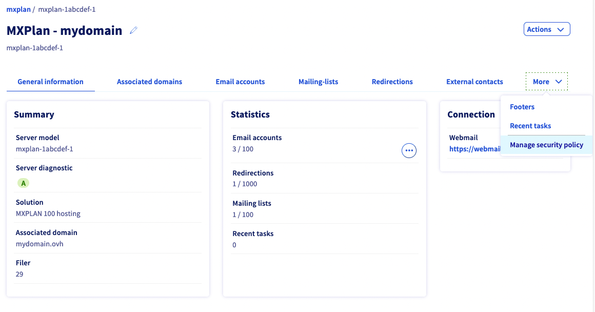

## Objective

With OVHcloud email services, you can set up professional email addresses. To maintain this environment, you can manage the global security settings for your email accounts.

**Find out how to manage the security policy of your E-mail service.**

## Requirements

- A preconfigured OVHcloud email solution **MX Plan** (available with a [web hosting plan](https://www.ovhcloud.com/asia/web-hosting/)
- Access to the [OVHcloud Control Panel](https://ca.ovh.com/auth/?action=gotomanager&from=https://www.ovh.com/asia/&ovhSubsidiary=asia)

## Instructions

The security policy management of your E-mail service has 2 aspects:

- enhancing E-mail account security when users try to log in
- adding complexity to the security of your E-mail service account passwords

Click on `Emails`{.action} , then click on the solution you want to manage. Click on the `More` tab, then on `Manage security policy`{.action}.

{.external}

{.external}

Continue to the aspect(s) you want to modify.

- [Enhance connection security](#enhanced-security): Define whether accounts should lock after a number of unsuccessful log-in attempts.
- [Add complexity to the security of passwords](#password-complexity): Define a complexity requirement, as well as rules for changing passwords.

### Enhance connection security 

This allows you to define whether E-mail accounts should lock after a number of unsuccessful log-in attempts.

To do this, complete the information below:

- **Lockout threshold**: Set the number of unsuccessful log-in attempts before the account locks. Enter "0" to not apply a lockout threshold.
- **Lockout counter reset time**: This field will only appear if a lockout threshold has been set. Specify the time in minutes it takes for the failed connection attempt counter to reset.
- **Account lockout duration**: This field will only appear if a lockout threshold has been set. Specify the time period in minutes during which the E-mail account will remain locked if the lockout threshold has been reached.

Once this information has been entered, you can immediately validate these changes by clicking on `Next`{.action}, then `Confirm`{.action}. You can then continue to the next part.

### Add complexity to the security of passwords 

This allows you to define a complexity requirement, as well as rules for changing passwords.

To do this, complete the information below:

- **Complexity requirements**: Allows user to set rules regarding the complexity of passwords:  not contain all or part of the user’s account name  be at least 6 characters long  contain uppercase and lowercase letters, non-alphabetic characters (! or $ for example), and numbers
- **Prevent password change**: Allows to enforce a minimum lifetime for your E-mail accounts’ passwords. This means that users will have to wait a certain number of days before they can change their passwords.
- **Maximum password duration**: Allows to enforce a maximum lifetime for your E-mail accounts’ passwords. This means that users will be forced to change their passwords once this time limit is reached.
- **Keep password history**: This field will only appear if a maximum lifetime has been set. Specify whether previous passwords can be reused again, and if so, for how long.
- **Minimum password length**: Allows to set a minimum size for password length when a user wants to change it.

Once this information has been entered, you can immediately validate these changes by clicking on `Next`{.action}, then `Confirm`{.action}. You can then continue to the next part.

## Go further

Join our community of users on <https://community.ovh.com/en/>.
