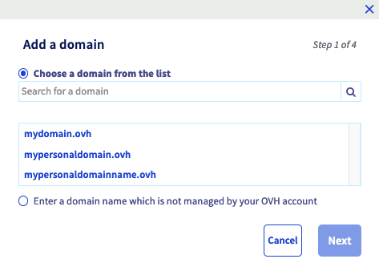
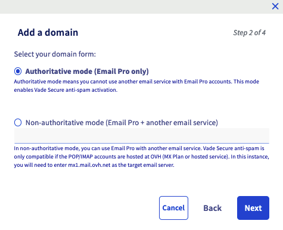
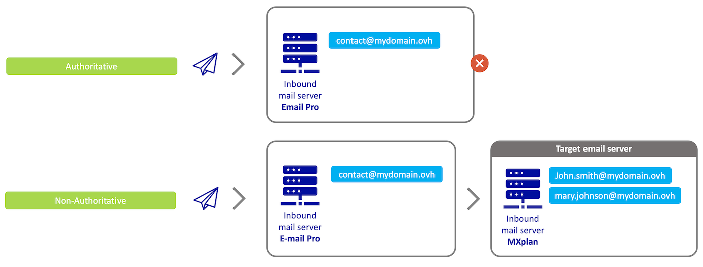
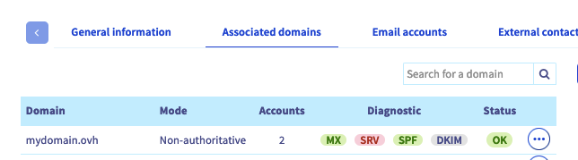
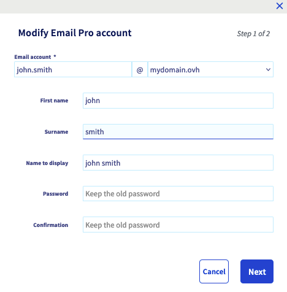

> [!primary]
> Tłumaczenie zostało wygenerowane automatycznie przez system naszego partnera SYSTRAN. W niektórych przypadkach mogą wystąpić nieprecyzyjne sformułowania, na przykład w tłumaczeniu nazw przycisków lub szczegółów technicznych. W przypadku jakichkolwiek wątpliwości zalecamy zapoznanie się z angielską/francuską wersją przewodnika. Jeśli chcesz przyczynić się do ulepszenia tłumaczenia, kliknij przycisk “Zgłoś propozycję modyfikacji” na tej stronie.
>

## Wprowadzenie

Właśnie zakupiłeś usługę E-mail Pro. Umożliwia ona korzystanie z profesjonalnych kont e-mail w najlepszej cenie pozwalającej na prowadzenie bieżącej działalności lub rozpoczęcie nowej.

**Dowiedz się, jak przeprowadzić konfigurację usługi E-mail Pro.**

## Wymagania początkowe

- Wykupienie usługi [E-mail Pro](/links/web/email-pro){.external}
- Otrzymanie wiadomości e-mail z potwierdzeniem, że usługa E-mail Pro została zainstalowana
- Zarejestrowana domena.
- Dostęp do [panelu klienta OVHcloud](/links/manager){.external}.

## W praktyce

### Etap 1: logowanie do usługi E-mail Pro

Po utworzeniu i udostępnieniu usługi E-mail Pro, można nią zarządzać poprzez [Panel klienta OVHcloud](/links/manager){.external}.Zaloguj się do Panelu klienta, kliknij E-mail Pro, następnie wybierz odpowiednią usługę.

> [!primary]
>
> Nazwa usługi E-mail Pro w Panelu klienta OVHcloud zaczyna się od *emailpro-*, następnie zawiera część Twojego identyfikatora klienta i kończy się cyfrą (1 dla pierwszej zainstalowanej usługi E-mail Pro, 2 dla drugiej etc.).
>

### Etap 2: dodanie domeny

Po zamówieniu usługi E-mail Pro automatycznie wyświetli się okno, w którym zostaniesz poproszony o `Dodanie domeny`{.action}. Jeśli okno się nie wyświetla, przejdź do karty `Powiązane domeny`{.action}, następnie kliknij przycisk `Dodaj domenę`{.action}.

Masz do wyboru dwie opcje:

- **Wybierz domenę z listy** : wyświetlają się tylko nazwy domen, którymi zarządzasz w Panelu klienta OVHcloud. Jeśli domena jest zarejestrowana w OVHcloud, ale nie wyświetla się w Panelu klienta, dodaj ją z opcją "Wpisz domenę, która nie jest zarządzana na Twoim koncie OVHcloud"
- **Wpisz domenę, która nie jest zarządzana na Twoim koncie OVHcloud** : wybierz tę opcję, jeśli domena jest zarejestrowana w OVHcloud, ale można ją skonfigurować w innym Panelu klienta OVHcloud **lub** jeśli domena jest zarejestrowana u innego operatora. Aby usługa E-mail Pro działała poprawnie, musisz mieć możliwość modyfikacji konfiguracji domeny (jej strefy DNS).

Po wybraniu opcji kliknij `Dalej`{.action}.

{.thumbnail}

Okno wyświetla teraz informacje dotyczące konfiguracji trybów. 

{.thumbnail}

- **Jeśli podałeś nazwę domeny nieobsługiwanej przez OVHcloud** : zostanie domyślnie skonfigurowany tryb nieautorytatywny.

- **Jeśli wybrałeś z listy nazwę domeny obsługiwaną przez OVHcloud**, musisz wybrać jeden z trybów.
    - **Autorytatywny**: Odpowiedni, jeśli usługa E-mail Pro jest jedynym rozwiązaniem poczty elektronicznej, którego używasz z nazwą domeny. Nie pozwala na korzystanie z innego rozwiązania poczty elektronicznej w połączeniu z Twoją usługą.
    - **Nieautorytatywny**: Odpowiedni, jeśli do obsługi Twojej domeny używasz usługi E-mail Pro **oraz innego rozwiązania poczty elektronicznej**.

> **Rozumienie trybów autorytatywnych i nieautorytatywnych**
>
> - Gdy wiadomość e-mail jest przesyłana do platformy E-mail Pro (*Inbound mail server Email Pro*) w trybie **autorytatywnym**, wszystkie adresy e-mail przypisane do Twojej domeny są hostowane tylko na tej platformie.     Na przykład, jeśli wyślemy wiadomość e-mail na adres "*mary.johnson@mydomain.ovh*", serwer E-mail Pro "*Inbound mail server Email Pro*" zwróci nadawcy wiadomość o niepowodzeniu, ponieważ ten adres nie istnieje na serwerze E-mail Pro "*Inbound mail server Email Pro*".
> - Gdy wiadomość e-mail jest wysyłana do platformy e-mail E-mail Pro (*Inbound mail server Email Pro*) w trybie **nieautorytatywnym**, oznacza to, że adresy e-mail Twojej domeny są rozdzielone między Twoją główną platformę e-mail (*Inbound mail server Email Pro*) i inną usługę e-mail (*Inbound mail server MXplan*).     Na przykład jeśli wyślemy wiadomość e-mail na adres "*mary.johnson@mydomain.ovh*", serwer E-mail Pro *Inbound mail server Email Pro* prześle wiadomość e-mail do serwera MXplan "*Inbound mail server MXplan*", aby serwer mógł ją dostarczyć.
>
> {.thumbnail}
>

> [!warning]
>
> Jeśli podczas dodawania domeny do platformy e-mail otrzymasz komunikat "**authoritative domain detected**", oznacza to, że domena ta jest zadeklarowana w trybie **autorytatywnym** na innej platformie e-mail. Aby obydwie platformy mogły działać jednocześnie, należy dla nich ustawić tryb **nieautorytatywny**.

Jeśli wybierzesz tryb **nieautorytatywny** i będziesz korzystać z usługi:

- **E-mail OVHcloud (Exchange lub MXplan)**, wpisz bezpośrednio jako docelowy serwer e-mail "*mx1.mail.ovh.net*" (działa w ten sam sposób z *mx0.mail.ovh.net*, *mx2.mail.ovh.net*, *mx3.mail.ovh.net*, *mx4.mail.ovh.net* ).
- **E-mail zewnętrzny względem OVHcloud (konkurencyjna oferta e-mail, prywatny serwer e-mail)** wprowadź w polu Serwer docelowy nazwę hosta serwera poczty przychodzącej dla tej usługi zewnętrznej, upewniając się, że zezwala ona na zapytania e-mail pochodzące z Twojej usługi E-mail Pro

Wybór trybu nie jest ostateczny i możesz zmienić go po zalogowaniu się do Panelu klienta OVHcloud.

Kliknij przycisk `Dalej`{.action}, aby kontynuować proces dodawania domeny.

**Jeśli wybrałeś z listy nazwę domeny obsługiwaną przez OVHcloud**, jej konfiguracja może zostać przeprowadzona automatycznie. W celu przeprowadzenia automatycznej konfiguracji, zaznacz odpowiednie pola i kliknij `Dalej`{.action}, aby kontynuować proces dodawania domeny.

{.thumbnail}

- **SRV**: rekord DNS umożliwiający automatyczną konfigurację Twojego programu pocztowego podczas dodawania adresu e-mail.
- **MX**: rekord DNS definiujący serwery e-mail, niezbędny do odbierania e-maili w danej domenie.
- **DKIM**: Wdrożenie zaszyfrowanego podpisu cyfrowego w celu zabezpieczenia wymiany e-maili. Więcej informacji zawiera przewodnik "[Poprawa bezpieczeństwa e-maili poprzez rekord DKIM](/pages/web_cloud/domains/dns_zone_dkim)".

**W przypadku domeny, która nie jest zarządzana w OVHcloud**, przejdź do etapu 3.

Przed zakończeniem konfiguracji zweryfikuj wyświetlane informacje, a następnie kliknij przycisk `Zatwierdź`{.action}, aby dodać domenę.

### Etap 3: konfiguracja nazwy domeny

Po dodaniu nazwy domeny jako domeny powiązanej sprawdź jej ustawienia, korzystając z wyświetlającej się tabeli.

W kolumnie `Diagnostyka`{.action} możesz sprawdzić konfigurację DNS domeny. Jeśli parametry powinny zostać zmodyfikowane, wyświetli się czerwony przycisk. Istnieją dwie możliwości:

- **Automatyczna konfiguracja podczas dodawania domeny OVHcloud**: wprowadzona zmiana może pojawić się w [Panelu klienta OVHcloud](/links/manager){.external} dopiero za kilka godzin.

- **Ręczna konfiguracja domeny nieobsługiwanej przez OVHcloud**: kliknij czerwony przycisk, aby wyświetlić listę modyfikacji do wprowadzania.
    - *W przypadku rekordu CNAME*, skorzystaj z naszego przewodnika "[Tworzenie pola CNAME po dodaniu przypisanej domeny](/pages/web_cloud/email_and_collaborative_solutions/microsoft_exchange/exchange_dns_cname)".
    - *W przypadku rekordu MX* zapoznaj się z naszym przewodnikiem "[Dodawanie rekordu MX do konfiguracji domeny](/pages/web_cloud/domains/dns_zone_mx)".
    - *W przypadku rekordu SRV* po kliknięciu czerwonego przycisku uzupełnij strefę DNS o informacje. Możesz zapoznać się z przewodnikiem "[Edycja strefy DNS OVHcloud](/pages/web_cloud/domains/dns_zone_edit)", aby dodać ten rekord.
    - *W przypadku rekordu SPF* uzupełnij strefę DNS o informacje, które są wyświetlane po kliknięciu przycisku. Możesz zapoznać się z przewodnikiem "[Poprawa bezpieczeństwa e-maili poprzez rekord SPF](/pages/web_cloud/domains/dns_zone_spf)", aby dodać ten rekord.
    *W przypadku rekordu DKIM* uzupełnij strefę DNS, używając informacji, które wyświetlają się po kliknięciu przycisku. Możesz zapoznać się z przewodnikiem "[Poprawa bezpieczeństwa e-maili poprzez rekord DKIM](/pages/web_cloud/domains/dns_zone_dkim)", aby dodać ten rekord.

{.thumbnail}

### Etap 4: konfiguracja i korzystanie z kont E-mail Pro

Skonfiguruj konta e-mail w karcie `Konta e-mail`{.action}. Konta, które zamówiłeś wyświetlają się w tabeli w postaci “*@configureme.me*”.

Aby je skonfigurować, kliknij przycisk `...`{.action}, a następnie `Zmień`{.action}.

{.thumbnail}

Teraz uzupełnij kolejne informacje, o które zostaniesz poproszony.

- **Konto e-mail** : wprowadź nazwę, którą wybrałeś dla Twojego konta e-mail (np. imie.nazwisko) i wybierz z listy odpowiednią domenę.

> [!warning]
>
> Wybór nazwy konta e-mail musi spełniać następujące warunki:
>
> - Minimum 2 znaki
> - Maksymalnie 32 znaki
> - Brak znaków akcentowanych
> - Brak znaków specjalnych, z wyjątkiem następujących znaków:`.`,`,`,`-` et`_`

- **Imię** : wpisz imię.
- **Nazwa** : wprowadź nazwę.
- **Nazwa do wyświetlenia** : wprowadź nazwę nadawcy, która ma się wyświetlać podczas wysyłki e-maili z tego adresu.
- **Hasło i potwierdzenie*** : Ustaw hasło składające się z minimum 8 znaków i zawierające co najmniej jedną dużą literę, jedną małą literę i jedną cyfrę. Ze względów bezpieczeństwa zalecamy nie używać dwa razy tego samego hasła. Najlepiej wybrać hasło nie mające żadnego związku z Twoimi danymi osobistymi (należy unikać używania imienia, nazwiska, daty urodzenia, etc.) i regularnie je zmieniać.

> [!warning]
>
> Wybór hasła musi spełniać następujące warunki:
>
> - Minimum 9 znaków
> - Maksymalnie 30 znaków
> - Brak znaków akcentowanych

Po wprowadzeniu informacji, kliknij przycisk `Dalej`{.action}, sprawdź dane, które się wyświetlają, a następnie kliknij `Potwierdź`{.action}, aby rozpocząć konfigurację konta.

> [!primary]
>
> Wykonaj czynności tego etapu tyle razy, ile to konieczne, w zależności od liczby kont, które posiadasz. Możesz zamówić nowe konta, klikając przycisk `Zamówienie kont`{.action}.
>

### Etap 5: korzystanie z kont e-mail

Po skonfigurowaniu Twoich kont możesz zacząć ich używać. W tym celu możesz użyć udostępnionej przez OVHcloud aplikacji online (*webapp*). Aplikacja dostępna jest pod adresem [webmail](/links/web/email). Zaloguj się, wprowadzając dane identyfikacyjne dla Twojego adresu e-mail.

Jeśli pierwszy raz logujesz się do interfejsu OWA webmail przy użyciu tego adresu e-mail, pojawi się monit o ustawienie języka interfejsu i strefy czasowej. Następnie kliknij przycisk `Zapisz`{.action}, aby kontynuować.

> [!primary]
>
> Strefy czasowe są wymienione zgodnie z [uniwersalnym standardem czasowym (UTC)](https://en.wikipedia.org/wiki/Coordinated_Universal_Time#/media/File:World_Time_Zones_Map.png), a nie alfabetycznie według miast.
>
> **Przykład** : Dla Europy Zachodniej jest to UTC +1 (Bruksela, Kopenhaga, Madryt, Paryż).

Aby skonfigurować Twoje konto e-mail w programie pocztowym lub na urządzeniu typu _smartfon_ lub tablet, [skorzystaj z przewodników dotyczących konfiguracji](/products/web-cloud-email-collaborative-solutions-email-pro). Poniżej znajdziesz elementy potrzebne do konfiguracji Twojego konta E-mail Pro:

|Typ serwera|Nazwa serwera|Typ zabezpieczenia|Port|
|---|---|---|---|
|Serwer poczty przychodzącej|pro**?**.mail.ovh.net|SSL/TLS|993|
|Serwer poczty wychodzącej|pro**?**.mail.ovh.net|STARTTLS|587|

> [!primary]
>
> Poniżej stosujemy przykładową nazwę serwera, czyli pro**?**.mail.ovh.net. Należy zastąpić „X” cyfrą wskazującą serwer Twojej usługi E-mail Pro.
> 
> Znajdziesz tę cyfrę w Twoim [Panelu klienta OVHcloud](/links/manager){.external}, przechodząc do sekcji `Web Cloud`{.action}, a następnie do `E-mail Pro`{.action}. Nazwa serwera jest widoczna w ramce **Połączenie** w karcie `Informacje ogólne`{.action}.
> 

## Sprawdź również

[Korzystanie z interfejsu Outlook Web App wraz z kontem Exchange](/pages/web_cloud/email_and_collaborative_solutions/using_the_outlook_web_app_webmail/email_owa)

[Tworzenie reguł skrzynki odbiorczej w aplikacji OWA](/pages/web_cloud/email_and_collaborative_solutions/using_the_outlook_web_app_webmail/creating-inbox-rules-in-owa-mx-plan)

[Dodaj alias do konta e-mail](/pages/web_cloud/email_and_collaborative_solutions/common_email_features/feature_redirections)

[Tworzenie automatycznych podpisów](/pages/web_cloud/email_and_collaborative_solutions/microsoft_exchange/feature_footers)

[Zarządzanie płatnościami za Twoje konta E-mail Pro](/pages/web_cloud/email_and_collaborative_solutions/email_pro/manage_billing_emailpro)

[Zarządzanie polityką bezpieczeństwa usługi e-mail](/pages/web_cloud/email_and_collaborative_solutions/common_email_features/security-policy)

W przypadku wyspecjalizowanych usług (pozycjonowanie, rozwój, etc.) skontaktuj się z [partnerami OVHcloud](/links/partner).

Jeśli chcesz otrzymywać wsparcie w zakresie konfiguracji i użytkowania Twoich rozwiązań OVHcloud, zapoznaj się z naszymi [ofertami pomocy](/links/support).

Dołącz do [grona naszych użytkowników](/links/community).