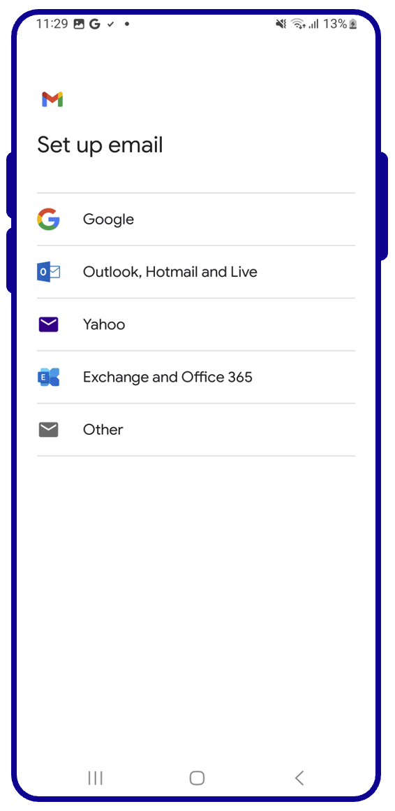
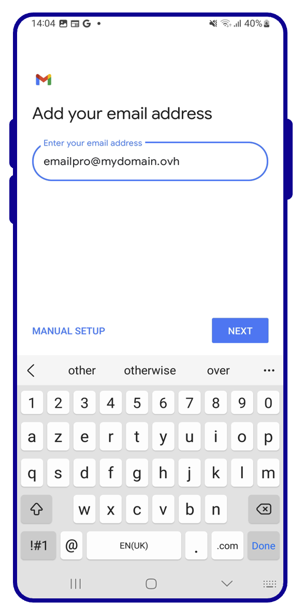
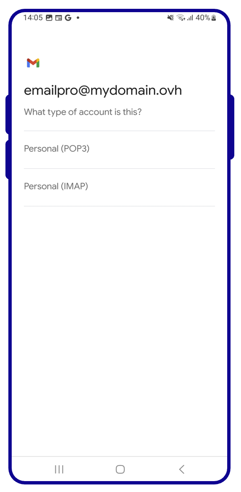
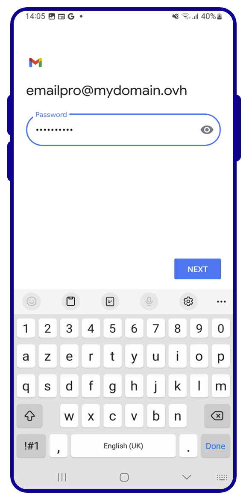
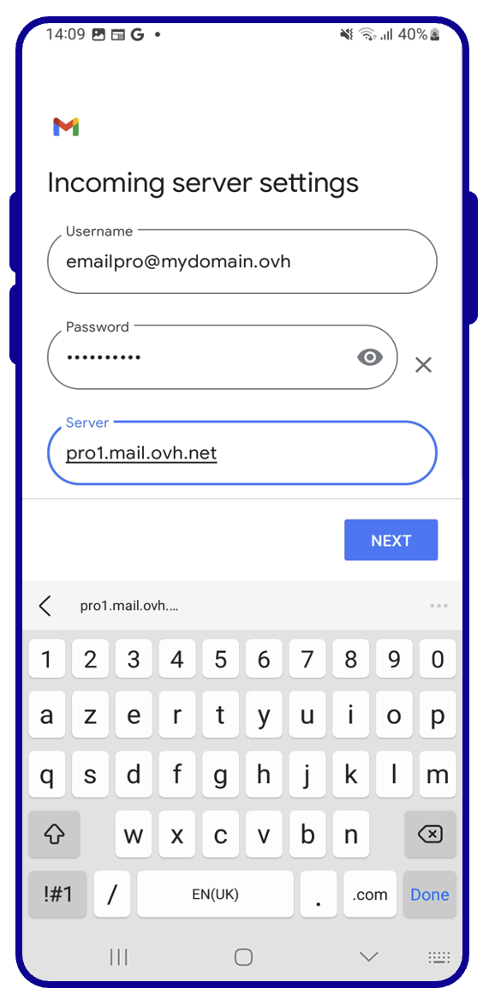
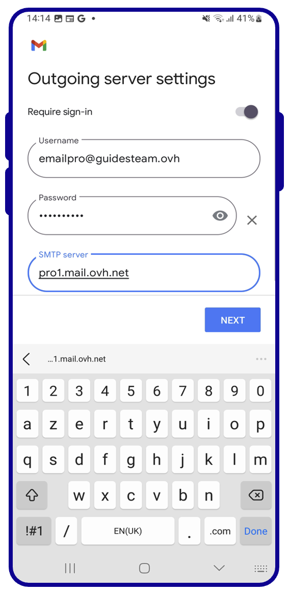
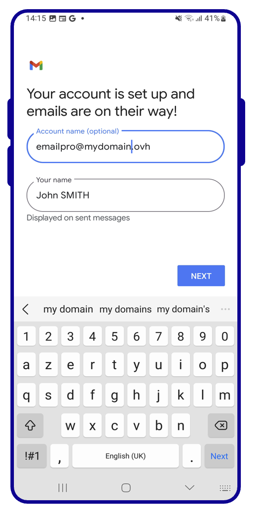

## Objective

You can configure Email Pro accounts on email clients, if they are compatible. By doing so, you can use your email address through your preferred email application.

**Find out how to configure an Email Pro account on Android, via the Gmail app.**

> [!warning]
>
> OVHcloud provides services for which you are responsible with regard to their configuration and management. It is therefore your responsibility to ensure that they function correctly.
> 
> This guide is designed to help you with common tasks. Nevertheless, we recommend contacting a [specialist provider](/links/partner) or the software publisher if you encounter any difficulties. OVHcloud cannot provide you with technical support in this regard. You can find more information in the "Go further" section of this guide.
> 

## Requirements

- You have an [Email Pro](/links/web/email-pro) solution.
- You have the Gmail app installed on your device. You can install the app from the Google Play Store.
- You have the required credentials for the email account you would like to configure.

> [!primary]
>
> This guide was created using a device with Android version 13.

## Instructions

### How to add your email account

> [!primary]
>
> In this guide, we will use as the server name: pro**?**.mail.ovh.net. You will need to replace the "?" with the actual number indicating the appropriate server for your Email Pro service.
> 
> You can find this information in the [OVHcloud Control Panel](/links/manager), in the `Web Cloud`{.action} section, if you select `Professional Email`{.action}. The server name is displayed in the **Connection** box in the `General Information`{.action} tab.
>

On your device's homepage, go to the `Gmail`{.action} app.

{.thumbnail .w-400}

Adding an account will be done differently **if no account has been set up,** or **if an account has already been set up**. Select the tab corresponding to one of these two situations:

> [!tabs]
> **First configuration**
>>
>> Select `Add email address`{.action}  {.thumbnail .h-600}
>>
> **Existing configuration**
>>
>> 1. Go to the menu at the top left of the screen.  
>> 2. Select `Settings`{.action}.  
>> 3. Select `Add account`{.action}.  {.thumbnail .h-600}

Follow the next steps in the configuration process by browsing the tabs below:

> [!tabs]
> **Step 1**
>> From the menu of email account types, select `Other`{.action}.  
>> {.thumbnail .h-600}
>>
> **Step 2**
>> Enter your email address.  
>> {.thumbnail .h-600}
>>
> **Step 3**
>> Select the protocol for receiving emails. It is recommended that you select `Personal (IMAP)`{.action}.  See [more details on POP and IMAP protocols](#popimap) at the end of this guide to understand their differences.  
>>{.thumbnail .h-600}
> **Step 4**
>> Enter the password for your email account.  
>> {.thumbnail .h-600}
>>
> **Step 5**
>>> Enter the "**Incoming server settings**"  - **Username**: Your full email address - **Password**: Your email account password - **Server**: Type pro**?**.mail.ovh.net (replace "**?**" with your server number).   
>>{.thumbnail .h-600}
>>
> **Etape 6**
>> Complete the "**Outgoing Server Settings**"  - **Username**: Your full email address - **Password**: Your email account password - **SMTP Server**: Type pro**?**.mail.ovh.net (replace "**?**" with your server number).   
>>{.thumbnail .h-600}
>>
> **Step 7**
>> Choose how often you want your emails to be synchronised.  
>> {.thumbnail .h-600}
>>
> **Step 8**
>> Determine the display name of your email address in the Gmail application, then press `Next`{.action}.  
>> {.thumbnail .h-600}

Once you have configured your email address, you can start using it! You can now send and receive
messages from your Gmail application.

> [!success]
> 
> OVHcloud offers a web application that allows you to access your email address from a web browser,
> at the address [Webmail](/links/web/email). You can
> log in using your email credentials.

### POP, IMAP and SMTP settings

When you choose your account type, we recommend using **IMAP** to receive emails. However, you can select **POP**. To understand how they work, see our section ["POP or IMAP, what is the difference?"](#popimap)

- **POP configuration**

| Information | Description |
| --- | --- |
| Username | Enter the **full** email address |
| Password | Enter the password for the email address |
| Server | pro**?**.mail.ovh.net (replace "**?**" with your server number) |
| Port | 995 |
| Security type | SSL/TLS |

- **IMAP configuration**

| Information | Description |
| --- | --- |
| Username | Enter the **full** email address |
| Password | Enter the password for the email address |
| Server | pro**?**.mail.ovh.net (replace "**?**" with your server number) |
| Port | 993 |
| Security type | SSL/TLS |

For sending emails, if you need to enter the **SMTP** settings manually in the account preferences,
you will find the settings below to use:

- **SMTP configuration**

| Information | Description |
| --- | --- |
| Username | Enter the **full** email address |
| Password | Enter the password for the email address |
| Server | pro**?**.mail.ovh.net (replace "**?**" with your server number) |
| Port | 587 |
| Security type | STARTTLS |

### POP or IMAP, what's the difference? 

When you set up your email address manually, your email client asks if you want to use **POP** (**P**ost **O**ffice **P**rotocol) or **IMAP** (**I**nternet **M**essage **A**ccess **P**rotocol). To understand this properly, you will need to configure your email address to include POP and IMAP protocols.

When you configure your mail client, you must enter the information from the **incoming server** to receive the emails, and the **outgoing server** to send the emails. To send emails, there is no choice, the **SMTP** (**S**imple **M**ail **T**ransfer **P**rotocol) is used. For the reception, you will have the choice between **POP** or **IMAP**.

{.thumbnail}

To understand the difference between POP and IMAP, we will break down the elements that make up the processing of your incoming emails:

1. **Your device**: A computer, smartphone or tablet.

2. **Your email client**: Software or application dedicated to managing your emails. Your choice will determine the level of usability and functionality you will need to view your emails.

3. **The receiving protocol**: A choice that determines how you check emails on your device. This affects other devices that access the same email account.
    - **IMAP**: Your email client queries the email server and downloads the emails to your device. When you view an unread email, the server marks it as “read” by default. Other devices configured in IMAP will be able to check this status and view this email until it has been deleted on one of the devices.
    - **POP**: Your email client requests the email server and downloads the emails to your device. By default, once the email is downloaded to your device, the message is deleted from the server. As a result, other devices connected to this email address will not be able to view this email.

{.thumbnail}

> [!primary]
>
> This description is a summary, it represents the standard operation of these two protocols. You can configure the POP so that emails are not deleted when you check your emails. The goal here is to describe how these two protocols work natively and avoid any additional steps to match your needs.

## Go further

> [!primary]
>
> For more information on setting up an email address from the Gmail app on Android, see the [Google Help Center](https://support.google.com/mail/answer/21289?hl=en&co=GENIE.Platform%3DAndroid&oco=1#zippy=%2Cadd-an-account).

[Configuring an email address included in an MX Plan or web hosting plan on Android, via the Gmail app](/pages/web_cloud/email_and_collaborative_solutions/mx_plan/how_to_configure_android)

[Configuring an Exchange account on Android via the Gmail app](/pages/web_cloud/email_and_collaborative_solutions/microsoft_exchange/how_to_configure_android)

Join our community of users on <https://community.ovh.com/en/>.
