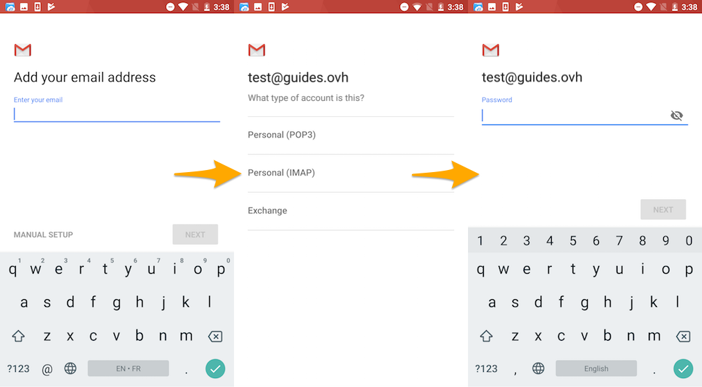
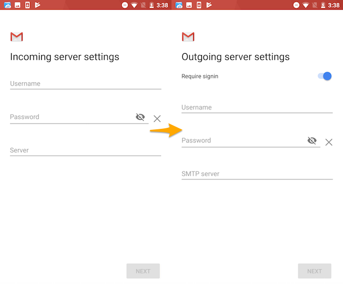

**Ostatnia aktualizacja dnia 2020-04-09**

## Wprowadzenie

Konta E-mail Pro mogą być skonfigurowane w jednym z kompatybilnych programów pocztowych. Dzięki temu możesz używać Twojego konta e-mail, korzystając z wybranej przez Ciebie aplikacji.

**Dowiedz się, jak skonfigurować konto E-mail Pro na urządzeniu z systemem Android przy użyciu aplikacji Gmail.**

> [!warning]
>
> OVHcloud udostępnia różnorodne usługi, jednak ich konfiguracja, zarządzanie oraz utrzymanie należy do Ciebie. Jesteś tym samym odpowiedzialny za ich prawidłowe funkcjonowanie.
> 
> Oddajemy w Twojej ręce niniejszy przewodnik, którego celem jest pomoc w jak najlepszym wykonywaniu bieżących zadań. W przypadku trudności zalecamy skorzystanie z pomocy wyspecjalizowanego webmastera lub kontakt z producentem oprogramowania. Niestety firma OVHcloud nie będzie mogła udzielić wsparcia w tym zakresie. Więcej informacji znajduje się w sekcji „Sprawdź również”.
> 

## Wymagania początkowe

- Wykupienie usługi [E-mail Pro](https://www.ovhcloud.com/pl/emails/email-pro/){.external}
- Instalacja aplikacji Gmail na Twoim urządzeniu (możesz pobrać ją z Google Play Store)
- Dane do logowania do konta e-mail, które chcesz skonfigurować

> [!primary]
>
> Niniejszy przewodnik został stworzony w oparciu o urządzenie Nexus 6 z wersją systemu Android7.1.1. W celu ujednolicenia procedury korzystamy z aplikacji Gmail, którą można pobrać z Play Store. Jeśli wybierzesz inną aplikację, sposób postępowania będzie wyglądał inaczej.
>

## W praktyce

### Etap 1: dodanie konta

> [!primary]
>
> W przewodniku używamy oznaczenia serwera: pro**?**.mail.ovh.net. Zastąp “?” cyfrą oznaczającą serwer powiązany z Twoją usługą E-mail Pro.
> 
> Odszukaj cyfrę w [Panelu klienta OVHcloud](https://www.ovh.com/auth/?action=gotomanager&from=https://www.ovh.pl/&ovhSubsidiary=pl){.external}, w sekcji `Web Cloud`{.action} =>  `E-mail Pro`{.action}. Nazwa serwera jest widoczna w ramce *Logowanie* w zakładce `Informacje ogólne`{.action}.
>

Na ekranie Twojego urządzenia wybierz aplikację `Gmail`{.action}. Dodanie konta może zostać przeprowadzone na dwa różne sposoby:

- **jeśli nie jest skonfigurowane żadne konto**: postępuj zgodnie z instrukcjami etapu powitalnego, następnie kliknij `Dodaj konto e-mail`{.action}. Wybierz `Inne`{.action}; 

- **jeśli inne konto jest już skonfigurowane**: kliknij piktogram w postaci trzech myślników na górze po lewej stronie, a następnie piktogram w postaci strzałki po prawej stronie nazwy skonfigurowanego konta. Następnie kliknij `Dodaj konto`{.action} i wybierz `Inne`{.action}. 

{.thumbnail}

Wpisz hasło dla Twojego konta e-mail, po czym kliknij `Dalej`{.action}.

Na etapie wyboru konta zaznacz **IMAP**, następnie wpisz hasło przypisane do Twojego konta e-mail. Kliknij `Dalej`{.action}, aby kontynuować konfigurację.

{.thumbnail}

Wpisz parametry serwera poczty przychodzącej:

|Informacja|Opis | 
|---|---| 
|Nazwa użytkownika|Wpisz pełny adres e-mail.|
|Hasło|Wpisz hasło przypisane do tego konta e-mail.|
|Serwer|Wpisz serwer « pro**?**.mail.ovh.net ».|

Kliknij `Dalej`{.action}, po czym wpisz parametry serwera poczty wychodzącej:

|Informacja|Opis | 
|---|---| 
|Wymaga rejestracji|Upewnij się, że to pole zostało zaznaczone.|
|Nazwa użytkownika|Wpisz pełny adres e-mail.|
|Hasło|Wpisz hasło przypisane do tego konta e-mail.|
|Serwer SMTP|Wpisz serwer « pro**?**.mail.ovh.net ».|

Następnie kliknij `Dalej`{.action}. Jeśli wpisane informacje są poprawne, logowanie zakończy się sukcesem.

{.thumbnail}

Wybierz opcje konta, po czym kliknij `Dalej`{.action}. Na koniec możesz wybrać dla konta nazwę umożliwiającą odróżnienie go od innych kont w Twojej aplikacji, a także nazwę, która będzie się wyświetlała jako nazwa nadawcy wiadomości e-mail. Po zakończeniu tych operacji kliknij `Dalej`{.action}.

Wykonaj test wysyłki e-maili, aby sprawdzić, czy konto zostało poprawnie skonfigurowane.

Jeśli wprowadzasz ręcznie dane techniczne w ustawieniach konta poniżej znajdziesz parametry, których należy użyć w przypadku oferty E-mail Pro:

|Typ serwera|Nazwa serwera|Typ zabezpieczenia|Port|
|---|---|---|---|
|Serwer poczty przychodzącej|pro**?**.mail.ovh.net|SSL/TLS|993|
|Serwer poczty wychodzącej|pro**?**.mail.ovh.net|STARTTLS|587|

### Etap 2: korzystanie z konta e-mail

Po zakończeniu konfiguracji konto jest gotowe do użytku. Możesz teraz zacząć wysyłać i odbierać wiadomości.

OVHcloud oferuje również aplikację internetową posiadającą [funkcje pracy zespołowej](https://www.ovhcloud.com/pl/emails/){.external} dostępną pod adresem <https://www.ovh.pl/mail/>. Możesz się do niej zalogować, używając tych samych danych, których użyłeś do skonfigurowania konta e-mail.

## Sprawdź również

[Konfiguracja konta e-mail, zawartego w usłudze MX Plan lub usłudze hostingu, na urządzeniu z systemem Android przy użyciu aplikacji Gmail](/pages/web_cloud/email_and_collaborative_solutions/mx_plan/how_to_configure_android){.external}

[Konfiguracja konta Exchange na urządzeniu z systemem Android przy użyciu aplikacji Gmail](/pages/web_cloud/email_and_collaborative_solutions/microsoft_exchange/how_to_configure_android){.external}

Przyłącz się do społeczności naszych użytkowników na stronie <https://community.ovh.com/en/>.