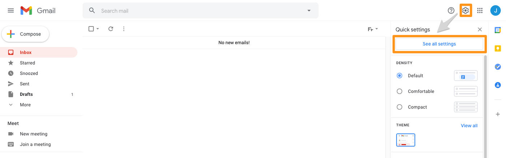
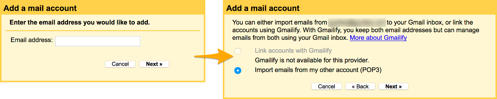
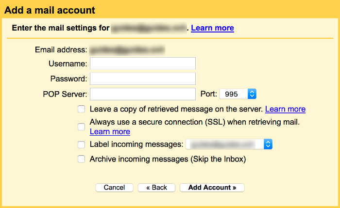
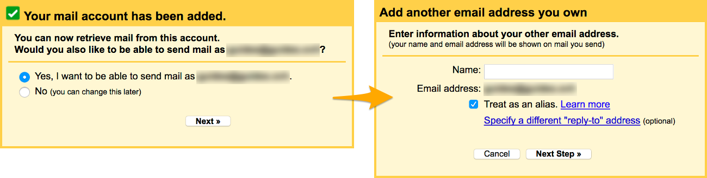
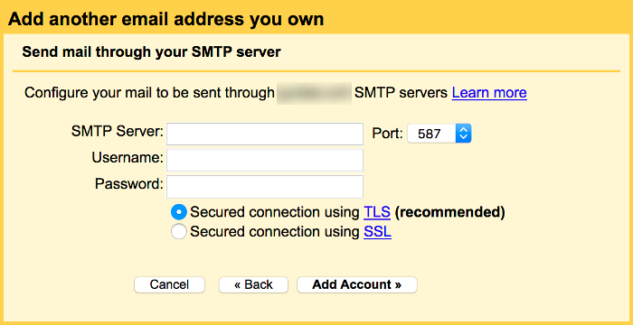

## Objetivo

As contas E-mail Pro podem ser configuradas em vários softwares de e-mail e interfaces online compatíveis. Isto permite-lhe enviar e receber e-mails a partir do dispositivo ou da interface online à sua escolha.

**Saiba como configurar uma conta E-mail Pro na interface online do Gmail.**

> [!warning]
>
> A OVHcloud oferece-lhe serviços cuja configuração, gestão e responsabilidade é da sua responsabilidade. Assim, deverá assegurar o seu bom funcionamento.
>
> Este guia fornece as instruções necessárias para realizar as operações mais habituais. No entanto, se encontrar dificuldades, recomendamos que recorra a um [parceiro especializado](/links/partner) e/ou que contacte o editor do serviço. Não poderemos proporcionar-lhe assistência técnica. Para mais informações, consulte a secção « Ir mais longe » deste guia.
>

## Requisitos

- Ter um plano [E-mail Pro](/links/web/email-pro).
- Dispor das credenciais relativas à conta E-mail Pro que pretende configurar.
- Dispor dos dados de acesso à conta Gmail na qual pretende configurar a conta E-mail Pro da OVHcloud.

> [!primary]
>
> Esta documentação foi realizada a partir da nova interface do Gmail. Se as imagens forem um pouco diferentes da sua versão, as instruções permanecerão as mesmas e poderão ser seguidas.
>

## Na Prática

### Etapa 1: adicionar uma conta E-mail Pro OVHcloud na interface do Gmail

> [!primary]
>
> Neste exemplo, utilizamos a menção servidor: pro**?**.mail.ovh.net. Deverá substituir o «? » pelo número que identifica o servidor do seu serviço E-mail Pro.
>
> Encontre este algarismo na sua [Área de Cliente OVHcloud](/links/manager), na rubrica `Web Cloud`{.action} e `E-mail Pro`{.action}. O nome do servidor está visível na tabela **Ligação** do separador `Informações gerais`{.action}.
>

Para começar, aceda à interface de gestão do Gmail a partir do browser. Uma vez nesta última, introduza as informações da sua conta Gmail e ligue-se.

Depois de aceder à interface, clique no ícone em forma de roda dentada e, a seguir, em `Ver todos os parâmetros`{.action}. Na página que se abrir, clique no separador `Contas e importação`{.action}.

{.thumbnail}

Ao lado de `Consultar outras contas de e-mail`, clique em `Adicionar uma conta de e-mail`{.action}. Na janela que se abrir, introduza o seu endereço de E-mail Pro OVHcloud e clique em `Seguinte`{.action}. Escolha `Importar os e-mails da minha outra conta (POP3)`{.action} e clique novamente em `Seguinte`{.action}.

{.thumbnail}

Indique agora os parâmetros do servidor POP (servidor de entrada) da sua conta E-mail Pro OVHcloud:

|Informação|Descrição|
|---|---|
|Nome de utilizador|Introduza o endereço de e-mail **completo**.|
|Palavra-passe|Introduza a palavra-passe do endereço de e-mail.|
|Servidor POP|Indique o servidor « pro**?**.mail.ovh.net ».|
|Porta|Selecione a porta « 995 ».|

Em relação às escolhas que pode assinalar:

- **« Conservar uma cópia da mensagem recuperada no servidor »** : recomendamos que selecione esta opção se pretender conservar uma cópia das mensagens recebidas do seu endereço E-mail Pro OVHcloud nos nossos servidores;

- **« Deve sempre utilizar uma ligação segura (SSL) quando recuperar os seus e-mails »** : certifique-se de que seleciona esta caixa de verificação para que a ligação ao seu endereço E-mail Pro OVHcloud possa ser efetuada;

- **« Adicionar uma etiqueta às mensagens de entrada »** : esta escolha permite-lhe adicionar uma etiqueta às mensagens que serão importadas do seu endereço E-mail Pro OVHcloud para a sua conta Gmail;

- **« Arquivar as mensagens de entrada (sem passar pela caixa de entrada) »** : esta escolha permite-lhe não visualizar na caixa de entrada da sua conta Gmail as mensagens importadas do seu endereço de e-mail OVHcloud.

Depois de preencher as informações, clique no botão `Adicionar uma conta`{.action}. Se os dados estiverem corretos, será estabelecida a ligação com êxito ao endereço de e-mail.

{.thumbnail}

A partir daí, se também pretender enviar mensagens com o seu endereço de E-mail Pro da OVHcloud a partir da interface online do Gmail, selecione a caixa de verificação `Sim, gostaria de enviar mensagens de e-mail a partir do endereço`{.action} e, em seguida clique em `Seguinte`{.action}.

De seguida, preencha o nome que pretende apresentar como remetente quando forem enviados e-mails com o endereço de e-mail, selecione a caixa de verificação `Tratar como alias`{.action} e clique no botão `Etapa seguinte`{.action}.

{.thumbnail}

Indique agora os parâmetros do servidor SMTP (servidor de envio) da sua conta E-mail Pro OVHcloud:

|Informação|Descrição|
|---|---|
|Servidor SMTP|Indique o servidor « pro**?**.mail.ovh.net ».|
|Porta|Selecione a porta « 587 ».|
|Nome de utilizador|Introduza o endereço de e-mail **completo**.|
|Palavra-passe|Introduza a palavra-passe do endereço de e-mail.|

Depois de preencher as informações, selecione a caixa ao lado de `Ligação segura TLS`{.action} e clique no botão `Adicionar uma conta`{.action}. Se os dados estiverem corretos, será estabelecida a ligação com êxito ao endereço de e-mail.

{.thumbnail}

Só precisa de validar esta adição introduzindo um código de confirmação enviado para o seu endereço de E-mail Pro OVHcloud. Para o obter, ligue-se à sua conta de e-mail como de costume a partir da nossa interface online acessível a partir de: <https://pro1.mail.ovh.net>.

Após a validação efetuada, o endereço de E-mail Pro OVHcloud será apresentado no separador Contas e importação {.action}, ao qual acedeu no início da operação.

### 2 - Utilizar uma conta E-mail Pro a partir da interface do Gmail

Depois de configurar a conta E-mail Pro, já só precisa de a utilizar! Pode desde já enviar e receber mensagens sobre este último a partir da interface do Gmail.

Para enviar uma mensagem com o seu endereço de E-mail Pro OVHcloud a partir da interface online do Gmail, deve escolher, aquando da redação de uma nova mensagem, o endereço de e-mail que realizará o seu envio. Esta escolha é feita ao lado de `De`{.action} na janela de redação.

{.thumbnail}

Tenha em conta que pode sempre utilizar a nossa interface online acessível a partir do endereço <https://www.ovh.com/pt/mail/> para aceder ao seu endereço de E-mail Pro OVHcloud. Pode ligar-se a ele graças aos dados de acesso.

## Quer saber mais? 

> [!primary]
>
> Para mais informações sobre a configuração de um endereço de e-mail a partir da interface Gmail online, consulte [o Centro de Ajuda do Google](https://support.google.com/mail/answer/21289?hl=pt&co=GENIE.Platform%3DDesktop).

Para serviços especializados (referenciamento, desenvolvimento, etc), contacte os [parceiros OVHcloud](/links/partner).

Se pretender usufruir de uma assistência na utilização e na configuração das suas soluções OVHcloud, consulte as nossas diferentes [ofertas de suporte](/links/support).

Fale com nossa [comunidade de utilizadores](/links/community).