

## Objective

You can configure Email Pro accounts on email clients, if they are compatible. By doing so, you can use your email address through your preferred email application.

**Find out how to configure your Email Pro account on Outlook Classic for Windows.**

## Requirements

- An [Email Pro](/links/web/email-pro) account.
- [Outlook classic](https://support.microsoft.com/en-gb/office/install-or-reinstall-classic-outlook-on-a-windows-pc-5c94902b-31a5-4274-abb0-b07f4661edf5) installed on your Windows.
- Login credentials for the email account to be configured.

<!-- CP-NAV-START:web-email-pro -->
---

### OVHcloud Control Panel Access

- **Direct link:** [Email Pro](/links/control-panel/web-email-pro)
- **Navigation path:** `Web Cloud`{.action} > `Email Pro`{.action} > Select your platform

---
<!-- CP-NAV-END:web-email-pro -->

/// details | Information related to the management and configuration of OVHcloud services

This guide will show you how to use one or more OVHcloud solutions with external tools, and the changes you need to make in specific contexts. You may need to adapt the instructions according to your situation.

If you experience any difficulties carrying out these operations, we recommend that you contact a [specialist service provider](/links/partner) and/or discuss the issue with our community. OVHcloud cannot provide you with technical support in this regard. You can find more information in the "[Go further](#go-further)" section of this guide.

///

## Instructions

> [!warning]
>
> This documentation applies only to **Outlook classic** available in the Microsoft 365 suite. If you are using the new Outlook, please refer to our guide "[Email Pro - Configure your Email Pro account on the New Outlook for Windows](/pages/web_cloud/email_and_collaborative_solutions/email_pro/how_to_configure_windows_10)".
>
> To install Outlook classic on your Windows computer, download it from the Microsoft page "[Install or reinstall classic Outlook on a Windows PC](https://support.microsoft.com/en-gb/office/install-or-reinstall-classic-outlook-on-a-windows-pc-5c94902b-31a5-4274-abb0-b07f4661edf5)" and install it.
>
> Once the installation is complete, to distinguish the two versions when they are installed, type "Outlook" in the Windows search bar. You will then be able to see the difference as shown below.
>
> {.thumbnail .h-500}

### Adding the account 

<!-- CP-STEPS-START:cp-block-server-name-lookup-add -->
> [!primary]
>
> In our example, we use the server name: pro?.mail.ovh.net. You will need to replace the "?" with the number corresponding to your Email Pro service server.
>
> Click [this link](/links/control-panel/web-email-pro) to access the `Email Pro`{.action} section. The server name is visible in the **Connection** section of the `General information`{.action} tab.
<!-- CP-STEPS-END:cp-block-server-name-lookup-add -->

- **When you start the application for the first time**: a setup wizard will appear and prompt you to enter your email address.

- **If you have already added an account**: Click `File`{.action} in the menu bar at the top of your screen, then `Add account`{.action}.

{.thumbnail .h-500}

**On Windows 11, the interface of Outlook classic may differ when adding an account.**

Depending on the usage history of Outlook on the concerned computer, a specific configuration may result in a different interface being displayed. In some cases, the so-called "modern" interface (**interface 1**) may be disabled in favor of the classic interface (**interface 2**).

This is why we invite you to consult the chapter corresponding to the interface displayed on your screen.

#### Configuration with interface 1 

To configure your email address, follow the steps by clicking on the tabs below.

> [!tabs]
> **Step 1**
>>
>> Enter your email address, then click on `Advanced options`{.action}.
>>
>> Check the box `Configure my account manually`{.action} and click on `Connect`{.action}.
>>
>> 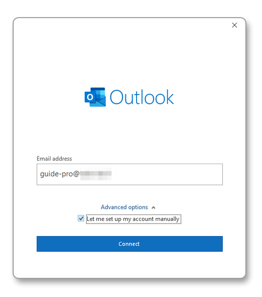{.thumbnail .h-500}
>>
> **Step 2**
>>
>> Among the account types offered, choose IMAP or POP.
>>
>> We recommend using the IMAP protocol.
>>
>> 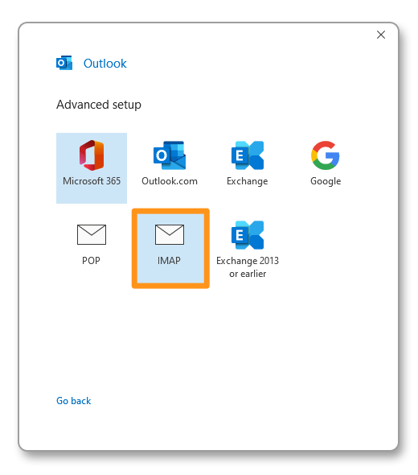{.thumbnail .h-500}
>>
> **Step 3**
>>
>> Enter the password for your email address, then click on `Connect`{.action}.
>>
>> 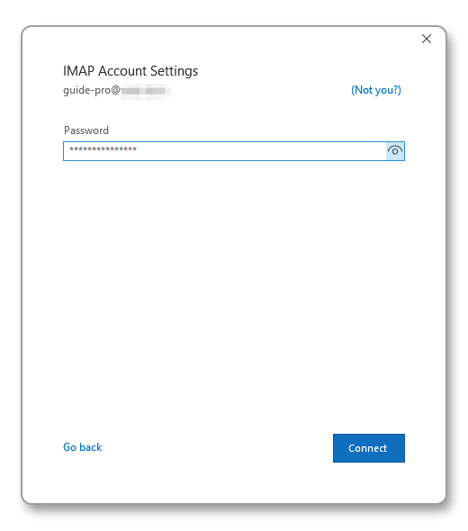{.thumbnail .h-500}
>>
> **Step 4**
>>
>> If Outlook cannot automatically configure the account, the following window appears.
>>
>> Click on `Modify account settings`{.action}.
>>
>> 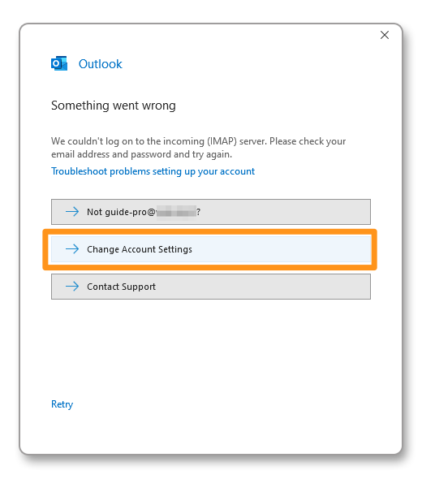{.thumbnail .h-500}
>>
> **Step 5**
>>
>> In the **Incoming mail** section, enter:
>> 
>> - Server: **pro**?**.mail.ovh.net** (make sure to replace "**?**" with your server number)
>> - Port: **993**
>> - Encryption method: **SSL/TLS**
>>
>> In the **Outgoing mail** section, enter:
>>
>> - Server: **pro**?**.mail.ovh.net** (make sure to replace "**?**" with your server number)
>> - Port: **587**
>> - Encryption method: **STARTTLS**
>>
>> Click on `Next`{.action} to confirm.
>>
>> 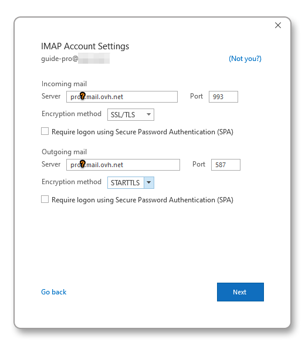{.thumbnail .h-500}
>>

#### Configuration with interface 2 

To configure your email address, follow the steps by clicking on the tabs below.

> [!tabs]
> **Step 1**
>>
>> - From the **Add an account** window, select `Manual setup or additional server types`{.action}.
>> - Click on `Next`{.action} to continue.
>> - Select `POP or IMAP`{.action}.
>> - Click on `Next`{.action} to continue.
>>
>> {.thumbnail .h-500}
>>
> **Step 2**
>>
>> Enter your account connection details **(1)**:
>>
>> User information  
>> **Your name**: set a display name. 
>> **Email address**: enter your full email address. 
>>
>> Server information  
>> **Account type**: select IMAP. 
>> **Incoming mail server**: pro?.mail.ovh.net (the "?" must be replaced by your server number). 
>> **Outgoing mail server (SMTP)**: pro?.mail.ovh.net (the "?" must be replaced by your server number). 
>>
>> Logon information  
>> **User Name**: Enter your full email address. 
>> **Password**: Enter the password associated with your email address. 
>>
>> Click on `More settings...`{.action} **(2)** and go to the next step.
>>
>> 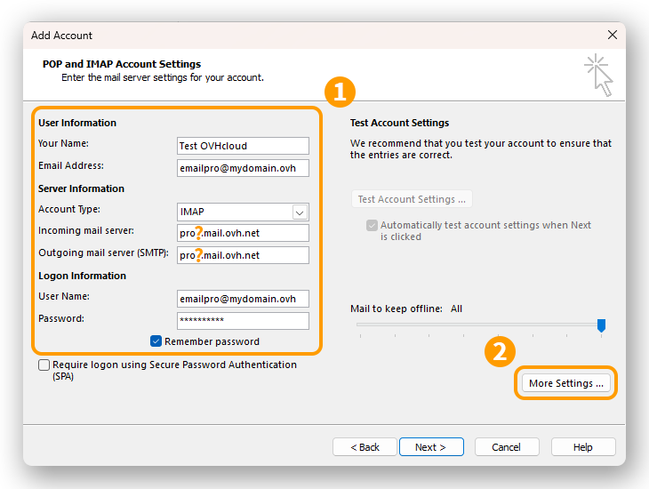{.thumbnail .h-500}
>>
> **Step 3**
>>
>> From the `Outgoing Server` tab, check `My outgoing server (SMTP) requires authentication`{.action} and leave `Use same settings as my incoming mail server`{.action} selected.
>>
>> From the `Advanced` tab:
>>
>> - **Incoming server (IMAP)**: 993
>> - **Use the following type of encrypted connection**: SSL/TLS
>> - **Outgoing server (SMTP)**: 587
>> - **Use the following type of encrypted connection**: STARTTLS
>>
>> Click on `OK`{.action} to validate the information. Click on `Next`{.action} to start the account configuration.
>>
>> 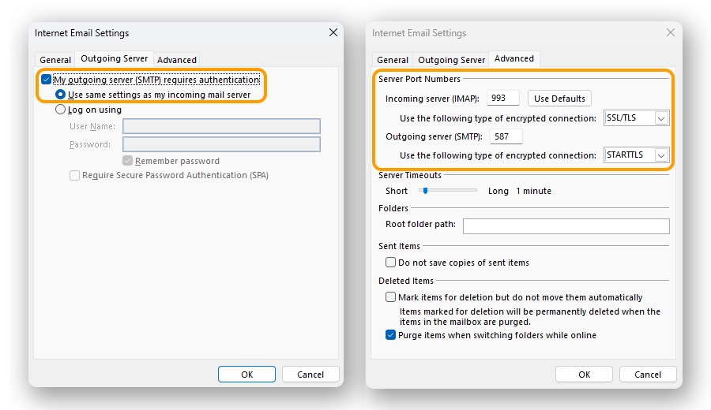{.thumbnail .h-500}
>>
> **Step 4**
>>
>> Click on `Next`{.action} to start the account configuration. If the settings are validated, you will get the window below.
>>
>> 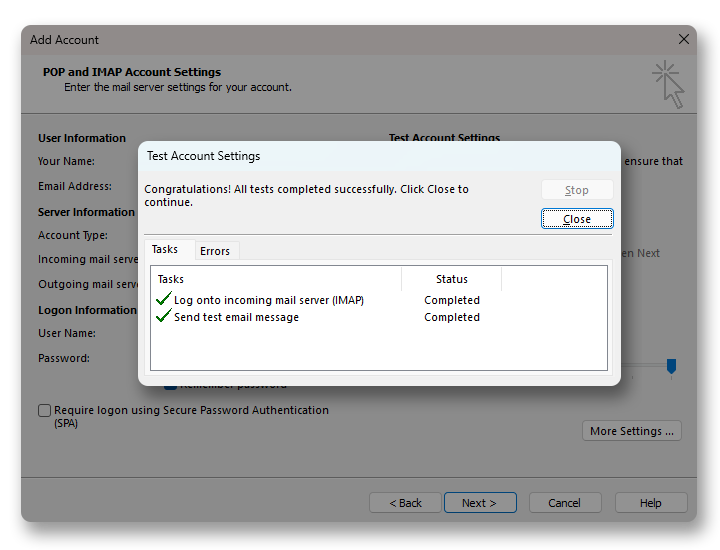{.thumbnail .h-500}
>>

### Using your email address

Once you have configured your email address, you can start using it! You can now send and receive emails.

OVHcloud also has a web application you can use to access your email address from your browser. OVHcloud Webmail is available [here](/links/web/email). You can log in using your email credentials. If you have any questions about how to use this interface, please refer to our guide on [Using the Outlook Web App](/pages/web_cloud/email_and_collaborative_solutions/using_the_outlook_web_app_webmail/email_owa).

### Retrieving a backup of your email address

If you need to make a change that could lead to the loss of your email account data, we advise you to make a backup of the email account concerned beforehand. To do this, please read the "**Exporting from Windows**" section in our guide on [Migrating your email address manually](/pages/web_cloud/email_and_collaborative_solutions/migrating/manual_email_migration#exporting-from-windows).

### Modifying existing settings

**On Windows 11, the interface of Outlook classic may differ when you modify an account.**

Depending on the usage history of Outlook on the concerned computer, a specific configuration may result in a different interface being displayed. In some cases, the so-called "modern" interface (**interface 1**) may be disabled in favor of the classic interface (**interface 2**).

This is why we invite you to consult the chapter corresponding to the interface displayed on your screen.

> [!tabs]
> **Interface 1**
>>
>> If your email account is already configured and you need to access its settings to modify them:
>>
>> - Click on `File`{.action} in the menu bar at the top of the screen, then select the account to modify in the drop-down menu **(1)**.
>> - Click on `Account Settings`{.action } **(2)** below.
>> - Select `Server Settings`{.action} **(3)** to display the configuration window.
>>
>> 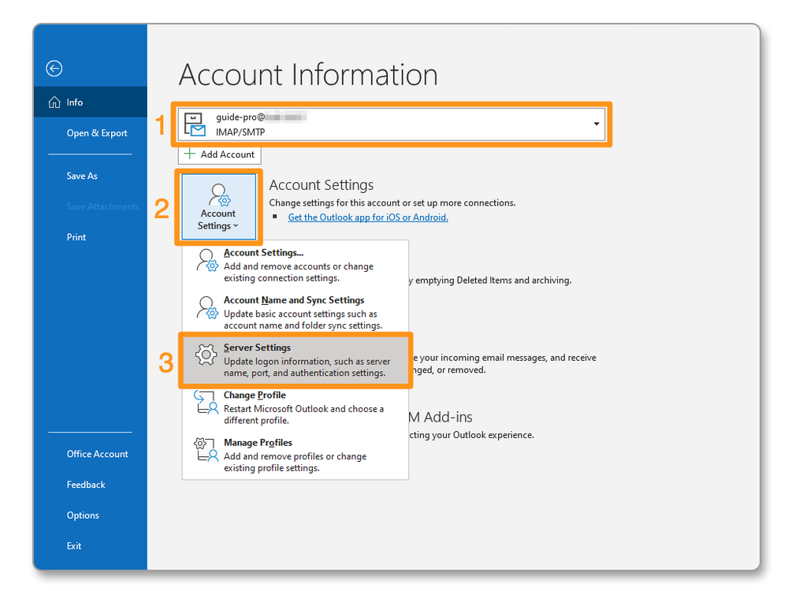{.thumbnail}
>>
>> The window is divided into two parts, **Incoming mail** and **Outgoing mail**. Click on the part you wish to modify.
>>
>> <!-- CP-STEPS-START:cp-block-server-name-lookup-modify -->
>> > [!primary]
>> >
>> > In our example, the server name used is "pro**?**.mail.ovh.net". You must replace the character "?" with the number corresponding to your Email Pro service server.
>> >
>> > Click [this link](/links/control-panel/web-email-pro) to access the `Email Pro`{.action} section. The server name is visible in the **Connection** section of the `General information`{.action} tab.
>> <!-- CP-STEPS-END:cp-block-server-name-lookup-modify -->
>>
>> 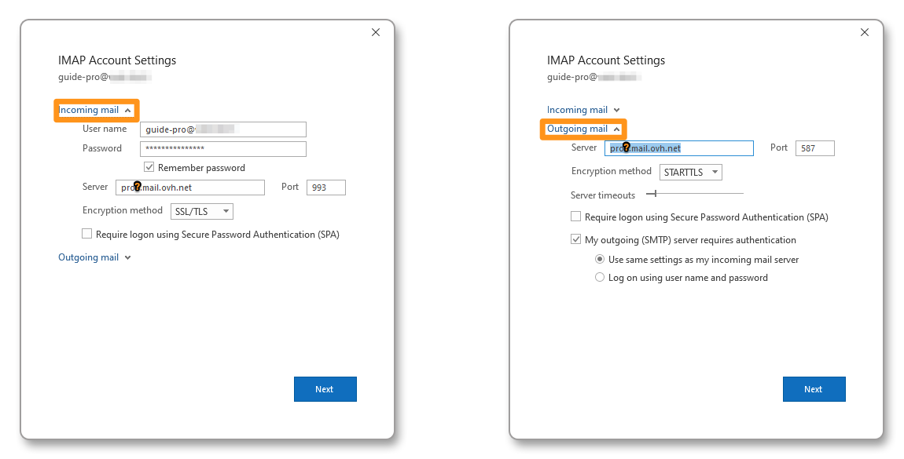{.thumbnail}
>>
> **Interface 2**
>>
>> If your email account is already configured and you need to access its settings to modify them:
>>
>> - Click on `File`{.action} in the menu bar at the top of the screen, then select the account to modify in the drop-down menu **(1)**.
>> - Click on `Account Settings`{.action} **(2)** below.
>> - Click on `Account Settings...`{.action} **(3)** to access the configuration window.
>>
>> 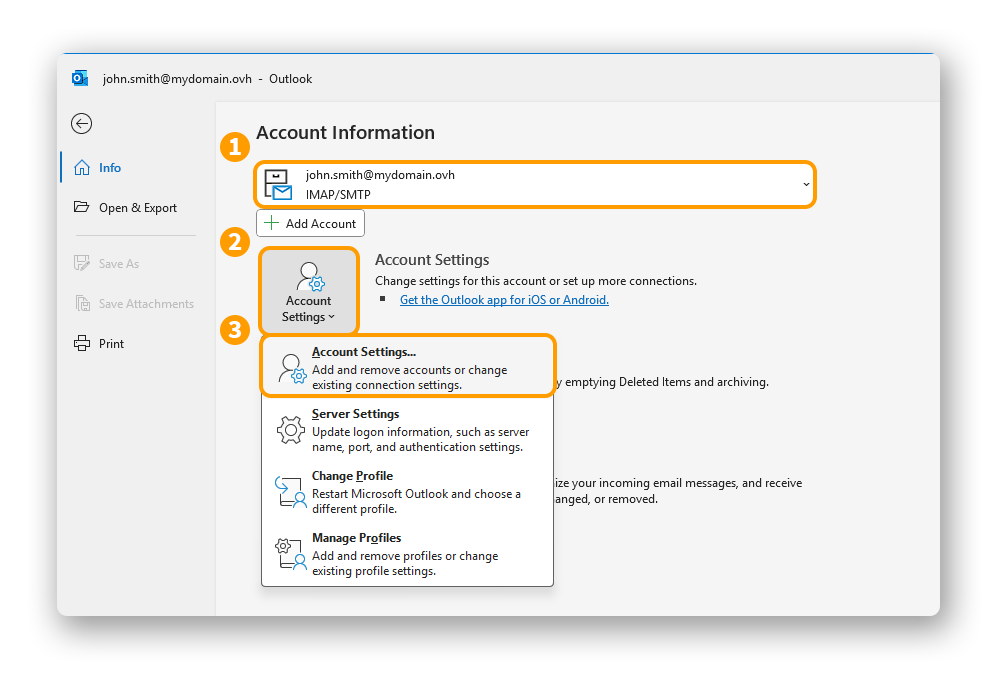{.thumbnail .h-500}
>>
>> - The account settings window appears: select the concerned email account, then click on `Modify...`{.action}.
>>
>> {.thumbnail .h-500}
>>
>> To configure your account, follow the instructions from **step 2** in the section "[Add the account - Configuration with interface 2](#add-account-int2)" of this guide.
>>

### General send and receive settings 

#### IMAP and POP receive settings 

For receiving emails, when choosing the account type, we recommend using **IMAP**. You can however select **POP**.

Select the tab corresponding to your configuration type:

> [!tabs]
> **IMAP configuration**
>>
>> - **Username**: enter the **full** email address.
>> - **Password**: enter the email address password.
>> - **Incoming server**: pro?.mail.ovh.net (make sure to replace the "?" with your server number).
>> - **Port**: 993.
>> - **Security type**: SSL/TLS.
>>
> **POP configuration**
>>
>> - **Username**: enter the **full** email address.
>> - **Password**: enter the email address password.
>> - **Incoming server**: pro?.mail.ovh.net (make sure to replace the "?" with your server number).
>> - **Port**: 995.
>> - **Security type**: SSL/TLS.

#### SMTP send settings 

For sending emails, find below the **SMTP** settings to use:

**SMTP configuration**

- **Username**: enter the **full** email address.
- **Password**: enter the email address password.
- **Outgoing server**: pro?.mail.ovh.net (make sure to replace the "?" with your server number).
- **Port**: 587.
- **Security type**: STARTTLS.

## Go further 

> [!primary]
>
> For more information about configuring an email address from the Outlook app on macOS, see [the Microsoft Help Center](https://support.microsoft.com/en-gb/office/add-email-account-in-Outlook-6e27792a-9267-4aa4-8bb6-c84ef146101b).

[Configuring your MX Plan address in Outlook for Windows](/pages/web_cloud/email_and_collaborative_solutions/mx_plan/how_to_configure_outlook_2016)

[Configuring your Exchange account in Outlook for Windows](/pages/web_cloud/email_and_collaborative_solutions/microsoft_exchange/how_to_configure_outlook_2016)

Join our [community of users](/links/community).