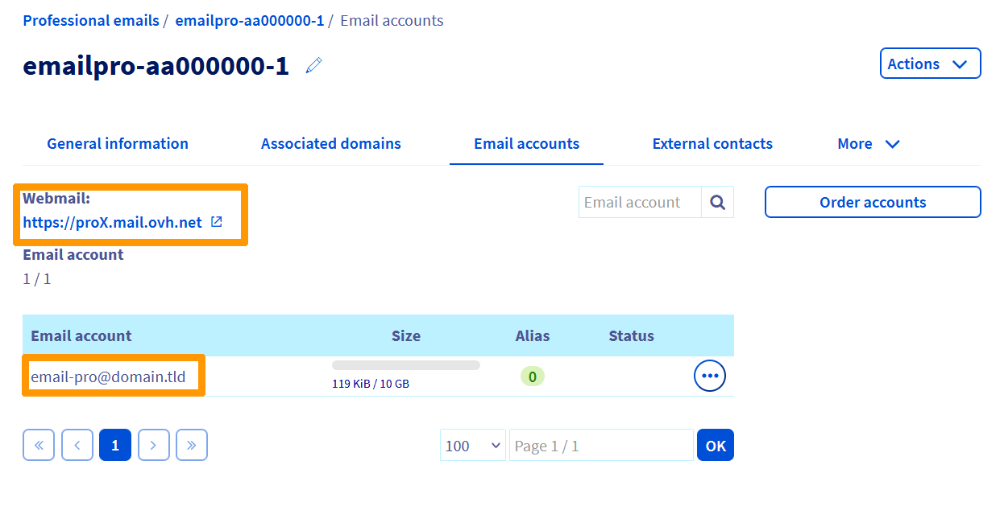

> [!primary]
> Diese Übersetzung wurde durch unseren Partner SYSTRAN automatisch erstellt. In manchen Fällen können ungenaue Formulierungen verwendet worden sein, z.B. bei der Beschriftung von Schaltflächen oder technischen Details. Bitte ziehen Sie im Zweifelsfall die englische oder französische Fassung der Anleitung zu Rate. Möchten Sie mithelfen, diese Übersetzung zu verbessern? Dann nutzen Sie dazu bitte den Button "Beitragen" auf dieser Seite.
>

## Ziel

E-Mail Pro Accounts können auf verschiedenen kompatiblen E-Mail-Clients eingerichtet werden. So können Sie Ihre E-Mail-Adresse über das Gerät Ihrer Wahl verwenden.

**Diese Anleitung erklärt, wie Sie einen E-Mail Pro Account auf Android mit der Microsoft Outlook App einrichten.**

## Voraussetzungen

- Sie haben einen [E-Mail Pro](https://www.ovhcloud.com/de/emails/email-pro/) Dienst in Ihrem Kunden-Account.
- Sie haben die Microsoft Outlook App auf Ihrem Android-Gerät installiert. Sie können diese aus dem *Google Play Store* herunterladen.

> [!warning]
> OVHcloud stellt Ihnen Dienstleistungen zur Verfügung, für deren Konfiguration und Verwaltung Sie die alleinige Verantwortung tragen. Es liegt somit bei Ihnen, sicherzustellen, dass diese ordnungsgemäß funktionieren.
> 
> Diese Anleitung soll Sie bei allgemeinen Aufgaben bestmöglich unterstützen. Dennoch empfehlen wir Ihnen, falls Sie Hilfe brauchen, einen [spezialisierten Dienstleister](https://partner.ovhcloud.com/de/directory/) oder den Herausgeber des Dienstes zu kontaktieren. Leider können wir Ihnen für externe Dienstleistungen keine weitergehende Unterstützung anbieten. Weitere Informationen finden Sie im Abschnitt [„Weiterführende Informationen“](#go-further) dieser Anleitung.
>

## In der praktischen Anwendung

### Schritt 1: E-Mail Pro Account-Informationen abrufen 

Loggen Sie sich in Ihr [OVHcloud Kundencenter](https://www.ovh.com/auth/?action=gotomanager&from=https://www.ovh.de/&ovhSubsidiary=de) ein gehen Sie dann in den Bereich `Web Cloud`{.action}. Klicken Sie in der linken Spalte auf `E-Mail für Profis`{.action} und wählen Sie den E-Mail Pro Dienst mit dem zu konfigurierenden E-Mail-Account aus.

Klicken Sie auf der neuen Seite auf den Tab `E-Mail-Accounts`{.action}.

{.thumbnail}

Rufen Sie den Namen des E-Mail Pro Servers ab, der unter `Webmail`{.action} angezeigt wird. In unserem oben abgebildeten Beispiel ist dies `proX.mail.ovh.net`.

> [!warning]
>
> Stellen Sie sicher, den **korrekten Namen** des E-Mail Pro Servers für den zu konfigurierenden E-Mail-Account zu verwenden. Er kann je nach Alter Ihres E-Mail Pro Angebots (pro1.mail.ovh.net, pro2.mail.ovh.net etc.) variieren.
> 

Ebenfalls im Tab `E-Mail-Accounts`{.action} von *Email Pro* wird eine Tabelle mit Ihren E-Mail-Accounts angezeigt.

Wenn Sie sich nicht mehr an das Passwort des E-Mail-Accounts erinnern, den Sie einrichten möchten, können Sie es über den Button `...`{.action} rechts vom betreffenden E-Mail-Account ändern.

Wählen Sie hier `Ändern`{.action} aus, geben Sie ein neues Passwort ein und bestätigen Sie es. Klicken Sie anschließend im zweiten Fenster auf `Weiter`{.action} und dann auf `Bestätigen`{.action}.

Die Änderung des Passworts wird innerhalb von ca. 15 Minuten durchgeführt.

> [!warning]
>
> Wenn Sie das Passwort eines E-Mail-Accounts ändern, der bereits mit einem E-Mail-Client (E-Mail-Programm, Computer, Tablet, Smartphone, Kopierer, etc.) verwendet wird, müssen Sie das Passwort in allen relevanten Clients aktualisieren.
> Diese können sich dann nicht mehr mit dem alten Passwort im E-Mail-Account einloggen.
>

Am Ende dieses ersten Schritts sollten die folgenden Informationen vorliegen:

- Name des E-Mail Pro Servers (pro1.mail.ovh.net, pro2.mail.ovh.net, etc.)
- Der zu konfigurierende E-Mail-Account
- Passwort der zu konfigurierenden E-Mail-Adresse

### Schritt 2: Konfiguration des Accounts auf Android über die Microsoft Outlook App 

Starten Sie auf Ihrem Android-Gerät Microsoft Outlook. Wenn Sie es noch nicht installiert haben, laden Sie es aus dem *Google Play Store* herunter.

|||
|---|---|
|{.thumbnail}|{.thumbnail}|

Wenn Sie eingeloggt sind, tippen Sie auf `Account hinzufügen`{.action}, geben Sie Ihre vollständige E-Mail-Adresse in das Feld `Geben Sie Ihre E-Mail-Adresse ein`{.action} ein und tippen Sie auf `Weiter`{.action}.

Unten werden Ihnen zwei Konfigurationsmöglichkeiten angeboten: `IMAP`{.action} und `POP3`{.action}.

|||
|---|---|
| {.thumbnail} | {.thumbnail} |

> [!success]
>
> Mit dem Synchronisationsprotokoll **IMAP** können Sie ein „Image“ der E-Mails auf dem zuständigen E-Mail Pro Server abrufen, um sie in Microsoft Outlook anzuzeigen. Dabei werden die E-Mails vom E-Mail Pro Server **nicht** gelöscht. Dieses Protokoll ist besonders nützlich, wenn Sie den betreffenden Account auf mehreren E-Mail-Clients konfiguriert haben.
>
> Das Protokoll **POP3** ruft E-Mails vom E-Mail Pro Server ab, um sie in der als Client verwendeten Software zu speichern. Deshalb sind die abgerufenen E-Mails anschließend nicht mehr auf dem E-Mail Pro Server vorhanden, sondern nur noch auf dem Gerät, das mit **POP3** konfiguriert wurde.
>
> Dieses Protokoll wird nicht empfohlen, wenn Sie mehrere Clients mit dem betreffenden Account konfiguriert haben. Abgerufene E-Mails sind dann nur auf einem der mit **POP3** konfigurierten Geräte gespeichert, statt in allen zugehörigen E-Mail-Clients.
>
> Trotz der Konfiguration mit **POP3** senden einige E-Mail-Programme dennoch eine Kopie der abgerufenen E-Mails an den Server, auf dem sich Ihr E-Mail-Account befindet. Diese Kopie kann vorübergehend oder dauerhaft bestehen bleiben.
> Wenden Sie sich direkt an den Software-Anbieter, um zu erfahren, ob diese Funktion aktiv ist.
>

#### Fall 1: Konfiguration der Microsoft Outlook App auf Android mit dem Protokoll IMAP

Wählen Sie `IMAP`{.action} unten in der Anzeige aus.

Auf der neu geöffneten Seite ist Ihre E-Mail-Adresse voreingetragen.

Geben Sie das Passwort Ihres E-Mail Pro Accounts in das Formular `Passwort`{.action} unter Ihrer E-Mail-Adresse ein.

In den beiden folgenden Formularen können Sie **optional** einen `Anzeigenamen`{.action} und eine `Beschreibung`{.action} eingeben.

Öffnen Sie nun `ERWEITERTE EINSTELLUNGEN`{.action} um den Rest des Konfigurationsmenüs anzuzeigen.

Füllen Sie anschließend die Formulare mit den folgenden Informationen aus.

Für den Abschnitt **IMAP-Posteingangsserver**:

 - **IMAP Hostname**: Geben Sie den Namen Ihres E-Mail Pro Servers an, den Sie in [Schritt 1](#step1) ermittelt haben: (*pro1.mail.ovh.net*, *pro2.mail.ovh.net*, etc.).
 - **Port**: Geben Sie die Portnummer **993** ein.
 - **Sicherheitstyp**: Wählen Sie aus der Dropdown-Liste **SSL/TLS** aus.
 - **IMAP Benutzername**: Geben Sie die vollständige E-Mail-Adresse des Accounts ein, den Sie konfigurieren möchten.
 - **IMAP Passwort**: Geben Sie das Zugangspasswort für den E-Mail-Account ein, den Sie einrichten möchten.

Für den Abschnitt **SMTP-Postausgangsserver**:

 - **SMTP Hostname**: Geben Sie den Namen Ihres E-Mail Pro Servers an, den Sie in [Schritt 1](#step1) ermittelt haben: (*pro1.mail.ovh.net*, *pro2.mail.ovh.net*, etc.).
 - **Port**: Geben Sie die Portnummer **587** ein.
 - **Sicherheitstyp**: Wählen Sie aus der Dropdown-Liste **StartTLS** aus.
 - **SMTP Benutzername**: Geben Sie die vollständige E-Mail-Adresse des Accounts ein, den Sie konfigurieren möchten.
 - **SMTP Passwort**: Geben Sie das Zugangspasswort für den E-Mail-Account ein, den Sie konfigurieren möchten.

Überprüfen Sie anschließend, ob alle eingegebenen Einstellungen mit den oben aufgeführten übereinstimmen, und klicken Sie auf das Symbol `V`{.action} oben rechts.

#### Fall 2: Konfiguration der Microsoft Outlook App auf Android mit dem Protokoll POP3

Wählen Sie `POP3`{.action} unten in der Anzeige aus.

Auf der neu geöffneten Seite ist Ihre E-Mail-Adresse voreingetragen.

Geben Sie das Passwort Ihres E-Mail Pro Accounts in das Formular `Passwort`{.action} unter Ihrer E-Mail-Adresse ein.

In den beiden folgenden Formularen können Sie **optional** einen `Anzeigenamen`{.action} und eine `Beschreibung`{.action} eingeben.

Öffnen Sie nun `ERWEITERTE EINSTELLUNGEN`{.action} um den Rest des Konfigurationsmenüs anzuzeigen.

Füllen Sie anschließend die Formulare mit den folgenden Informationen aus.

Für den Abschnitt **POP Posteingangsserver**:

 - **POP Hostname**: Geben Sie den Namen Ihres E-Mail Pro Servers an, den Sie in [Schritt 1](#step1) ermittelt haben: (*pro1.mail.ovh.net*, *pro2.mail.ovh.net*, etc.).
 - **Port**: Geben Sie die Portnummer **995** ein.
 - **Sicherheitstyp**: Wählen Sie aus der Dropdown-Liste **SSL/TLS** aus.
 - **POP Benutzername**: Geben Sie die vollständige E-Mail-Adresse des Accounts ein, den Sie konfigurieren möchten.
 - **POP Passwort**: Geben Sie das Zugangspasswort für den E-Mail-Account ein, den Sie konfigurieren möchten.

Für den Abschnitt **SMTP Postausgangsserver**:

 - **SMTP Hostname**: Geben Sie den Namen Ihres E-Mail Pro Servers an, den Sie in [Schritt 1](#step1) ermittelt haben: (*pro1.mail.ovh.net*, *pro2.mail.ovh.net*, etc.).
 - **Port**: Geben Sie die Portnummer **587** ein.
 - **Sicherheitstyp**: Wählen Sie aus der Dropdown-Liste **StartTLS** aus.
 - **SMTP Benutzername**: Geben Sie die vollständige E-Mail-Adresse des Accounts ein, den Sie konfigurieren möchten.
 - **SMTP Passwort**: Geben Sie das Zugangspasswort für den E-Mail-Account ein, den Sie konfigurieren möchten.

Überprüfen Sie anschließend, ob alle eingegebenen Einstellungen mit den oben aufgeführten übereinstimmen, und klicken Sie auf das Symbol `V`{.action} oben rechts.

### Schritt 3: Konfiguration der Microsoft Outlook App auf Android abschließen

Nachdem Sie auf das Symbol `V`{.action} geklickt haben, testet die App die Einstellungen und meldet sich beim E-Mail Pro Server an, auf dem sich Ihr E-Mail-Account befindet.
Der Inhalt des E-Mail-Accounts wird dann abgerufen bzw. synchronisiert, um ihn auf Ihrem Gerät anzuzeigen.

Testen Sie dann das Senden und Empfangen von E-Mails über Ihre Microsoft Outlook App, um die Konfiguration abzuschließen.

## Weiterführende Informationen 

Kontaktieren Sie für spezialisierte Dienstleistungen (SEO, Web-Entwicklung etc.) die [OVHcloud Partner](https://partner.ovhcloud.com/de/directory/).

Wenn Sie Hilfe bei der Nutzung und Konfiguration Ihrer OVHcloud Lösungen benötigen, beachten Sie unsere [Support-Angebote](https://www.ovhcloud.com/de/support-levels/).

Für den Austausch mit unserer User Community gehen Sie auf <https://community.ovh.com/en/>.
