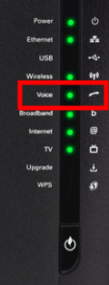

**Dernière mise à jour le 02/11/2020**

## Objectif

Vous pouvez activer, selon votre [offre internet](https://www.ovhtelecom.fr/offre-internet/), une ou plusieurs lignes téléphoniques sur votre pack ADSL/VDSL/FTTH. 
Ces dernières vous permettent d'émettre et recevoir des appels. Elles peuvent également être liées à un ou plusieurs numéros portés si vous en possédez.

**Ces lignes ne sont pas livrées en même temps que l'accès ADSL/VDSL/FTTH, ce guide vous explique comment les activer.**

## Prérequis

- Disposer d'un [pack ADSL/VDSL/FTTH](https://www.ovhtelecom.fr/offre-internet/) actif.
- Disposer d'une ou plusieurs ligne(s) non activée(s) dans ce pack.

## En Pratique

### Combien de lignes puis-je activer ?

Selon l'offre ADSL/VDSL/FTTH à laquelle vous avez souscrite, vous disposez d'au minimum 1 emplacement pour des lignes téléphoniques et de 0 à 1 emplacement pour une ligne fax virtuelle. 
Lorsque vous activez une ligne, celle-ci va occuper un emplacement.

Pour connaître le nombre d'emplacements libres restants, rendez vous dans la rubrique `Telecom` de votre [espace client OVHcloud](https://www.ovh.com/auth/?action=gotomanager&from=https://www.ovh.com/fr/&ovhSubsidiary=fr). Cliquez ensuite sur `Accès Internet`{.action} et sélectionnez votre offre.

En sélectionnant votre pack, vous obtenez une vue globale des services associés à ce dernier. Vous pourrez alors retrouver le nombre d'emplacements encore disponibles.

{.thumbnail}

Dans l'exemple ci-dessus, il y a :

-   1 emplacement téléphonique déjà activé ;
-   1 emplacement fax déjà activé.

Il reste un emplacement libre, nous pouvons donc activer 1 ligne téléphonique pour ce pack ADSL/VDSL/FTTH.

### Comment activer les lignes associées à mon Pack ?

S'il vous reste des emplacements libres, vous pouvez activer vos lignes téléphoniques/FAX. 

Pour cela, connectez-vous à votre [espace client OVHcloud](https://www.ovh.com/auth/?action=gotomanager&from=https://www.ovh.com/fr/&ovhSubsidiary=fr), sélectionnez votre pack dans la liste de vos services puis cliquez sur `Activer un service`{.action} dans le cadre « Téléphonie ».

{.thumbnail}

Vous avez alors le choix d'activer la ligne **avec ou sans** téléphone.

#### **Sans téléphone**

Une ligne sans téléphone est une ligne qui sera techniquement configurée directement dans le modem sans action de votre part. Il vous suffira de brancher un simple téléphone **analogique** sur le modem. Plus de détails [ici](./#comment-utiliser-les-lignes-activees-sans-telephone).

Ce type d'activation nécessite que vous possédiez un téléphone analogique personnel.

Vous ne pouvez activer que deux lignes sans téléphone par accès car il n'y a que deux ports analogiques disponibles sur le modem.

Pour activer une ligne sans téléphone, choisissez le nombre de lignes à activer (par défaut 1 est proposé).
 Sélectionnez ensuite la case `Ligne SIP sans téléphone`{.action} puis cliquez sur `Valider la commande`{.action} en bas de page.

{.thumbnail}

Cette ligne sera alors disponible dans un délai moyen d'une heure.

#### **Avec un téléphone**

L'activation d'une ligne avec téléphone inclut l'envoi d'un téléphone IP sous caution qu'il suffira de brancher sur le réseau de votre modem comme un simple ordinateur.

Vous pouvez consulter les détails techniques de chaque téléphone [ici](http://www.ovhtelecom.fr/telephonie/comparatif-des-telephones.xml).

Pour activer une ligne avec téléphone, choisissez le nombre de lignes à activer (par défaut 1 est proposé).
 Sélectionnez alors la case du téléphone de votre choix. Vous devez alors choisir le type de livraison :

- la livraison par transporteur à 9.99€ HT se fait via la société **DHL** sous 24h ouvrées ;
- la livraison en point relais **Mondial Relay** gratuite et sous 48h ouvrées.

Cliquez sur `Valider la commande`{.action} une fois votre choix effectué.

{.thumbnail}

Cette ligne sera alors disponible et utilisable après la réception et le branchement du téléphone sur votre modem.

### Activation d'une ligne Fax

Pour activer une ligne Fax, cliquez sur `Activer un service`{.action} dans le cadre « EcoFax Pro ». Cliquez alors sur `Activer`{.action} pour confirmer votre choix.

{.thumbnail}

Cette ligne sera alors disponible dans un délai moyen d'une heure.

Veuillez consulter [nos guides Fax](/products/web-cloud-phone-and-fax-fax) afin d'avoir plus de détails sur l'utilisation de ce service.

### Comment utiliser les lignes activées sans téléphone

Si vous avez activé une ligne sans téléphone, vous devez posséder un simple téléphone analogique à fréquence vocale, c'est à dire un téléphone qui peut être utilisé sur une ligne fixe France Télécom par exemple.

Pour que cette ligne soit utilisable, **les conditions suivantes doivent être remplies**:

Le voyant **Voice** du modem doit être allumé pour les modems Technicolor (TG788 et TG799). 
 Le voyant **Phone** du modem doit être allumé sur les modems Zyxel.
 Si ce n'est pas le cas, vérifiez bien que l'activation de ligne a été effectuée sur l'espace client OVHcloud et patientez une heure.

{.thumbnail}

{.thumbnail}

Votre téléphone analogique doit être branché sur le port **phone 1** du modem (ou le port **phone 2** si c'est la deuxième ligne sans téléphone).

> [!primary]
> Il y a une inversion de ports sur les modems Technicolor TG788 : le port **phone 2** est à gauche alors que le port **phone 1** est à droite.
>

{.thumbnail}

## Aller plus loin

Consultez [nos guides dédiés à la configuration de vos lignes](/products/web-cloud-phone-and-fax-voip).

Échangez avec notre communauté d'utilisateurs sur <https://community.ovh.com>
