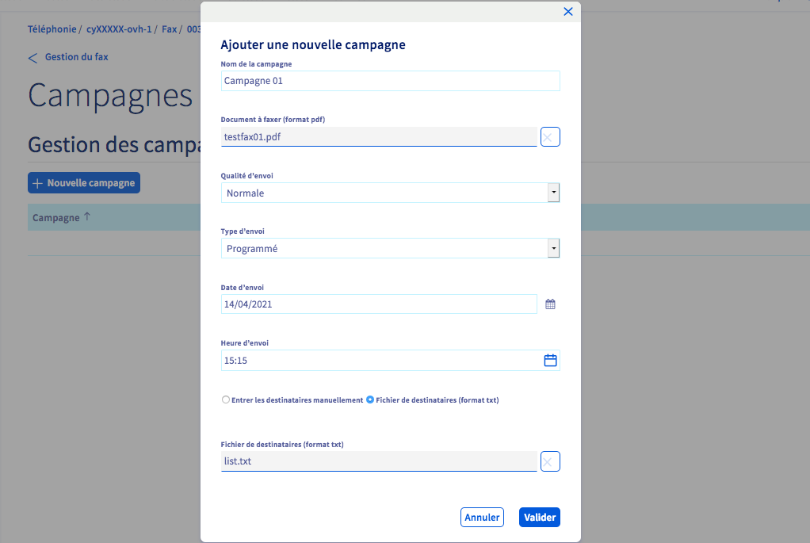

**Dernière mise à jour le 16/02/2022**

## Objectif

Vous pouvez envoyer une campagne de fax depuis votre espace client OVHcloud. Cela vous permet d'obtenir un suivi détaillé du déroulement de la campagne.

**Découvrez comment préparer et envoyer une campagne de fax depuis votre espace client OVHcloud.**

## Prérequis

- Disposer d’une [ligne Fax OVHcloud](https://www.ovhtelecom.fr/fax/).
- Être connecté à votre [espace client OVHcloud](https://www.ovh.com/auth?onsuccess=https%3A%2F%2Fwww.ovhtelecom.fr%2Fmanager&ovhSubsidiary=fr).

## En pratique

### Configurer et déclencher une campagne de fax

Connectez-vous à votre [espace client OVHcloud](https://www.ovh.com/auth?onsuccess=https%3A%2F%2Fwww.ovhtelecom.fr%2Fmanager&ovhSubsidiary=fr) puis sélectionnez `Télécom`{.action}. Cliquez sur `Téléphonie`{.action} puis sur le groupe ou se trouve votre ligne Fax.

Cliquez sur l'onglet `Fax`{.action} puis sur `Campagnes de fax`{.action}.

{.thumbnail}

Cliquez sur le bouton `+ Nouvelle campagne`{.action} pour configurer votre campagne de fax.

{.thumbnail}

Complétez alors les champs requis :

* Nom de la campagne : définissez un nom qui vous permettra de retrouver facilement cette campagne dans votre historique.
* Document à faxer (format pdf) : cliquez sur le bouton `Fichier`{.action} pour sélectionner le document à envoyer, celui-ci doit être au format **PDF**.
* Qualité d'envoi : définissez une qualité d'envoi, entre `Normale`, `Haute` ou `Meilleure`, cette dernière étant préconisée pour faciliter les envois vers les numéros spéciaux ou étrangers.
* Type d'envoi : choisissez entre `Programmé` (vous pourrez alors programmer la date et l'heure d'envoi) et `Manuel` (vous devrez déclencher ultérieurement l'envoi de la campagne).
* Date d'envoi : la date de déclenchement de la campagne.
* Heure d'envoi : l'heure de déclenchement de la campagne.
* Destinataires : vous pouvez choisir de soit `Entrer les destinataires manuellement`{.action}, soit téléverser dans l'espace client un `Fichier de destinataires`{.action} au format **txt**. Dans ce dernier cas, cliquez sur le nouveau bouton `Fichier`{.action} pour ajouter votre liste de destinataires.

> [!primary]
> **Ajout d'un fichier de destinataires au format txt**
>
> Les numéros de destinataires doivent être séparée par une virgule, un point-virgule ou un retour à la ligne. Les numéros doivent contenir entre 6 et 17 chiffres, avec ou sans espaces et peuvent commencer par un +.
>

Une fois tous les champs complétés, cliquez sur `Valider`{.action}.

### Suivre une campagne de fax

Lorsqu'une campagne est créée, elle se retrouve dans le tableau afin de pouvoir la lancer (dans le cadre d'une campagne avec lancement **Manuel**) ou de suivre une campagne lancée.

Cliquez sur le bouton `...`{.action} à droite de la campagne pour avoir accès aux options de suivi :

* `Détails`{.action} : permet d'afficher les détails d'une campagne (nom, référence, statu, état, planification, statut des envois).
* `Lancer la campagne`{.action} : permet de lancer une campagne manuelle.
* `Stopper la campagne`{.action} : permet de stopper une campagne en cours ou planifiée pour la lancer manuellement.
* `Supprimer`{.action} : permet de supprimer une campagne de l'historique.

{.thumbnail}

Une campagne peut avoir plusieurs statuts :

* **N/A** : pas de statut encore disponible. Cela s'applique généralement à une campagne en cours ou non envoyée.
* **Succès** : la campagne s'est déroulée sans difficultés.
* **Succès partiel** : la campagne s'est déroulée mais certains numéros sont probablement invalides. Vous pouvez avoir le détail de la campagne en cliquant sur le bouton `...`{.action} puis sur `Détails`{.action}
* **En erreur** : la campagne n'a pas pu être réalisée. Cliquez sur `...`{.action} puis sur `Détails`{.action} pour obtenir des informations complémentaires.

## Aller plus loin

Échangez avec notre communauté d'utilisateurs sur <https://community.ovh.com>
