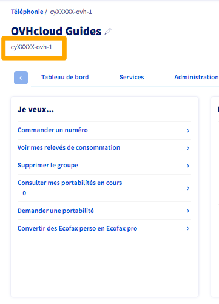

**Dernière mise à jour le 04/06/2021**

## Objectif

Un **groupe de téléphonie** (aussi appelé **groupe de facturation** ou **billing account**) est un  conteneur dans lequel sont regroupés vos services de téléphonie, qu'il s'agisse de lignes téléphoniques ou de numéros alias.

Vous pouvez créer plusieurs groupes de téléphonie, pour mieux organiser vos services VoIP, afin d'administrer séparément chaque entité de votre entreprise, ou encore pour séparer la facturation de vos services, chaque groupe générant sa propre facture.

Rattacher plusieurs lignes au sein d'un seul groupe permet aussi la supervision de lignes entre elles, depuis un téléphone ou un logiciel compatible.

**Découvez comment gérer des groupes de téléphonie et déplacer vos lignes SIP et numéros alias entre ces groupes**

## Prérequis

- Être connecté à l'[espace client OVHcloud](https://www.ovh.com/auth?onsuccess=https%3A%2F%2Fwww.ovhtelecom.fr%2Fmanager&ovhSubsidiary=fr).
- Disposer de [lignes SIP OVHcloud](https://www.ovhtelecom.fr/telephonie/voip/) et/ou de [numéros alias OVHcloud](https://www.ovhtelecom.fr/telephonie/numeros/).

## En pratique

Afin d'accéder à la gestion des groupes de téléphonie, connectez-vous à votre [espace client OVHcloud](https://www.ovh.com/auth?onsuccess=https%3A%2F%2Fwww.ovhtelecom.fr%2Fmanager&ovhSubsidiary=fr). Dans la partie `Télécom`{.action}, cliquez sur `Téléphonie`{.action}.

Les différents groupes apparaissent alors. Cliquez sur un groupe pour afficher la liste des services qu'il contient.

{.thumbnail}

### Renommer un groupe de téléphonie

Il peut être utile de bien nommer vos groupes de téléphones dès lors que vous possédez un nombre important de services.

Chaque groupe possède un nom interne unique (1 ci-dessous) que vous ne pouvez pas modifier. Vous pouvez par contre modifier le nom personnalisé du groupe en cliquant sur le crayon (2 ci-dessous) à droite du nom du groupe.

{.thumbnail}

### Ajouter un groupe de téléphonie

L'ajout d'un groupe de téléphonie est gratuit. Pour créer un nouveau groupe, depuis un groupe existant, cliquez sur l'onglet `Administration`{.action} puis sur `Ajouter un groupe`{.action}.

{.thumbnail}

Prenez connaissance des contrats et conditions, valides-les puis clquez sur `Commander un nouveau groupe de téléphonie (Gratuit)`{.action}

{.thumbnail}

La création du groupe prend quelques minutes. Il sera alors automatiquement ajouté à la liste de vos groupes dans le menu de gauche. Rafraîchissez votre espace client si vous ne le voyez pas apparaître.

### Regrouper des services dans un groupe de téléphonie 

Vous pouvez déplacer des lignes téléphones et numéros alias d'un groupe à un autre, afin de répondre à plusieurs cas d'usage, telle qu'une facturation distincte entre entités au sein d'une entreprise.

Un autre cas d'usage fréquent est la supervision, depuis un téléphone ou un logiciel de type POPC, d'un ensemble de lignes.
Ainsi, une personne en charge de l'accueil téléphonique d'une entreprise peut connaître en temps réel le statut (libre ou occupé) des lignes de ses collègues et ainsi déterminer si un transfert d'appel est possible.
Pour qu'une ligne soit supervisée, elle doit être dans le **même groupe de téléphonie** que la ligne qui la supervise.

Afin de déplacer une ligne dans un nouveau groupe, sélectionnez celui-ci dans le menu de gauche puis cliquez sur l'onglet `Administration`{.action} et enfin sur `Regroupement de lignes`{.action}.

{.thumbnail}

Sélectionnez d'abord le groupe qui contient actuellement les lignes souhaitées, puis cochez ces dernières. Validez en cliquant sur `Attacher les services sélectionnés`{.action}.

{.thumbnail}

Cette action prend quelques minutes pour être prise en compte.

#### Cas particulier des lignes liées à une offre Découverte

Les lignes liées à un forfait découverte ne peuvent être déplacées dans un autre groupe de téléphonie.
De même, il n'est pas possible d'intégrer d'autres lignes dans un groupe de téléphonie comportant une ligne découverte.

#### Cas particulier des lignes liées à un accès à Internet OVHcloud

Les accès à Internet OVHcloud comprennent souvent des lignes téléphoniques qu'il faut activer dans l'espace client OVHcloud, dans la partie `Accès Internet`{.action}. Ces lignes, une fois activées, génèrent leur propre groupe de téléphonie (un groupe pour chaque accès à Internet).
 Ce groupe est nommé *ovhtel-XXXXXXXX-X*, contrairement à un groupe de téléphonie classique dont le nom contient votre identifiant client, par exemple *az123456-ovh-1*.

|Groupe de téléphonie classique|Groupe de téléphonie lié à un accès à Internet OVHcloud| 
|---|---| 
|{.thumbnail}|{.thumbnail}|

> [!warning]
> Le déplacement d'une ligne liée à un accès à Internet OVHcloud, depuis un groupe *ovhtel-XXXXXXXX-X* vers un autre groupe de téléphonie, n'est pas autorisé.
>

Vous pouvez néanmoins ajouter des lignes et des numéros dans un groupe *ovhtel-XXXXXXXX-X*, leur facturation sera regroupée avec celle de l'accès à Internet lié à ce groupe.

#### Cas particulier des numéros fixes SDA

OVHcloud propose une offre de numéros fixes SDA (Sélection Directe à l'Arrivée) dédiés à la redirection d'appels. Ces numéros sont fournis par « blocs » de 50 ou 100 numéros consécutifs.

Vous pouvez déplacer un bloc, dans son ensemble, de numéros fixes SDA commandés chez OVHcloud d'un groupe vers un autre.
  Par contre, il n'est pas possible de déplacer un numéro unitaire appartenant à un tel bloc de numéros.

### Gérer les options d'un groupe de téléphonie

Le menu `Options du groupe`{.action}, dans l'onglet `Administration`{.action}, vous permet d'activer ou désactiver des options d'affichage des appels.

{.thumbnail}

### Supprimer un groupe de téléphonie

> [!warning]
> La suppression d'un groupe de téléphonie entraîne automatiquement **une demande de résiliation de tous les services qu'il contient**.
>
> Afin d'éviter cela, nous vous conseillons de ne supprimer que des groupes préalablement vidés de tout service.
> Vous pouvez déplacer ces services dans un autre groupe ou, si c'est votre souhait, résilier individuellement chaque service.
>

Pour supprimer un groupe de téléphonie, sélectionnez-le dans le menu de gauche puis cliquez sur l'onglet `Administration`{.action} et sur `Supprimer le groupe`{.action}.

{.thumbnail}

La suppression d'un groupe de téléphonie n'est pas à effet immédiat, elle est planifiée à la date de votre prochaine facturation. Jusqu'à cette date, elle peut être annulée.

#### Annuler une demande de suppression d'un groupe de téléphonie

Pour annuler une demande de suppression, cliquez sur `Supprimer le groupe`{.action} puis sur `Annuler la suppression`{.action}.

{.thumbnail}

L'annulation sera prise en compte immédiatement.

## Aller plus loin

Échangez avec notre communauté d'utilisateurs sur <https://community.ovh.com/>.
