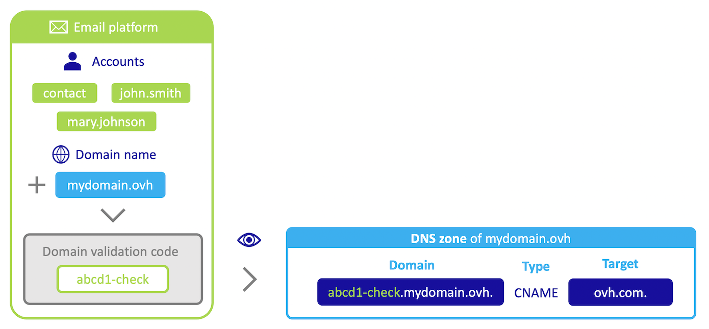
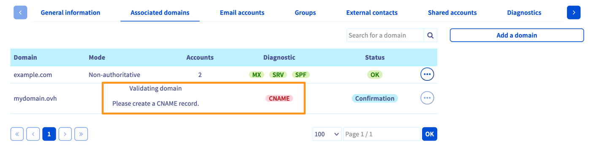
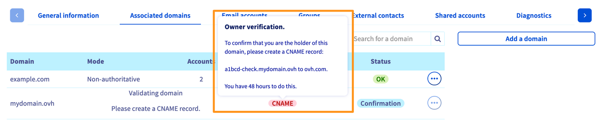
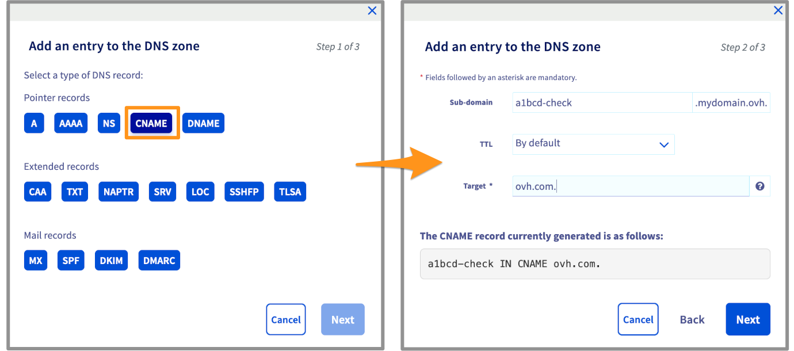
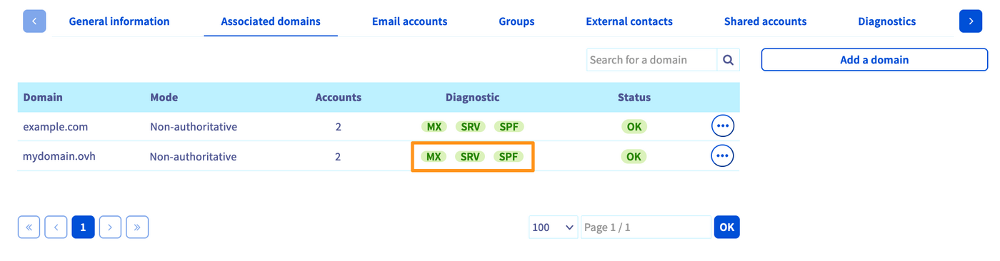

> [!primary]
> Esta tradução foi automaticamente gerada pelo nosso parceiro SYSTRAN. Em certos casos, poderão ocorrer formulações imprecisas, como por exemplo nomes de botões ou detalhes técnicos. Recomendamos que consulte a versão inglesa ou francesa do manual, caso tenha alguma dúvida. Se nos quiser ajudar a melhorar esta tradução, clique em "Contribuir" nesta página.
>

## Objetivo

Quando adiciona um domínio à sua plataforma de e-mail, poderá ser-lhe solicitada a configuração de um registo CNAME na zona DNS. Esta tem como objetivo assegurar que o nome de domínio afetado é legítimo para ser utilizado na plataforma de e-mail.

> [!primary]
>
> Se o domínio adicionado for gerido na mesma conta de cliente que a plataforma de e-mail, mais especificamente a zona DNS, não é necessário configurar nenhum registo CNAME.

**Saiba como validar o seu domínio na sua plataforma de e-mail adicionando um registo CNAME.**

## Requisitos

- Ter acesso à [Área de Cliente OVHcloud](/links/manager), na secção `Web Cloud`{.action}.
- Dispor de uma solução [Exchange](/links/web/emails) ou [Email Pro](/links/web/email-pro).
- Ter adicionado um domínio à sua plataforma de e-mail. Se necessário, pode consultar o guia " [Adicionar um domínio a uma plataforma de e-mail](/pages/web_cloud/email_and_collaborative_solutions/microsoft_exchange/exchange_adding_domain) ".
- Poder [configurar a zona DNS](/pages/web_cloud/domains/dns_zone_edit) do domínio em causa a partir da Área de Cliente OVHcloud ou da interface de gestão onde está registado.

## Instruções

### Porquê criar um registo CNAME?

O registo CNAME é utilizado aqui como alias, e aponta para um destino que por sua vez envia para um endereço IP. Por isso, não se trata, por natureza, de um registo associado a um serviço de e-mail.

No âmbito das nossas ofertas [**Hosted Exchange**](/links/web/emails-hosted-exchange) e [**Email Pro**](/links/web/email-pro), este registo CNAME é utilizado como código de validação (token) que será visível na zona DNS do nome de domínio a validar. O objetivo é verificar se o utilizador da plataforma de e-mail é o gestor do nome de domínio que adiciona.

No diagrama abaixo, a plataforma de e-mail ([Exchange](/links/web/emails) ou [Email Pro](/links/web/email-pro)) é representada pelo quadro verde.<br>
Para formar os endereços de e-mail adicione contas (aqui representadas por " **contacto** ", " **john.smith** " e " **mary.johnson** ").<br>
O domínio **mydomain.ovh** foi adicionado à plataforma de e-mail (consulte o guia " [Adicionar um domínio a uma plataforma de e-mail](/pages/web_cloud/email_and_collaborative_solutions/microsoft_exchange/exchange_adding_domain) ").<br>
Um código de validação é gerado pela plataforma (sob a forma " **abcd1-check** " no nosso exemplo).<br>
Se a zona DNS do nome de domínio **mydomain.ovh** não for gerida na mesma conta de cliente OVHcloud ou for gerida a partir de uma interface de gestão externa, este código deve ser adicionado sob a forma de um registo CNAME. Este registo é representado pelo quadro azul no exemplo.<br>
A plataforma de e-mail é capaz de observar os registos DNS do nome de domínio **mydomain.ovh** para verificar a presença do código de validação.

{.thumbnail}

Depois de a plataforma de e-mail ter lido o código de validação na zona DNS do nome de domínio **mydomain.ovh**, será possível formar os endereços **contact@mydomain.ovh**, **john.smith@mydomain.ovh** e **mary.johnson@mydomain.ovh**.

### Etapa 1 - Compreender o diagnóstico CNAME da OVHcloud <a name="step1"></a>

A etiqueta de diagnóstico **CNAME** será apresentada no separador `Domínios associados`{.action} da plataforma de e-mail, após a adição do domínio.

{.thumbnail}

No exemplo acima, a pastilha é vermelha. Eis as possíveis razões para este diagnóstico:

- **o domínio declarado não é gerido na mesma conta de cliente OVHcloud que a sua plataforma de e-mail**: realize [a etapa 3](#step3) deste guia a partir da Área de Cliente da conta OVHcloud que gere a zona DNS do domínio.
- **o domínio declarado utiliza servidores DNS externos à OVHcloud**: o domínio está registado na OVHcloud, mas utiliza servidores DNS " personalizados ". Para o verificar, na secção `Nomes de domínio`{.action}, na coluna à esquerda, selecione o domínio em causa. No separador `Informações gerais`{.action}, verifique a menção " Servidores DNS ". Se a janela `Personalizar`{.action} estiver definida, deverá aceder à interface de gestão dos servidores DNS listados no separador `Servidores DNS`{.action}

{.thumbnail}

- **o domínio declarado não está registado na OVHcloud e não utiliza servidores DNS da OVHcloud**: o domínio está registado noutro agente de registo. Deve verificar a partir da interface do agente de registo do domínio e verificar os servidores DNS utilizados para identificar onde deve configurar a zona DNS.

### Etapa 2 - Obter o código de validação <a name="step2"></a>

Abra o separador `Domínios associados`{.action} e clique na etiqueta vermelha `CNAME` na coluna "diagnóstico" para obter as informações necessárias.

O registo CNAME é descrito na caixa de diálogo que é apresentada.

{.thumbnail}

Registe o código único visível na linha do meio (`a1bcd-check.mydomain.ovh to ovh.com.` no exemplo acima).

### Etapa 3 - Criar o registo CNAME <a name="step3"></a>

Selecione o separador apropriado para a sua situação:

> [!tabs]
> **A partir da Área de Cliente OVHcloud**
>> Na secção `Web Cloud`{.action}, clique em `Nomes de domínio`{.action} e, em seguida, no domínio em causa. De seguida, selecione o separador `Zona DNS`{.action}.<br>
>> É apresentada a configuração da sua zona DNS. Para adicionar um registo CNAME, clique no botão `Adicionar uma entrada`{.action} à direita.<br>
>> Na nova janela, vários registos DNS são propostos. Clique em `CNAME`{.action} e complete os campos em função das informações obtidas durante [etapa 2](#step2) deste guia.<br>
>> Por exemplo, se o código de validação for " **a1bcd-check** ", este deve ser introduzido na caixa " subdomínio ". Por fim, indique " **ovh.com.** " na parte " destino " tendo presente o " **.**" final.
>>
>> {.thumbnail}
>>
>> Depois de introduzida a informação, clique no botão `Seguinte`{.action}: Certifique-se de que as informações estão corretas e clique em `Confirmar`{.action}.<br>
>>
>> > [!warning]
>> >
>> > A modificação requer um tempo de propagação normalmente aplicado em alguns minutos. Pode, no entanto, chegar a um máximo de 24 horas.
>>
> **A partir de uma interface externa à OVHcloud**
>>
>> Aceda à interface que gere a zona DNS do domínio e adicione um registo do tipo CNAME a esta última, com os seguintes parâmetros:
>>
>> - **Subdomínio**: Introduza o valor " **xxxxx-check** " substituindo os " **x** " pelo código único indicado na etapa 2 [deste guia](#step2).
>> - **Destino**: introduza o valor " **ovh.com.** " tendo presente o " **.** " final se a sua interface de introdução não o fizer automaticamente.
>>
>> Valide esta alteração na sua zona DNS.
>>
>> > [!warning]
>> >
>> > Esta alteração requer um tempo de propagação, que normalmente é aplicado em alguns minutos. Pode, no entanto, chegar a um máximo de 24 horas.
>> >
>>
>> Eis um exemplo de resposta DNS após adicionar um registo CNAME de validação:
>>
>> ```bash
>> ab1cd-check.mydomain.ovh. 3600	IN	CNAME	ovh.com.
>> ```

Para verificar se a configuração do registo CNAME foi lida corretamente pela sua plataforma de e-mail, aceda a esta última e aceda ao separador `Domínios associados`{.action}. Se a etiqueta `CNAME` deixar de aparecer na coluna " diagnóstico ", o domínio será adicionado com êxito. Caso contrário, é possível que a propagação ainda não esteja concluída.

{.thumbnail}

## Quer saber mais?

Fale com a nossa comunidade de utilizadores em <https://community.ovh.com/en/>.