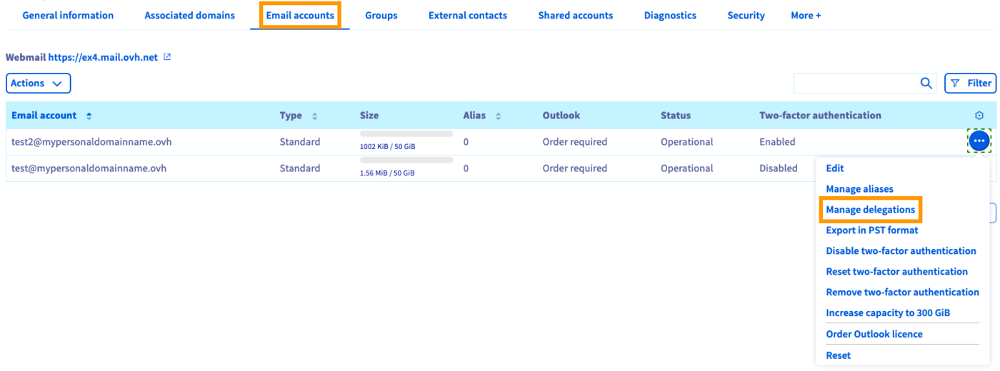
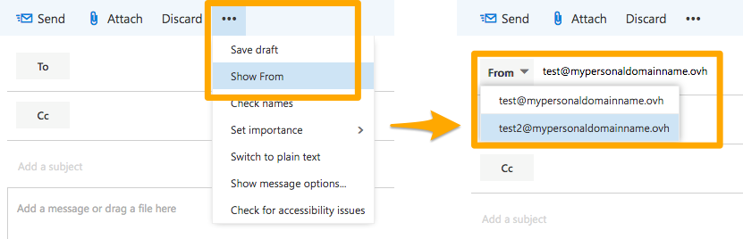
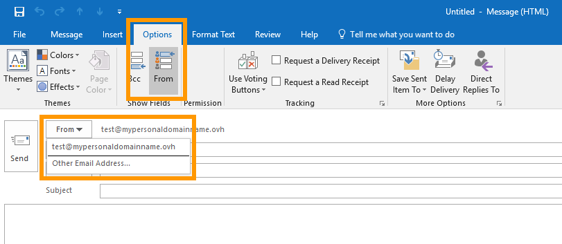

## Objetivo

Os serviços Exchange e Email Pro permitem beneficiar de endereços de e-mail profissionais, que facilitam o trabalho colaborativo graças a diferentes funcionalidades. Uma delas permite delegar direitos específicos (como o de envio ou de acesso) entre diferentes contas de e-mail.

**Saiba como delegar os direitos da sua conta  noutro agente.**

## Requisitos

- Dispor de um serviço [OVHcloud Exchange](/links/web/emails-hosted-exchange) ou [E-mail Pro](/links/web/email-pro) já configurado.

> [!warning]
>
> **Para a oferta [Email Pro](/links/web/email-pro)** as funcionalidades de delegação descritas neste guia são utilizadas unicamente através de [Webmail](/links/web/email). Os protocolos que permitem a sua utilização através de um programa de correio eletrónico necessitam de dispor de uma conta [Exchange](/links/web/emails-hosted-exchange).

- Ter acesso à [Área de Cliente OVHcloud](/links/manager).
- Dispor dos identificadores relativos à conta  que beneficiará dos novos direitos delegados.

## Instruções

Antes de começar, defina o(s) direito(s) que vai delegar. Relembramos que, ao criar uma delegação, atribui a uma ou várias contas  direitos adicionais na conta  em causa.

|Permissões|Descrição|
|---|---|
|Direito de envio|Permite realizar um envio "como". Não será a conta que efetua a remessa que aparecerá como expedidor, mas sim a conta para a qual dispõe do direito de envio. Não há qualquer indicação de que a mensagem tenha sido enviada através de outra pessoa.|
|Direito de enviar|Permite realizar um envio "por parte de". Não será a conta que efetua a remessa que irá aparecer como expedidor, mas sim a conta para a qual tem o direito de enviar da parte de envios. No entanto, deve ser assinalado que a mensagem foi enviada da conta que efetuou o envio.|
|Direito de acesso|Dá acesso apenas de leitura à conta a que a delegação se refere. Este acesso não permite efetuar envios, mas sim consultar o conteúdo.|

> [!warning]
>
> Não tem a possibilidade de acumular o "direito de envio" com o "direito de enviar da parte de". As outras combinações são possíveis.
> 

Quando identificar a conta que a delegação lhe diz respeito, determinar os direitos que irá delegar, bem como a(s) conta(s) que irá(ão) beneficiar destes direitos adicionais, siga para a primeira etapa.

### 1 - criar a delegação

Para efetuar esta operação, aceda à [Área de Cliente OVHcloud](/links/manager):

- **Exchange**: Clique em `Microsoft`{.action} na barra à esquerda e, a seguir, em `Exchange`{.action}.. 
- **Email Pro**: Clique em `Email Pro`{.action}.

A seguir, clique no nome do serviço de e-mail no qual se encontra a conta em que se encontra a criação da delegação. Por fim, clique no separador `Contas de e-mail`{.action}.

A tabela que aparecer apresenta as contas associadas ao seu serviço de e-mail. Clique nos três pontos à direita da conta para a qual deseja criar uma delegação e, a seguir, em `Gerir as delegações`{.action}.

{.thumbnail}

Na nova página, selecione as permissões que deseja delegar. Deve fazê-los corresponder a uma ou várias contas beneficiárias. A seguir, clique em `Seguinte`{.action}.

{.thumbnail}

Levem alguns instantes para verificar atentamente o resumo das alterações. Se tudo estiver correto, clique em `Validar`{.action}. Dentro de alguns minutos, a delegação será criada nos nossos servidores.

Uma vez configurada a delegação, *test@mypersonaldomain.ovh* poderá efetuar as ações selecionadas na conta *test2@mypersonaldomain.ovh*.

### Etapa 2: utilizar os direitos delegados

Agora que a delegação está em funções, só falta utilizá-la. Certifique-se de que possui os dados de acesso relativos à conta de e-mail que beneficia dos novos direitos delegados.

A forma de o fazer é diferente consoante os direitos que delegou e o software ou interface web que utiliza para aceder à sua conta de e-mail. Consulte este manual em função dos direitos que delegou.

- [Utilizar o seu "direito de acesso"](#access)

- [Utilizar o seu "direito de envio"](#send-as)

- [Utilizar o seu "direito de enviar da parte de"](#send-on-behalf)

> [!warning]
>
> Esta solução requer conhecimentos sobre o programa ou a interface que vai utilizar. Apresentamos a seguir algumas informações sobre como a realizar. No entanto, se encontrar dificuldades, recomendamos que recorra a um [prestador de serviços especializado](/links/partner) e/ou que contacte o editor do programa ou da interface. Não poderemos proporcionar-lhe assistência técnica.
>

#### 2.1 Utilizar o seu "direito de acesso" 

- **A partir do webmail Outlook Web App (OWA)**

Aceda ao endereço [Webmail](/links/web/email) e introduza os identificadores da conta de e-mail que disponham do direito delegado. Depois de aceder, clique com o botão direito do rato no nome da conta no menu à esquerda e selecione `Adicionar uma pasta partilhada`{.action}.

Na janela que aparecer, indique o nome da conta para a qual beneficia do direito delegado e clique em `Adicionar`{.action}. A conta aparece no menu à esquerda, permitindo-lhe explorar o seu conteúdo.

{.thumbnail}

- **A partir do software Outlook para Windows**

> [!warning]
>
> A utilização desta funcionalidade **via Outlook** só está disponível para uma conta de e-mail [Exchange](/links/web/emails-hosted-exchange).

No Outlook, clique em `Ficheiro`{.action} na barra de menu no topo do ecrã e, a seguir, em `Parâmetros da conta`{.action}. No menu pendente, clique novamente em `Parâmetros da conta`{.action}. Na nova janela, selecione a conta com direito delegado e clique em `Alterar`{.action}. 

{.thumbnail}

Clique agora em `Parâmetros adicionais`{.action}. Na nova janela, aceda ao separador `Avançado`{.action} e clique em `Adicionar`{.action}. Introduza o nome da conta para a qual beneficia do direito delegado e valide a adição até ao seu termo. A conta aparece no menu à esquerda do seu software, permitindo-lhe explorar o seu conteúdo.

{.thumbnail}

#### 2.2 Utilizar o seu "direito de envio" 

- **A partir do webmail Outlook Web App (OWA)**

Aceda ao endereço [Webmail](/links/web/email) e introduza os identificadores da conta de e-mail que disponham do direito delegado. Uma vez ligado, inicie a redação de uma nova mensagem pressionando o botão `+ Novo`.action}.

Na zona que aparecer, clique no botão que representa três pontos e, a seguir, em `Apresentar o campo De`{.action}. A seguir, clique no botão `De`{.action} e selecione o endereço que aparecerá como remetente (para o qual dispõe do direito delegado). Se esta não aparecer, elimine a já introduzida e inscreva-a. 

Só precisa de redigir a sua mensagem e enviá-la. 

{.thumbnail}

- **A partir do software Outlook para Windows**

> [!warning]
>
> A utilização desta funcionalidade **via Outlook** só está disponível para uma conta de e-mail [Exchange](/links/web/emails-hosted-exchange).

No Outlook, inicie a redação de uma nova mensagem. Certifique-se de que o botão `De`{.action} aparece na janela de redação. Se não for o caso, aceda ao separador `Opções`{.action} e clique em `Apresentar De`{.action}.

A seguir, clique no botão `De`{.action} e selecione o endereço que aparecerá como remetente (para o qual dispõe do direito delegado). Se esta não aparecer, clique em `Outros`{.action}, introduza o endereço pretendido e valide. 

Só precisa de redigir a sua mensagem e enviá-la. 

{.thumbnail}

#### 2.3 Utilizar o seu "direito de enviar da parte de" 

- **A partir do webmail Outlook Web App (OWA)**

Aceda ao endereço [Webmail](/links/web/email) e introduza os identificadores da conta de e-mail que disponham do direito delegado. Uma vez ligado, inicie a redação de uma nova mensagem pressionando o botão `+ Novo`.action}.

Na zona que aparece, clique no botão que representa três pontos e, a seguir, em `Mostrar o campo De`{.action}. A seguir, clique no botão `De`{.action} e selecione o endereço que aparecerá como remetente (para o qual dispõe do direito delegado). Se esta não aparecer, elimine a já introduzida e inscreva-a. 

Só precisa de redigir a sua mensagem e enviá-la. 

{.thumbnail}

- **A partir do software Outlook para Windows**

> [!warning]
>
> A utilização desta funcionalidade **via Outlook** só está disponível para uma conta de e-mail [Exchange](/links/web/emails-hosted-exchange).

No Outlook, inicie a redação de uma nova mensagem. Certifique-se de que o botão `De`{.action} aparece na janela de redação. Se não for o caso, aceda ao separador `Opções`{.action} e clique em `Apresentar De`{.action}.

A seguir, clique no botão `De`{.action} e selecione o endereço que aparecerá como remetente (para o qual dispõe do direito delegado). Se esta não aparecer, clique em `Outros`{.action}, introduza o endereço pretendido e valide. 

Só precisa de redigir a sua mensagem e enviá-la. 

{.thumbnail}

## Quer saber mais? 

Para serviços especializados (referenciamento, desenvolvimento, etc), contacte os [parceiros OVHcloud](/links/partner).

Se pretender usufruir de uma assistência na utilização e na configuração das suas soluções OVHcloud, consulte as nossas diferentes [ofertas de suporte](/links/support).

[Utilizar o endereço de e-mail a partir do webmail Outlook Web App (OWA)](/pages/web_cloud/email_and_collaborative_solutions/using_the_outlook_web_app_webmail/email_owa)

[Partilhar uma pasta através do webmail OWA](/pages/web_cloud/email_and_collaborative_solutions/using_the_outlook_web_app_webmail/owa_directory_sharing)

[Utilização de grupos de difusão (mailing lists)](/pages/web_cloud/email_and_collaborative_solutions/microsoft_exchange/feature_groups)

Fale com nossa [comunidade de utilizadores](/links/community).