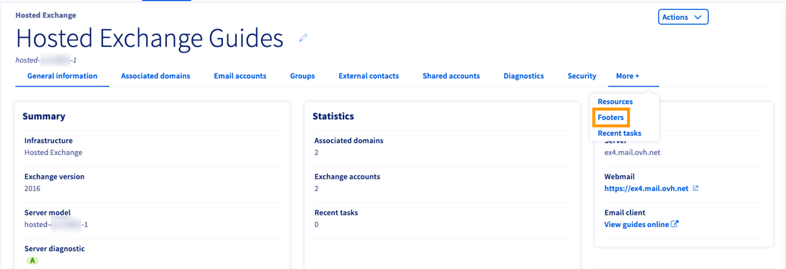
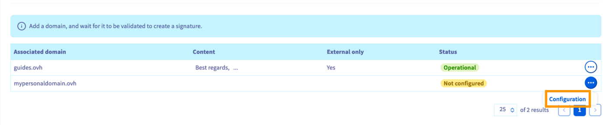
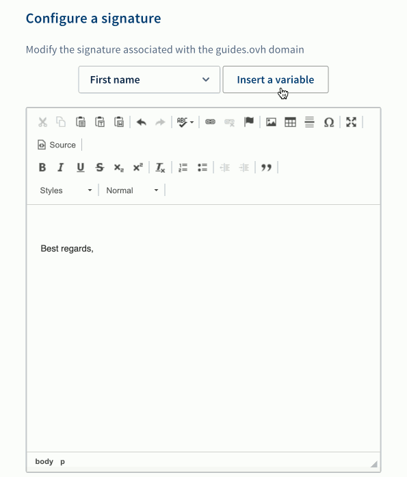
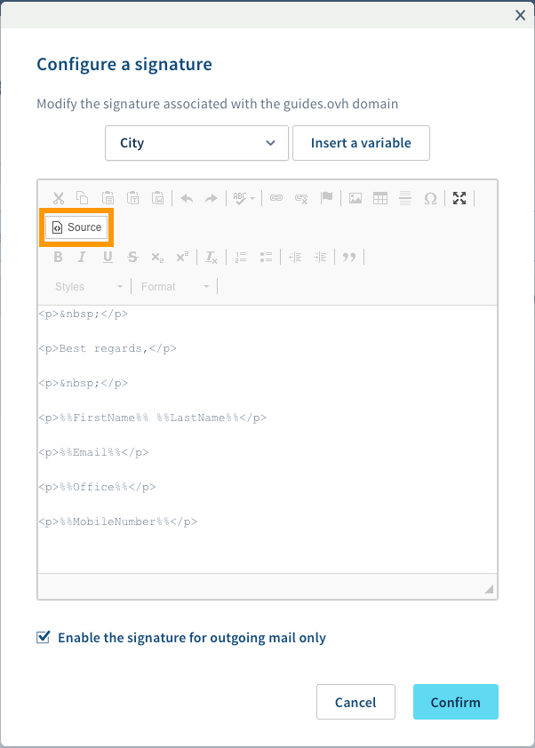
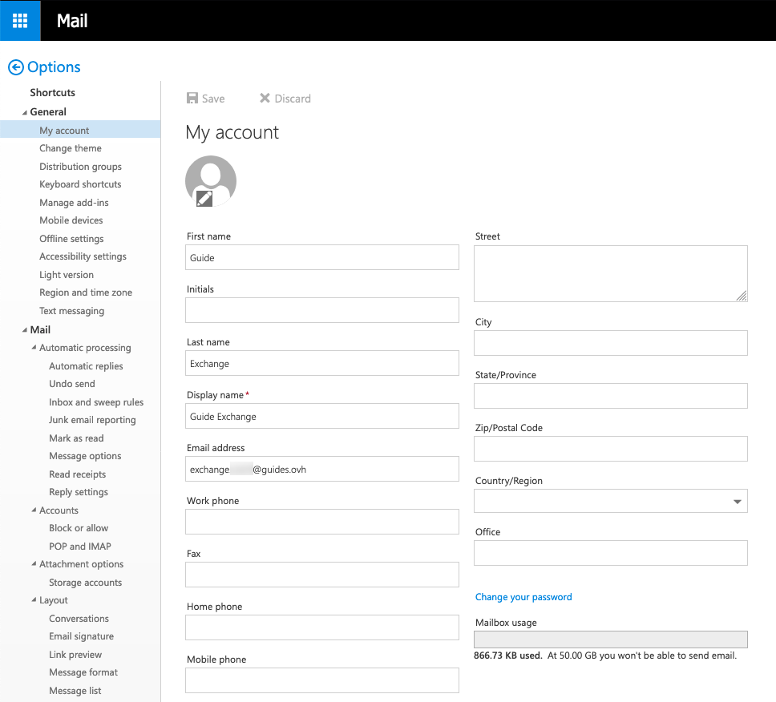

## Sumário

Na Área de Cliente OVHcloud, pode criar assinaturas universais (footers) para endereços de e-mail que usem o mesmo domínio (assinaturas «empresariais»). Elas serão adicionadas de forma automática a todos os e-mails que enviar.

**Este guia explica como criar assinaturas automáticas através da Área de Cliente OVHcloud.**

## Requisitos

- Dispor de um serviço [OVHcloud Exchange](/links/web/emails-hosted-exchange) ou [E-mail Pro](/links/web/email-pro) já configurado.

<!-- CP-NAV-START:web-exchange -->
<!-- CP-NAV-START:web-email-pro -->
---

### Acesso à Área de Cliente OVHcloud

**Exchange:**

- **Ligação direta:** [Exchange](/links/control-panel/web-exchange)
- **Caminho de navegação:** `Web Cloud`{.action} > `Exchange`{.action} > Selecione a sua plataforma

**E-mail Pro:**

- **Ligação direta:** [E-mail Pro](/links/control-panel/web-email-pro)
- **Caminho de navegação:** `Web Cloud`{.action} > `E-mail Pro`{.action} > Selecione a sua plataforma

---
<!-- CP-NAV-END:web-email-pro -->
<!-- CP-NAV-END:web-exchange -->

## Instruções

No menu horizontal, clique em `Mais +`{.action} e selecione `Footers`{.action}.

{.thumbnail}

Nesta secção, vai encontrar os seus domínios associados. Poderá criar uma assinatura para cada um deles. Clique em `...`{.action} e, a seguir, em `Configuration`{.action} para abrir o editor HTML.

{.thumbnail}

O editor oferece uma série de variáveis correspondentes aos dados do utilizador na sua configuração de conta. É possível, por exemplo, compor uma mensagem de remate genérica e acrescentar um fecho adequado ou informações de contacto por baixo. Clique na seta para escolher uma variável e, a seguir, em `Insert a variable`{.action} para a acrescentar ao painel de edição.

{.thumbnail}

A assinatura é criada por meio de tags HTML, o que oferece algumas opções de formatação. Use a barra de ferramentas em cima para personalizar a assinatura. Também pode verificar o código HTML ao clicar em `Source`{.action}.

{.thumbnail}

Selecione a caixa «Enable the signature for outgoing mail only» para evitar que a assinatura seja adicionada a e-mails enviados a utilizadores do mesmo domínio. Clique em `Confirm`{.action} quando tiver concluído a operação. Agora, a assinatura será adicionada a todos os e-mails enviados a partir das contas associadas a este domínio. Depois de criadas, as assinaturas podem ser editadas ou eliminadas na Área de Cliente OVHcloud.

Antes de criar assinaturas, tenha em consideração o seguinte:

- Além de «Nome», «Sobrenome» e «Nome de exibição», as informações de conta não podem ser editadas a partir da Área de Cliente: elas têm de ser especificadas no OWA do utilizador («Options», «General», «My account»).

{.thumbnail}

- A assinatura será adicionada ao corpo do e-mail sem quebras, pelo que aconselhamos que a comece com pelo menos uma linha em branco.
- No OWA não se indica se o domínio tem uma assinatura ativa e **não há sincronização**. Se os utilizadores acrescentarem uma [assinatura própria](/pages/web_cloud/email_and_collaborative_solutions/using_the_outlook_web_app_webmail/email_owa#adicionar-assinatura), os e-mails vão incluir tanto a assinatura individual quanto a assinatura associada ao domínio.
- O editor permite formatação HTML, hiperligações, imagens, etc. Contudo, as assinaturas não deverão contar demasiado com estas opções. Os destinatários podem usar clientes de e-mail incompatíveis com HTML e imagens integradas, ou então as assinaturas podem ser exibidas de forma distorcida. Tenha em conta que as tags HTML serão removidas por completo se a mensagem for enviada como «Texto simples» a partir do OWA.
- O serviço não conta com a opção «Initials». Se introduzir esta variável, não verificará nenhum efeito.

## Saiba mais 

[Guia de utilização do Outlook Web App](/pages/web_cloud/email_and_collaborative_solutions/using_the_outlook_web_app_webmail/email_owa)

[Atribuir permissões a uma conta de e-mail](/pages/web_cloud/email_and_collaborative_solutions/microsoft_exchange/feature_delegation)

[Partilha de calendários em OWA](/pages/web_cloud/email_and_collaborative_solutions/using_the_outlook_web_app_webmail/owa_calendar_sharing)

Fale com nossa [comunidade de utilizadores](/links/community).
