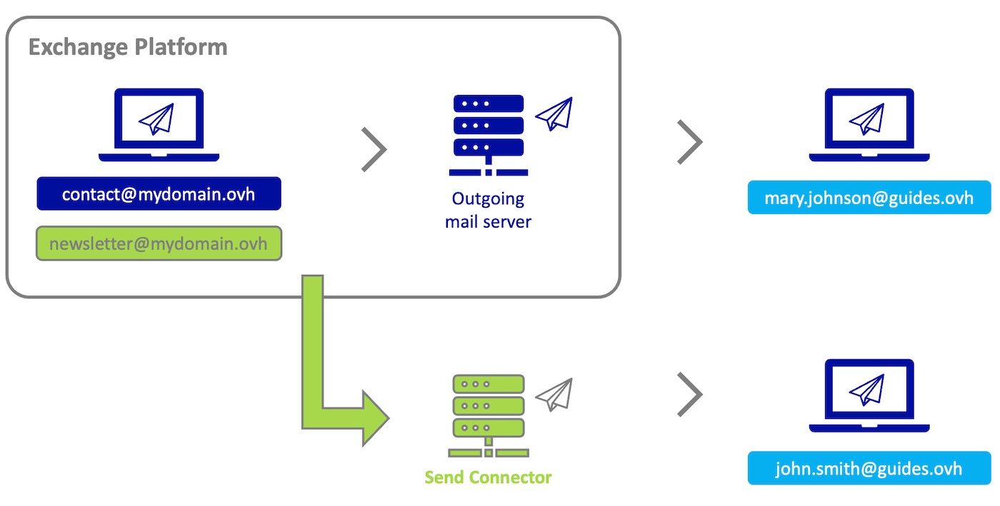

<style>
 pre {
     font-size: 14px !important;
 }
 pre.bgwhite {
   background-color: #fff !important;
   color: #000 !important;
   font-family: monospace !important;
   padding: 5px !important;
   margin-bottom: 5px !important;
 }
 pre.bgwhite code {
   background-color: #fff !important;
   border: solid 0px transparent !important;
   font-family: monospace !important;
   font-size: 0.90em !important;
   color: #000 !important;
 }
 .small {
     font-size: 0.90em !important;
 }
</style>

## Objectif

Ajouter un connecteur d'envoi SMTP à votre plateforme Exchange permet, pour une ou plusieurs adresses e-mail Exchange, d'envoyer des e-mails en passant par un serveur d'envoi externe à votre plateforme Exchange. Il peut être utilisé, par exemple, dans le cadre de campagne d'envoi massif d'e-mail, ou encore d'utiliser une solution antispam externe. Seules les adresses e-mail attachées au connecteur d'envoi utiliseront ce dernier.


**Découvrez comment configurer un connecteur d'envoi sur votre plateforme Private Exchange.**

**Exemple**

L'adresse e-mail **newsletter@mydomain.ovh** est attachée au connecteur d'envoi (Send Connector) configuré sur la plateforme Exchange. L'adresse **contact@mydomain.ovh** n'est pas rattachée au connecteur d'envoi.

{.thumbnail}

Voici le contexte du schéma ci-dessus:

- **contact@mydomain.ovh** envoie un e-mail à l'adresse **mary.johnson@guides.ovh** : il s'agit d'un envoi classique, car le connecteur d'envoi n'a pas été attaché à l'adresse **contact@mydomain.ovh**. **mary.johnson@guides.ovh** reçoit donc l'e-mail en provenance du serveur d'envoi de la plateforme Exchange (*Outgoing mail server*).
- **newsletter@mydomain.ovh** envoie un e-mail à l'adresse **john.smith@guides.ovh** : **newsletter@mydomain.ovh** a été attaché au connecteur d'envoi, **john.smith@guides.ovh** recevra l'e-mail en provenance du serveur d'envoi du connecteur (*Send Connector*) paramétré sur la plateforme Exchange.


## Prérequis

- Avoir souscrit à une plateforme [Private Exchange OVHcloud](https://www.ovhcloud.com/fr/emails/private-exchange/) ou [Trusted Exchange OVHcloud](https://www.ovhcloud.com/fr/enterprise/products/trusted-exchange/).
- Être connecté à [l'espace client OVHcloud](https://www.ovh.com/auth/?action=gotomanager&from=https://www.ovh.com/fr/&ovhSubsidiary=fr).
- Être connecté aux [API OVHcloud](https://api.ovh.com/).
- Disposer des paramètres nécessaires au paramétrage du connecteur d'envoi. Rapprochez-vous du prestataire qui vous délivre le service.

## En pratique

La mise en place d'un connecteur d'envoi se fait en 3 étapes.

- [1. Ajouter le connecteur d'envoi à votre plateforme](#addconnector) : Vous entrez les paramètres du connecteur d'envoi que votre prestataire vous a transmis.
- [2. Configurer une adresse e-mail sur un connecteur d'envoi](#addaddress) : Vous attachez le connecteur d'envoi à une ou plusieurs adresses e-mail afin qu'elles envoient au travers de ce connecteur lors d'un envoi .
- [3. Vérifier que votre adresse e-mail utilise le connecteur d'envoi](#checkheader) : réaliser un envoi depuis une adresse e-mail paramétrée avec un connecteur et récupérer l'en-tête de l'e-mail depuis l'adresse e-mail de réception pour vérifier que l'e-mail est bien passé au travers du connecteur d'envoi.

Vous trouverez aussi dans ce guide d'autres opérations utiles concernant les connecteurs d'envoi.

- [Retirer un connecteur d'envoi attaché à une adresse e-mail](#removeaddress)
- [Définir un connecteur d'envoi comme serveur d'envoi par défaut](#defaultconnector)
- [Listes des autres appels API en lien avec les connecteurs d'envoi](#apilist)

### Ajouter un connecteur d'envoi à votre plateforme Exchange <a name="addconnector"></a>

> [!warning]
>
> L'ajout d'un connecteur d'envoi est réservé et prévu pour les offres [Private Exchange OVHcloud](https://www.ovhcloud.com/fr/emails/private-exchange/) et [Trusted Exchange OVHcloud](https://www.ovhcloud.com/fr/enterprise/products/trusted-exchange/). Si vous activez un connecteur d'envoi sur une offre Exchange OVHcloud, autre que celles citées précédemment, vous risquez de voir celui-ci désactivé à tout moment par nos administrateurs pour des raisons de sécurité.

Avant de commencer, munissez-vous des informations suivantes. Elles doivent être fournies par le prestataire délivrant le connecteur d'envoi.

- l'adresse du serveur d'envoi (SMTP)
- le port utilisé pour l'envoi (exemple: 587)
- le nom d'utilisateur associé (exemple: une adresse e-mail) , **peut être optionnel selon votre connecteur d'envoi**.
- le mot de passe associé au nom d'utilisateur , **peut être optionnel selon votre connecteur d'envoi**.

Ensuite, connectez-vous aux API OVHcloud avec vos identifiants. N'hésitez pas à vous appuyer de notre guide [Premiers pas avec les API OVHcloud ](pages/manage_and_operate/api/first-steps).

Pour ajouter un connecteur d'envoi à votre plateforme Exchange, utiliser l'appel API suivant.

> [!api]
>
> @api {v1} /email/exchange POST /email/exchange/{organizationName}/service/{exchangeService}/sendConnector

- `organizationName` : saisissez le nom de votre plateforme Exchange se présentant sous la forme « private-zz111111-1 » ou « dedicated-zz111111-1 ».
- `exchangeService` : saisissez le nom de votre plateforme Exchange se présentant sous la forme « private-zz111111-1 » ou « dedicated-zz111111-1 ».
- `displayName` : nom d'affichage de votre connecteur d'envoi.
- `maxSendSize` : taille maximale, en MB, d'un e-mail lors d'un envoi (100MB maximum et par défaut si vous ne mettez rien).
- `password` : mot de passe attaché à l'utilisateur du connecteur d'envoi.
- `port` : port utilisé pour l'envoi.
- `requireTLS` : utiliser le protocole de sécurité TLS à l'envoi.
- `smartHost` : adresse du connecteur d'envoi (SMTP).
- `smartHostAuthMechanism` : mécanisme d'authentification utilisé pour le connecteur d'envoi.
- `user` : utilisateur associé au connecteur d'envoi.

Vous obtenez ce type de résultat :

``` console
{
    todoDate: "2023-09-25T14:06:02+02:00"
    id: 113924189
    finishDate: null
    function: "addSendConnector"
    status: "todo"
}
```

Une fois le connecteur d'envoi créé, utilisez l'appel API suivant pour récupérer son ID (identifiant).

> [!api]
>
> @api {v1} /email/exchange GET /email/exchange/{organizationName}/service/{exchangeService}/sendConnector

- `organizationName` : saisissez le nom de votre plateforme Exchange se présentant sous la forme « private-zz111111-1 » ou « dedicated-zz111111-1 ».
- `exchangeService` : saisissez le nom de votre plateforme Exchange se présentant sous la forme « private-zz111111-1 » ou « dedicated-zz111111-1 ».

Vous obtenez ce type de résultat :

``` console
[
    29
]
```

Vous pouvez retrouver le détail de votre connecteur d'envoi en utilisant cette API : <a name="idconnector"></a>

> [!api]
>
> @api {v1} /email/exchange GET /email/exchange/{organizationName}/service/{exchangeService}/sendConnector/{id}

- `organizationName` : saisissez le nom de votre plateforme Exchange se présentant sous la forme « private-zz111111-1 » ou « dedicated-zz111111-1 ».
- `id` : saisissez l'ID de votre connecteur d'envoi, obtenu sous forme de numéro à l'étape précédente.
- `exchangeService` : saisissez le nom de votre plateforme Exchange se présentant sous la forme « private-zz111111-1 » ou « dedicated-zz111111-1 ».

Vous obtenez ce type de résultat :

``` console
{
    smartHost: "smtp-relay.example.com"
    displayName: "testconnector"
    state: "ok"
    maxSendSize: 100
    smartHostAuthMechanism: "basicAuthRequireTLS"
    port: 587
    lastUpdateDate: null
    creationDate: "2023-09-25T14:06:02+02:00"
    taskPendingId: 0
    id: 29
    requireTLS: true
}
```

### Configurer une adresse e-mail pour utiliser un connecteur d'envoi <a name="addaddress"></a>

Pour pouvoir envoyer des e-mails via un connecteur d'envoi, il faut l'associer à une ou plusieurs adresses e-mail.

Utiliser l'appel API de paramétrage d'un compte Exchange afin d'ajouter l'ID de votre connecteur d'envoi sur une adresse e-mail :

> [!api]
>
> @api {v1} /email/exchange PUT /email/exchange/{organizationName}/service/{exchangeService}/account/{primaryEmailAddress}

- `organizationName` : saisissez le nom de votre plateforme Exchange se présentant sous la forme « private-zz111111-1 » ou « dedicated-zz111111-1 ».
- `primaryEmailAddress` : saisissez une des adresses e-mail de votre plateforme Exchange, sur laquelle vous souhaitez attacher le connecteur d'envoi.
- `exchangeService` : saisissez le nom de votre plateforme Exchange se présentant sous la forme « private-zz111111-1 » ou « dedicated-zz111111-1 ».
- `Account` : C'est ici que les informations liées à l'adresse e-mail sont saisies. **Nous allons seulement nous intéresser à la ligne relative au connecteur d'envoi**.
    - `sendConnectorId` : saisissez l'ID de votre connecteur d'envoi, obtenu sous forme de numéro à [l'étape précédente](#idconnector).
    - Cocher la case `deleteVirus` (si elle n'est pas déjà cochée) pour ne pas obtenir d'erreur lors de l'exécution de l'appel API

Vous obtenez le résultat suivant :

``` console
{
    null
}
```

### Tester votre connecteur d'envoi <a name="checkheader"></a>

Si votre configuration est conforme aux informations transmises par le fournisseur du connecteur d'envoi, votre adresse e-mail enverra ses e-mails au travers de ce connecteur d'envoi. Il n'y a pas de manipulation particulière à faire pour l'envoi, simplement envoyer depuis la ou les adresses e-mails attachées au connecteur d'envoi.

Pour tester votre envoi, envoyez un e-mail depuis une adresse qui est attachée au connecteur d'envoi vers une adresse de test que vous aurez choisi et que vous pouvez consulter. Une fois l'e-mail de test envoyé, connectez-vous à l'adresse destinataire et observez l'en-tête de l'e-mail pour vérifier que l'envoi s'est bien fait au travers du connecteur d'envoi. Si besoin , consultez notre guide [Récupérer l'en-tête d'un e-mail](/pages/web_cloud/email_and_collaborative_solutions/troubleshooting/diagnostic_headers).

**Exemple d'en-tête**

l'adresse e-mail **newsletter@mydomain.ovh** envoie un e-mail à l'adresse **john.smith@guides.ovh**. L'adresse e-mail **newsletter@mydomain.ovh** a été attachée au connecteur d'envoi. Le connecteur d'envoi a pour nom de domaine **sender-id.example.com**

Voici un exemple d'en-tête d'un e-mail envoyé depuis un Private Exchange qui utilise un connecteur d'envoi, dans le contexte cité précédemment:

&lt;robert@hisdomain.ovh&gt;

<pre class="bgwhite"><code>Return-Path: &lt;bounces-249164590-newsletter=mydomain.ovh@sender-id.example.com&gt;
Delivered-To: john.smith@guides.ovh
Received: from localhost (HELO queue) (127.0.0.1)
    by localhost with SMTP; 28 Feb 2023 09:51:02 +0200
Received: from unknown (HELO output28.mail.ovh.net) (192.168.11.93)
    by 192.168.1.2 with AES256-GCM-SHA384 encrypted SMTP; 28 Feb 2023 09:51:02 +0200
Received: from vr45.mail.ovh.net (unknown [10.101.8.45])
    by out28.mail.ovh.net (Postfix) with ESMTP id 4PQqLG4KHRzRxRQZj
    for &lt;john.smith@guides.ovh&gt;; Tue, 28 Feb 2023 07:51:02 +0000 (UTC)
Received: from in31.mail.ovh.net (unknown [10.101.4.31])
    by vr45.mail.ovh.net (Postfix) with ESMTP id 4PQqLF6ZBMz37ZHNP
    for &lt;john.smith@guides.ovh&gt;; Tue, 28 Feb 2023 07:51:01 +0000 (UTC)
Received-SPF: Pass (mailfrom) identity=mailfrom; client-ip=11.22.333.44; helo=sender-id.example.com; envelope-from=bounces-249164590-newsletter=mydomain.ovh@sender-id.example.com; receiver=john.smith@guides.ovh
Authentication-Results: in31.mail.ovh.net;
    dkim=pass (1024-bit key; unprotected) header.d=smtp.example.com header.i=@smtp.example.com header.b="HDetLEPl";
    dkim-atps=neutral
Received: from sender-id.example.com (sender-id.example.com [11.22.333.44])
    by in31.mail.ovh.net (Postfix) with ESMTPS id 4PQsPF43SEm78WdxQ
    for &lt;john.smith@guides.ovh&gt;; Tue, 28 Feb 2023 07:51:01 +0000 (UTC)
DKIM-Signature: v=1; a=rsa-sha256; c=relaxed/relaxed; d=smtp.example.com;
    q=dns/txt; s=mail; bh=gZnUUk4TldsnAE7L+M9zwjuOeOmD6FwV4Yyq99XN2a0=;
    h=from:subject:date:to:mime-version:content-type:list-unsubscribe:x-csa-complaints:list-unsubscribe-post;
    b=HDiySKAl0J78ByyGlPjCVc+zvEv/DP9NkfUdso8DkB5z1Lig4rfbqCLnD6SE6wh7sjsZMsae0gk
    Muy0Uur0tw2nWq/WI94O4grD/KAWWC+jo2w/1+0ol1VCQN2+zQEhM+HJj4pcnn+MfU/RrXLkXfDV
    BLfqJiRcWJCQ3fy3Gag=
Received: by smtp-relay.smtp.example.com with ESMTP id 12185513-794a-4762-b3ee-a4044d30975e; Tue Feb 28 2023 07:51:00 GMT+0000
X-Mailin-EID: MjAxMTY0NTkwfm5vLXJlcGx5QHRlc3QtbXV0dS5jb21%2BPDE2N2U1NdkfOTQ3MzQ1YWFiNzY3NWY3ZmJkMWUzZGJkQHRlYW1qZXJlbS5vdmg%2B25ead5LmQuc2VuZGVyLXNpYi5jb20%3D
To: &lt;john.smith@guides.ovh&gt;
Date: Tue, 28 Feb 2023 07:50:56 +0000
Subject: Test SBR 3 (SIB)
Message-Id: &lt;12185193-354a-4762-b3ee-a40484d30975e@smtp-relay.smtp.example.com&gt;
Origin-messageId: &lt;167e568a947345aab7675f7fbd1e3dbd@mydomain.ovh&gt;
Thread-Index: AQHZS0ljK1OFDltwD80S81Qo68wiBIQ==
Accept-Language: fr-FR, en-US
Content-Language: fr-FR
X-MS-Has-Attach:
X-MS-TNEF-Correlator:
x-mclm-sbr-processed: true
MIME-Version: 1.0
X-sib-id: 8dUZE2ztHUSpKwRy5O0fOawZARq-Dh8BNrytyOAwG9i3ybk5nxMfOvwZLeo778wLsYKejwcxuIEci6PKSzh3d4X7w126g-32syWTSQKRPQZTyxdXonPcl3lqm3pXkNolSaGbfG4dHY38OoEF7aXWMGvRsJtNlvsy1sEx8vGFOpxg_3cK
X-CSA-Complaints: csa-complaints@eco.de
From: &lt;newsletter@mydomain.ovh&gt;
</code></pre>

### Retirer un connecteur d'envoi attaché à une adresse e-mail <a name="removeaddress"></a>

Pour retirer un connecteur d'envoi attaché sur un compte de la plateforme Exchange, utilisez l'appel API de paramétrage du compte Exchange concerné afin de changer l'ID de votre connecteur d'envoi par l'ID du serveur d'envoi de votre plateforme Exchange :

> [!api]
>
> @api {v1} /email/exchange PUT /email/exchange/{organizationName}/service/{exchangeService}/account/{primaryEmailAddress}

- `organizationName` : saisissez le nom de votre plateforme Exchange se présentant sous la forme « private-zz111111-1 » ou « dedicated-zz111111-1 ».
- `primaryEmailAddress` : saisissez une des adresses e-mail de votre plateforme Exchange, sur laquelle vous souhaitez détacher le connecteur d'envoi.
- `exchangeService` : saisissez le nom de votre plateforme Exchange se présentant sous la forme « private-zz111111-1 » ou « dedicated-zz111111-1 ».
- `Account` : complétez ici les informations liées à l'adresse e-mail saisie dans la case « primaryEmailAddress ». Nous allons seulement nous intéresser aux lignes relatives au connecteur d'envoi.
    - `sendConnectorId` : saisissez « 0 » pour définir l'ID du serveur d'envoi de la plateforme Exchange.
    - Cocher la case `deleteVirus` (si elle n'est pas déjà cochée) pour ne pas obtenir d'erreur.

Vous obtenez le résultat suivant :

``` console
{
    null
}
```

### Définir un connecteur d'envoi comme serveur d'envoi par défaut <a name="defaultconnector"></a>

Il est possible d'attacher automatiquement un connecteur d'envoi à chaque fois que vous ajoutez un compte Exchange sur votre plateforme. De cette manière, tous les comptes qui seront ajoutés passeront par défaut par le connecteur d'envoi que vous aurez défini.

Pour cela, utilisez l'appel API suivant:

> [!api]
>
> @api {v1} /email/exchange PUT /email/exchange/{organizationName}/service/{exchangeService}/domain/{domainName}/changeDefaultSBR

- `organizationName` : saisissez le nom de votre plateforme Exchange se présentant sous la forme « private-zz111111-1 » ou « dedicated-zz111111-1 ».
- `exchangeService` : saisissez le nom de votre plateforme Exchange se présentant sous la forme « private-zz111111-1 » ou « dedicated-zz111111-1 ».
- `domainName` : saisissez le nom de domaine qui bénéficiera du connecteur d'envoi.
- `sbrDefault ` : laissez vide.
- `sendConnectorIdDefault` : saisissez l'ID de votre connecteur d'envoi, obtenu sous forme de numéro à [cette étape](#idconnector).

Vous obtenez le résultat suivant :

``` console
{
    null
}
```

> [!warning]
>
> Pour redéfinir le serveur d'envoi par défaut de la plateforme Exchange, saisissez « 0 » dans la case `sendConnectorIdDefault`.

### Listes des autres appels API en lien avec les connecteurs d'envoi <a name="apilist"></a>

- Récupérer les connecteurs d'envoi déjà créés sur un service Exchange:

> [!api]
>
> @api {v1} /email/exchange GET /email/exchange/{organizationName}/service/{exchangeService}/sendConnector

- Supprimer un connecteur d'envoi existant:

> [!api]
>
> @api {v1} /email/exchange DELETE /email/exchange/{organizationName}/service/{exchangeService}/sendConnector/{id}

- Récupérer les détails d'un connecteur d'envoi existant:

> [!api]
>
> @api {v1} /email/exchange GET /email/exchange/{organizationName}/service/{exchangeService}/sendConnector/{id}

- Éditer un connecteur d'envoi existant:

> [!api]
>
> @api {v1} /email/exchange PUT /email/exchange/{organizationName}/service/{exchangeService}/sendConnector/{id}

- Changer la méthode d'authentification d'un connecteur d'envoi existant:

> [!api]
>
> @api {v1} /email/exchange POST /email/exchange/{organizationName}/service/{exchangeService}/sendConnector/{id}/changeAuthentication

## Aller plus loin

[Éditer une zone DNS](/pages/web_cloud/domains/dns_zone_edit)

[Ajouter un nom de domaine sur son service Exchange](/pages/web_cloud/email_and_collaborative_solutions/microsoft_exchange/exchange_adding_domain)

Échangez avec notre communauté d'utilisateurs sur <https://community.ovh.com>.
