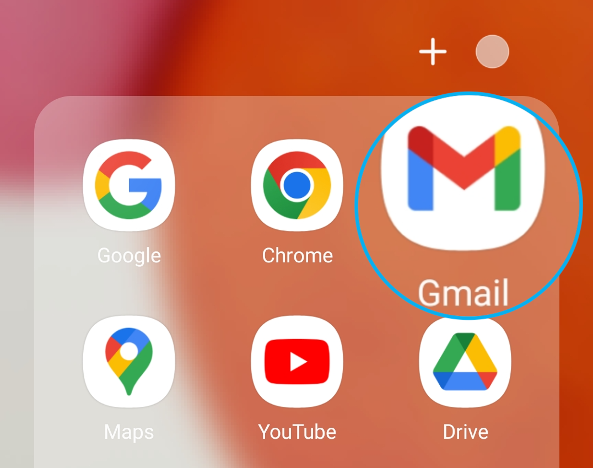
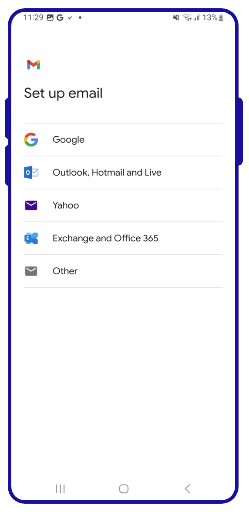
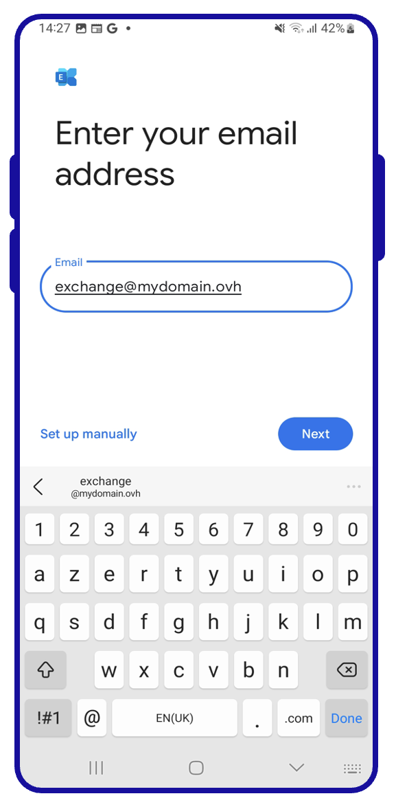
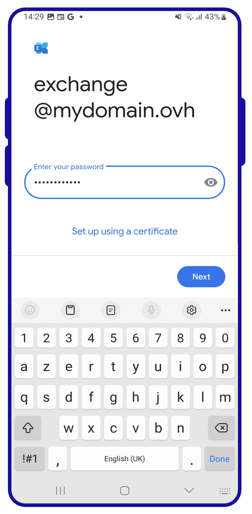
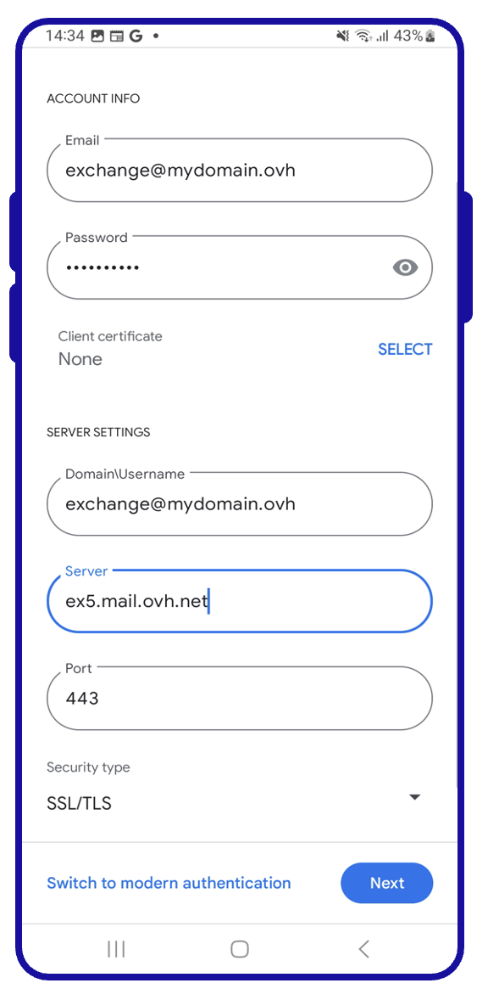

## Objectif

Les adresses e-mail de l'offre Exchange peuvent être configurées sur différents logiciels de messagerie compatibles. Cela vous permet d'envoyer et de recevoir vos messages depuis l'appareil de votre choix. Retrouvez dans ce guide les étapes de configuration d'une adresse e-mail Exchange depuis l'application Gmail présente sur les appareils Android.

**Apprenez à configurer un compte Exchange sur Android, via l'application Gmail.**

> [!warning]
>
> OVHcloud met à votre disposition des services dont la configuration, la gestion et la responsabilité vous incombent. Il vous revient de ce fait d'en assurer le bon fonctionnement.
>
> Nous mettons à votre disposition ce guide afin de vous accompagner au mieux sur des tâches courantes. Néanmoins, nous vous recommandons de faire appel à un [prestataire spécialisé](https://partner.ovhcloud.com/fr-ca/) et/ou de contacter l'éditeur du service si vous éprouvez des difficultés. En effet, nous ne serons pas en mesure de vous fournir une assistance. Plus d'informations dans la section « Aller plus loin » de ce guide.

## Prérequis

- Disposer d'une offre [Exchange](https://www.ovhcloud.com/fr-ca/emails/){.external}.
- Disposer de l'application Gmail sur votre appareil. Vous pouvez installer cette dernière depuis le Google Play Store.
- Disposer des identifiants relatifs à l'adresse e-mail que vous souhaitez paramétrer.

> [!primary]
>
> Cette documentation a été réalisée depuis un appareil utilisant la version 13 d'Android.
>

## En pratique

### Comment ajouter votre compte e-mail 

> [!primary]
>
> Dans notre exemple, nous utilisons la mention serveur : ex**?**.mail.ovh.ca. Vous devrez remplacer le « ? » par le chiffre désignant le serveur de votre service Exchange.
>
> Retrouvez ce chiffre dans votre [espace client OVHcloud](https://ca.ovh.com/auth/?action=gotomanager&from=https://www.ovh.com/ca/fr/&ovhSubsidiary=qc){.external}, dans la rubrique `Web Cloud`{.action} puis `Microsoft`{.action}.
> Cliquez sur `Exchange`{.action}, puis sur la plateforme Exchange souhaitée. Le nom du serveur est visible dans le cadre **Connexion** de l'onglet `Informations Générales`{.action}.
>

Sur l'écran d'accueil de votre appareil, rendez-vous dans l'application `Gmail`{.action}.

{.thumbnail .w-400}

L’ajout d’un compte se fera différemment **si aucun compte n'est paramétré** ou **si un compte a déjà été paramétré**. Sélectionnez l'onglet correspondant à l'une des 2 situations évoquées :

> [!tabs]
> **Première configuration**
>>
>> Sélectionnez `Ajouter une adresse e-mail`{.action}  
>> {.thumbnail .h-600}
>>
> **Configuration existante**
>>
>> 1. Dirigez-vous vers le menu situé dans la partie supérieure gauche de l'écran  
>> 2. Sélectionnez `Paramètres`{.action}  
>> 3. Sélectionnez `Ajouter un compte`{.action}  
>> {.thumbnail}
>>

Suivez les étapes successives de configuration en parcourant les onglets ci-dessous :

> [!tabs]
> **Etape 1**
>> Dans le menu des types de comptes e-mail, sélectionnez `Exchange et Office`{.action}.  
>> {.thumbnail .h-600}
>>
> **Etape 2**
>> Saisissez votre adresse e-mail puis appuyez sur `Suivant`{.action}.  
>> {.thumbnail .h-600}
>>
> **Etape 4**
>> Saisissez le mot de passe de votre adresse e-mail puis appuyez sur `Suivant`{.action}.  
>> {.thumbnail .h-600}
>>
> **Etape 5**
>> Complétez la page « **Configuration de l'adresse** »  - **E-mail** : votre adresse e-mail complète - **Mot de passe** : le mot de passe de votre adresse e-mail - **Certificat** : laissez « Aucun » - **Domaine\Nom d'utilisateur** : votre adresse e-mail complète - **Serveur** : ex?.mail.ovh.ca ( remplacez le **?** par [le numéro de votre serveur Exchange](#addaccount)) - **Port** : 443 - **Type de sécurité** : SSL/TLS  Appuyez sur `Suivant`{.action} pour valider la configuration.  
>> {.thumbnail .h-600}
>>
> **Etape 6**
>> Le message « Vous pouvez dès à présent utiliser votre compte » devrait apparaitre, appuyez sur `OK`{.action} pour terminer la configuration.  
>> {.thumbnail .h-600}
>>

Une fois l'adresse e-mail configurée, il ne reste plus qu’à l'utiliser ! Vous pouvez dès à présent envoyer et recevoir des messages depuis votre application Gmail.

> [!success]
>
> OVHcloud propose une application web permettant d'accéder à votre adresse e-mail depuis un navigateur web, à l’adresse <https://www.ovhcloud.com/fr-ca/mail/>. Vous pouvez vous y connecter grâce aux identifiants de votre adresse e-mail.

## Aller plus loin 

[MXplan - Configurer une adresse e-mail dans Gmail pour Android](/pages/web_cloud/email_and_collaborative_solutions/mx_plan/how_to_configure_android).

[E-mail Pro - Configurer une adresse e-mail dans Gmail pour Android](/pages/web_cloud/email_and_collaborative_solutions/email_pro/how_to_configure_android).

Échangez avec notre communauté d'utilisateurs sur <https://community.ovh.com>.