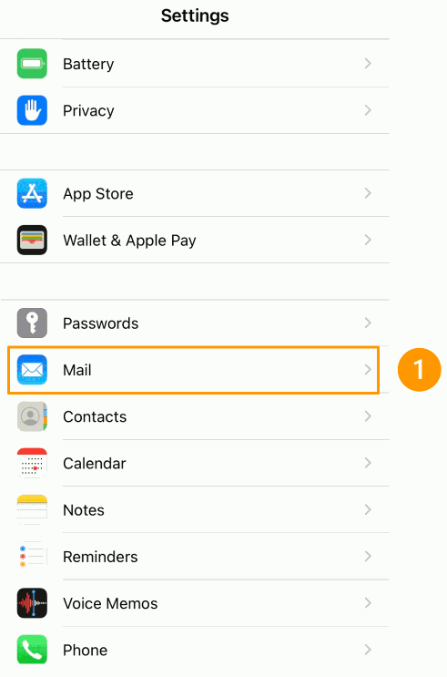
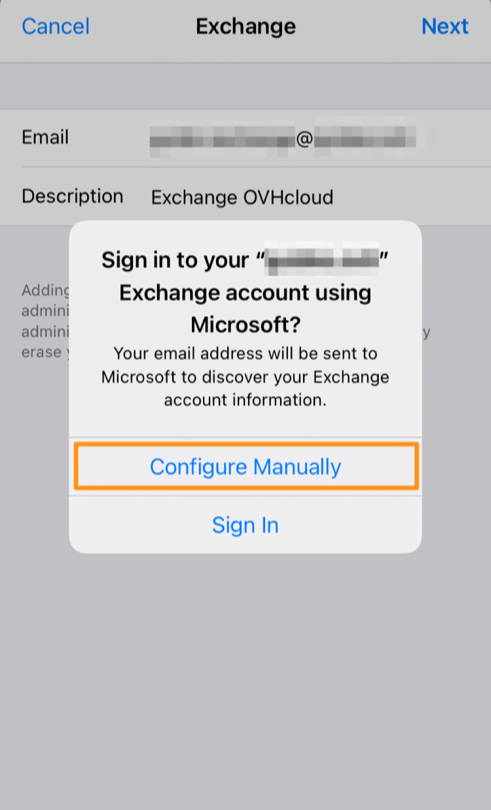
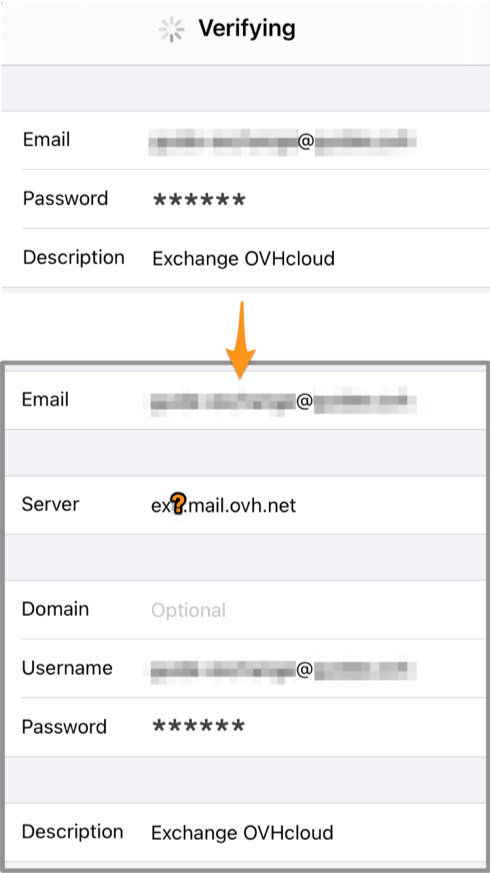
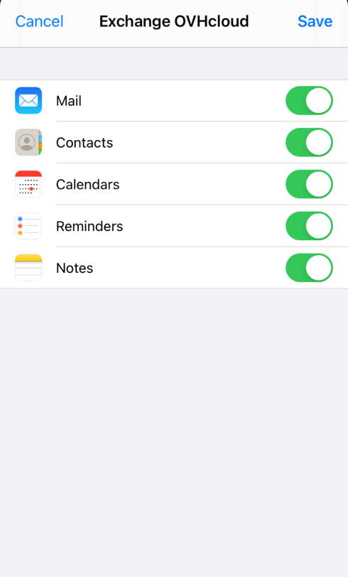

 

## Objetivo

Es posible configurar sus cuentas Exchange en el cliente de correo que usted utilice, siempre que sea compatible, para poder acceder a ellas desde cualquiera de sus dispositivos.

**Esta guía explica cómo configurar una cuenta Exchange en un iPhone o iPad utilizando la aplicación Mail.**

> [!warning]
>
> La configuración, la gestión y la responsabilidad de los servicios que OVHcloud pone a su disposición recaen sobre usted. Por lo tanto, usted deberá asegurarse de que estos funcionen correctamente.
>
> Esta guía le ayudará a realizar las tareas más habituales. No obstante, si tiene alguna duda le recomendamos que contacte con un proveedor de servicios especializado o con el editor del servicio. Nosotros no podremos asistirle. Para más información, consulte el apartado «Más información» de esta guía.
>

## Requisitos

- Disponer de una [cuenta de correo Exchange](/links/web/emails-hosted-exchange).
- Tener la aplicación Mail instalada en su dispositivo iOS.
- Disponer del nombre de usuario y la contraseña de la cuenta de correo electrónico que quiera configurar.

## Procedimiento

### Añadir la cuenta 

En la pantalla de bienvenida de su dispositivo, acceda a `Ajustes`{.action} (icono de rueda dentada). Según la versión de iOS, puede añadir una cuenta de diferentes formas:

- **Para iOS 7, 8, 9 y 10**: pulse `Correo electrónico, contactos, Calendario`{.action} y luego `Añadir cuenta`{.action}. A continuación, seleccione `Otra`{.action} y pulse `Añadir cuenta de correo`{.action}. Continúe en el paso 5 de la tabla siguiente.

- **Para iOS 11, 12 y 13**: pulse `Cuentas y contraseñas`{.action} y luego `Añadir cuenta`{.action}. A continuación, seleccione `Otra`{.action} y pulse `Añadir cuenta de correo`{.action}. Continúe en el paso 5 de la tabla siguiente.

- **Para versiones de iOS 14 y superiores**: siga las instrucciones de la tabla siguiente.

| | |
|---|---|
|{.thumbnail}|1. En `Ajustes`, vaya a `Mail`.    2. Pulse `Cuentas`.   3. Pulse `Añadir cuenta`.   3.4. Seleccione `Microsoft Exchange`.|
|5. Introduzca su **dirección de correo electrónico** y una **descripción** de su cuenta de correo, y pulse `Siguiente`.  6. Seleccione `Configuración manual`.  |{.thumbnail}|
|{.thumbnail}|7. Introduzca:  - el servidor **ex.mail.ovh.ca** - su dirección de **correo electrónico completa** en nombre de usuario  - la contraseña de su dirección de correo electrónico|
|8. Asegúrese de dejar al menos `Mail`{.action} marcado para que la aplicación pueda utilizar la cuenta. Las demás aplicaciones (como el *Calendario* o las *Notas*) pueden utilizar otras funciones colaborativas inherentes a Exchange.  9. Pulse `Guardar` para terminar de añadir su cuenta Exchange.|{.thumbnail}|

Si lo desea, puede realizar una prueba de envío para comprobar que la cuenta esté bien configurada.

### Utilizar la dirección de correo

Una vez que haya configurado la dirección de correo electrónico, ya puede empezar a utilizarla enviando y recibiendo mensajes.

OVHcloud también ofrece una aplicación web que tiene las [funciones colaborativas de Exchange](/links/web/emails-hosted-exchange) y está disponible en la dirección [Webmail](/links/web/email). Puede acceder con el nombre de usuario y la contraseña de su dirección de correo electrónico.

> [!primary]
>
> Si necesita ayuda para recibir o enviar mensajes de correo, consulte nuestras [FAQ en los servicios de correo de OVHcloud](/pages/web_cloud/email_and_collaborative_solutions/mx_plan/faq-emails).
>

## Más información

> [!primary]
>
> Para obtener más información sobre cómo configurar una dirección de correo electrónico desde la aplicación Mail en iOS, visite [el Centro de ayuda de Apple](https://support.apple.com/es-es/102619).

[Configurar una cuenta de correo electrónico incluida en un MX Plan o un plan de hosting en iPhone o iPad](/pages/web_cloud/email_and_collaborative_solutions/mx_plan/how_to_configure_ios)

[FAQ e-mails](/pages/web_cloud/email_and_collaborative_solutions/mx_plan/faq-emails)

Interactúe con nuestra [comunidad de usuarios](/links/community).
