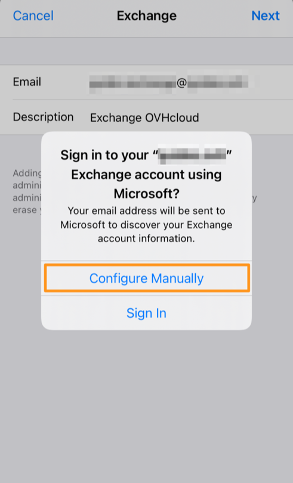
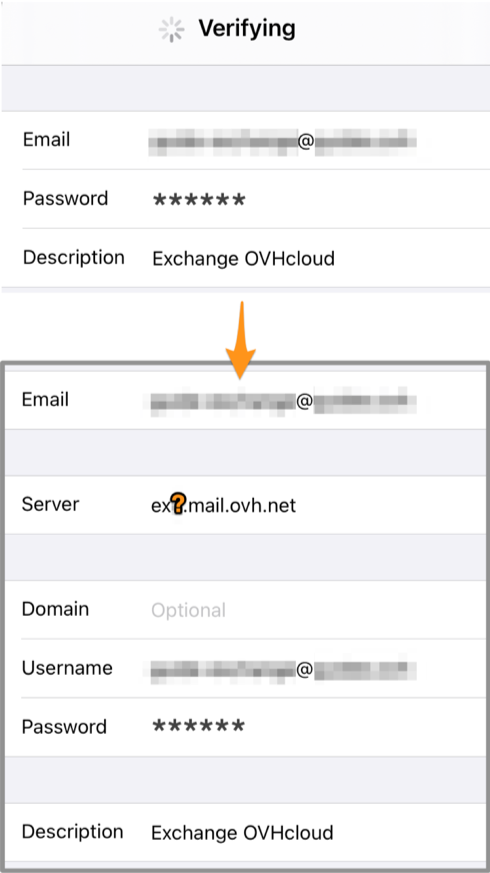
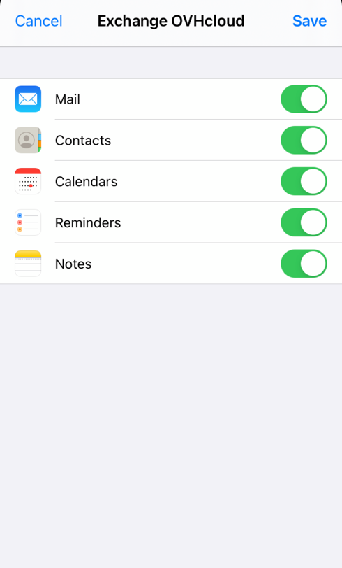

## Objectif

Les comptes Exchange peuvent être configurés sur différents logiciels de messagerie compatibles. Cela vous permet d'utiliser votre adresse e-mail depuis l'appareil de votre choix.

**Découvrez comment configurer votre compte Exchange sur un iPhone ou un iPad, via l'application Mail.**

> [!warning]
>
> OVHcloud met à votre disposition des services dont la configuration, la gestion et la responsabilité vous incombent. Il vous revient de ce fait d'en assurer le bon fonctionnement.
>
> Nous mettons ce guide à votre disposition afin de vous accompagner au mieux sur des tâches courantes. Néanmoins, nous vous recommandons de faire appel à un [prestataire spécialisé](/links/partner) et/ou de contacter l'éditeur du service si vous éprouvez des difficultés. En effet, nous ne serons pas en mesure de vous fournir une assistance. Plus d'informations dans la section « Aller plus loin » de ce guide.
>

## Prérequis

- Disposer d'un [compte e-mail Exchange](/links/web/emails-hosted-exchange).
- Disposer de l’application Mail installée sur votre appareil iOS.
- Disposer des identifiants relatifs à l'adresse e-mail que vous souhaitez paramétrer.

## En pratique

### Ajouter le compte 

> [!primary]
>
> Dans notre exemple, nous utilisons la mention serveur : ex**?**.mail.ovh.ca. Vous devrez remplacer le « ? » par le chiffre désignant le serveur de votre service Exchange.
>
> Retrouvez ce chiffre dans votre [espace client OVHcloud](/links/manager), dans la rubrique `Web Cloud`{.action} puis `Microsoft`{.action}.
> Cliquez sur `Exchange`{.action}, puis sur la plateforme Exchange souhaitée. Le nom du serveur est visible dans le cadre **Connexion** de l'onglet `Informations Générales`{.action}.
>

Sur l'écran d'accueil de votre appareil, rendez-vous sur `Réglages`{.action} (icône de roue crantée). L'ajout d'un compte s'effectue de différentes manières selon votre version d'iOS :

- **Pour iOS 7, 8, 9 et 10** : appuyez sur `Mail, Contacts, Calendrier`{.action}, puis sur `Ajouter un compte`{.action}. Choisissez finalement `Autre`{.action}, puis `Ajouter un compte Mail`{.action}. Passez ensuite à l'étape 5 du tableau suivant.

- **Pour iOS 11** : appuyez sur `Comptes et mots de passe`{.action}, puis sur `Ajouter un compte`{.action}. Choisissez finalement `Autre`{.action}, puis `Ajouter un compte Mail`{.action}. Passez ensuite à l'étape 5 du tableau suivant.

- **Pour les versions iOS 14 et supérieure** : suivez les instructions du tableau suivant.

| | |
|---|---|
|{.thumbnail}|1. Dans  `Réglages`, allez sur `Mail`.    2. Appuyez sur `Comptes`.   3. Appuyez sur `Ajouter un compte`.   4. Choisissez `Microsoft Exchange`.|
|5. Saisissez votre **adresse e-mail** et une **description** de votre compte e-mail, appuyez sur `Suivant`.  6. Sélectionnez `Configuration manuelle`.  |{.thumbnail}|
|{.thumbnail}|7. Saisissez:  - le serveur **ex?.mail.ovh.ca** ( remplacez le **?** par [le numéro de votre serveur Exchange](#addaccount))  - votre **adresse e-mail complète** dans nom d'utilisateur  - le mot de passe de votre adresse e-mail|
|8. Assurez-vous de bien laisser au minimum `Mail`{.action} coché afin que l'application puisse utiliser ce compte. Les autres applications (comme *Calendrier* et *Notes*) peuvent utiliser certaines des fonctions collaboratives inhérentes à Exchange.  9. Appuyez sur `Enregistrer` pour finaliser l'ajout de votre compte exchange.|{.thumbnail}|

Vous pouvez effectuer un test d'envoi pour vérifier que le compte est correctement paramétré.

### Utiliser l'adresse e-mail

Une fois l'adresse e-mail configurée, il ne reste plus qu’à l'utiliser ! Vous pouvez dès à présent envoyer et recevoir des messages.

OVHcloud propose également une application web disposant des [fonctions collaboratives Exchange](/links/web/emails-hosted-exchange) accessible à l’adresse [Webmail](/links/web/email). Vous pouvez vous y connecter grâce aux identifiants relatifs à votre adresse e-mail.

> [!primary]
>
> En cas de difficulté de réception ou d'envoi d'e-mails, consultez notre [FAQ sur les services e-mail OVHcloud](/pages/web_cloud/email_and_collaborative_solutions/mx_plan/faq-emails).
>

## Aller plus loin

> [!primary]
>
> Pour plus d'informations sur la configuration d'une adresse e-mail depuis l'application Mail sur iOS, consultez [le centre d'aide Apple](https://support.apple.com/fr-fr/102619).

[Configurer son adresse e-mail comprise dans l’offre MX Plan ou dans une offre d’hébergement web sur un iPhone ou un iPad](/pages/web_cloud/email_and_collaborative_solutions/mx_plan/how_to_configure_ios).

[FAQ e-mails](/pages/web_cloud/email_and_collaborative_solutions/mx_plan/faq-emails)

Échangez avec notre communauté d'utilisateurs sur <https://community.ovh.com>.