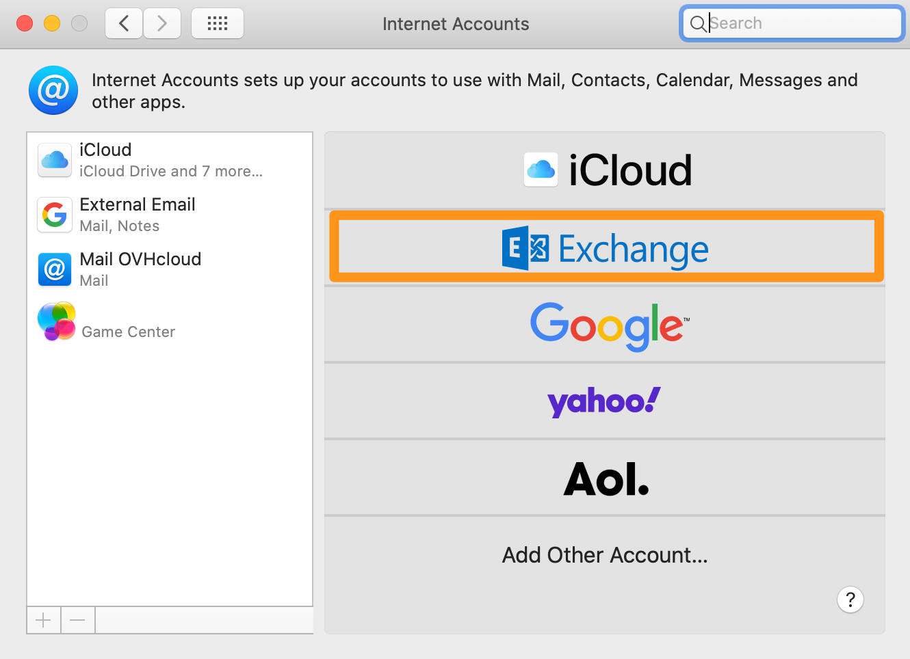
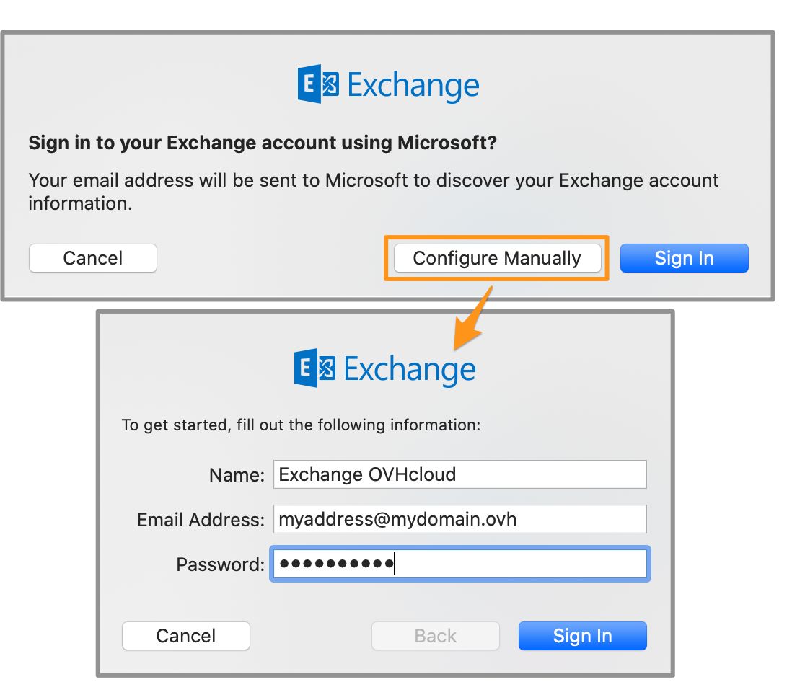
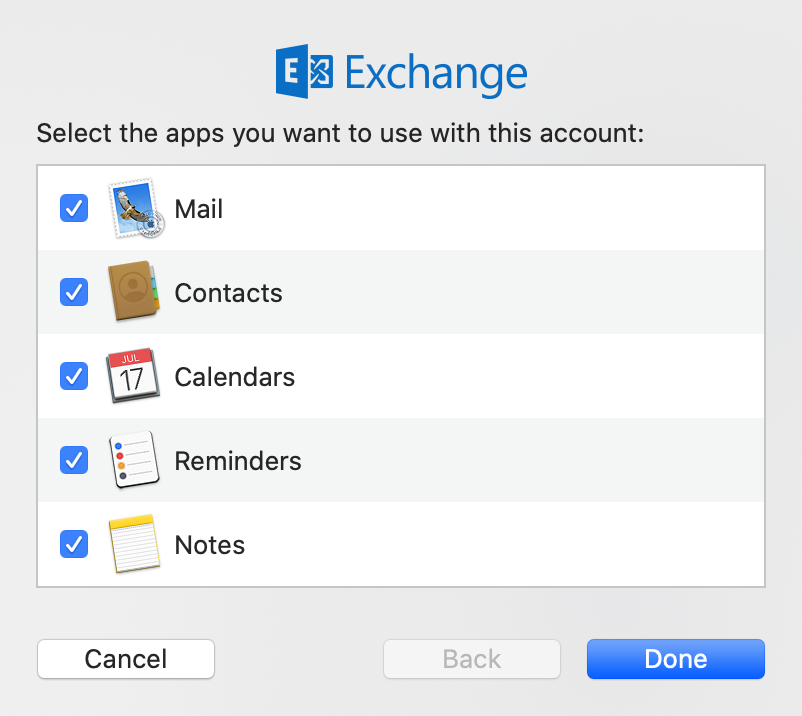

## Objective

You can configure Exchange accounts on email clients, if they are compatible. By doing so, you can use your email address through your preferred email application. The Mail app on macOS is available for free on all Macs.

**Find out how to configure your Exchange email address on the macOS Mail app.**

> [!warning]
>
> OVHcloud provides services for which you are responsible with regard to their configuration and management. It is therefore your responsibility to ensure that they function correctly.
> 
> This guide is designed to help you with common tasks. Nevertheless, we recommend contacting a [specialist provider](/links/partner) or the software publisher if you encounter any difficulties. OVHcloud cannot provide you with technical support in this regard. You can find more information in the "Go further" section of this guide.
>

## Requirements

- An [Exchange email account](/links/web/emails-hosted-exchange)
- **Mail** installed on your Mac
-  The required credentials for the email account you would like to configure
 
## Instructions

### How to add your account 

> [!primary]
>
> In this guide, we will use as the server name: ex**?**.mail.ovh.ca. You will need to replace the "?" with the actual number indicating the appropriate server for your Exchange service.
> 
> You can find this information in the [OVHcloud Control Panel](/links/manager), in the `Web Cloud`{.action} section, if you select `Microsoft`{.action}, `Exchange`{.action} and then the desired Exchange service. The server name is displayed in the **Connection** box in the `General Information`{.action} tab.
>

- **When you start the application for the first time**: A configuration wizard will appear, prompting you to choose your account type.

- **If an account has already been set up**: Click on `Mail`{.action} in the menu bar at the top of your screen, then on `Accounts`{.action}.

> [!tabs]
> **Step 1**
>> Select `Exchange`{.action}  
>>{.thumbnail .w-400 .h-600}
>>
> **Step 2**
>> Enter the **Name** of your email account and your **Email address**, then click `Log in`{.action}.   
>>{.thumbnail .w-400 .h-600}
>>
> **Step 3**
>> In the next window, click `Manual configuration`{.action}:   - Define the **Name** that will be displayed in the navigation interface.  - Leave your **Email address**. - Leave your **Password** already entered.   To finalise the configuration, click `Log in`{.action}.    
>>{.thumbnail .w-400 .h-600}
>>
> **Step 4**
>>> Type:   - Email address: Leave your full email address. - User name: Leave your full email address.  - Password: Leave your **Password**.  - Internal URL: **ex?.mail.ovh.ca** (replace **?** with [your Exchange server number](#addaccount)) - External URL: **ex?.mail.ovh.ca** (replace **?** with [your Exchange server number](#addaccount))  
>>
>> > [!warning]
>>>
>>> It is normal that an error message of the type “**Unable to verify account name or password**” occurs when the window appears for the first time. However, if this message persists after validation, the information entered is incorrect.  
>>
>>{.thumbnail .w-400 .h-600}
>>
> **Step 5**
>> In addition to your emails, you can select other Exchange features that you want to manage from your Mac.   {.thumbnail .w-400 .h-600}

### Use your email account

Once you have configured your email address, you can start using it! You can now send and receive emails.

OVHcloud also has a web application you can use to access your email account from your browser. You can access this application at [Webmail](/links/web/email). You can log in using your email credentials. If you have any questions about how to use it, you can refer to our guide on [Using the Outlook Web App with an Exchange account](/pages/web_cloud/email_and_collaborative_solutions/using_the_outlook_web_app_webmail/email_owa).

### Retrieve a backup of your email account

If you need to make any changes that could lead to the loss of your email account data, we advise backing up the email account concerned beforehand. To do this, please read the "**Export**" section in the "**Mail on macOS**" section of our guide on [Manually migrating your email account](/pages/web_cloud/email_and_collaborative_solutions/migrating/manual_email_migration#exporting).

### Modify existing settings

If your email account is already set up and you need to access the account settings to change them:

- Click `Mail`{.action} in the menu bar at the top of your screen, then `Preferences...`{.action} **or** `Settings...`{.action} depending on your macOS version.
- From the `Accounts`{.action} tab, select the account concerned in the left-hand column, then click `Server settings`{.action}.

{.thumbnail .w-400 .h-600}

## Go further

> [!primary]
>
> For more information on configuring an email address from the Mail app on macOS, see [the Apple Help Center](https://support.apple.com/en-gb/guide/mail/mail35803/mac).

[FAQ emails](/pages/web_cloud/email_and_collaborative_solutions/mx_plan/faq-emails)

[Configure your Email Pro account on macOS Mail](/pages/web_cloud/email_and_collaborative_solutions/email_pro/how_to_configure_mail_macos)

[Configure your MX Plan email account on macOS Mail](/pages/web_cloud/email_and_collaborative_solutions/mx_plan/how_to_configure_mail_macos)

Join our community of users on <https://community.ovh.com/en/>.
